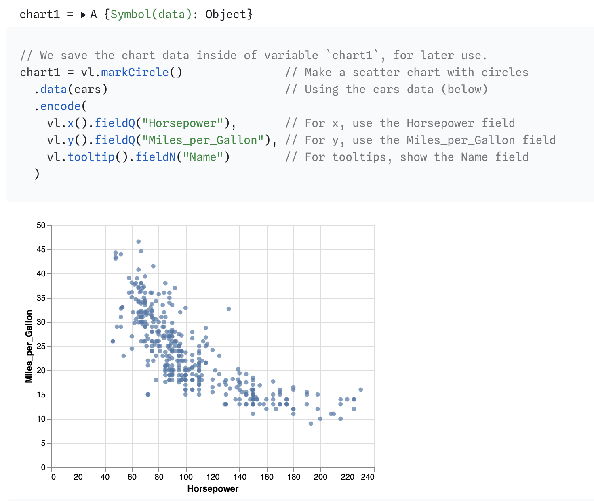
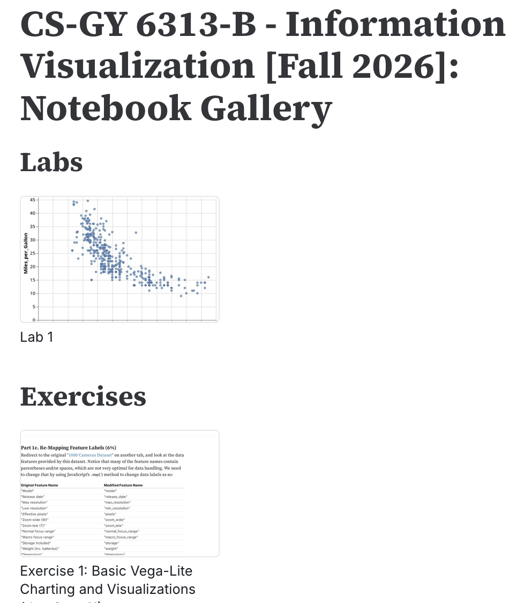
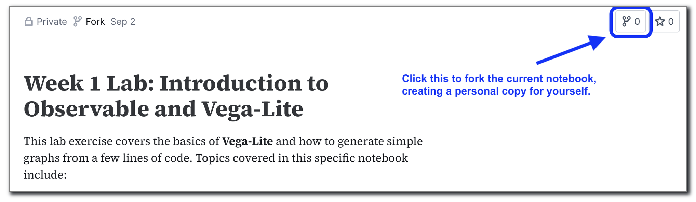
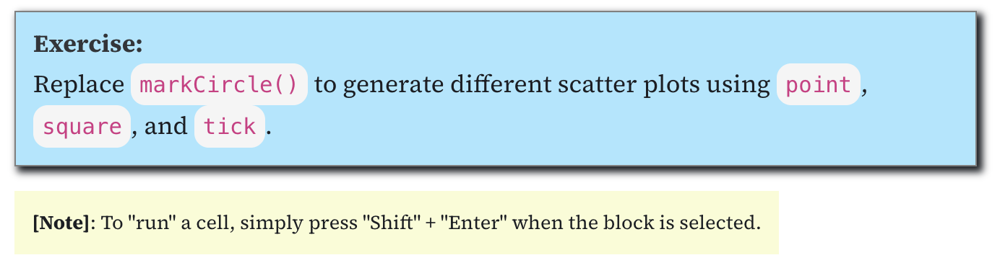
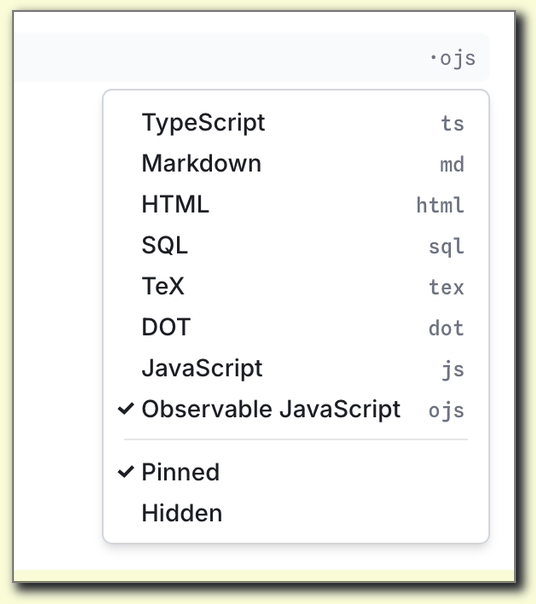

## Week 1 Lab Overview

|User Interface|Graphics Library|Notebook|
|:--|:--|:--|
|<a href="https://observablehq.com" target="_blank">observablehq.com</a>|<a href="https://vega.github.io/vega-lite/" target="_blank">Vega-Lite</a>|<a href="https://observablehq.com/@rk2546/2026-infovis-cse_week-1-lab" target="_blank">Week 1 Lab Notebook</a>|

### Today's Lab Activities

1. **Setup**
   - Create Observable account
   - Explore the interface
   - Fork a starter notebook

2. **First Visualizations**
   - Create basic Vega-Lite charts
   - Explore different mark types
   - Modify visual encodings
   - Talk about Tidy Data

## Working with Observable

Observable is a nifty online notebook system based on JavaScript. We will be doing exercises, submitting assignments, etc. all via Observable and Brightspace.

:::: {.columns}

::: {.column width="30%"}

:::
::: {.column width="25%"}

:::
::: {.column width="40%"}
To keep track of all the notebooks we're going to use in class, head over to <a href="https://observablehq.com/@rk2546/2026-infovis-cse_notebook-gallery" target="_blank">this special notebook</a>. 

Refer back to this if you lose any notebooks; we'll store solution code here too for lab exercises and assignments.
:::
::::

## Step 1: Setting Up Observable

### Creating Your Account

1. Go to [observablehq.com](https://observablehq.com)
2. Sign up with your NYU email
3. Verify your email address
4. Complete your profile

### Understanding the Interface

:::: {.columns}
::: {.column width="50%"}
#### Key Features
- Interactive notebooks
- Live code execution
- Built-in datasets
- Version control
:::

::: {.column width="50%"}
#### Navigation
- Home: Your notebooks
- Explore: Community notebooks
- Documentation: Help & tutorials
- Search: Find examples
:::
::::

## Step 2: Forking Notebooks, Data

### About Forking

Forking is a key function provided by **Observable** and is essential when working with different notebooks. We've made an **Observable** notebook specifically for this week's lab! Let's fork it.

1. Navigate to <a href="https://observablehq.com/@rk2546/2026-infovis-cse_week-1-lab" target="_blank">Week 1 Lab Notebook</a>
2. Scroll to the top-right of the notebook. You should see some function buttons, such as "Star this notebook" and "Fork this notebook".
3. Select "Fork this notebook", and save it into as your own Observable notebook.

{style="max-width: 800px; width: 100%; height:auto; margin:auto;"}

Once your fork the notebook, you are free to start making any and all adjustments as you prefer!

## How We (the class) Write Our Notebooks

:::: {.columns}
::: {.column width="50%"}
Keep an eye out for these across our notebooks:


- Blue: your TO-DOs for a notebook.
- Yellow: notes, addendums, extra info.

:::
::: {.column width="50%"}


When you create new cells, keep an eye on the cell type. We generally prefer `ojs`, or "Observable JavaScript
:::
::::

## Understanding Charts

### Basic Structure

```javascript
vl.markCircle()                        // Make a scatter chart
  .data(cars)                          // Using the cars data (below)
  .encode(
    vl.x().fieldQ("Horsepower"),       // For x, use the Horsepower field
    vl.y().fieldQ("Miles_per_Gallon"), // For y, use the Miles_per_Gallon field
    vl.tooltip().fieldN("Name")        // For tooltips, show the Name field
  )
  .render()                            // Draw the chart
```

### Key Components
- **mark\<MARK TYPE\>**: Visual representation (point, bar, line, etc.)
- **Data**: The data source to render
- **Encoding**: Map data to visual properties

## Vega-Lite Mark Types

### Common Marks

:::: {.columns}
::: {.column width="33%"}
#### Points & Lines
- `point`: Scatterplots
- `line`: Line charts
- `area`: Area charts
- `trail`: Connected points
:::

::: {.column width="33%"}
#### Bars & Rectangles
- `bar`: Bar charts
- `rect`: Heatmaps
- `square`: Equal-width rectangles
:::

::: {.column width="33%"}
#### Other
- `circle`: Fixed-size circles
- `text`: Text labels
- `tick`: Tick marks
- `arc`: Pie charts
:::
::::

## Lab Exercise #1

### Task
Replace `markCircle()` to generate different scatter plots using point, square, and tick.

### Starter Code
```javascript
vl.markCircle() // TO-DO: Change this to show point, square and tick plots instead.
  .data(cars)
  .encode(
    vl.x().fieldQ("Horsepower"),
    vl.y().fieldQ("Miles_per_Gallon"),
    vl.tooltip().fieldN("Name")
  )
  .render()
```
## Data Types

|Data Type|API Equivalent|Description|Examples|
|:--|:--|:--|:--|
|Quantitative|\`fieldQ()\`| numerical magnitudes | 1, 1.2, 3, 4, $1,230.60|
|Temporal|\`fieldT()\`| corresponding to Date values | 2019-01-02T00:01:23Z, 1996|
|Nominal|\`fieldN()\`| unordered, categorical data | Audi, Ford, Hyundai, Tesla|
|Ordinal|\`fieldO()\`| like nominal, but with an inherent order | small, medium, large|


```javascript
vl.markCircle()
  .data(cars)
  .encode(
    vl.x().fieldQ("Horsepower"),        // This is a Quantitative type
    vl.y().fieldQ("Miles_per_Gallon"),  // This is a Quantitative type
    vl.tooltip().fieldN("Name")         // This is a Nominal type
  )
  .render()
```


## Visual Encodings

### Encoding Channels

| Channel | Use Case | Data Types |
|---------|----------|------------|
| `x`, `y` | Position | Quantitative, Ordinal, Temporal |
| `color` | Category distinction | Nominal, Ordinal, Quantitative |
| `size` | Magnitude | Quantitative |
| `shape` | Category distinction | Nominal |
| `opacity` | Emphasis/de-emphasis | Quantitative |
| `tooltip` | Details on demand | Any |


## Lab Exercise #2

### Task
Modify the code below in the following ways:

1. Modify the x-axis to display "Year".
2. Modify the y-axis to display "Horsepower".
3. Modify the tooltip to display "Origin" instead of "Name".

### Starter Code
```javascript
vl.markCircle()
  .data(cars)
  .encode(
    vl.x().fieldQ("Horsepower"),        // TO-DO: Change this to represent "Year"
    vl.y().fieldQ("Miles_per_Gallon"),  // TO-DO: Change this to represent "Horsepower"
    vl.tooltip().fieldN("Name")         // TO-DO: Change this to represent "Origin"
  )
  .render()
```

## Render Settings

**Vega-Lite** offers some different rendering options.

- **Rendering as SVG**: Rather than rendering the chart as an HTML \<canvas\> element, the chart is rendered as an SVG image. This produces sharp images, but doesn't work well with large datasets
- **Rendering as an Object**: For compatibility with **Vega-Lite** as a JavaScript library, you can also render the code into a JavaScript object.

## Lab Exercise #3

### Task
Try the following individually:

1. Add `{ renderer: "svg" }` inside of the `render()` method.
2. Replace `render()` with `toObject()` instead.

### Starter Code
```javascript
vl.markCircle()
  .data(cars)
  .encode(
    vl.x().fieldQ("Horsepower"),
    vl.y().fieldQ("Miles_per_Gallon"),
    vl.tooltip().fieldN("Name")
  )
  .render()   // TO-DO: Replace this line to either render as an SVG or as an JavaScript Object
```

## A note on Tidy Data

### The 3 Rules of Tidy Data

- Each variable is a column; each column is a variable.
- Each observation is a row; each row is an observation.
- Each value is a cell; each cell is a single value.

### Why Tidy?

The _"shape"_ of your data is incredibly important! It helps with data transfer between different **Observable** notebooks, and even working with different environments altogether (e.g. **R**, **Tableau**).

_Learn more here: [https://cran.r-project.org/web/packages/tidyr/vignettes/tidy-data.html](https://cran.r-project.org/web/packages/tidyr/vignettes/tidy-data.html)_

## Coloring Charts

Two ways to color charts:

- Coloring all data points with a manually-designated color
- Coloring based on a data feature / column.

Coloration helps with visual communication of core relationships between data groups, or adding a 3rd dimension to data that is hard to capture in 2D graphs.

### Code Sample

```javascript
vl.markCircle()
  ...
  .encode(
    ...
    vl.color().\<METHOD\>
    ...
  )
  .render()
```

## Lab Exercise #4

Color the chart two ways:

- Manually set a color "red" across all data points.
- Coloring points based on the "Origin" data feature.

### Starter Code

```javascript
vl.markCircle()
  .data(cars)
  .encode(
    vl.x().fieldQ("Horsepower"),
    vl.y().fieldQ("Miles_per_Gallon"),
    // TO-DO: Add color options for coloring either all points or coloring points by "Origin"
    vl.tooltip().fieldN("Name")
  )
  .render()
```


## Tips for Success

### Best Practices

:::: {.columns}
::: {.column width="50%"}
#### Do's ✅
- Start with simple charts
- Test incrementally
- Read error messages
- Use Observable examples
- Ask questions early
:::

::: {.column width="50%"}
#### Don'ts ❌
- Don't overcomplicate
- Don't ignore data types
- Don't forget axis labels
- Don't use too many colors
- Don't skip documentation
:::
::::


## Course Assignments

We will upload weekly assignments. They will always be due **at midnight the day before**. Make sure to answer all questions to the best of your ability.

- Assignment #1: <a href="https://observablehq.com/@rk2546/2026-infovis-cse_week-1-exercise" target="_blank">https://observablehq.com/@rk2546/2026-infovis-cse_week-1-exercise</a>
  - Due no later than **September 10th @ 11:59pm on Brightspace**.
- Getting Help
  - Course Discord channel - make sure to sign up!
  - Office hours: **Zoom, online only** - <a href="https://nyu.zoom.us/j/93989651008" target="_blank">https://nyu.zoom.us/j/93989651008</a> @ 11:00am on Wednesdays 

## Resources for This Week

### Documentation
- [Vega-Lite Documentation](https://vega.github.io/vega-lite/)
- [Observable Documentation](https://observablehq.com/documentation/)
- [Example Gallery](https://vega.github.io/vega-lite/examples/)

### Useful Observable Notebooks
- [Introduction to Vega-Lite](https://observablehq.com/@uwdata/introduction-to-vega-lite)
- [Data Types and Encoding Channels](https://observablehq.com/@uwdata/data-types-graphical-marks-encoding-channels)


