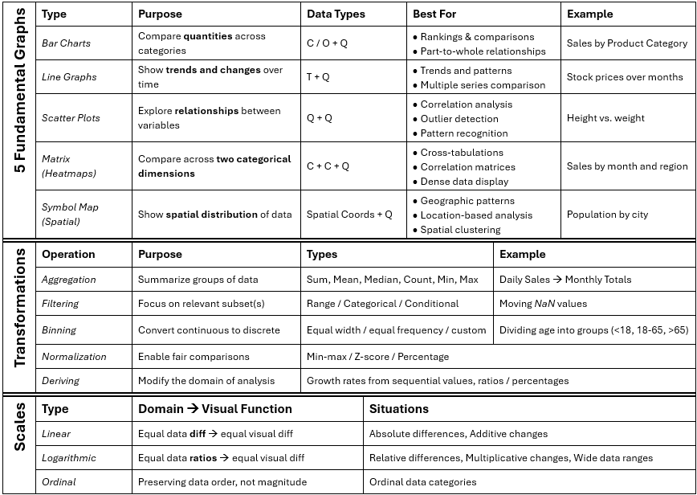
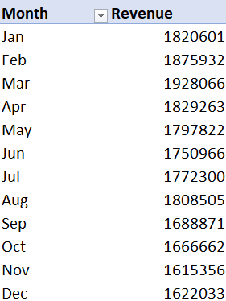
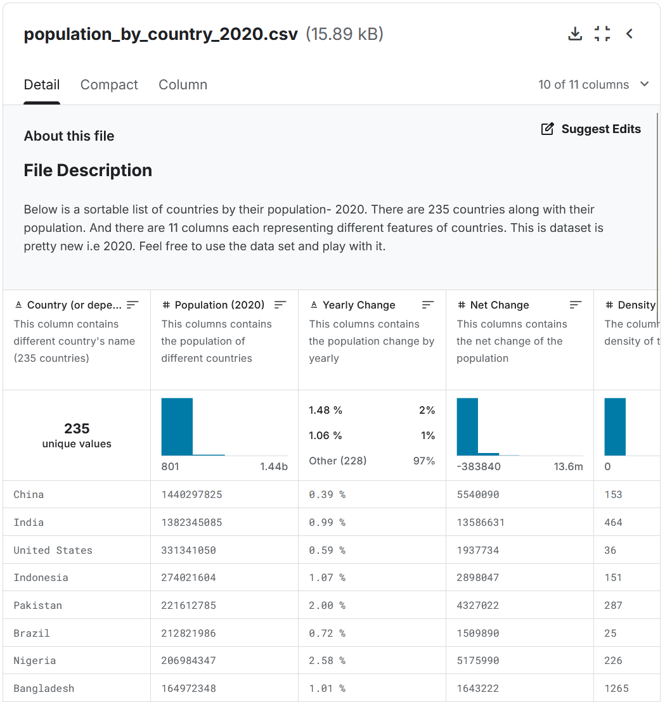
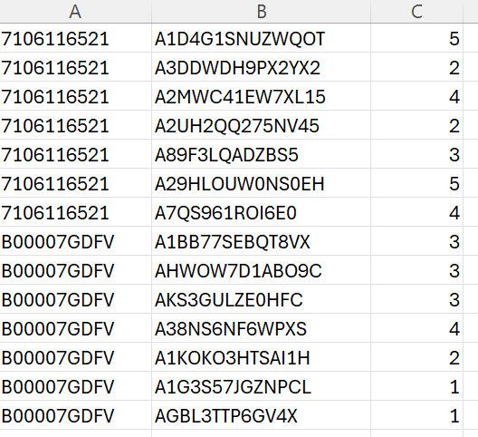
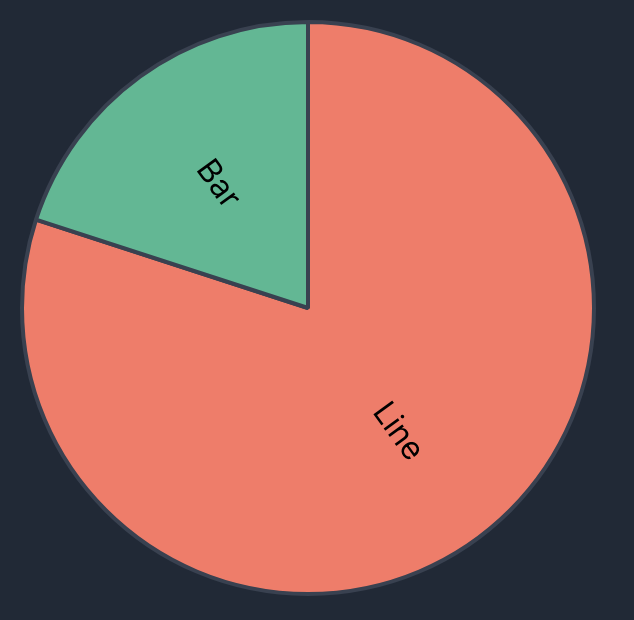
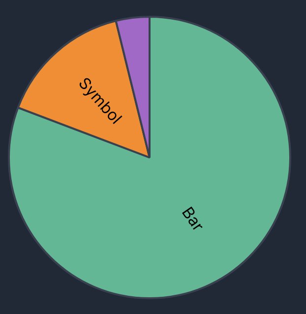
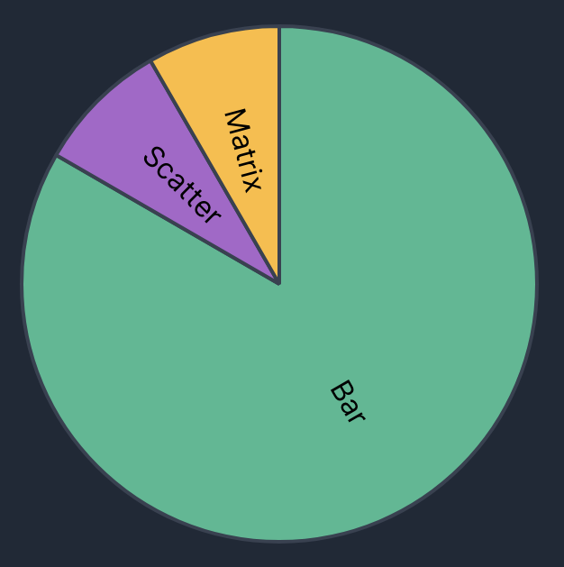
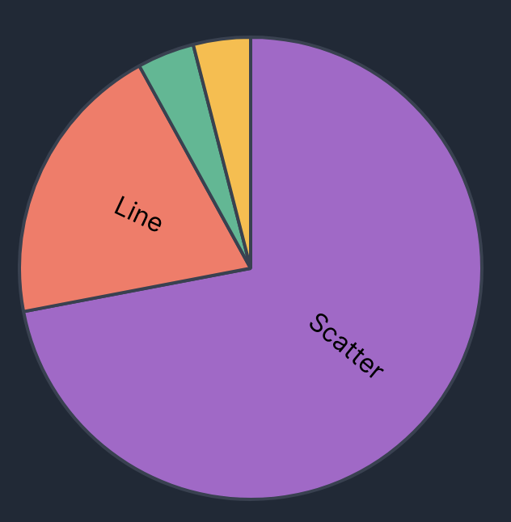

## Week 3 Lab Overview

|User Interface|Graphics Library|Notebook|
|:--|:--|:--|
|<a href="https://observablehq.com" target="_blank">observablehq.com</a>|<a href="https://vega.github.io/vega-lite/" target="_blank">Vega-Lite</a>|<a href="https://observablehq.com/@rk2546/2026-infovis-cse_week-3-lab" target="_blank">Week 3 Lab Notebook</a>|

### Today's Lab Activities

1. Warm up: Practice with Scenarios & Choices
2. Question-Forming Practice in Pairs

## Recall Today's Main Topics:

::::{.incremental}
- **5 Fundamental Graphs**: Bar Charts, Line Graphs, Scatter Plots, Matrix, Symbol Maps
- **Principles**: Expressiveness & Effectiveness
- **Transformation Types**: Aggregation, Filtering, Binning, Deriving, Normalization
- **Domains & Scales**: Linear, Log, Ordinal
::::

---

{width="80%"}

(_Available via the <a href="https://observablehq.com/@rk2546/2026-infovis-cse_week-3-lab" target="_blank">Week 3 Lab Notebook</a>_)

## Notes About Submissions

### Computer Time Zones Affect "Last Created" and "Last Updated": 

If your computer is not in the correct time zone, it messes with your submission time. *There is no easy way to check if something has been modified.*

<br />

### Travel is an UNEXCUSED absence (except under certain circumstances)

- Please **notify us via email** if you anticipate a travel situation, or if in an emergency.
- Visit NYU's <a href="https://www.nyu.edu/life/community-flourishing/centers-and-communities/accessibility.html" target="_blank">Moses Center for Accessibility and Inclusive Culture</a> if needed; they will communicate with us on your behalf, with full expectations of privacy and confidentiality where possible.

---

### Pay attention to [TO-DO] requirements!

We have explicit TO-DO instructions for a reason. Even if there are occasional mistypes from previous iterations of assignments, they had purpose.

:::{.columns}

::::{.column width="50%"}

_From Exercise #2, Part 2C:_

> Both charts must only show movies with a release date (AKA don't consider movies that are missing their release dates). (2%)

::::

::::{.column width="50%"}

What about if in the below expression, a row's "Release Date" is `null` or `undefined`?

```js
"year(datum['Release Date'])"
```

::::

:::


## Part 1: Warm Up - Thinking about Design Choices (~5-10 mins)

### Our Task:

- **What we're given**: A data scenario & a goal in mind
- **Our task**: Answer, collectively, the optimal way to:
  1. Identify the data domains [Q, C, O, T, Spatial (S)]
  2. Graph the data [Bar, Line, Scatter, Matrix, Symbol]

::: {style="width:400px;margin:auto;text-align:center;"}
{style="width:100%;"}
<a href="https://forms.gle/5uxF5Rfo8Eie1HPV8" target="_blank">Lab Activity Google Form</a>
:::


---

### Exercise 1

::::{.columns}
:::{.column width="50%"}
- **What we're given:** Monthly sales revenue ($) over the past 12 months for a retail store.
- **Goal:** Identify trends over time.

#### Answer:
:::::{.incremental}
- **Data domains**: 
  - _Monthly Sales_ (Q)
  - _12 months_ (T/O)
- **Graph**: _Line_ or _Bar_
:::::

:::
:::{.column width="50%"}
{width="75%"}

(Source: [dataamir](https://github.com/dataamir/Monthly-sales-performance-trends.git))
:::
::::

---

### Exercise 2

::::{.columns}
:::{.column width="50%"}
- **What we're given:** Population size of different countries.
- **Goal:** Compare country population sizes

#### Answer:
:::::{.incremental}
- **Data domains**:
  - _Population Size_ (Q)
  - _Country_ (S)
- **Graph**: _Symbol Map_ (via GeoData)
:::::

:::
:::{.column width="50%"}
{width="100%"}

(Source: [Kaggle: Population by Country - 2020](https://www.kaggle.com/datasets/tanuprabhu/population-by-country-2020))
:::
::::

---

### Exercise 3

::::{.columns}
:::{.column width="50%"}
- **What we're given:** Product ratings from 1 to 5 stars collected from customer feedback.
- **Goal:** Show frequency of each rating.

#### Answer:
:::::{.incremental}
- **Data domains**: 
  - A _collection_ (Q)... 
  - ... of _Product Ratings_ (O)
- **Graph**: _Bar Chart_
:::::

:::
:::{.column width="50%"}
{width="100%"}

(Source: [openbigdata.org](https://openbigdata.org/resource/amazon-product-reviews/))
:::
::::

---

### Exercise 4

- **What we're given:** Test scores (0%-100%) of students plotted against hours studied.
- **Goal:** Determine the correlation between study time and performance.

#### Answer:
:::::{.incremental}
- **Data domains**: 
  - _Test scores_ (Q)
  - _hours studied_ (Q)
- **Graph**: _Scatter Plot_
:::::


## Poll Results from Last Year's Class (Sep. 19, 2025)

::::{.columns}
:::{.column width="25%"}
**Exercise #1**:
{width="100%"}
:::
:::{.column width="25%"}
**Exercise #2**:
{width="100%"}
:::
:::{.column width="25%"}
**Exercise #3**:
{width="100%"}
:::
:::{.column width="25%"}
**Exercise #4**:
{width="100%"}
:::
::::

<br />

### Core Idea: Meaning-Making: Data -> Information

> As engineers, designers, and researchers, we must do the work to **find meaning within the raw data** and **interpret them for the benefit of others**.

There are many ways to generate viable alternatives charts!


## Part 2: Question-Forming Practice

### Question-forming?

Rather than generate charts as per usual, we will instead stretch our minds and **form our own questions**. This is an invaluable skill in most circumstances.

- <a href="https://vega.github.io/vega-lite/data/barley.json" target="_blank">barley.json from Vega-Lite</a>
- <a href="https://drive.google.com/file/d/1pZHIACjSVvYwOcXqZrqiVFSblvxnIyzX/view?usp=sharing" target="_blank">Paris Airbnb data</a>
- <a href="https://vega.github.io/vega-lite/data/gapminder.json" target="_blank">Gapminder geodata</a>

---

### Question Taxonomy

|Question type|Prompt|
|:-|:-|
| **Distribution** | What values are common/uncommon?             |
| **Comparison**   | How does A differ from B?                    |
| **Relationship** | Does A appear related to B?                  |
| **Ranking**      | Which groups have the highest/lowest values? |
| **Change**       | How does something change across time?       |
| **Variation**    | Which groups are more/less consistent?       |
| **Exception**    | Is anything surprising or unusual?           |


## Paired Exercise: Simple Question-Forming with Barley (5 min.)

**IN PAIRS OF TWO OR THREE**, take the <a href="https://vega.github.io/vega-lite/data/barley.json" target="_blank">barley dataset</a> and consider: **What can we ask about this dataset?** We'll take 5 minutes for you to: 

- Identify the data features in the dataset and their data types
  - Quantitative (Discrete, Continuous), Nominal, Temporal, Ordinal?
- Try to derive as many questions about the data you can form from the data alone. 
  - Feel free to use the question taxonomy table for inspiration.
  - Consider:
    - What was this dataset originally used for?
    - From where and how was the data collected?
    - Which data types are continuous or discrete? Categorical or quantitative?

---


### Data Features & Their Types

::: {.incremental}
- `yield`: Continuous, Quantitative
- `variety`: Nominal
- `year`: Temporal
- `site`: Nominal
:::

### Example questions

::: {.incremental}
- Average or median `yield` per `variety`
- Popularity of barley `variety` per `site`
- Changes in barley distribution between 1931 and 1932
:::

## Question-Laddering as a Strategy

When you are struggling with question-forming, then a useful strategy is to implement **question-laddering**.

> **Question-Laddering**: Generating complex inquiries by starting with a simpler question and then forming even more simple or more complex questions.

This is an _incremental_ process; rather than attempting to jump the gun, you must start **simple** and then progressively reach **complicated** inquiries.

---

### Example using Gapminder Geodata

Take a look at our <a href="https://vega.github.io/vega-lite/data/gapminder.json" target="_blank">Gapminder geodata</a>. It's rather easy to have a simple question like:

> Which countries have the highest life expectancy?

Now, let's consider the next rung of the ladder: **How can we make this question more interesting and/or complex?**

<pre>
Which countries have the highest life expectancy?
↓
How does life expectancy differ across regions?
↓
How has life expectancy changed over time across regions?
↓
Is increasing GDP associated with increasing life expectancy?
↓
Does the relationship between GDP and life expectancy differ between regions?
↓
Which countries have unusually high or low life expectancy given their GDP?
</pre>

## Paired Exercise: Question-Laddering with Gapminder (5-10 min.)

**IN PAIRS OF TWO OR THREE**, take a look at the gapminder data and attempt to form a question ladder. 

1. Form 1-2 questions you have about the data, like we did in the previous paired exercise.
2. Attempt to form a question ladder that increases in complexity the further down you go.

If you're struggling, consider the following:

- Is the question too simple, or not simple enough?
- Can we involve more dimension to our question? (i.e. include one or more features into the question)?
- Can we form a hypothesis or prediction of the answer to our question? If a hypothesis can be _immediately_ thought of, then maybe the question is too simple.

## Persona-Forming as a Strategy

Another crucial way to help form questions is to adopt **personas** with **motivations**.

Let's take a look at the <a href="https://drive.google.com/file/d/1pZHIACjSVvYwOcXqZrqiVFSblvxnIyzX/view?usp=sharing" target="_blank">Paris Airbnb Data</a>, which aggregates data about Airbnb rentals. If we had to form questions, then we might want to think:

|This kind of person (Persona):|Might ask (Motivation):|
|:----|:----|
|Tourist|Where might I find affordable accommodation?
|An Airbnb Code Developer|What characteristics distinguish frequently reviewed listings?|
|A Paris Resident|Are Airbnb listings concentrated in particular parts of the city?|
|An Airbnb Host|What appears to distinguish higher-priced listings?|
|A City-Planner|Are some neighborhoods affected by short-term rentals more than others?|

## Paired Exercise: Personas and Paris Airbnbs

**IN PAIRS OF TWO OR THREE**, take on the Personas related to Airbnb above and form 2-3 questions you might be motivated to ask, given the data. Debate about the importance of each question and come to a conclusion about which you'd finally select as your primary dataset question.


## End of Lab

- Exercise #3 will be posted tonight and will be due on **September 24th, 2026 @ 11:59pm**!
- Where do I ask questions?
  - Office Hours!
  - Our course Discord!