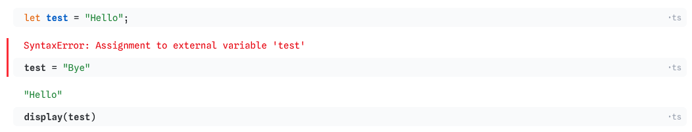
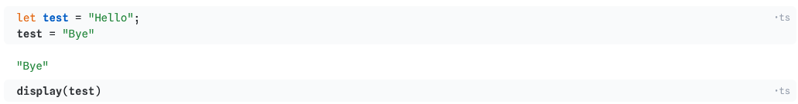

## Week 4 Lab Overview

|User Interface|Graphics Library|Notebook|
|:--|:--|:--|
|<a href="https://observablehq.com" target="_blank">observablehq.com</a>|(None!)|<a href="https://observablehq.com/@rk2546/2026-infovis-cse_week-4-lab" target="_blank">Lab 3 Notebook</a>|

### Today's Lab Activities

- Introduction to D3.js... kinda
- Introduction to JavaScript Essentials
- Data Manipulation (mapping, filtering)


## Why JavaScript First?

> **A lot of D3.js requires basic JavaScript**. Before we even start with D3.js, we have to have a solid grasp on JavaScript fundamentals.

JavaScript is:

- (relatively) lightweight as a standalone language (though the JavaScript ecosystem is getting heavier with each new library released).
- a "Just-In-Time" compiler (<a href="https://developer.mozilla.org/en-US/docs/Glossary/Just_In_Time_Compilation" target="_blank">Read more here</a>).
- used both in and outside of the web browser (e.g. <a href="https://nodejs.org/en" target="_blank">Node.js</a>, <a href="https://react.dev/" target="_blank">React</a>).
- _loosely-typed_ (or _weakly-typed_, _dynamically-typed_, etc.)


## `let` v.s. `var` v.s. `const`

### JavaScript Allows Type-inference

JavaScript uses **type inference** to determine what data type a variable is. Therefore, you don't have to directly state if a variable is a `string`, `int`, etc.

:::{.columns}
::::{.column width="50%"}

```{js}
const example : string = "Hello world";
```

::::
::::{.column width="50%"}

```{js}
const example = "Hello world";
```

::::
:::

<br />

### JavaScript Requires Scope Declarations

However, JavaScript still requires you to define the _scope_ of your variables within their block.

- `let` and `const` are **block-scoped**; they are restricted to the closest curly brackets they are surrounded by.
  - `let` declares that a variable can be reassigned a value within its scope.
  - `const` declares that a variable _cannot_ be reassigned a value.
- `var` is **function-scoped** and **global-scoped**; they can leak out of `if` statements or other kinds of loops.
  - `var` declares that a variable can be reassigned a value.
  - Try to avoid `var` as much as possible.

---

### Reassignment v.s. Redeclaration

There's a difference between **reassignment** and **redeclaration**:

- **Reassignment**: Setting a new value to an existing variable
- **Redeclaration**: Usually accidentally, even if the variable already exists, you create another variable with the same name.

|Scope|Reassignment|Redeclaration|
|:-:|:-|:-|
|`var`|Can be updated|Can be redeclared|
|`let`|Can be updated|Cannot be redeclared|
|`const`|Cannot be updated|Cannot be redeclared|

> **[Note]**: If you set a `const` variable as an object, though you cannot reassign a new value to it, you can still modify the object's properties and values.

_Source_: <a href="https://www.w3schools.com/js/js_varletconst.asp" target="_blank">W3Schools</a>


## JavaScript vs TypeScript

**TypeScript** is a _SuperSet_ of JavaScript. It contains all the properties and characteristics of pure JavaScript, while also extending it further. You code in TypeScript, and then when you deploy your code your IDE will convert your TypeScript back into normal JavaScript.

|Feature|JavaScript|TypeScript|
|:-|:-|:-|
|Typing|loose/dynamically typed|static typed|
|Tools|Limited built-in tooling|Comes with IDEs, code editors|
|Compatibility|Cannot run TypeScript in JavaScript files|Backwards-compatible with JavaScript|
|Extension|`.js`|`.ts`|

---

### Things... Don't Really Change

Most JavaScript you write will STILL be valid even in TypeScript. Why even care about TypeScript then?


:::{.columns}

::::{.column with="40%"}

```
const age = 25;
age = "Twenty-Five";
```

- JavaScript: _Allowed_
- TypeScript: **Error!**

::::
::::{.column width="60%"}
TypeScript's stricter type inference can be leveraged to catch erroneous (re)assignments that pure JavaScript would be happy to compile.
::::
:::

<hr />

:::{.columns}
::::{.column width="40%"}

```
let age: number = 25;
let name: string = "Alice";
let active: boolean = true;
const scores: number[] = [85, 90, 72];

function add(a: number, b: number): number {
  return a + b;
}

const student: {
  name: string;
  score: number;
} = {
  name: "Alice",
  score: 95
};
```

::::
::::{.column width="60%"}
TypeScript allows you (but doesn't require you) to explicitly declare a variable's _type_. This cannot be done in JavaScript, as JS is a **dynamically typed** language.
::::
:::

---

:::{.columns}
::::{.column width="40%"}

```
// Example: Interface
interface Student {
  name: string,
  grade: number
}

const students : Student[] = [
  { name: "Alice", grade: 96 },
  { name: "Jim", grade: 97 }
]
```
<br />
```
// Example: Alias
type PriceTier = "Low" | "Medium" | "High";

let tier : PriceTier = "Medium";
let tier2 : PriceTier = "Expensive";  // <- ERROR
```

::::
::::{.column width="60%"}
TypeScript introduces `interface` and _aliases_ that are reusable. If you are aware of the specific qualities of your variables, then you can use this to ensure that your functions compile properly.
::::
:::


::: {.fragment}

<br />

### Be careful about typing!

_Even if you explicitly declare your variables' types, those checks will disappear after your TypeScript is compiled. These explicit typings are only for YOUR benefit, to make more robust code. When your code is actually deployed, your type checks will no longer work._
:::

---

## Note: Observable Notebooks and Variable Scope

Scope works slightly differently in Observable's online notebooks. Here are some simple rules:

- You can control whether a cell should be in TypeScript, JavaScript, Observable JavaScript, or even Markdown and/or HTML
- Scope rules regarding reassignment and redeclaration are at the code block-level.
- Variables in one code block can still be accessed by other code blocks, regardless of whether `let`, `const`, or `var` are used.

### Erroneous Code



### Valid Code




## JavaScript Objects and Data Storage

Below is an example of a dataset stored as both a JavaScript Object (specifically, an array of items) and as a `.csv` table

- The dataset is simply an `Array` storing multiple objects in order.
- Each item in the dataset is an `Object`.
- Each `Object` is a collection of **keys**/**properties** and **values**.


:::{.columns}
::::{.column width="50%"}

```js
const students = [
  {name: "Alice", major: "CS", score: 82},
  {name: "Bob", major: "Biology", score: 91},
  {name: "Carol", major: "CS", score: 76},
  {name: "David", major: "Physics", score: 88}
];
```

::::
::::{.column width="50%"}

|name|major|score|
|:-|:-|:-:|
|Alice|CS|82|
|Bob|Biology|91|
|Carol|CS|76|
|David|Physics|88|

::::
:::

## In-Lab Exercise: What Does This JavaScript Do?

If we are given this dataset:

```{js}
const students = [
  {name: "Alice", major: "CS", score: 82},
  {name: "Bob", major: "Biology", score: 91},
  {name: "Carol", major: "CS", score: 76},
  {name: "David", major: "Physics", score: 88}
];
```

Then what will these return?

<table>
  <thead>
    <tr>
      <th>Code</th>
      <th>Output/Returns</th>
    </tr>
  </thead>
  <tbody>
    <tr>
      <td class="fragment" data-fragment-index="1"><code>students[0]</code></td>
      <td class="fragment" data-fragment-index="2"><code>{name: "Alice", major: "CS", score: 82}</code></td>
    </tr>
    <tr>
      <td class="fragment" data-fragment-index="3"><code>students[0].name</code></td>
      <td class="fragment" data-fragment-index="4"><code>"Alice"</code></td>
    </tr>
    <tr>
      <td class="fragment" data-fragment-index="5"><code>students[2].score</code></td>
      <td class="fragment" data-fragment-index="6"><code>76</code></td>
    </tr>
  </tbody>
</table>

---

If we are given this dataset:

```{js}
const students = [
  {name: "Alice", major: "CS", score: 82},
  {name: "Bob", major: "Biology", score: 91},
  {name: "Carol", major: "CS", score: 76},
  {name: "David", major: "Physics", score: 88}
];
```

Then what will these return?

<table>
  <thead>
    <tr>
      <th>Code</th>
      <th>Output/Returns</th>
    </tr>
  </thead>
  <tbody>
    <tr>
      <td class="fragment" data-fragment-index="1"><code>students.map(d =&gt; d.name)</code></td>
      <td class="fragment" data-fragment-index="2"><code>["Alice","Bob","Carol","David"]</code></td>
    </tr>
    <tr>
      <td class="fragment" data-fragment-index="3"><code>students.map(d =&gt; d.score)</code></td>
      <td class="fragment" data-fragment-index="4"><code>[82,91,76,88]</code></td>
    </tr>
    <tr>
      <td class="fragment" data-fragment-index="5"><code>students.filter(d =&gt; d.score &gt;= 85)</code></td>
      <td class="fragment" data-fragment-index="6">
        <pre><code>[
  {name: "Bob", major: "Biology", score: 91},
  {name: "David", major: "Physics", score: 88}
]</code></pre>

      </td>
    </tr>
  </tbody>
</table>

## JavaScript Functions

Two types:

:::{.columns}

::::{.column width="50%"}

### Traditional Functions

```{js}
function multiply(num1, num2) {
  const result = num1 * num2
  return result
}
```

::::

::::{.column width="50%"}

### Arrow Functions

```{js}
const multiply = (num1, num2) => {
  const result = num1 * num2
  return result
}
```

::::
:::

<br />
In most cases, they are the same. Many consider arrow functions to be a shorthand version of writing functions. if your arrow function reduces down to a single `return`, then you can even go shorter:

```{js}
const multiply = (num1, num2) => num1 * num2
```

## `map()` v.s. `filter()` v.s. `reduce()`

JavaScript provides some in-built functions.

- `map()`: Keep the same length, but re-"map" values into something else.
- `filter()`: Keep values the same, but "filter" out items that don't match a provided criteria
- `reduce()`: Combination of `map()` and `filter()`, literally "reduces" an array into something else.

We won't use `reduce()` a lot, but you may need `map()` and `filter()` in order to manipulate data in JavaScript.

<br />

:::{.columns}

::::{.column}

### `map()`:

```{js}
const mapped = data.map( item => {
  item.price += 10;
  return item;
})
```

::::

::::{.column}

### `filter()`

```{js}
const filtered = data.filter( item => {
  return item.price >= 20;
})
```

::::

::::{.column}

### `reduce()`

```{js}
const initial_price = 0
const reduced = data.reduce(
  (accumulator, item) => accumulator + item.price,
  initial_price
);
```

::::

:::


## In-Lab Exercise: Practicing with Data Handling

The <a href="https://vega.github.io/vega-lite/data/gapminder.json" target="_blank">Gapminder dataset</a> is the focus of this exercise. With it, and using JavaScript's in-built `map()`, `filter()`, and/or `reduce()`, produce the following:

- An array with only life expectancy values
- All records including and after 1990
- All records from France only
- (Bonus) An array of all unique countries present within the Gapminder data
- (Bonus) The average population size of each country

---

### An array with only life expectancy values

```js
data.map(d => d.life_expect)
```

<br />

### All records including and after 1990

```js
data.filter(d => d.year >= 1990)
```

<br />

### All records from France only

```js
data.filter(d => d.country == "France")
```

---

### (Bonus) An array of all unique countries present within the Gapminder data

```js
const countries = [...new Set(data.map(d => d.country))];
```

<br />

### (Bonus) The average population size of each country

```js
const average_population = countries.map(country => {
  const rows = data.filter(d => d.country == country);
  const average = rows.reduce((sum, d) => sum + d.pop, 0) / rows.length;
  return {
    country: country,
    population: average
  };
});
```

## End of Lab

- Exercise #4 will be posted **tonight** and is due on **October 1st, 2026 @ 11:59pm**!
- Where do I ask questions?
  - Office Hours! 
  - Our course Discord!