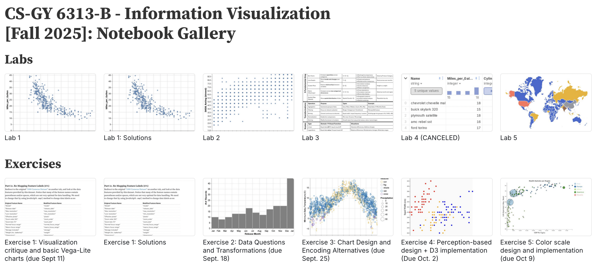
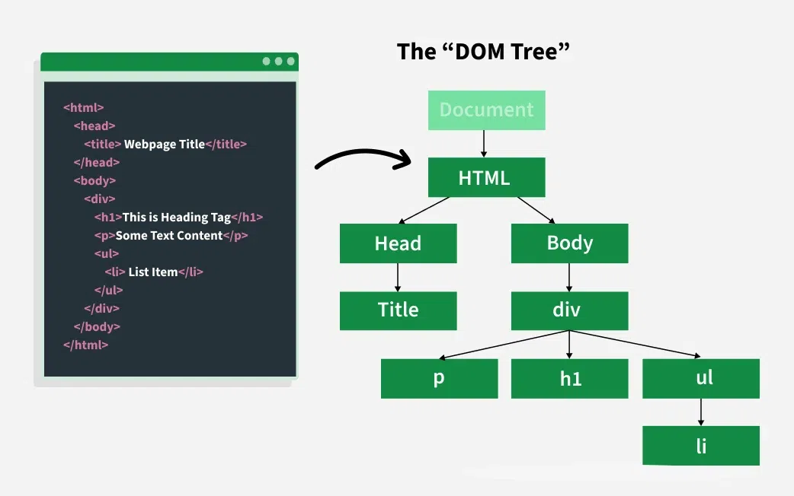
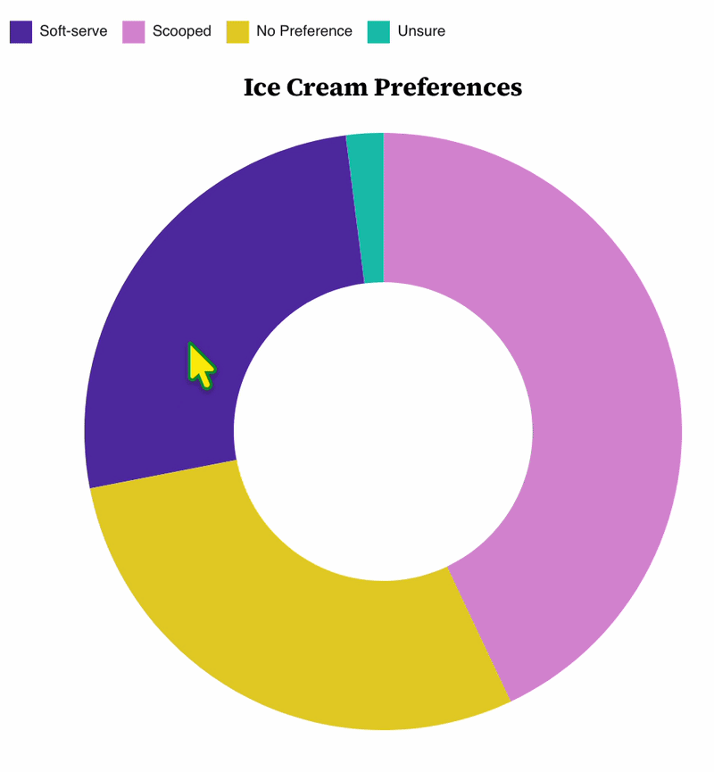

## Week 6 Lab Overview

|User Interface|Graphics Library|Notebook|
|:--|:--|:--|
|<a href="https://observablehq.com" target="_blank">observablehq.com</a>|<a href="https://d3js.org/" target="_blank">D3</a>|<a href="https://observablehq.com/@rk2546/2026-infovis-cse_week-6-lab" target="_blank">Week 6 Lab Notebook</a>|

### Today's Lab Activities

Today we will be a exploring the following topics:

1. Review: HTML DOM and Event Handling
2. Basic Example: Buttons and Observable
3. New Chart: Pie Chart
4. Mouse Interactions

## Resources for You

<a href="https://observablehq.com/@rk2546/2025-infovis-cse_notebook-gallery" target="_blank">Notebook Gallery</a>

{width="100%"}

## Review: DOM and Event Handling

{width="1000px"}

_Image souce:_ [GeekForGeeks](https://www.geeksforgeeks.org/javascript/dom-document-object-model/)


## Manipulating the DOM

:::{.incremental width="75%"}
- **Direct manipulation**: Users interact directly with the data in the visualizations (e.g., by clicking the bar or item). This must be implemented as part of the visualization itself and requires JS event handling.
- **Indirect manipulation**: Users interact with a separate, but linked interactive element (e.g., search field to filter). In Observable we can use the Input library for the input forms; in normal HTML5 websites, we need use form elements such as `<button>` and `<input>`.
:::

## Example: 

<iframe width="100%" height="134" frameborder="0" src="https://observablehq.com/embed/@rk2546/2025-infovis-cse_week-6-lab?cells=interactivity"></iframe>

````js
interactivity = {
  const svg = d3.create("svg")
    .attr('width', width)
    .attr('height', 50);
  
  const data = [1, 2, 3];
  const circles = svg.selectAll("circle")
    .data(data)
    .enter()
      .append("circle")
        .attr("r", 10)
        .attr("cy", 25)
        .attr("cx", (d, i) => 30 + i * 30)
        .on("click", function (event, d) {
          console.log(`clicked on: ${d}`);
          const circle = d3.select(this); // can't use arrow scoping
          circle.style("stroke", "orange").style("stroke-width", "3px");
        });

  return svg.node();
}
````

## Event Handling Syntax

````js
.on("click", function(event, d) { ... });
````

<br />

:::{.incremental}
- `.on(<EVENT>, <HANDLER FUNCTION>)` = We are attaching the `<HANDLER FUNCTION>` onto the `<EVENT>`.
- `"click"` = We want to attach our function to whenever the user mouse-clicks onto a circle.
- `function(event, d)` = This handler function has access to the event details as well as the data binded to it.
:::

<br />

[_W3Schools_](https://www.w3schools.com/jsref/dom_obj_event.asp) to look up the common event types and their functions

## Basic Input Types

HTML allows you these common types, which you can read more about here: <a href="https://www.w3schools.com/html/html_form_input_types.asp" target="_blank">HTML Input Types</a>.

Here are some common types:

|Input Type|Description|HTML Tag|
|:-|:-|:-|
|Button|Do something when a button is clicked|`<input type="button">` or `<button>`|
|Checkbox|Toggle between two values (on or off); choose any from a set|`<input type="checkbox">`|
|Radio|Toggle between two values; choose only one from a set|`<input type="radio">`|
|Range / Number|Choose a number in a range|`<input type="range">` / `<input type="number">`|
|Select|Choose one or any from a set (drop-down menu)|`<select>` and `<option>`|
|Text|Enter freeform single-line text|`<input type="text">`|
|Textarea|Enter freeform multi-line text|`<textarea>`|
|Date or Datetime|Choose a date|`<input type="date">` or `<input type="datetime-local">`|
|Color|Choose a color|`<input type="color">`|
|File|Choose a local file|`<input type="file">`|

## Case Example: Buttons

JavaScript (and by extension, TypeScript) natively allows us to access the DOM and create, modify, or delete HTML elements. We've provided an example of a button that is coded to increment a `count` variable every time you click it. 

Let's observe how we modify attributes such as style, text content, and event listeners to the buttons and other related HTML elements.

```{js}
// Let's define a local-scope `count` that's a number.
let count : number = 0;

// We'll create a new `<button>` and attach it to the DOM of this web document
const button = document.createElement("button");
button.textContent = "Increment";

// We'll also create a `<span>` and also add it to the DOM.
// We'll add some styling to make it look good with the button.
const output = document.createElement("span");
output.style.display = "inline-block";
output.style.marginLeft = "8px";
output.textContent = String(count);

// We'll add a new event to catch when the user clicks the button.
button.addEventListener("click", () => {
  // We increment the count, and update the output span's text content.
  count++;
  output.textContent = String(count);
});

// We'll create a div, style it, and append the button and output span to it.
const container = document.createElement("div");
container.style.display = "inline-block";
container.style.marginBottom = "12px";
container.append(button, output);

// We render the container next to their code block in Observable.
display(container);
```

---

### Part 1: Defining our `count` variable

If we use `let`, then we're indicating that though the `count` is technically accessible by other code blocks, we're restricting its scope to the current code block. We are allowing it to be reassigned.

```{js}
// Let's define a local-scope `count` that's a number.
let count : number = 0;
```

<br />

### Part 2: Creating our button

We can create new elements using `.createElement(HTML TAG)`.

```{js}
// We'll create a new `<button>` and attach it to the DOM of this web document
const button = document.createElement("button");
button.textContent = "Increment";
```

---

### Part 3: Creating a text display

Similarly, we also use `.createElement(HTML TAG)` here. We modify some additional attributes of our new `<span>` element too.

```{js}
// We'll also create a `<span>` and also add it to the DOM.
// We'll add some styling to make it look good with the button.
const output = document.createElement("span");
output.style.display = "inline-block";
output.style.marginLeft = "8px";
output.textContent = String(count);
```

<br />

### Part 4: Event Listeners for our button

We use an _arrow function_ with an event listener that checks if the user clicks on the button. If so, we update not just `count` but the `<span>` displaying it.

```{js}
// We'll add a new event to catch when the user clicks the button.
button.addEventListener("click", () => {
  // We increment the count, and update the output span's text content.
  count++;
  output.textContent = String(count);
});
```

---

### Part 5: Creating wrapper `<div>`s

To keep things neat, we wrap both the button and the output `<span>` into a container element.

```{js}
// We'll create a div, style it, and append the button and output span to it.
const container = document.createElement("div");
container.style.display = "inline-block";
container.style.marginBottom = "12px";
container.append(button, output);
```

## Alternative Way for Content Generation, Observable-Style

There is an alternative way that you can create HTML elements, specific to Observable. Observe the code below; this produces the same output as the above code, but using Observable logic.

```{js}
let count2 : number = 0;

// Programmatically create an HTML button
const increment_button = html`<button>Increment</button>`;

// Programmatically create an output span
const output_span = html`<span style="display:inline-block;margin-left:8px;">${count2}</span>`;

// Attach an event to `onclick`.
increment_button.onclick = () => {
  ++count2;
  output_span.textContent = String(count2);
}

// Programmatically create the div that wraps these elements
const container = html`<div style="display:inline-block;margin-bottom:12px;">${increment_button}${output_span}</div>`;

display(container);
```

## In-Lab Exercise: Creating An Interactive Button Panel (10 mins.)

Create some code that does the following:

- Initializes a variable `calc_value` that is set to 0 by default.
- Create 5 buttons that do the following:
  - Increments `calc_value` by 1
  - Decrements `calc_value` by 1
  - Multiplies `calc_value` by 2
  - Divides `calc_value` by 3
  - Resets `calc_value` to 0

How you create the HTML or style it is not important.

---

## Warning: Observable Shenanigans

You must note the following behavior when working with Observable notebooks:

- Even though **Observable exposes variables between code blocks**...
- ... variables are **not dynamically updated if they are changed in their original code block**.

In our lab notebook, we defined `count` and `count2` and incremented them using buttons. If we attempt to implement the code below and play around with our two buttons...

```{js}
const sum = count + count2;
display(sum);
```

... you'll quickly realize that no matter how many times you increment either `count` or `count2` via the buttons, it won't change `sum`.

<br />

### Core Idea: Keep Code Self-Contained

Treat variables from other code blocks as read-only. Each code block must independently determine their own inputs, interactions, etc.

_If you are really interested in having values in specific observable blocks be used and updated whenever those values are changed, then you can read <a href="https://observablehq.com/@rk2546/2025-infovis-cse_week-6-lab" target="_blank">last year's lab notebook</a>._


## Mouse Events

Mouse events are events tied specifically to mouse interactions with the DOM. This is useful for generating _tooltips_, similar to Vega-Lite's `.tooltip()` modifier we've worked with prior.

There are three events that will be key to mouse interactions in JavaScript:

- `mouseover`: Triggers when the mouse begins to hover over an element.  
- `mousemove`: Triggers when the mouse moves along the screen.
- `mouseout`: Triggers when the mouse stops hovering over an element.

We will need to access these events and the data binded to them.

## Example: Pie Charts and Ice Cream Preferences

_Technically a donut chart_

:::{.columns}

::::{.column width="50%"}

|Type|Value|Total|
|:-|:-:|:-:|
|Soft-serve|286|1,098|
|Scooped|472|1,098|
|No Preference|318|1,098|
|Unsure|22|1,098|

::::

::::{.column width="50%"}



::::

:::

---

```{js}
const path = svg.chart.selectAll('path')
  .data(pie(pie_data))
    .enter()
      .append('path')
      // ...
      .on('mouseover', function (d, i) {    // Add a listener to `mouseover`
        d3.select(this)                     // Make D3 pay attention to the current `path` element
          .attr('opacity', '.75')           // Modify the opacity to be 0.75
      })
      .on('mouseout', function (d, i) {     // Add a listener to `mouseover`
        d3.select(this)                     // Make D3 pay attention to the current `path` element
          .attr('opacity', '1')             // Modify the opacity to be 1.0
      });
```

<br />

### Why traditional function over arrow function?

One of the key differences between traditional functions and arrow functions is the scope of `this`.

- In traditional functions, `this` refers to the immediate object that called the function.
- With arrow functions, `this` refers to the global context.

<a href="https://dev-aditya.medium.com/understanding-this-in-javascript-arrow-functions-vs-regular-functions-704a8452c4f1" target="_blank">Learn more here</a>

## Transitions

Sometimes we want these dynamic changes to have transitions. This allows the interactions of your charts to appear more visually interesting.

Observe the following code sample:

```{js}
d3.select("body")
  .transition()
  .style("background-color", "red");
```

In this code example, when `<body>` is loaded into the DOM, D3 will perform a transition to adjust the “background-color” of `<body>` to “red”. D3’s transitions support various transition types, such as `.transition().attr()` and `.transition().style()`.

<a href="https://d3js.org/d3-transition" target="_blank">Read more here.</a>

## In-Lab Exercise: Adding Transitions (5 mins.)

Copy the pie chart code and modify the chart so that, on both `mouseover` or `mouseout`, add a transition that has a duration of 1000ms (1 sec.).

You are free to re-use `color_scale`, `arc`, `pie`, and all the dimensional variables such as `_width` and `_margins` without needing to copy them.

<br />

:::{.fragment}

### Solution

```{js}
// Instantiate our SVG. Reusin g some old variables
let svg = instantiate_chart({
  width:_width,
  height:_height,
  margins:_margins,
  titles:{chart:'Ice Cream Preferences'}
});

// The novelty comes from the two new events we are considering: `mouseover` and `mouseout`
let path = svg.chart.selectAll('path')
  .data(pie(pie_data))
    .enter()
      .append('path')
      .attr('d', arc)
      .attr('fill', (d) => color_scale(d.data.type))
      .attr('transform', `translate(${_width/2}, ${_height/2})`)
      .on('mouseover', function (d, i) {    // Add a listener to `mouseover`
        d3.select(this)                     // Make D3 pay attention to the current `path` element
          .transition(1000)                 // Make a transition
            .attr('opacity', '.75')         // Modify the opacity to be 0.75
      })
      .on('mouseout', function (d, i) {     // Add a listener to `mouseover`
        d3.select(this)                     // Make D3 pay attention to the current `path` element
          .transition(1000)                 // Make a transition
            .attr('opacity', '1')           // Modify the opacity to be 1.0
      });
```

:::


## End of Lab

- Exercise #6 will be posted tonight and is due on **October 15th @ 11:59pm**!
- Where do I ask questions?
  - Office Hours!
  - Our course Discord!