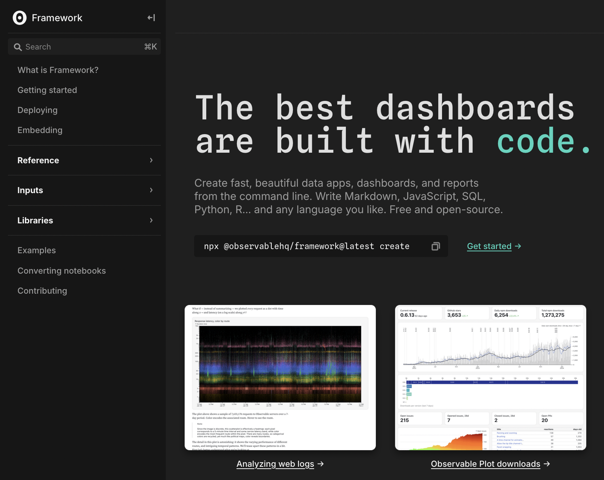
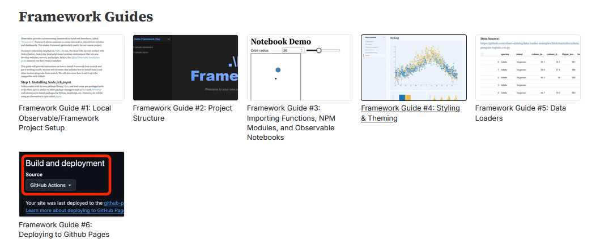
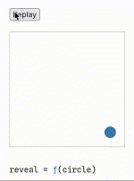
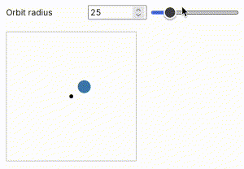
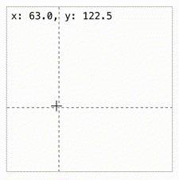
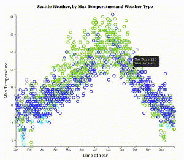

## Week 6 Lab Overview

|User Interface|Graphics Library|Notebook(s)|
|:--|:--|:--|
|<a href="https://observablehq.com" target="_blank">observablehq.com</a>|<a href="https://d3js.org/" target="_blank">D3</a><br /><a href="https://observablehq.com/framework/" target="_blank">Framework</a>|<a href="https://observablehq.com/@rk2546/guide-project_structure" target="_blank">Observable Frameworks</a>|

### Today's Lab Activities

Today we will be a exploring the following topics:

1. How to set up a local instance of Observable via _Framework_
2. Group Formation Time - Finding Teammates, Initial Brainstorming
3. Upcoming Changes to Course Deliverables

- <a href="https://forms.gle/qqKF7hPGoy3hvaEc7" target="_blank">Project Group Check-in</a> - Due by **TONIGHT** @ 11:59pm


## Running Observable Locally: "Framework"

In prep for your group projects, it would be ideal to work on your own local instances of Observable...ness. The same group behind Observable also has released <a href="https://observablehq.com/framework/" target="_blank">Framework</a>, a JavaScript ecosystem for generating dashboards and web apps with Observable functionality.

:::{.columns}
::::{.column width="50%"}
We will focus a bit on making sure you are ready with a _Framework_ project that you can upload to Github. Make sure to open today's lab notebook, <a href="https://observablehq.com/@rk2546/guide-local_observable_setup" target="_blank">Local Observable Frameworks</a> and follow along with the instructions.

<br />
<span style="color:blue; font-size:0.9em;">**[Note]**: _Framework_ is one of **many** options you can use for your project. We're introducing it because it's the closest to the Observable notebooks we've generated thus far.</span>
::::
::::{.column width="50%"}
{width="100%"}
::::
:::

## Framework Prerequisites


<div style="display:flex;flex-direction:row;flex-wrap:nowrap;justify-content:space-evenly;align-items:baseline;width:100%;">
  <a href="https://github.com/" target="_blank" style="display:flex;flex-direction:column;justify-content:center;">
    
    <p style="text-align:center"><strong>Github</strong></p>
  </a>
  <a href="https://nodejs.org/en" target="_blank" style="display:flex;flex-direction:column;justify-content:center;">
    
    <p style="text-align:center"><strong>Node.js</strong></p>
  </a>
  <a href="https://code.visualstudio.com/" target="_blank" style="display:flex;flex-direction:column;justify-content:center;">
    
    <p style="text-align:center"><strong>A Code Editor<br />(e.g. _Visual Studio Code_)</strong></p>
  </a>
</div>

<p style="text-align:center;margin-top:64px;">Our guide assumes that you have a Github account.<br />If you do not, please make an account.</p>

## Installing Node.js and npm: Mac OSX

We will install _Node.js_ and _npm_ with a version manager called _nvm_.

1. Install _nvm_ by following the instructions provided by the <a href="https://github.com/nvm-sh/nvm" target="_blank">version manager's Github documentation</a>.
2.  Open a CLI ("Command Line Interface") in `Terminal.app` or some other code editor such as _VSCode_. 
3.  Paste and run the command, which downloads and installs the latest LTS version of _Node.js_: 
   
    ````sh
    nvm install --lts
    ````

4.  Paste and run the command. This will switch the default _Node.js_ version that your CLI uses to the LTS version you just installed:

    ````sh
    nvm use --lts
    ````

## Installing Node.js and npm:  Windows

_nvm_ is a Unix-based _Node.js_ version manager. Windows as its own version, called _nvm-windows_.

1. Install _nvm-windows_ via the installation instructions mentioned in their <a href="https://docs.nvm-windows.com/install/installers" target="_blank">online documentation</a>.
2. Open <a href="https://learn.microsoft.com/en-us/powershell/scripting/windows-powershell/starting-windows-powershell?view=powershell-7.4#with-administrative-privileges-run-as-administrator" target="_blank">PowerShell <strong>as an administrator</strong></a>. Alternatively, open a CLI terminal in your code editor such as _VSCode_.
3. Paste and run the command, which downloads and installs the latest LTS version of _Node.js_: 
   
    ````sh
    nvm install --lts
    ````

4. Paste and run the command. This will switch the default _Node.js_ version that your CLI uses to the LTS version you just installed:

    ````sh
    nvm use --lts
    ````

## Creating a Framework Project

1. Open a terminal window (either _Terminal.app_ on MacOS, _Command Prompt_ on Windows, or _VS Code_ on either MacOS or Windows). 
2. Navigate to any folder or location where you will be comfortable creating a new folder (e.g. the `Documents/` directory on MacOS or the `Desktop/` on Windows). You can navigate to that location using the following command:

    ````sh
    cd [PATH]/[TO]/[LOCATION]
    ````

3. Paste and run the command:

    ````sh
    npx @observablehq/framework@latest create
    ````

---

4. New instructions will be prompted from you in the terminal window. Answer all the directions that appear. 

    - You will likely be asked to install `@observablehq/framework@[VERSION]`. Say "Yes" or "y" to proceed.
    - The defaults are fine
    - If you want to have sample pages and content, you are free to say "Yes" to "Include sample files to help you get started?"; otherwise, say "No" to that prompt.
    - When prompted with "Install dependencies?", you are safe to say "Yes, via npm (recommended)"
    - When prompted with "Initialize git repository?", you are safe to say "Yes"

At this point, _Framework_ will create a brand new folder for you with all the code necessary to run a Framework project locally. If you ran with defaults, then the new folder will be titled "hello-framework".

## Running a Dev Server

We are ready to run a local server that we can use for development. Run the following command inside your project folder:

````sh
npm run dev
````

Your _Framework_ webpage should then be loaded into a `localhost` server that you can view via the browser. The _Framework_ architecture tracks any changes to any files and updates in real-time every time you **save changes in a file**.

## Version Control via Github

After these steps, you should be able to push changes to your Github repository and pull them when needed.

1. Online, create an empty Github repository and feel free to name it anything you want (though generally you should try to match project names when possible).
2. Locally (via command line or via Github tool), add and commit all files in your project window.
3. Set the branch to "main", add a new remote origin, and push your changes. The 3 commands to do so are provided below, as an example:

    ````sh
    git branch -M main
    git remote add origin git@github.com:[USERNAME]/[PROJECT_NAME].git
    git push -u origin main
    ````

<br />
<span style="color:blue; font-size:0.9em;">**[Note]**: Whenever you clone your repo to another folder or device, you **must** install dependencies again:</span>
```sh
npm install
```

## Framework Setup: Command Line Summary

````sh
# Step 1: Install Node.js LTS, for Mac OSX (after installing npx)
nvm install --lts
nvm use --lts

# Step 1: Install Node.js LTS, for Windows (after installing npx-windows)
nvm install lts
nvm use lts

# Step 2: Create a _Framework_ Project
npx @observablehq/framework@latest create

# Step 3: Run a Development Preview Server
npm run dev
  
# Step 4: Connecting an Empty Github Repo
git add -A
git commit -m "first commit"
git branch -M main
git remote add origin git@github.com:[USERNAME]/[PROJECT_NAME].git
git push -u origin main
````

## How Framework Works

### General Operations:
:::{.incremental}
- _Framework_ generates webpages from _Markdown_ files.
- Markdown files can mix and combine Markdown syntax, HTML, and JavaScript.
- Helper functions can be written in separate scripts and imported into Markdown files.
- NPM and Observable modules can be imported.

### Best Practices
- Try to keep most dev files (major scripts, datasets, etc.) inside of the `src/` folder.
- [Avoid dashboard rot](https://observablehq.com/blog/five-strategies-fight-dashboard-rot) by knowing beforehand what to create (i.e. a script, a database, a notebook) and keeping efficient/accessible/interactive design practices in mind.
:::

**Let's Run a Live Demo!**

## Additional Framework Guides For the Course

<a href="https://observablehq.com/@rk2546/2026-infovis-cse_notebook-gallery" target="_blank">Info-Vis Notebook Gallery</a>

Look up our other guides on Framework, if you wish to learn more.




## Changes to Course Materials

1. We only have **2** weekly exercises remaining.
2. We will soon transition into two new deliverables for the course:
    - **Bi-weekly mini-projects** that are expected to be delivered through Framework webpages, hosted with Github Pages.
    - **Group project milestones** to report back on your overall progress as the semester progresses.
3. We will place more emphasis on our class' <a href="https://ctsilva.github.io/2026-InfoVis-CSE/syllabus#ai-policy" target="_blank">AI Policy</a>:
  
    > ... you can use generative AI tools to do the assignments in this class. If you use an AI to guide you in completing an assignment, you must disclose which parts were generated by the AI. Remember that you are responsible for any errors or inaccuracies in AI-generated content, and you must be able to explain all submitted work.
  
    Basically **if you use AI for any exercises, mini-projects, milestone deliverables, or even for the final group project, you MUST disclose where and how you used it.**


## Project Groups: Finding Partners & Brainstorming

Spend the remainder of the class searching for teammates or datasets to focus working on. Aim to find a group by the end of class today, and report back to us your group members by TONIGHT on <a href="https://forms.gle/qqKF7hPGoy3hvaEc7" target="_blank">this Google Form</a>.

### Optimal groups tend to demonstrate:

1. **Diverse Skills and Knowledge**: Each student has something unique they should bring to the table.
2. **Well-Planned Schedules**: Group members may have different responsibilities, exam schedules, etc. Find members whose schedules align.
3. **Communication of Expectations**: Students are expected to contribute equally to their group projects. Find members who you think will work well with your way of working.
4. **Efficient Code Environments & Workflow**: Try to agree on a single code environment and workflow that works for all members. Do all members know how to use Git and version control systems?

The best groups are those that **communicate with each other well, are honest with each other, and are not afraid to ask questions**.

---

### If you're struggling, consider:

- **Follow YOUR interests first!** Don't start by searching for a dataset; instead, focus on discussing at least one _common interest_ among your group members first. Datasets should serve to help you _explore_ those common interests.
- **Start with simple questions** In <a href="https://ctsilva.github.io/2026-InfoVis-CSE/labs/week3-lab.html#/12" target="_blank">Lab #3</a>, we covered question taxonomies and strategies for forming research questions. Try to:
  1. Explore what features represent in your chosen datasets.
  2. Start with simple questions, and use _question-laddering_ to formulate more complex questions.
  3. Consider your target audience - who are you focusing your questions toward, and what kind of _personas_ populate your target audience?


<!--
## Lab: Interactables

We have a second notebook for today's lab, which further elaborates on some interactable elements.

[Week 7 Lab Notebook](https://observablehq.com/@rk2546/2025-infovis-cse_week-7-lab)

:::{.columns}
::::{.column width="30%"}
{width=300}
::::
::::{.column width="30%"}
{width=500}
::::
::::{.column width="30%"}
{width=300}
::::
:::

## General Structure for Interactables

1. A way to manipulate the data (e.g. a button, a mouse event).
2. Functions to handle changes (e.g. an _event handler_ function).
3. A connection between (1) and (2).

## General Structure for Interactables

1. A way to manipulate the data (e.g. a button, a mouse event).
2. Functions to handle changes (e.g. an _event handler_ function).
3. A connection between (1) and (2).

:::{.columns}
::::{.column width="15%"}
{width="100%"}
::::
::::{.column width="40%"}
````js
// Manipulation
viewof replay = Inputs.button("Replay");
````
<br />
````js
{
  replay;
  // ....
  const circle = svg.append("circle")
      .attr("r", 10)
      .attr("cx", 25)
      .attr("cy", 25)
      .attr("fill", "steelblue")
      .call(reveal);    // Event Handling

  return svg.node();
}
````
::::
::::{.column width="40%"}
```js
// Daisy-change of events to this circle
reveal = circle => {
  circle
    .interrupt()      // 1. Stop previous animation
    .attr("cx", 25)   // 2. Place at origin (25,25)
    .attr("cy", 25)
    .transition()     // 3. Start a transition
    .duration(1500)   // 4. Run for 1.5sec
    .attr("cx", 175)  // 5. Set new pos (175,175)
    .attr("cy", 175);
}
````
::::
:::

## General Structure for Interactables

1. A way to manipulate the data (e.g. a button, a mouse event).
2. Functions to handle changes (e.g. an _event handler_ function).
3. A connection between (1) and (2).

:::{.columns}
::::{.column width="15%"}
{width="100%"}
::::
::::{.column width="75%"}
````js
// Manipulation
viewof radius = Inputs.range([15, 75], {label: "Orbit radius", value: 25, step: 1})
````

````js
// Create two PERSISTENT variables that will be used across multiple functions within this code block.
let angle = 0;        // Relative to +x
const speed = 0.02;   // degrees per frame

// Event Handler that runs every frame. Animates the cirlce
function animate() {
    
  // Update angle since it's a new frame
  angle += speed;
    
  // We grab the value set by our slider variable at this current frame
  const r = viewof radius.value;

  // Modify the x and y positions of our orbiting circle, mathematically
  const x = pivot.x + r * Math.cos(angle);
  const y = pivot.y + r * Math.sin(angle);
  orbit.attr("cx", x).attr("cy", y);

  // This is a special DOM function that calls `animate()` again when the next frame
  // of the window is updated. So `animate()` will run at every frame.
  requestAnimationFrame(animate);
}

// Call `animate()` to get things rolling when this code block runs
animate();
````
::::
:::

## General Structure for Interactables

1. A way to manipulate the data (e.g. a button, a mouse event).
2. Functions to handle changes (e.g. an _event handler_ function).
3. A connection between (1) and (2).

:::{.columns}
::::{.column width="15%"}
{width="100%"}
::::
::::{.column width="75%"}

````js
// Mouse event handlers
  const onmousemove = (event) => {
    const [x, y] = d3.pointer(event);   // Grab the mouse position
    vLine                               // Modify the position of our vertical line
      .attr("x1", x)
      .attr("x2", x)
      .style("visibility", "visible");  // And make it visbile
    hLine                               // Same with the horiontal line.
      .attr("y1", y)
      .attr("y2", y)
      .style("visibility", "visible");
    text.text(`x: ${x.toFixed(1)}, y: ${y.toFixed(1)}`);    // We modify the coordinates text.
  };

  const onmouseleave = (event) => {
    vLine.style("visibility", "hidden");    // Make the vertical and horizontal lines invisible
    hLine.style("visibility", "hidden");
    text.text("");                          // We make the text empty.
  };

  // Connect events to handlers.
  svg.on("mousemove", onmousemove);
  svg.on("mouseleave", onmouseleave);
````
::::
:::

## Persistence in JavaScript

**Persistent variables** are those that are maintained and are referenced across multiple components, functions, etc. In JavaScript, variables remain persistent **within the context they are defined**.

<br />

#### Example #2:

````js
let angle = 0;        // Relative to +x
const speed = 0.02;   // degrees per frame
````

<br />

#### Example #3:

````js
// We must generate our crosshair lines pre-emptively as elements of our svg.
// We create the vertical line, with some styling
const vLine = svg.append("line")
  // ...

// We create a horizontal line, with some styling
const hLine = svg.append("line")
  // ...

// Similar to the crosshair lines, we also pre-generate a text display showing the mouse coordinates.
const text = svg.append("text")
  // ...
````

## Review: Basic Input Types

- [Button](https://observablehq.com/@observablehq/input-button) - do something when a button is clicked
- [Toggle](https://observablehq.com/@observablehq/input-toggle) - toggle between two values (on or off)
- [Checkbox](https://observablehq.com/@observablehq/input-checkbox) - choose any from a set
- [Radio](https://observablehq.com/@observablehq/input-radio) - choose one from a set
- [Range](https://observablehq.com/@observablehq/input-range) or [Number](https://observablehq.com/@observablehq/input-range) - choose a number in a range (slider)
- [Select](https://observablehq.com/@observablehq/input-select) - choose one or any from a set (drop-down menu)
- [Text](https://observablehq.com/@observablehq/input-text) - enter freeform single-line text
- [Textarea](https://observablehq.com/@observablehq/input-textarea) - enter freeform multi-line text
- [Date](https://observablehq.com/@observablehq/input-date) or [Datetime](https://observablehq.com/@observablehq/input-date) - choose a date
- [Color](https://observablehq.com/@observablehq/input-color) - choose a color
- [File](https://observablehq.com/@observablehq/input-file) - choose a local file

## Try For Yourselves

Our lab notebook has two application examples as exercises. Try them for yourselves!

<br />

{width="100%"}f<a 
-->

## Final Reminders & Checks

- Exercise #6 concerns additional chart types in D3.js. it is due **October 15th @ 11:59pm**
- <a href="https://forms.gle/qqKF7hPGoy3hvaEc7" target="_blank">Project Group Check-in</a> - Due by **TONIGHT** @ 11:59pm
- Have questions?
    - Discord!
    - Email!
    - Office Hours!