## Acknowledgments

This lecture incorporates materials from:

- **Prof. Jeffrey Heer** (University of Washington)
  - CSE 512: Data Visualization course materials
  - Data transformation and wrangling concepts
  - *Used consistent with standard academic practice*
  
- **Prof. Enrico Bertini** (NYU)
  - Data abstraction and analytical questions materials
  - *Used with permission*

- **Parikshit Solunke** (NYU)
  - Slide development and revisions for the Fall 2025 offering
  
## Today's Agenda

### Three Main Parts

::: {.incremental}
1. **Part 1:** Recap: Data Fundamentals
2. **Part 2:** Analytical Questions  
3. **Part 3:** Data Wrangling and Transformations
:::

---

## Detailed Agenda

:::: {.columns}
::: {.column width="50%"}
### Recapitulation & Part 2
- What is data? (Interactive discussion)
- Data abstraction: Items + Attributes
- Dataset and attribute types
- Domain vs. data questions
- Task taxonomies for visualization
:::

::: {.column width="50%"}
### Part 3
- Real-world data challenges and cleaning
- Transformation operations
- SQL operations and relational algebra
- Roll-up and drill-down operations
- Tidy data principles
- Tools and best practices
:::
::::

# Recapitulation: Data Fundamentals

## What Is Data?

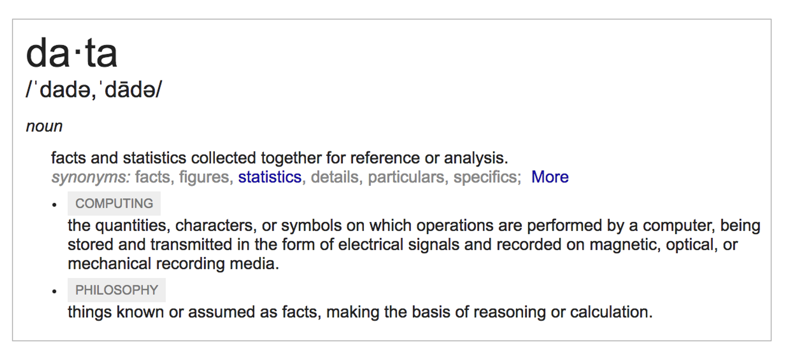{width="70%"}

::: {.incremental}
- **Definition**: Facts and statistics collected together for reference or analysis
- **Examples**: Census data, stock prices, sensor readings, survey responses, click streams
- **Characteristics**: Can be structured/unstructured, quantitative/qualitative, temporal/static
:::

::: {.notes}
Interactive discussion - students provide examples and we build definition together

After definition and examples, ask for Characteristics.
:::

## Data in Visualization

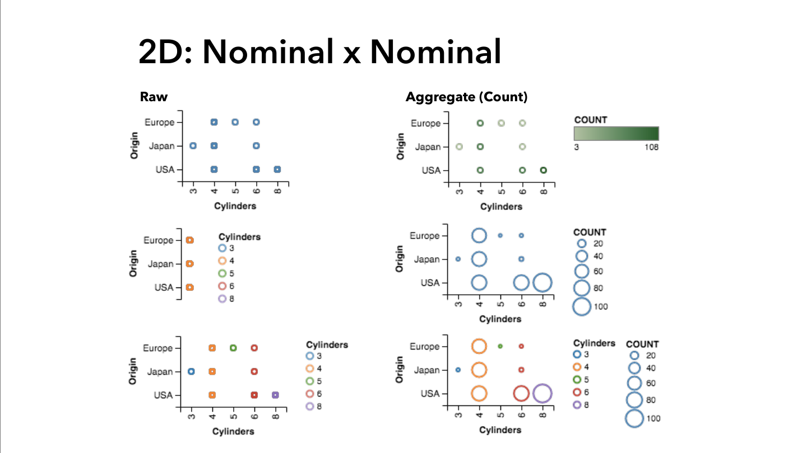{width="80%"}

### The Visualization Pipeline (Card et al., 1999)

::: {.incremental}
1. **Collection**: Raw data from various sources
2. **Transformation**: Data tables, cleaning, structuring, aggregations etc
3. **Visualization**: Visual structures and views
:::

::: {.notes}
Complete this together - what happens at each stage?

  
:::

## Data Abstraction

### Data Abstraction as a Visualization Design Tool

---

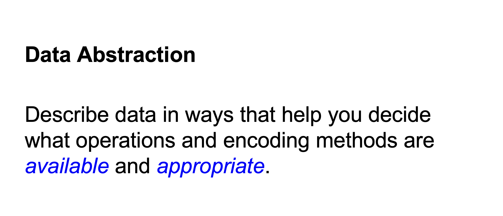{width="80%"}

### From Reality to Representation

::: {.incremental}
- **Real-world phenomena**: Events, objects, processes
- **Measurements/observations**: Sensors, surveys, records
- **Abstract data model**: Tables, networks, fields
- **Visualization encoding**: Visual mappings and representations
:::

::: {.notes}
You can think of Visualization as a process of creating an abstract representation of real world events. Producing a visualization is basically applying transformations and encodings to change the representation of data in a way that's useful.

You have some real world phenomena, you measure the phenomena, then you decide what data model is best suited, and then finally you decide how to best visually represent data. 
:::

## Datasets = Items + Attributes

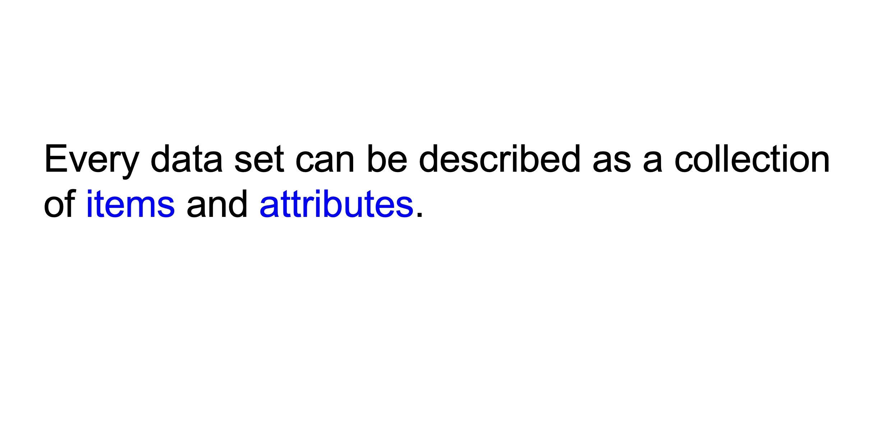{width="90%"}

---

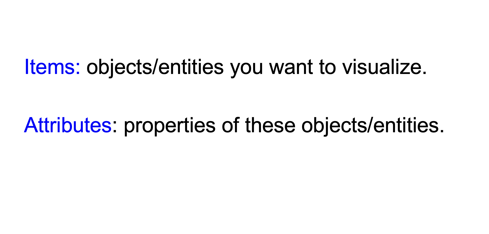{width="90%"}

### Complete the Framework

**Items** (also called records, cases, objects):
- Definition: Objects/entities you want to visualize
- Examples: 

**Attributes** (also called variables, features, fields):
- Definition: Properties of these objects/entities
- Examples: 

::: {.notes}
For example - consider a census dataset, could you think of what the items would be and what attributes it could have
:::

---

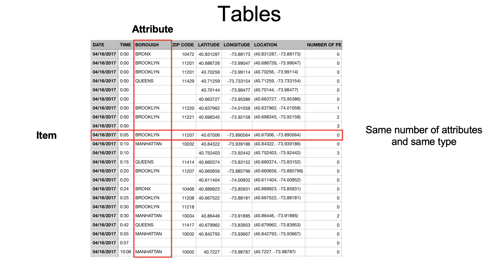{width="90%"}

---

## Dataset Types

### Munzner's Classification (2014)

*From "Visualization Analysis and Design", Chapter 2*

Fill in examples for each type:

- **Tables**: 
- **Networks**: 
- **Fields**: 
- **Geometry**: 

::: {.notes}
Have students think of examples from their research/work experience
:::

---

## Attribute Types

### Qualitative (Categorical):
- **Nominal:** No order (colors, countries)
- **Ordinal:** Natural order (low/medium/high)

### Quantitative (Numeric):
- **Discrete:** Countable numbers (students in class)
- **Continuous:** Any value in range (height, temperature)

---

## Stevens' Levels of Measurement (1946)

Complete the table with examples: 

| Level | Description | Operations | Examples |
|-------|-------------|------------|----------|
| **Nominal** | Categories, no order | =, ≠ |  |
| **Ordinal** | Ordered categories | =, ≠, <, > |  |
| **Interval (Quantitative)** | Numeric, no true zero | =, ≠, <, >, - |  |
| **Ratio (Quantitative)** | Numeric, true zero | =, ≠, <, >, -, % |  |


:::{.notes}
Stevens proposed a classification which, instead of dividing quantitative values into discrete and continuous, looks at them as intervals and ratios.

ANSWER KEY for the Examples column:

- **Nominal**: Colors, names, IDs
- **Ordinal**: Rankings, grades
- **Interval**: Temperature (°C or °F only — Kelvin has a true zero), dates
- **Ratio**: Height, weight, age, income
:::
---

### Why is it useful to identify attribute types?

::: {.fragment}
<br/>
Types provide guidance in selecting appropriate graphical encoding strategies...
:::

:::{.notes}
In visualization it's important to think of attribute types because doing this simplifies the process of deciding how to graphically represent your data.
:::
---

## Visualization Examples by Attribute Type

### Line Charts: Appropriate for Ordered Data
{width="100%"}

:::{.notes}
Line charts imply a continuity relationship, which does not exist in nominal data, but are suitable for ordinal data.
:::

---

### Categorical Data: Arbitrary Sorting
{width="100%"}

:::{.notes}
Nominal or categorical attributes can usually be arranged arbitrarily.
:::

---

### Spatial Attributes: Use Spatial Metaphors
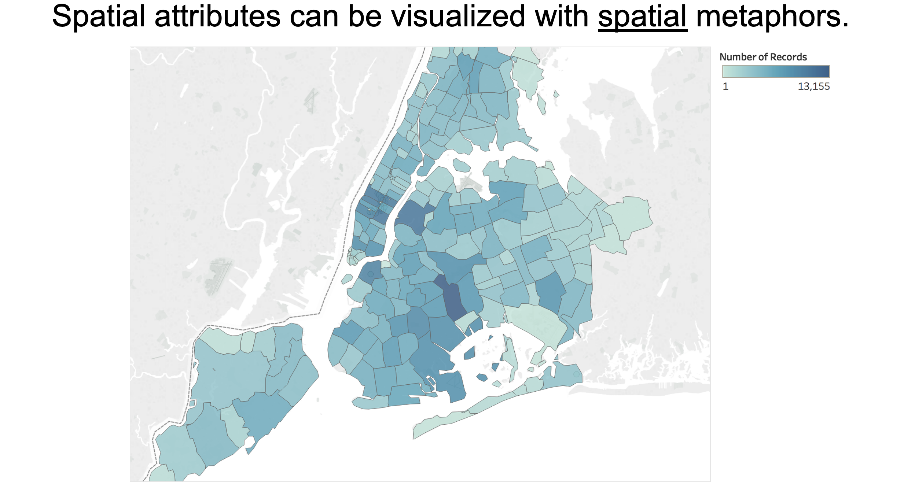{width="90%"}

:::{.notes}
If you have spatial data, you can use various spatial metaphors to represent it, here it's NYC neighborhoods, so you visualize the data as a choropleth map.
:::

---

### Quantitative Data: Divergent Color Scales
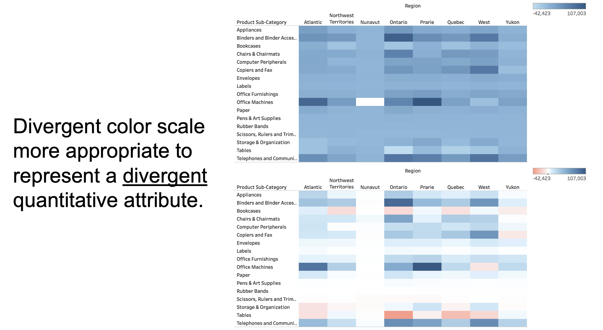{width="100%"}

:::{.notes}
If you have divergent quantitative data, i.e. some sort of interval, you can use a divergent color scale, with separate hues for negative values and separate ones for positive values.
:::

---

## (More) Ways of Characterizing Variables

### Physical Types
- Characterized by storage format
- Characterized by machine operations
- *Example*: bool, int32, float, double, string

### Abstract Types
- Provide descriptions of the data
- May be characterized by methods/attributes
- May be organized into a hierarchy
- *Example*: plants, animals, metazoans

## Taxonomy of Data Types

### Shneiderman's Classification (1996)

:::: {.columns}
::: {.column width="50%"}
- **1D** (sets and sequences)
- **Temporal**
- **2D** (maps)
- **3D** (shapes)
:::

::: {.column width="50%"}
- **nD** (relational)
- **Trees** (hierarchies)
- **Networks** (graphs)
:::
::::

*"The eyes have it: A task by data type taxonomy for information visualization"*

## Dimensions & Measures

### Dimensions (~ independent variables)
- **Categorical variables** that describe and organize data (Nominal, Ordinal)
- Examples: Categories, dates, regions, binned quantities
- Used for: Grouping, filtering, splitting data

### Measures (~ dependent variables)
- Quantitative values that can be aggregated (Q)
- Examples: Sales revenue, temperature readings, counts
- Used for: Sum, count, average, std. dev, min/max

*Not a strict distinction. The same variable may be treated either way depending on the task. For example — whether described as Hot/Cold (N) vs. Temperature Values (Q)*

:::{.notes}
You can also classify attributes into either dimensions and measures, - dimensions are usually categorical values - which can be used for grouping, splitting, filtering purposes, meanwhile measures refer to any quantitative values that you can run aggregations and other operations on. Note that this is not a strict distinction, the same variable can be described both as a measure and dimension - for instance- temperature.
:::

---

## Data Models vs Conceptual Models

### Data models are formal descriptions
- Focus on storage, computation, and manipulation
- Example: Array of 32-bit floats [98.6, 101.2, 99.1]

### Conceptual models are mental constructions
- Semantic, meaning-rich representations
- Support reasoning, interpretation, and understanding
- Example: Patient temperatures (normal, fever, recovering)

### Examples (data vs. conceptual)
- Float array [1.2, -0.8, 2.1] vs. market volatility
- 3D vector of floats vs. spatial location

**Data models ask "How is it stored?" Conceptual models ask "What does it mean?"**

::: {.notes}
From Jeff Heer's materials on distinguishing between formal data models and conceptual understanding
:::

## From Data Model to Stevens' Levels

**Example: Temperature Data**

### Data Model
- 32.5, 54.0, -17.3, ...
- Floating point numbers

### Conceptual Model
- Temperature (°C)

### Measurement Scales (Stevens' Levels):
- Above/Below Freezing (Nominal)
- Cold, Warm, Hot (Ordinal)
- Actual Temperature Values (Quantitative - Interval)

**Key Point**: Same data, different analytical possibilities depending on measurement scale

# Part 2: Analytical Questions

## Visualization as a Tool to Answer Questions with Data

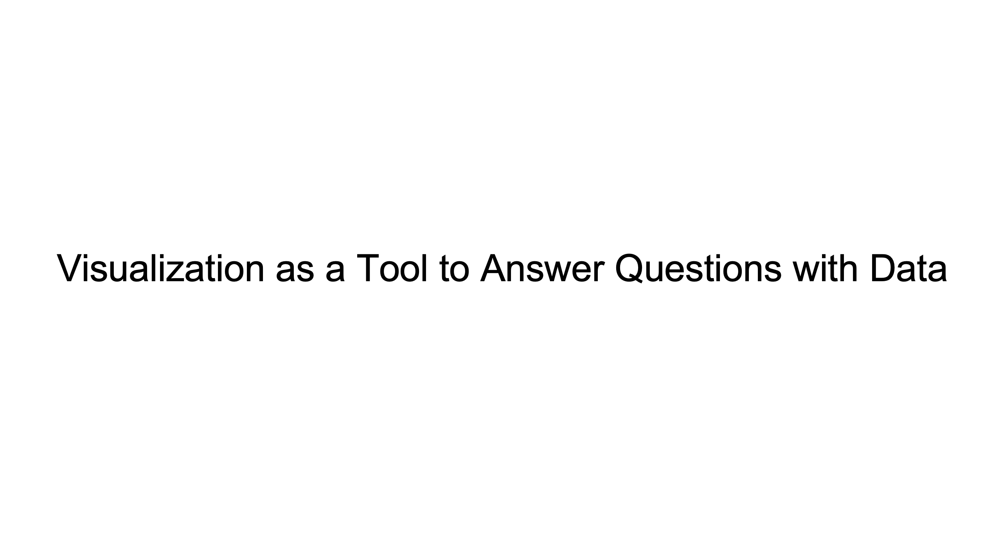{width="100%"}

:::{.notes}
The ultimate purpose of creating visualizations is to answer questions that you have about data.
:::
---

## Domain Questions vs. Data Questions

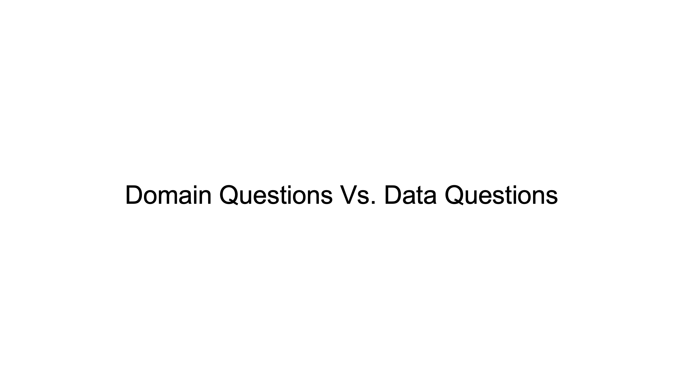{width="100%"}

:::{.notes}
However, the type of questions you can ask vary a lot, and can be broadly categorized as either a domain question or a data question.
:::

---

## From Domain to Data Questions

{width="100%"}

::: {.notes}
Pure transition slide - read it and move straight on to the table.
:::

---

## Example: NYC Flight Delays Data

**The raw data:** one row per carrier per departure hour.

| carrier | hour | avg_total_delay (min) |
|---------|------|-----------------------|
| 9E      | 5    | …                     |
| 9E      | 6    | …                     |
| …       | …    | …                     |
| WN      | 23   | …                     |

Nine carriers (9E, AA, B6, DL, EV, MQ, UA, US, WN) × hours 5–23 ≈ **170 rows**.

:::{.notes}
The raw data is a plain table - about 170 rows of carrier, hour, average delay. Ask them to picture scanning that table while holding the three questions on the next slide in their head.

Housekeeping, for you: the table screenshot that originally lived here did not survive the migration from the 2025 deck; the image that was in this slot was a mis-filed borough bar chart. This schema stands in for it - no invented numbers.
:::
---

## Domain Questions: Flight Data

::: {.incremental}
- **When** are delays more common during the day?
- **Which airlines** experience high amounts of delays?
- Do all airlines experience the **same temporal patterns** in terms of delays?
:::

:::{.notes}
Reveal the three one at a time and, for each, ask someone to answer it from the 170-row table. They cannot - not reliably, not quickly. That failure is the point: these are perfectly reasonable questions and the table is the wrong instrument.

Then advance - the next slide answers all three at a glance.
:::
---

## Visualization Answers All Questions

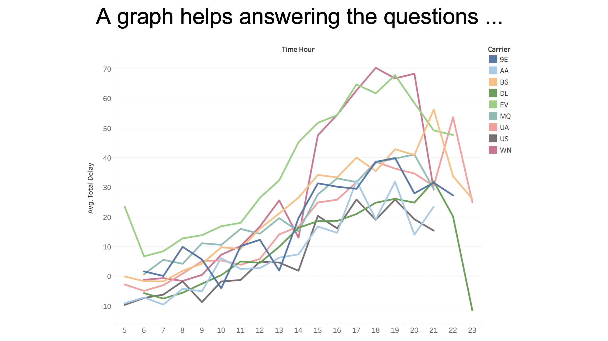{width="100%"}


:::{.notes}
But as soon as you visualize this data, you can find the answers to the questions easily, for instance, delays seem to be most common in the evenings, and WN and EV seem to be the worst. 
:::
---

## Example: Vision Zero Initiative

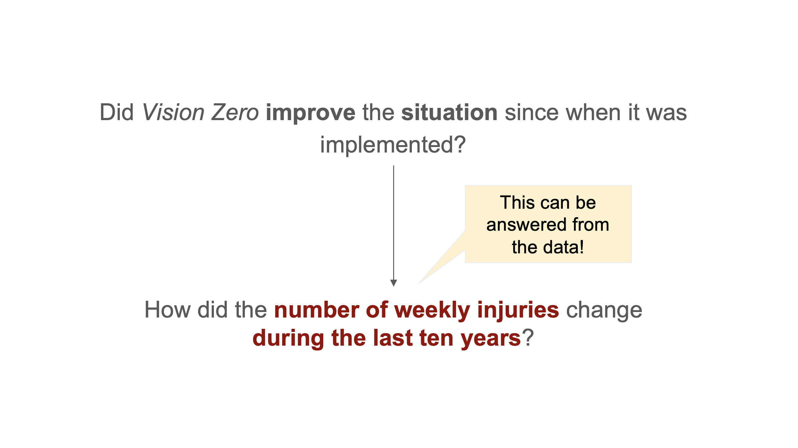{width="100%"}

:::{.notes}
Here we have a domain question about Vision Zero: "Did Vision Zero improve the situation since when it was implemented?"

The data question underneath it: "How did the number of weekly injuries change during the last ten years?"

But what you notice is that the question is vague - What do you mean by improve? What do you mean by situation - however, when you specify what you mean, you can answer the question from the data. "How did the number of weekly injuries change during the last ten years?" is a data question - specific, and answerable.
:::

---

## Multiple Data Questions from One Domain Question

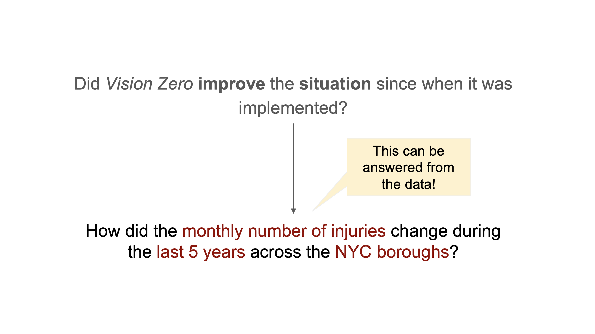{width="100%"}


:::{.notes}
Same domain question, different data question: "How did the monthly number of injuries change during the last 5 years across the NYC boroughs?" Monthly instead of weekly, five years instead of ten, and now split by borough.

You can start from the same domain question and land on very different data questions depending on your interpretation. The basis of a good visualization is doing this translation well - and the next slide lists the knobs you turned.
:::

---

## Key Insight: Specificity Matters

**One domain question can lead to many data questions:**

::: {.incremental}
- **Temporal granularity:** Weekly vs. monthly vs. yearly
- **Temporal scope:** 5 years vs. 10 years vs. since implementation
- **Spatial scope:** Citywide vs. by borough vs. by intersection
- **Measure definition:** Total injuries vs. serious injuries vs. fatalities
:::

:::{.notes}
It's very important to be specific with data questions and to choose this wisely. The data questions you formulate can have varying temporal granularity, scope, spatial scope and measure different things.  
:::

---

## Key Characteristics

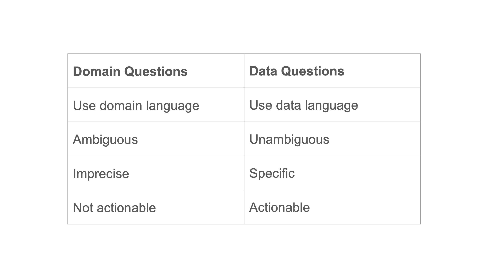{width="100%"}

:::{.notes}
The summary table. Domain questions use domain language and are ambiguous, imprecise, and not actionable. Data questions use data language and are unambiguous, specific, and actionable.

The word to lean on is actionable: a data question tells you what to compute. A domain question does not - and that gap is the design work.
:::

---

## Assessment Questions Throughout the Pipeline

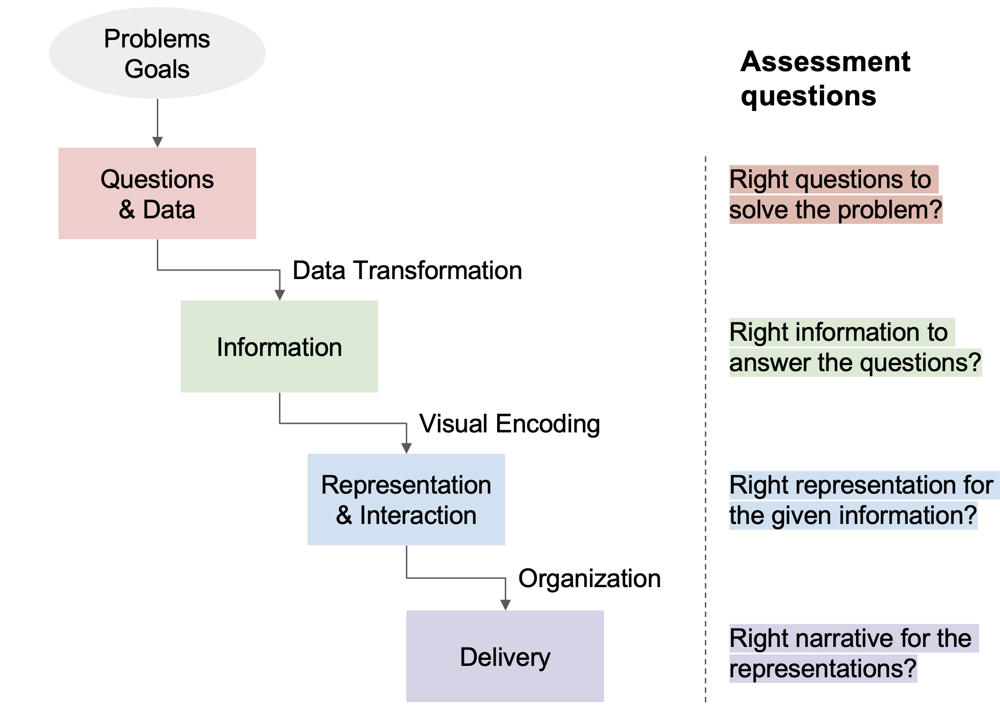{width="100%"}

:::{.notes}
At every stage of the data visualization pipeline, you can ask yourself some assessment questions to verify you're on the right track to build a good visualization.
:::

---

## What Types of Tasks Can We Do with Data?

### Shneiderman's Information Seeking Tasks (1996)

::: {.incremental}
- **Overview**: What does the data look like?
- **Zoom**: Focus on items of interest
- **Filter**: Show me something conditionally
- **Details-on-demand**: Show me more when I need it
- **Relate**: How are items connected?
- **History**: What has changed?
- **Extract**: Let me save what I find
:::

::: {.notes}
Shneiderman's Visual Information Seeking Mantra: Overview first, zoom and filter, then details-on-demand


start with overview example - (ask class for other things they can think of )
:::


## The Three Levels of Questions

### According to Bertin (1983)

::: {.incremental}
1. **Elementary**: What is the value of X for element Y?
2. **Intermediate**: What elements have value X?
3. **Overall**: What are the relationships among all elements?
:::

::: {.notes}
Bertin classified data questions in three different levels => 

Elementary, intermediate and overall.
Elementary Qs relate to individual values, Intermediate to groups of values and overall to the scale of the entire dataset.
:::

## Modern Task Frameworks

- **Brehmer & Munzner (2013)**: Why - What - How
- **Schulz et al. (2013)**: Goals - Means - Characteristics

### Munzner's What-Why-How

| | The question | The abstraction |
|---|---|---|
| **What** | What data is shown? | datasets and attributes |
| **Why** | Why is the user looking at it? | actions and targets |
| **How** | How is the view built? | visual encoding and interaction idioms |

*All three answers are stated in domain-independent vocabulary.*

::: {.notes}
There are many task frameworks; they mostly describe the same set of tasks in different vocabulary.

Munzner's is the one to remember, because the whole course is organised around it:

WHAT is the data - datasets and attributes. That is literally Part 1 of today: tables, networks, fields; nominal, ordinal, quantitative.

WHY is the user looking - the task, given as an action plus a target. Actions like discover, present, compare, summarise; targets like trends, outliers, distributions, correlations.

HOW is the view built - the idiom: visual encoding plus interaction. That is Week 3 onward.

The key move is the third column: all three answers are abstractions. You deliberately restate the problem in vocabulary that has nothing to do with the domain - not "which Brooklyn intersections injured the most cyclists" but "find outliers in a quantitative attribute, faceted by a categorical one." That restatement is what lets you reuse a design you have seen solve a completely unrelated problem.

Point back at Vision Zero: the domain question was the why in domain terms, and turning it into a data question was the start of the abstraction.

Footnote if anyone checks the citations: the 2013 paper orders it Why-What-How, the 2014 book orders it What-Why-How. Same framework.
:::
---

## Types of Analytical Tasks

### Low-level Tasks (Amar et al., 2005)

*"Low-Level Components of Analytic Activity in Information Visualization"*

:::: {.columns}
::: {.column width="50%"}
**Value Tasks**

- **Retrieve Value**: What is the value of attribute X for case Y?
- **Filter**: Which cases satisfy condition C?
- **Compute Derived Value**: What is the value of function F given attribute X?
- **Find Extremum**: What is the max/min value of attribute X?
- **Sort**: What is the ordering of cases by attribute X?
- **Determine Range**: What is the span of values of attribute X?
:::

::: {.column width="50%"}
**Pattern Tasks**

- **Find Anomalies**: Which cases are exceptional given their relation to others?
- **Cluster**: Which cases are similar in value for attributes X, Y, Z?
- **Correlate**: What is the relationship between attributes X and Y?
- **Characterize Distribution**: What is the distribution of values of attribute X?
:::
::::

::: {.notes}
You can broadly think of analytical tasks as value and pattern tasks- 
Where pattern tasks have a little more semantics attached to them , while value tasks relate to individual samples usually.
:::

---

## Why Task Frameworks?

:::{.incremental}

- **Choose appropriate visual encodings** - Match data types to suitable visual representations
- **Support user tasks** - Ensure your visualization enables the analytical tasks users need
- **Design systematic interactions** - Know what operations users expect to perform
- **Avoid visualization pitfalls** - Understand when certain chart types mislead or fail
- **Evaluate design decisions** - Test whether your visualization supports intended analytical goals
- **Create complete tools** - Build systems that handle the full spectrum of data analysis tasks
:::

::: {.notes}
All this might seem a little theoretical, but thinking about tasks this way streamlines the process of creating visualizations.

Namely: name the task first, and the encoding usually follows. "Find extremum" wants a sorted bar chart; "correlate" wants a scatterplot; "characterize distribution" wants a histogram - which is exactly what the live binning slide later will complicate.
:::

# Part 3: Data Wrangling and Transformation


## The Reality of Data Work

> "I spend more than half of my time integrating, cleansing and transforming data without doing any actual analysis. Most of the time I'm lucky if I get to do any 'analysis' at all."
> 
> — Anonymous Data Scientist (2012 interview study)


::: {.notes}
If you have worked with data analytics in any capacity, you might also have a similar experience - where you find that you're doing very little actual analysis and most work is actually data cleaning, transforming and so forth. 
:::

## Visualization Reveals Data Problems

> "The first sign that a visualization is good is that it shows you a problem in your data. Every successful visualization that I've been involved with has had this stage where you realize, 'Oh my God, this data is not what I thought it would be!' So already, you've discovered something."
> 
> — Martin Wattenberg (ACM Queue '09)

::: {.notes}
Visualizing data is not only helpful for final analysis but it also helps reveal problems in the analytics stage. So always generate some basic visualizations whenever you're trying to clean or process data.
:::

---

## Data Wrangling Pipeline

{width="100%"}


::: {.notes}
The Data wrangling pipeline consists of all stages of working with data, right from collection to delivery. Data transformation and cleaning can be thought of as big parts of this process.
:::

## Common Data Quality Issues
:::{.fragment}
:::: {.columns}
::: {.column width="50%"}
### Missing Data
- Null values
- Empty strings
- Placeholder values (999, -1)
- Incomplete records

### Inconsistent Data
- Different formats
- Duplicate records
- Conflicting values
- Unit mismatches
:::

::: {.column width="50%"}
### Incorrect Data
- Data entry errors
- Outliers
- Wrong data types
- Invalid relationships

### Structural Issues
- Denormalized data
- Wrong granularity
- Mixed semantics
- Schema violations
:::
::::
:::

::: {.notes}
Interactive
:::

## Common Data Cleaning Techniques

:::{.incremental}
* ### Handling Missing Values
  - **Purpose**: Address incomplete data
  - **Methods**: Imputation, deletion, interpolation
  - **Example**: Fill missing ages with median value

* ### Duplicate Removal
  - **Purpose**: Eliminate redundant records
  - **Types**: Exact matches, fuzzy matching, key-based

* ### Outlier Detection
  - **Purpose**: Identify anomalous values
  - **Methods**: Statistical bounds, domain rules, clustering

* ### Data Type Correction
  - **Purpose**: Ensure proper format consistency
  - **Methods**: Parsing, casting, validation rules
:::

::: {.notes}
Interactive
:::

## Common Transformation Operations

:::{.incremental}
* ### Aggregation
  - **Purpose**: Summarize groups of data
  - **Methods**: Sum, mean, median, count, min, max
  - **Example**: Daily sales → Monthly totals

* ### Filtering
  - **Purpose**: Focus on relevant subset
  - **Types**: Range, categorical, conditional 

* ### Binning
  - **Purpose**: Convert continuous to discrete
  - **Methods**: Equal width, equal frequency, custom
  - **Example**: Dividing age into groups (<18, 18-65, >65)

* ### Normalization
  - **Purpose**: Enable fair comparison
  - **Methods**: Min-max, z-score, percentage
:::

::: {.notes}
Interactive
:::

## Binning: Same Data, Different Story

```{ojs}
//| echo: false
ages = {
  const rng = d3.randomLcg(42);
  const younger = d3.randomNormal.source(rng)(24, 3);
  const older   = d3.randomNormal.source(rng)(41, 5);
  return [...Array.from({length: 90}, younger), ...Array.from({length: 55}, older)]
    .map(Math.round).filter(a => a >= 15 && a <= 60);
}
```

```{ojs}
//| echo: true
viewof binWidth = Inputs.range([1, 20], {value: 5, step: 1, label: "Bin width (years)"})
```

```{ojs}
//| echo: true
Plot.plot({
  x: {label: "Age"}, y: {label: "Count"},
  marks: [
    Plot.rectY(ages, Plot.binX({y: "count"},
      {x: d => d, thresholds: d3.range(15, 61, binWidth)})),
    Plot.ruleY([0])
  ],
  width: 1150, height: 400
})
```

::: {.notes}
CHECK BEFORE CLASS: Press O for the overview grid to jump straight to them. You want to see a slider and a histogram on the first, a checkbox and a bar chart on the second. If either shows a red error box instead, the OJS did not run.

SKIPPABLE - if you are running long, jump straight to Transformation Pipeline Example.

Drag the slider before you say anything. At width 1-2 it looks like noise. At 4-6 two clear peaks appear. At 15 and above it collapses into one hump and the second group disappears entirely.

Then ask: which of these is the honest chart? There is no answer in the data. Bin width is a choice you made, and it decided the conclusion - and nothing on the chart tells the reader a choice was made at all.

Good follow-up if the room is quiet: "if I had only ever shown you the width-20 version, what would you conclude about this population?" They will say one group. Drag back to 5.

Ties directly to the bullet you just read - "Methods: equal width, equal frequency, custom" - those are not interchangeable defaults.
:::

## Transformation Pipeline Example

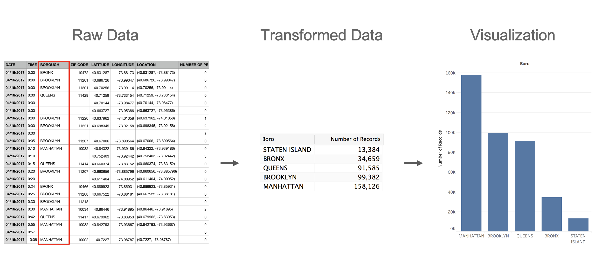{width="100%"}

:::{.notes}
You start with some raw dataset and a question you need to answer, then you decide the format that you need to answer the questions and transform the raw data into that format, which can then be visualized. Often, what visual metaphor you're using dictates what format you want to transform the data to. 
:::

## Relational Data Model

### Represent data as a **table** (or relation)

- Each **row** (or tuple) represents a record
  - Each record is a fixed-length tuple
  
- Each **column** (or field) represents a variable
  - Each field has a name and a data type

- A table's **schema** is the set of names and types
- A **database** is a collection of tables (relations)

:::{.notes}
relational data model - used in sql. 

(Read)
:::

## Relational Algebra / SQL

### Operations on Data Tables: table(s) in, table out

- **Project** (`SELECT`): select a set of columns
- **Filter** (`WHERE`): remove unwanted rows
- **Sort** (`ORDER BY`): order records
- **Aggregate** (`GROUP BY`, `SUM`, `MIN`, `MAX`): partition rows into groups + summarize
- **Combine** (`JOIN`, `UNION`): integrate data from multiple tables

:::{.notes}
SQL provides the framework for selection, sorting, filtering, aggregation and join operations.
:::

## SQL Operations: Project

```sql
SELECT day, stock FROM prices
```

:::: {.columns}
::: {.column width="45%"}
**Input:**

| day  | stock | price  |
|------|-------|--------|
| 10/3 | AMZN  | 957.10 |
| 10/3 | MSFT  | 74.26  |
| 10/4 | AMZN  | 965.45 |
| 10/4 | MSFT  | 74.69  |
:::

::: {.column width="10%"}
→
:::

::: {.column width="45%"}
**Output:**

| day  | stock |
|------|-------|
| 10/3 | AMZN  |
| 10/3 | MSFT  |
| 10/4 | AMZN  |
| 10/4 | MSFT  |
:::
::::

## SQL Operations: Filter

```sql
SELECT * FROM prices WHERE price > 100
```

:::: {.columns}
::: {.column width="45%"}
**Input:**

| day  | stock | price  |
|------|-------|--------|
| 10/3 | AMZN  | 957.10 |
| 10/3 | MSFT  | 74.26  |
| 10/4 | AMZN  | 965.45 |
| 10/4 | MSFT  | 74.69  |
:::

::: {.column width="10%"}
→
:::

::: {.column width="45%"}
**Output:**

| day  | stock | price  |
|------|-------|--------|
| 10/3 | AMZN  | 957.10 |
| 10/4 | AMZN  | 965.45 |
:::
::::

## SQL Operations: Aggregate

```sql
SELECT stock, MIN(price) 
FROM prices 
GROUP BY stock
```

:::: {.columns}
::: {.column width="45%"}
**Input:**

| day  | stock | price  |
|------|-------|--------|
| 10/3 | AMZN  | 957.10 |
| 10/3 | MSFT  | 74.26  |
| 10/4 | AMZN  | 965.45 |
| 10/4 | MSFT  | 74.69  |
:::

::: {.column width="10%"}
→
:::

::: {.column width="45%"}
**Output:**

| stock | min(price) |
|-------|------------|
| AMZN  | 957.10     |
| MSFT  | 74.26      |
:::
::::

## Roll-Up and Drill-Down

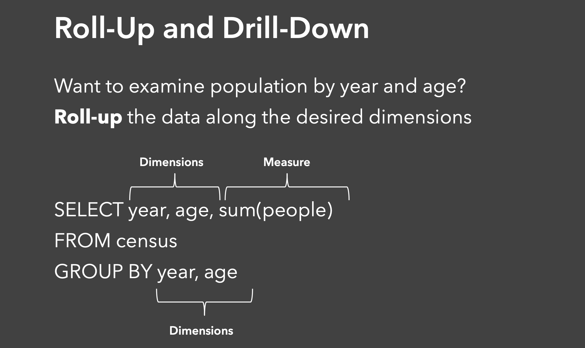{width="100%"}

:::{.notes}
Roll up and drill down are complementary data navigation techniques.

Roll Up moves from detailed data to summarized, higher-level views. You're aggregating information to see broader patterns and trends. For example: aggregating individual census records into population totals by year and age group, transforming millions of personal data points into meaningful demographic summaries that reveal population trends over time.
:::

---

## Roll-Up and Drill-Down: Adding Dimensions

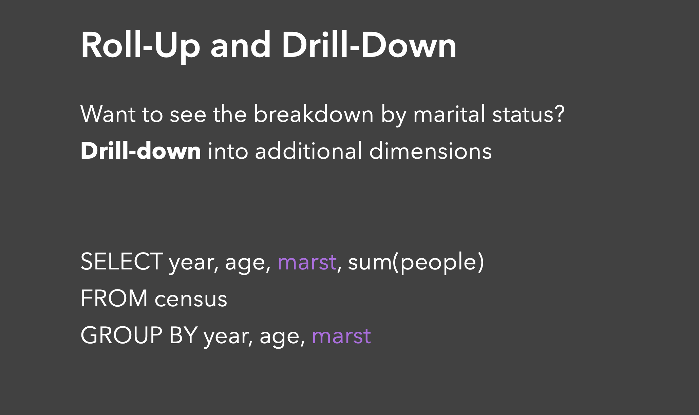{width="100%"}

:::{.notes}
Drill Down moves from summary data to more detailed, granular views. You're breaking down aggregated information to examine specific components. For example:
This query demonstrates a drill-down operation by adding the marital status dimension to our previous year and age grouping. Starting from a two-dimensional view of population by year and age, we're now drilling down to include marital status as an additional dimension. This provides a more granular breakdown, allowing us to see not just how many people are in each age group per year, but also how they're distributed across different marital statuses—revealing deeper patterns like marriage trends across age groups over time.
:::

---

## Data Cube Visualization: Aggregation Operations

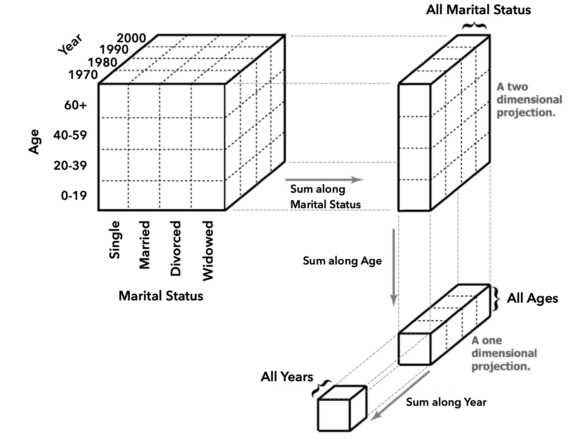{width="100%"}

:::{.notes}
This diagram illustrates how roll-up operations work with a three-dimensional data cube containing population data across Year, Age, and Marital Status dimensions. Starting with the full cube that shows detailed breakdowns by all three dimensions, we can roll up the data by summing along different dimensions to create simpler views. Rolling up along the Marital Status dimension collapses all marital categories into a two-dimensional projection showing just Year and Age. Rolling up along the Age dimension creates a view of just Year and Marital Status for all ages combined. Finally, rolling up along the Year dimension produces a one-dimensional view showing overall patterns by Marital Status across all years and ages. Each roll-up operation reduces complexity while preserving the aggregated totals, allowing analysts to examine the data from different perspectives and levels of detail.
:::
---

## Roll-Up vs. Drill-Down Operations

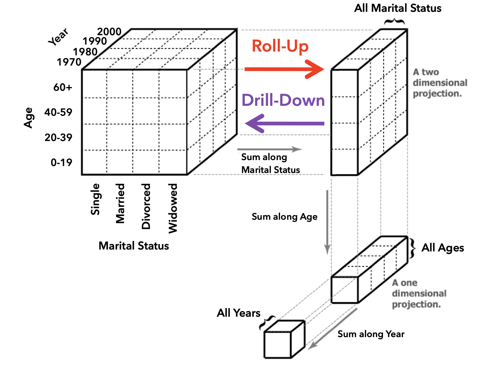{width="100%"}

::: {.notes}
Both operations side by side. The red arrow to the right is roll-up; the purple arrow back to the left is drill-down. They are inverses.

Walk down the right-hand chain: start with the full Year x Age x Marital Status cube. Sum along Marital Status and you get a two-dimensional projection, Year by Age, all marital statuses combined. Sum along Age as well and you are down to a one-dimensional bar, just Year. Sum along Year and you have a single number, the grand total.

The point worth making: roll-up is lossy. Once you have summed along Marital Status you cannot recover the breakdown from the projection alone - drill-down only works if you still hold the underlying detail. That is exactly why "preserve raw data" shows up in the Best Practices slide later.
:::

---

## Creating Derived Attributes

### Calculated Fields
```python
# Examples of derived attributes
df['profit_margin'] = df['profit'] / df['revenue']
df['year'] = pd.to_datetime(df['date']).dt.year
df['is_profitable'] = df['profit'] > 0
df['age_group'] = pd.cut(df['age'], 
                         bins=[0, 18, 65, 100],
                         labels=['child', 'adult', 'senior'])
```

### Feature Engineering
- Ratios and percentages
- Time-based features (day of week, season)
- Categorical encoding (one-hot, ordinal)
- Text processing (word counts, sentiment)

---

## Tidy Data: Organizing Data for Visualization

**Goal:** Structuring data to make visualization and analysis easier

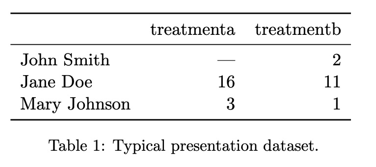{width="100%"}

::: {.notes}
Table 1 from Wickham's Tidy Data paper - the format you would put in a report. Three people down the side, two treatments across the top, results in the cells. John Smith has no value for treatment A.

Ask the class: what are the variables here? There are three - person, treatment, and result - but only person is actually in a column. Treatment is hiding in the column headers and result is spread across two columns. That is the whole problem in one small table.
:::

---

## Alternative Data Structures

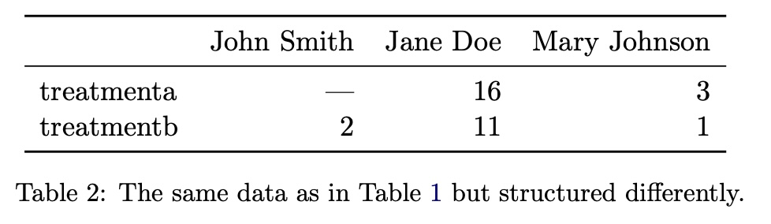{width="100%"}

::: {.notes}
Table 2 is the same data transposed - people across the top, treatments down the side. Nothing about the underlying data changed, only the layout.

The point: there is no principled reason to prefer Table 1 over Table 2. Both are presentation layouts. If your analysis code has to know which one it was handed, you are writing layout-specific code instead of data-specific code.
:::

---

## The Tidy Data Solution

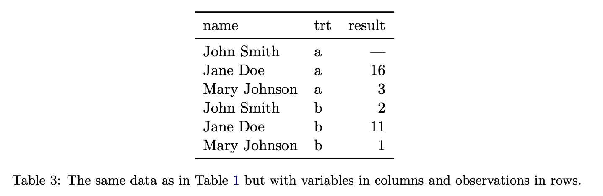{width="100%"}

::: {.notes}
Table 3 - the same six observations in tidy form: name, trt, result. Every variable is a column, every observation is a row.

It looks more verbose, six rows instead of a compact 3x2 grid, and that is the usual objection. But this is the shape every plotting and modeling library wants. From here you can say x = trt, y = result, color = name directly. From Table 1 you cannot, without reshaping first.

Note the missing value is still there - John Smith, treatment a - but now it is an explicit row rather than a gap in a grid.
:::

---

## Tidy Data Definition

In tidy data:

::: {.incremental}
- **Each variable forms a column**
- **Each observation forms a row**  
- **Each type of observational unit forms a table**
:::

::: {.notes}
Three rules, Wickham 2014. Worth stating slowly - they will use these for the rest of the course.

The third is the one people forget. If you have data about both songs and their weekly rankings, those are two different observational units and arguably belong in two tables.

Tie it back: Table 3 satisfies all three. Tables 1 and 2 violate the first two.
:::

---

## Tidy Data Example #1

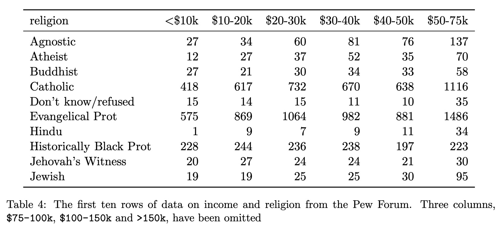{width="100%"}

::: {.notes}
Table 4 - real data now. Pew Forum survey, religion crossed with income bracket, first ten rows, three more income columns omitted.

Ask again: what are the variables? Three - religion, income, frequency. But look at the header row. Those income brackets are values, not variable names. Every one of those columns is the same variable chopped into pieces.

The general tell: when your column headers are data rather than names, the table is not tidy.
:::

---

## Transforming to Tidy Format

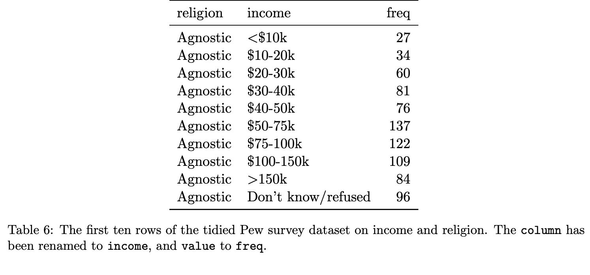{width="100%"}

::: {.notes}
Table 6 - the same Pew data melted into three columns: religion, income, freq. The brackets that were headers are now values, and every count sits in one column.

Point at the first row - Agnostic, under $10k, 27 - and trace it back to the top-left cell of the previous table so they see it is literally the same number.

This is melt in pandas, pivot_longer in the tidyverse, and the fold transform in Vega-Lite, which is what they will meet in the lab.
:::

---

## Tidy Data Example #2: Before

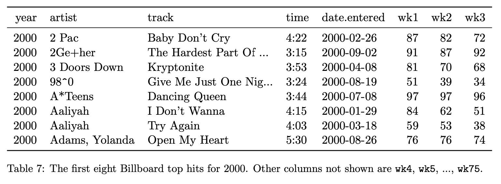{width="100%"}

::: {.notes}
Table 7 - Billboard top hits for 2000. Same pathology, much worse: wk1, wk2, wk3, all the way out to wk75. Seventy-five columns that are all the same variable.

Ask what the variables really are: year, artist, track, time, date entered, week, rank. Seven variables in a table with eighty-odd columns.

Good place to point out the second observational unit too - artist, track and time repeat for every single week. That is the third tidy rule knocking.
:::

---

## Tidy Data Example #2: After

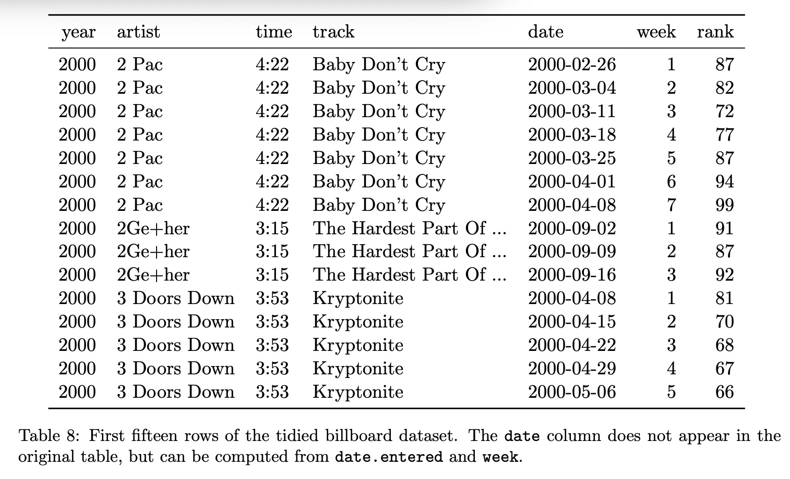{width="100%"}

::: {.notes}
Table 8 - tidied. week and rank are columns now, and each song contributes one row per week it charted.

Two things to point out. First, the table got much longer and that is fine; length is cheap. Baby Don't Cry now has seven rows, one per week on the chart. Second, look at the date column - it did not exist in the original. It is computed from date.entered plus week, which is a derived attribute, exactly what we covered a few slides ago.

Also note the ragged lengths: 2 Pac has seven weeks, 2Ge+her only three. In the wide format that raggedness was 75 columns of trailing blanks. Here it is just fewer rows.
:::

---

## Tools for Data Transformation

:::: {.columns}
::: {.column width="33%"}
### Programming
- **Python**: pandas, numpy
- **R**: dplyr, tidyr
- **SQL**: CTEs, window functions
:::

::: {.column width="33%"}
### Visual Tools
- **Tableau Prep**
- **Power Query**
- **OpenRefine**
- **Trifacta**
:::

::: {.column width="34%"}
### Big Data
- **Apache Spark**
- **dbt**
- **Alteryx**
- **Apache Beam**
:::
::::

## Best Practices

### Data Wrangling Guidelines

::: {.incremental}
1. **Document transformations**: Keep track of all changes
2. **Preserve raw data**: Never modify original source
3. **Validate results**: Check for unexpected values
4. **Test edge cases**: Handle nulls, zeros, outliers
5. **Consider performance**: Optimize for large datasets
6. **Make it reproducible**: Script or save workflows
7. **Think about updates**: Design for new data
:::

# Examples & Practice

## Data to Visualization Examples

### Categories → Bar Chart
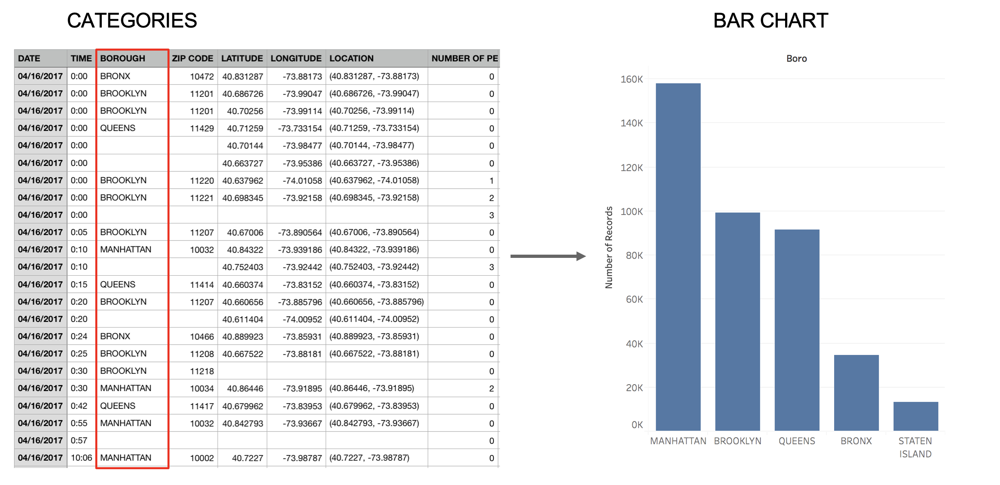{width="90%"}

::: {.notes}
First of two quick examples tying data type to encoding - a preview of Week 3.

NYC collision data with the BOROUGH column highlighted. Categorical attribute, so counting records per category gives you a bar chart: Manhattan around 158K down to Staten Island around 12K.

Worth pausing on the blank BOROUGH cells in the table - several rows have latitude and longitude but no borough. Nice callback to the data quality section: those rows are either dropped, imputed from the coordinates, or shown as a null category. The bar chart as drawn has quietly dropped them, and nothing on the chart tells you that.
:::

---

## What the Bar Chart Isn't Showing

```{ojs}
//| echo: false
collisions = [
  {borough: "Manhattan", n: 158000}, {borough: "Brooklyn", n: 99000},
  {borough: "Queens", n: 91000},     {borough: "Bronx", n: 35000},
  {borough: "Staten Island", n: 12000}, {borough: "(unknown)", n: 86000}
]
```

```{ojs}
//| echo: true
viewof includeUnknown = Inputs.toggle({
  label: "Include rows with missing BOROUGH", value: false})
```

```{ojs}
//| echo: true
Plot.plot({
  marks: [
    Plot.barY(
      includeUnknown ? collisions : collisions.filter(d => d.borough != "(unknown)"),
      {x: "borough", y: "n", sort: {x: "-y"}}),
    Plot.ruleY([0])
  ],
  x: {label: null}, y: {label: "Number of records"},
  width: 1150, height: 380, marginBottom: 70
})
```

::: {.notes}
CHECK BEFORE CLASS: Press O for the overview grid to jump straight to them. You want to see a slider and a histogram on the first, a checkbox and a bar chart on the second. If either shows a red error box instead, the OJS did not run.

SKIPPABLE - if you are running long, jump straight to Spatial Information / Map.

The toggle starts off, so this reproduces the static chart on the previous slide exactly. Flip it on: an "(unknown)" bar appears and lands second, ahead of Brooklyn.

Ask which chart they would put in a report. Neither is obviously right. Dropping the unknowns assumes they distribute like the known rows. Keeping them puts a category on the axis that is not a place.

This is the same dataset as the previous slide - the rows with blank BOROUGH but perfectly good latitude and longitude. Those boroughs are recoverable with a spatial join, which is a transformation, which is the entire point of today.

CAVEAT for you, not the class: the five borough counts are read off the chart on the previous slide and the 86K unknown bucket is illustrative - do not quote it as a measured figure.

What you CAN tell the class, because it is real: in a fuller extract of this same dataset the missing-borough bucket is the single LARGEST category - about 270K, ahead of Brooklyn at about 228K. That chart is in this folder as figs/flight-data-table.png (mis-filed under a flight name). If you would rather the toggle use those real numbers, say so; the trade-off is that the toggle-off chart would then no longer match the previous slide, whose extract has Manhattan on top.
:::

---

### Spatial Information → Map
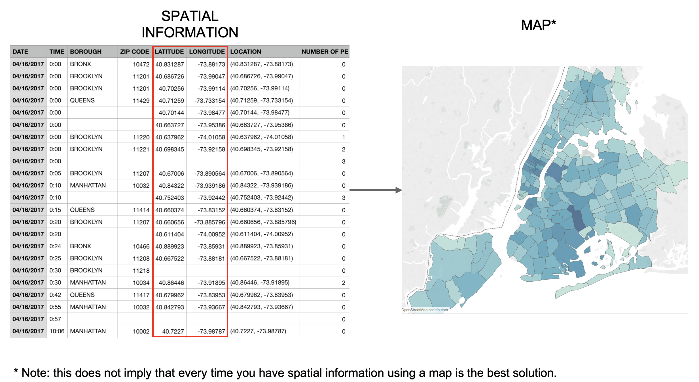{width="90%"}

::: {.notes}
Same table, now with LATITUDE and LONGITUDE highlighted, aggregated into a choropleth of NYC.

Read the asterisk at the bottom out loud - having spatial attributes does not mean a map is the right answer. A map is good for "where", but if the question is "which borough is worst", the bar chart on the previous slide answers it faster and more precisely. Geography is seductive; make them justify it.

Same missing-coordinate caveat applies - the rows with no lat/long simply are not on this map.
:::

## Example: U.S. Census Data

### Data Schema
- **Year**: 1850-2000 (every decade)
- **Age**: 0-90+
- **Sex**: Male, Female
- **Marital Status**: Single, Married, Divorced, Widowed
- **People Count**: Number in group

### Questions to Explore
- How has population age distribution changed?
- What are marriage patterns by age and year?
- How do we handle the changing categories over time?

## Interactive Exercise: NYC Taxi Data

### Dataset Description

Raw taxi trip data with these fields:

::: {.incremental}
- **pickup_datetime, dropoff_datetime**
- **pickup_location, dropoff_location**  
- **trip_distance, fare_amount**
- **passenger_count**
:::

---

## Your Design Tasks

Work in small groups to design a transformation pipeline:

::: {.incremental}
1. **What derived attributes would be useful?**
2. **How would you aggregate for daily patterns?**
3. **What filtering might reveal insights?**
4. **How would you handle outliers?**
:::

::: {.notes}
Give groups 5-7 minutes, then discuss solutions
:::

## Common Data Formats

### Text Formats
```csv
# CSV: Comma-Separated Values
year,age,marital_status,sex,people
1850,0,0,1,1483789
```

```json
// JSON: JavaScript Object Notation
[
  {"year":1850,"age":0,"marital_status":0,"sex":1,"people":1483789},
  {"year":1850,"age":5,"marital_status":0,"sex":1,"people":1411067}
]
```

### Binary Formats
- **Arrow**: Columnar memory format
- **Parquet**: Compressed columnar storage
- **HDF5**: Hierarchical data format

# Summary

## Key Takeaways

### Analytical Questions
- Different levels of questions require different visualizations
- Tasks range from elementary lookups to pattern discovery
- Visual queries enable interactive exploration

### Data Models & Types
- Distinguish between data models and conceptual models
- Type (N/O/Q) determines appropriate encodings
- Dimensions vs measures depends on analytical task

### Data Transformation
- SQL/relational algebra provides fundamental operations
- Tidy data principles enable consistent analysis
- Roll-up and drill-down for multidimensional exploration

### Data Wrangling
- Most time spent on data preparation, not analysis
- Visualization helps identify data quality issues
- Document and automate transformation pipelines

## Next Week

### Week 3 (Sept 18): Fundamental Graphs and Visual Encoding
- Chart types and their purposes
- Marks and channels theory
- Grammar of graphics principles

### Required Reading
- Tufte, *The Visual Display of Quantitative Information*, Ch. 1-2 (Graphical Excellence; Graphical Integrity)
- [Multi-View Composition](https://observablehq.com/@uwdata/multi-view-composition-json) (Observable)

## Questions?

### Resources
- [Tidy Data Paper](https://www.jstatsoft.org/article/view/v059i10)
- [pandas Documentation](https://pandas.pydata.org/)
- [Data Transformation with dplyr](https://dplyr.tidyverse.org/)
- [Jeff Heer's CSE 512 Course](https://courses.cs.washington.edu/courses/cse512/)
- **Amar, R., Eagan, J., & Stasko, J.** (2005). Low-level components of analytic activity in information visualization. *IEEE Symposium on Information Visualization*, 111-117.
- **Card, S. K., Mackinlay, J. D., & Shneiderman, B.** (1999). *Readings in Information Visualization: Using Vision to Think*. Morgan Kaufmann.
- **Munzner, T.** (2014). *Visualization Analysis and Design*. CRC Press.
- **Shneiderman, B.** (1996). The eyes have it: A task by data type taxonomy for information visualization. *Proceedings 1996 IEEE Symposium on Visual Languages*, 336-343.
- **Stevens, S. S.** (1946). On the Theory of Scales of Measurement. *Science*, 103(2684), 677-680.
