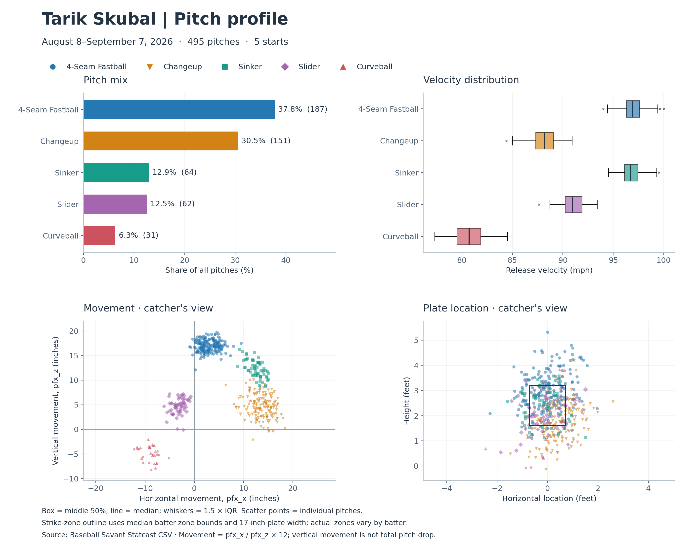
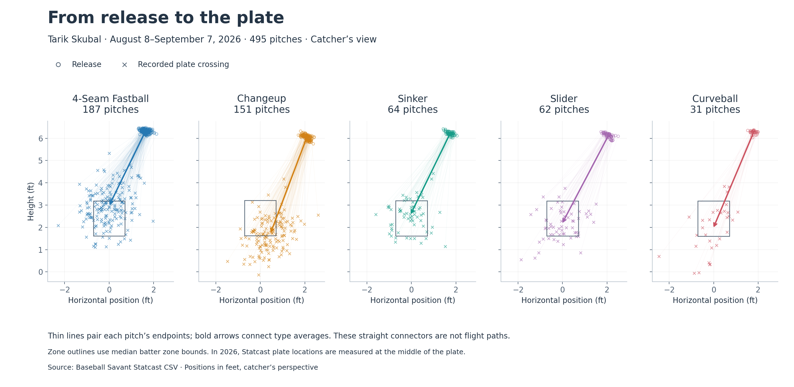

## Today's Agenda

**Learning Objectives:**

::: incremental
- Master the five fundamental graph types and when to use them
- Apply expressiveness and effectiveness principles
- Understand visual encoding theory (marks and channels)
- Make informed chart selection decisions
- Design effective scales and axes
:::

::: notes
Today we're building the foundation for effective visualization design. We'll move from abstract principles to concrete techniques you can apply immediately.
:::

------------------------------------------------------------------------

## Acknowledgments

**Special thanks to:**

::::: columns
::: {.column width="50%"}
**Prof. Enrico Bertini** NYU Tandon School of Engineering

-   Course materials and pedagogical insights
-   Visualization design principles
-   Interactive visualization expertise
:::

::: {.column width="50%"}
**Prof. Jeff Heer** University of Washington

-   Fundamental visualization theory
-   Perceptual effectiveness research
-   Vega-Lite and D3.js frameworks
:::
:::::

*This course builds upon their foundational contributions to visualization education and research.*

::: notes
Acknowledge the important contributions of Prof. Bertini and Prof. Heer to the field and to the educational materials used in this course.
:::

------------------------------------------------------------------------

## The Chart Selection Challenge

:::::: columns
::: {.column width="40%"}
**The central question:** Given data and a task, which visualization technique will be most effective?

::: incremental
-   **Chart type** (bar, line, scatter, etc.)
-   **Visual encoding** (position, color, size)
-   **Design choices** (scales, axes, layout)
:::
:::

::: {.column width="60%"}
{width="100%" fig-align="center"}
:::
::::::

::: notes
Start with the fundamental question every data analyst faces. The process breaks down into two critical steps that we'll explore in detail today. This isn't just theory - it's the practical workflow you'll use in every visualization project.
:::

------------------------------------------------------------------------

## Two-Step Process

:::::: columns
:::incremental  
-   **Step1:** Decide what to visualize.
    -   Tipically, data is represented in a table and you must __SELECT__ attributes to create your visualization
    -   The selected attributes can also be __TRANSFORMED__ in order to generated useful information to answer the question
-   **Step2:** Choose/Design your visualization.
    -   Your visualization can be selected from a set of existing visualizations
    -   Based on well-defined principles, a novel visualization can be designed to answer the question
:::

::::::


------------------------------------------------------------------------


## Data Types Drive Design

:::::: columns
::: {.column width="40%"}
**Understanding your data:**

::: incremental
-   **Categorical** (nominal, ordinal)
-   **Quantitative** (continuous, discrete)
-   **Temporal** (time-based ordering)
-   **Spatial** (geographic coordinates)
:::

**The type determines suitable encodings**
:::

::: {.column width="60%"}
{height="760" fig-align="center"}
:::
::::::

::: notes
This step is often underestimated but crucial. The wrong data selection can make even the best visual design ineffective. We'll see concrete examples of transformations that unlock insights.
:::

------------------------------------------------------------------------

## Same Data, Multiple Options

:::::: columns
::: {.column width="40%"}
**Design decisions:**

::: incremental
-   Which visual channels best represent your data?
-   How do you map data attributes to visual properties?
-   What design choices enhance clarity?
-   How do you avoid misleading representations?
:::

**Chart selection:** The attribute types can guide the chart selection!
:::

::: {.column width="60%"}
{width="100%" fig-align="center"}
:::
::::::

::: notes
This is where art meets science. We'll learn principled approaches to make these choices, backed by research on human perception and cognition.
:::

------------------------------------------------------------------------

## The Five Fundamental Graphs

:::: {.columns}
::: {.column width="100%"}
<!-- Top row content goes here -->
:::: {.columns}
::: {.column width="33%"}
**Bar Chart:**  
{width="50%"} 
:::
::: {.column width="33%"}
**Line Chart:**  
{width="70%"}
:::
::: {.column width="33%"}
**Scatterplot:**  
{width="70%"}
:::
::::
:::
::::

:::: {.columns}
::: {.column width="100%"}
<!-- Bottom row content goes here -->
:::: {.columns}
::: {.column width="50%"}
**Matrix Chart:**  
{width="80%"}
:::
::: {.column width="50%"}
**Symbol Map:**  
{width="50%"}
:::
::::
:::
::::


<!-- ::::: columns
::: {.column width="60%"}
{width="45%"} {width="45%"}
:::

::: {.column width="40%"}
{width="90%"}

{width="45%"} {width="45%"}
:::
:::::

::: notes
These five chart types are your visualization toolkit's power tools. Master these, and you'll be able to tackle the vast majority of visualization challenges. They're also building blocks for more complex designs.
::: -->

------------------------------------------------------------------------

## Bar Chart: Categorical Comparisons

::::: columns
::: {.column width="40%"}
**Purpose:** Compare quantities across categories

**Data Types:**

- Categorical/Ordinal + Quantitative
- Example: Sales by product category

**Best For:**

- Rankings and comparisons
- Part-to-whole relationships

**Key principle:** Our visual system excels at comparing lengths along a common baseline.
:::

::: {.column width="60%"}
```{=html}
<div id="barchart-demo"></div>
<script>
{
  const data = SKUBAL.bar;   // data/skubal-statcast.js

  const width = 960, height = 600;
  const margin = {top: 24, right: 24, bottom: 56, left: 84};

  const svg = d3.select("#barchart-demo").append("svg")
    .attr("viewBox", [0, 0, width, height]);

  const x = d3.scaleBand()
    .domain(data.map(d => d.category))
    .range([margin.left, width - margin.right])
    .padding(0.3);

  const y = d3.scaleLinear()
    .domain([0, d3.max(data, d => d.count)])
    .nice()
    .range([height - margin.bottom, margin.top]);

  // Recessive horizontal grid (behind the marks)
  svg.append("g").attr("class", "grid")
    .attr("transform", `translate(${margin.left},0)`)
    .call(d3.axisLeft(y).ticks(5).tickSize(-(width - margin.left - margin.right)).tickFormat(""));

  // Bars
  svg.append("g")
    .selectAll("rect")
    .data(data)
    .join("rect")
    .attr("x", d => x(d.category))
    .attr("y", d => y(d.count))
    .attr("width", x.bandwidth())
    .attr("height", d => y(0) - y(d.count))
    .attr("rx", 4)
    .attr("fill", "#2a78d6");

  // X axis
  svg.append("g")
    .attr("transform", `translate(0,${height - margin.bottom})`)
    .call(d3.axisBottom(x).tickSizeOuter(0))
    .attr("font-size", 18);

  // Y axis
  svg.append("g")
    .attr("transform", `translate(${margin.left},0)`)
    .call(d3.axisLeft(y).ticks(5))
    .attr("font-size", 18)
    .call(g => g.select(".domain").remove());

  // Y axis label
  svg.append("text")
    .attr("transform", "rotate(-90)")
    .attr("y", 28)
    .attr("x", -(height / 2))
    .attr("text-anchor", "middle")
    .attr("font-size", 20)
    .text("Count");

}
</script>
```
:::
:::::

::: notes
Bar charts are the workhorses of categorical data visualization. The key insight: our visual system excels at comparing lengths along a common baseline. Always start the y-axis at zero for accurate magnitude comparison.
:::

------------------------------------------------------------------------

## Line Chart: Trends Over Time

::::: columns
::: {.column width="40%"}
**Purpose:** Show trends and changes over time

**Data Types:**

- Temporal + Quantitative
- Example: Stock prices over months

**Best For:**

- Trends and patterns
- Multiple series comparison

**Key principle:** Connecting lines imply continuity - use only for ordered data.
:::

::: {.column width="60%"}
```{=html}
<div id="linechart-demo"></div>
<script>
{
  // Average 4-Seam velocity by inning (data/skubal-statcast.js)
  const data = SKUBAL.line4seam;

  const width = 960, height = 600;
  const margin = {top: 48, right: 30, bottom: 70, left: 96};

  const svg = d3.select("#linechart-demo").append("svg")
    .attr("viewBox", [0, 0, width, height]);

  const x = d3.scaleLinear()
    .domain(d3.extent(data, d => d.inning))
    .range([margin.left, width - margin.right]);

  const y = d3.scaleLinear()
    .domain([94, 100])
    .range([height - margin.bottom, margin.top]);

  // Recessive horizontal grid (behind the marks)
  svg.append("g").attr("class", "grid")
    .attr("transform", `translate(${margin.left},0)`)
    .call(d3.axisLeft(y).ticks(6).tickSize(-(width - margin.left - margin.right)).tickFormat(""));

  // Line
  const line = d3.line()
    .x(d => x(d.inning))
    .y(d => y(d.speed));

  svg.append("path")
    .datum(data)
    .attr("fill", "none")
    .attr("stroke", "#2a78d6")
    .attr("stroke-width", 2)
    .attr("d", line);

  // Points
  svg.append("g")
    .selectAll("circle")
    .data(data)
    .join("circle")
    .attr("cx", d => x(d.inning))
    .attr("cy", d => y(d.speed))
    .attr("r", 7)
    .attr("fill", "#2a78d6")
    .attr("stroke", "#fafafa")
    .attr("stroke-width", 2);

  // X axis
  svg.append("g")
    .attr("transform", `translate(0,${height - margin.bottom})`)
    .call(d3.axisBottom(x).ticks(7).tickSizeOuter(0))
    .attr("font-size", 18);

  // Y axis
  svg.append("g")
    .attr("transform", `translate(${margin.left},0)`)
    .call(d3.axisLeft(y).ticks(6))
    .attr("font-size", 18)
    .call(g => g.select(".domain").remove());

  // X axis label
  svg.append("text")
    .attr("x", (margin.left + width - margin.right) / 2)
    .attr("y", height - 16)
    .attr("text-anchor", "middle")
    .attr("font-size", 20)
    .text("Inning");

  // Y axis label
  svg.append("text")
    .attr("transform", "rotate(-90)")
    .attr("y", 30)
    .attr("x", -(height / 2))
    .attr("text-anchor", "middle")
    .attr("font-size", 20)
    .text("Average 4-Seam velocity (mph)");

  // Title
  svg.append("text")
    .attr("x", width / 2)
    .attr("y", 24)
    .attr("text-anchor", "middle")
    .attr("font-weight", 600)
    .attr("font-size", 22)
    .text("4-Seam velocity holds through the start");
}
</script>
```
:::
:::::

::: notes
Line charts excel at showing continuity and change. The connecting lines imply a continuous relationship - use them only when this makes sense (typically with time or other ordered dimensions). Notice how the trend of declining velocity is immediately apparent.
:::

------------------------------------------------------------------------

## Scatter Plot: Relationships

::::: columns
::: {.column width="40%"}
**Purpose:** Explore relationships between variables

**Data Types:**

- Quantitative + Quantitative
- Example: Height vs. weight

**Best For:**

- Correlation analysis
- Outlier detection
- Pattern recognition

**Key principle:** Reveals relationships that summary statistics might miss.
:::

::: {.column width="60%"}
```{=html}
<div id="scatterplot-demo"></div>
<script>
{
  // Every pitch: speed vs spin rate (data/skubal-statcast.js)
  const data = SKUBAL.scatter;

  const width = 960, height = 620;
  const margin = {top: 48, right: 210, bottom: 70, left: 96};

  const svg = d3.select("#scatterplot-demo").append("svg")
    .attr("viewBox", [0, 0, width, height]);

  const x = d3.scaleLinear()
    .domain(d3.extent(data, d => d.speed)).nice()
    .range([margin.left, width - margin.right]);

  const y = d3.scaleLinear()
    .domain(d3.extent(data, d => d.spin)).nice()
    .range([height - margin.bottom, margin.top]);

  const color = d3.scaleOrdinal()
    .domain(["4-Seam", "Sinker", "Changeup", "Slider", "Curveball"])
    .range(["#2a78d6", "#1baf7a", "#eb6834", "#eda100", "#e87ba4"]);

  // Recessive horizontal grid (behind the marks)
  svg.append("g").attr("class", "grid")
    .attr("transform", `translate(${margin.left},0)`)
    .call(d3.axisLeft(y).ticks(6).tickSize(-(width - margin.left - margin.right)).tickFormat(""));

  // Points
  svg.append("g")
    .selectAll("circle")
    .data(data)
    .join("circle")
    .attr("cx", d => x(d.speed))
    .attr("cy", d => y(d.spin))
    .attr("r", 6)
    .attr("fill", d => color(d.type))
    .attr("stroke", "#fafafa")
    .attr("stroke-width", 1)
    .attr("opacity", 0.65);

  // X axis
  svg.append("g")
    .attr("transform", `translate(0,${height - margin.bottom})`)
    .call(d3.axisBottom(x).ticks(6).tickSizeOuter(0))
    .attr("font-size", 18);

  // Y axis
  svg.append("g")
    .attr("transform", `translate(${margin.left},0)`)
    .call(d3.axisLeft(y).ticks(6))
    .attr("font-size", 18)
    .call(g => g.select(".domain").remove());

  // X axis label
  svg.append("text")
    .attr("x", (margin.left + width - margin.right) / 2)
    .attr("y", height - 16)
    .attr("text-anchor", "middle")
    .attr("font-size", 20)
    .text("Release Speed (mph)");

  // Y axis label
  svg.append("text")
    .attr("transform", "rotate(-90)")
    .attr("y", 30)
    .attr("x", -(height / 2))
    .attr("text-anchor", "middle")
    .attr("font-size", 20)
    .text("Spin Rate (rpm)");

  // Title
  svg.append("text")
    .attr("x", width / 2)
    .attr("y", 24)
    .attr("text-anchor", "middle")
    .attr("font-weight", 600)
    .attr("font-size", 22)
    .text("Speed vs spin rate by pitch type (Skubal, 495 pitches)");

  // Legend
  const legend = svg.append("g")
    .attr("transform", `translate(${width - margin.right + 28}, ${margin.top + 8})`);

  const types = color.domain();  // all five pitch types (legend previously listed only three)
  legend.selectAll("circle")
    .data(types)
    .join("circle")
    .attr("cx", 0)
    .attr("cy", (d, i) => i * 32)
    .attr("r", 8)
    .attr("fill", d => color(d));

  legend.selectAll("text")
    .data(types)
    .join("text")
    .attr("x", 18)
    .attr("y", (d, i) => i * 32)
    .attr("dy", "0.35em")
    .attr("font-size", 18)
    .text(d => d);
}
</script>
```
:::
:::::

::: notes
Scatter plots reveal relationships that summary statistics might miss. They're essential for exploratory data analysis and can reveal clusters, outliers, and non-linear relationships. Notice how different pitch types cluster in different regions of the speed-spin space.
:::

------------------------------------------------------------------------

## Matrix (Heatmap): Two-Way Comparisons

::::: columns
::: {.column width="40%"}
**Purpose:** Compare across two categorical dimensions

**Data Types:**

- Categorical + Categorical + Quantitative
- Example: Sales by month and region

**Best For:**

- Cross-tabulations
- Correlation matrices
- Dense data display

**Key principle:** Color encoding allows rapid processing of many values.
:::

::: {.column width="60%"}
```{=html}
<div id="matrix-demo"></div>
<script>
{
  // Real data: Tarik Skubal, Statcast (Baseball Savant), 5 games Aug 10 - Sep 3 2026, 495 pitches.
  // value = % of pitches at that count that were this pitch type; n = pitches thrown at that count.
  const data = SKUBAL.heatmap.cells;   // data/skubal-statcast.js
  const cols = SKUBAL.heatmap.cols;
  const types = ["4-Seam", "Sinker", "Changeup", "Slider", "Curveball"];
  const LOW_N = 20;
  const counts = cols.map(c => ({label: c, strikes: data.find(d => d.count === c).strikes, n: data.find(d => d.count === c).n}));
  const strikesGroups = [0, 1, 2];
  const width = 960, height = 600;
  const margin = {top: 152, right: 36, bottom: 104, left: 150};
  const cellW = (width - margin.left - margin.right) / counts.length;   // ~64
  const cellH = (height - margin.top - margin.bottom) / types.length;   // ~76
  const svg = d3.select("#matrix-demo").append("svg").attr("viewBox", [0, 0, width, height]);

  const x = d3.scaleBand().domain(counts.map(c => c.label)).range([margin.left, width - margin.right]);
  const y = d3.scaleBand().domain(types).range([margin.top, height - margin.bottom]);
  const color = d3.scaleSequential().domain([0, 70]).interpolator(d3.interpolateBlues);

  svg.append("text").attr("x", width / 2).attr("y", 30).attr("text-anchor", "middle")
    .attr("font-weight", 600).attr("font-size", 22).text("Tarik Skubal, pitch selection by count (% of pitches at that count)");

  // strike-group headers above the column labels
  const groups = svg.append("g").attr("font-size", 16).attr("fill", "#555");
  strikesGroups.forEach(s => {
    const cols = counts.filter(c => c.strikes === s).map(c => c.label);
    const x0 = x(cols[0]), x1 = x(cols[cols.length - 1]) + x.bandwidth();
    groups.append("text").attr("x", (x0 + x1) / 2).attr("y", 96).attr("text-anchor", "middle")
      .text(s === 1 ? "1 strike" : `${s} strikes`);
    groups.append("line").attr("x1", x0 + 6).attr("x2", x1 - 6).attr("y1", 106).attr("y2", 106).attr("stroke", "#bbb");
  });

  // cells with a 2px surface gap
  svg.append("g").selectAll("rect").data(data).join("rect")
    .attr("x", d => x(d.count)).attr("y", d => y(d.type))
    .attr("width", x.bandwidth()).attr("height", y.bandwidth())
    .attr("fill", d => d.n < LOW_N ? "#eeeeee" : color(d.value)).attr("stroke", "#fafafa").attr("stroke-width", 2);

  // value labels: dark ink on light cells, white on dark
  svg.append("g").attr("font-size", 16).selectAll("text").data(data).join("text")
    .attr("x", d => x(d.count) + x.bandwidth() / 2).attr("y", d => y(d.type) + y.bandwidth() / 2)
    .attr("text-anchor", "middle").attr("dy", "0.35em")
    .attr("fill", d => d.n < LOW_N ? "#999" : (d.value > 38 ? "#fff" : "#333")).text(d => d.n < LOW_N ? "·" : Math.round(d.value));

  // column labels (counts) and row labels (pitch types)
  svg.append("g").attr("font-size", 17).attr("fill", "#333").selectAll("text").data(counts).join("text")
    .attr("x", c => x(c.label) + x.bandwidth() / 2).attr("y", 136).attr("text-anchor", "middle").text(c => c.label);
  svg.append("g").attr("font-size", 18).attr("fill", "#333").selectAll("text").data(types).join("text")
    .attr("x", margin.left - 12).attr("y", t => y(t) + y.bandwidth() / 2).attr("text-anchor", "end").attr("dy", "0.35em").text(t => t);
  svg.append("text").attr("x", (margin.left + width - margin.right) / 2).attr("y", 66)
    .attr("text-anchor", "middle").attr("font-size", 18).attr("fill", "#555").text("Count (balls-strikes) →");

  // sample size per column, under the grid
  svg.append("g").attr("font-size", 15).attr("fill", "#777").selectAll("text").data(counts).join("text")
    .attr("x", c => x(c.label) + x.bandwidth() / 2).attr("y", height - margin.bottom + 22).attr("text-anchor", "middle").text(c => "n=" + c.n);

  // legend
  const lw = 320, lh = 16, lx = margin.left, ly = height - 56;
  const lscale = d3.scaleLinear().domain([0, 70]).range([0, lw]);
  svg.append("defs").append("linearGradient").attr("id", "matrix-legend-gradient")
    .selectAll("stop").data(d3.range(0, 1.01, 0.05)).join("stop")
    .attr("offset", d => d).attr("stop-color", d => color(d * 70));
  svg.append("rect").attr("x", lx).attr("y", ly).attr("width", lw).attr("height", lh).style("fill", "url(#matrix-legend-gradient)");
  svg.append("g").attr("transform", `translate(${lx},${ly + lh})`)
    .call(d3.axisBottom(lscale).ticks(5).tickFormat(d => d + "%")).attr("font-size", 16)
    .call(g => g.select(".domain").remove());
  svg.append("text").attr("x", lx + lw + 16).attr("y", ly + lh - 2).attr("font-size", 16).attr("fill", "#555").text(`grey · = fewer than ${LOW_N} pitches at that count`);
}
</script>
```
:::
:::::

::: notes
Matrices efficiently display large amounts of data in compact form. Color encoding allows us to process many values quickly, though precise comparison is harder than with position-based encodings. Notice how patterns emerge - darker cells show where certain pitches are thrown more frequently at specific counts.
:::

------------------------------------------------------------------------

## Symbol Map: Spatial Distribution

::::: columns
::: {.column width="40%"}
**Purpose:** Show spatial distribution of data

**Data Types:**

- Spatial coordinates + Quantitative
- Example: Population by city

**Best For:**

- Geographic patterns
- Location-based analysis
- Spatial clustering
:::

::: {.column width="60%"}
{height="760" fig-align="center"}
:::
:::::

::: notes
Symbol maps leverage our spatial reasoning abilities. They're powerful for revealing geographic patterns but require careful design to avoid overlapping symbols and ensure accurate size perception.
:::

------------------------------------------------------------------------

## Alternate representations

**Question:** Is it possible to create different representations of the same data?

**It is. However, some representations might not follow the best design guidelines**

{.nostretch width="50%" fig-align="center"}

------------------------------------------------------------------------

## Chart Selection Examples

**Scenario 1:** Monthly sales data for different product categories

::: fragment
**Answer:** Line chart (multiple series) - shows trends over time by category
:::

**Scenario 2:** Customer satisfaction ratings across departments

::: fragment
**Answer:** Bar chart - compares quantitative values across categories
:::

**Scenario 3:** Relationship between advertising spend and sales revenue

::: fragment
**Answer:** Scatter plot - explores correlation between two quantitative variables
:::

::: notes
Work through these examples with students to reinforce the decision-making process. Ask them to justify their choices based on the framework.
:::

------------------------------------------------------------------------

## Decomposing a chart: Marks and Channels

**Marks are the geometric primitives we use in a visualization. They are used to represent the items of a dataset.**

```{=html}
<div id="marks-demo"></div>
<script>
{
  // Simple data: five values
  const data = [
    {label: "A", value: 187},
    {label: "B", value: 100},
    {label: "C", value: 85},
    {label: "D", value: 92},
    {label: "E", value: 31}
  ];
  const max = d3.max(data, d => d.value);

  // Create container
  const container = d3.select("#marks-demo")
    .style("display", "grid")
    .style("grid-template-columns", "repeat(3, max-content)")
    .style("gap", "18px 26px")
    .style("justify-content", "center");

  const W = 580, H = 380;

  function panel(title) {
    const svg = container.append("svg")
      .attr("width", W).attr("height", H)
      .attr("font-family", "sans-serif")
      .attr("font-size", 22);
    svg.append("text")
      .attr("x", W/2)
      .attr("y", 26)
      .attr("text-anchor", "middle")
      .attr("font-weight", 600)
      .attr("font-size", 24)
      .text(title);
    return svg;
  }

  const rows = d3.scaleBand(data.map(d => d.label), [48, H - 8]).padding(0.25);
  const cols = d3.scaleBand(data.map(d => d.label), [14, W - 4]).padding(0.15);
  const len = d3.scaleLinear([0, max], [18, W - 10]);
  const midRow = d => rows(d.label) + rows.bandwidth() / 2;
  const midCol = d => cols(d.label) + cols.bandwidth() / 2;

  // 1. Position
  const pos = panel("1. Position");
  pos.append("g").selectAll("text").data(data).join("text")
    .attr("x", 4).attr("y", midRow).attr("dy", "0.35em").text(d => d.label);
  pos.append("g").selectAll("line").data(data).join("line")
    .attr("stroke", "#e3e1da")
    .attr("x1", len(0)).attr("x2", len(max))
    .attr("y1", midRow).attr("y2", midRow);
  pos.append("g").selectAll("circle").data(data).join("circle")
    .attr("cx", d => len(d.value)).attr("cy", midRow).attr("r", 11);

  // 2. Length
  const bar = panel("2. Length");
  bar.append("g").selectAll("text").data(data).join("text")
    .attr("x", 4).attr("y", midRow).attr("dy", "0.35em").text(d => d.label);
  bar.append("g").selectAll("rect").data(data).join("rect")
    .attr("x", len(0))
    .attr("y", d => rows(d.label))
    .attr("width", d => len(d.value) - len(0))
    .attr("height", rows.bandwidth());

  // 3. Angle (Pie chart)
  const pie = panel("3. Angle");
  const arcs = d3.pie().sort(null).value(d => d.value)(data);
  const arc = d3.arc().innerRadius(0).outerRadius(136);
  const g = pie.append("g").attr("transform", `translate(${W/2},${H/2 + 22})`);
  g.selectAll("path").data(arcs).join("path")
    .attr("d", arc)
    .attr("fill", "#4c4b46")
    .attr("stroke", "#fff");
  g.selectAll("text").data(arcs).join("text")
    .attr("transform", a => `translate(${arc.centroid(a)})`)
    .attr("text-anchor", "middle")
    .attr("dy", "0.35em")
    .attr("fill", "#fff")
    .text(a => a.data.label);

  // 4. Area
  const area = panel("4. Area");
  const radius = d3.scaleSqrt([0, max], [0, cols.bandwidth() / 2]);
  area.append("g").selectAll("text").data(data).join("text")
    .attr("x", midCol).attr("y", H - 6)
    .attr("text-anchor", "middle").text(d => d.label);
  area.append("g").selectAll("circle").data(data).join("circle")
    .attr("cx", midCol)
    .attr("cy", H / 2 + 6)
    .attr("r", d => radius(d.value));

  // 5. Lightness
  const light = panel("5. Lightness");
  const grey = d3.scaleSequential([0, max], d3.interpolateGreys);
  light.append("g").selectAll("text").data(data).join("text")
    .attr("x", midCol).attr("y", H - 6)
    .attr("text-anchor", "middle").text(d => d.label);
  light.append("g").selectAll("rect").data(data).join("rect")
    .attr("x", d => cols(d.label))
    .attr("y", 78)
    .attr("width", cols.bandwidth())
    .attr("height", 242)
    .attr("fill", d => grey(d.value));

  // 6. Hue
  const hue = panel("6. Hue");
  const rainbow = d3.scaleSequential([0, max], d3.interpolateRainbow);
  hue.append("g").selectAll("text").data(data).join("text")
    .attr("x", midCol).attr("y", H - 6)
    .attr("text-anchor", "middle").text(d => d.label);
  hue.append("g").selectAll("rect").data(data).join("rect")
    .attr("x", d => cols(d.label))
    .attr("y", 78)
    .attr("width", cols.bandwidth())
    .attr("height", 242)
    .attr("fill", d => rainbow(d.value));
}
</script>
```

::: notes
Two foundational results sit behind this demo, and it is worth naming them.

Bertin (Semiologie graphique, 1967): a mark on the page can vary in a small set of visual variables - position in the plane, size, value (lightness), texture, color (hue), orientation, shape - and each variable supports only certain kinds of reading. Bertin called these levels of organization: a variable is selective if you can pick out all marks of one kind at a glance, associative if the marks group, ordered if the eye perceives a ranking, and quantitative if it perceives ratios. Position is all four. Size and value are ordered but not truly quantitative. Hue, shape and orientation are selective and associative only - they carry identity, not amount. That is the whole lesson of panel 6.

Mackinlay (1986, APT): two criteria for choosing an encoding. Expressiveness - the encoding must show all the facts in the data and only those facts; a line chart over nominal categories fails it by implying an order that is not there (slide 18, Expressiveness Violations). Effectiveness - among expressive encodings, prefer the channel people decode most accurately for that data type. His ranking for quantitative data, built on Cleveland and McGill: position, then length, then angle and slope, then area, then volume, then lightness and saturation, then hue last.

Read the six panels down that ranking: 1 position, 2 length, 3 angle, 4 area, 5 lightness, 6 hue. Same five numbers each time. Ask the room to order A to E from panel 1, then from panel 4, then from panel 6. Panel 1 is instant, panel 4 is a guess, panel 6 is impossible - hue provides no sense of order or magnitude. Munzner's channel ranking on slide 20 is the modern version of exactly this list.
:::

------------------------------------------------------------------------

## Decomposing a chart: Marks and Channels

::::: columns
::: {.column width="40%"}
**Channels:**

-   Channels are the appearance of the marks
-   They are used to represent the __attributes__ of a dataset
:::

::: {.column width="60%"}
{width="100%" fig-align="center"}
:::
:::::

::: notes
These are the foundational principles from Jacques Bertin and Jock Mackinlay. They provide objective criteria for evaluating visualization designs and guide our decision-making process.
:::

------------------------------------------------------------------------

## Principles: Expressiveness & Effectiveness

::::: columns
::: {.column width="50%"}
**Expressiveness:** The visual encodings must show all and only the facts in the data.

-   The most fundamental expression of this principle is that __ordered data should be shown in a way that our perceptual system intrinsically senses as ordered__. Conversely, unordered data should not be shown in a way that perceptually implies an ordering that does not exist. Violating this principle is a common beginner’s mistake in visualization.

**Effectiveness:** Information should be readily perceived

-   The importance of the attribute should match the salience of the channel; that is, its noticeability. In other words, the __most important attributes should be encoded with the most effective channels__ in order to be most noticeable, and then decreasingly important attributes can be matched with less effective channels.
:::


:::::

::: notes
These are the foundational principles from Jacques Bertin and Jock Mackinlay. They provide objective criteria for evaluating visualization designs and guide our decision-making process.
:::

------------------------------------------------------------------------

## Expressiveness Violations

::::: columns
::: {.column width="60%"}
{width="100%" fig-align="center"}

**Problem:** The line asserts continuity — and values — where the data is absent
:::

::: {.column width="40%"}
{height="760" fig-align="center"}

**Problem:** Arbitrary ordering implies non-existent relationship
:::
:::::

::: notes
Left: five small multiples - injuries by contributing factor, over time. Faceting by the nominal variable is fine, and the x-axis inside each panel is time, so a line is the right mark for it. The problem is what the line does at the gaps. Driver Inattention crashes from about 950 to zero and rebounds to 1300 within two ticks; Failure to Yield does the same; Fatigued/Drowsy drops to zero and stays there. Injuries do not vanish for a month and come back. Those are periods with no records - a relabelled category, or data not yet reported - and the line interpolates straight through them, asserting a collapse that never happened.

That is the expressiveness violation in Mackinlay's sense: the encoding states a fact - a real drop to zero - that is not in the data. Bertin's reading of a line is exactly why it happens: a line is ordered and continuous, so every segment claims the values in between exist. Fix: break the line at missing periods, or mark them explicitly. Never let a plotting library fill absence with zero.

Second, smaller violation: there are no x-axis labels at all, so a reader cannot even tell this is time - which is how the previous caption on this slide came to misread it as categorical.

Right: the bar chart's category order is arbitrary, but position along an axis reads as ordered, so the eye infers a ranking that is not in the data. Sort by value if a ranking is the point; otherwise make the order deliberate - alphabetical or grouped - and say so.
:::

------------------------------------------------------------------------

## Effectiveness: A Quick Experiment

**Which value is larger?**

{.nostretch width="90%" fig-align="center"}

<!--

{.nostretch width="46%" fig-align="center"}

::: fragment
**Result:** Position on a common baseline is judged more accurately than length
:::

-->

::: notes
Run it as an experiment, not a slide. Keep the results image hidden (it is the second figure - cover it or scroll so only the top row shows) and use Cleveland and McGill's own two-step task.

First, say what the dots are. They are not data: Cleveland and McGill placed them to mark the two values the subject judges, and their placement is what makes the five types different. Type 1: two adjacent bars in the same group. Type 2: the bottom segments of two neighbouring stacked bars - both on the baseline, so still position. Type 3: one bar in group A and one in group B, far apart - position, with distance. Type 4: the top segments of bars A and B - different heights, no shared baseline, so a length judgment. Type 5: both dots are in bar A - its top segment and a large middle segment, one above the other - a length comparison within a single stacked bar, and the hardest case. The A and B letters label the groups, not the pair; in Type 5 the pair is not A versus B at all. Point at the dots when you ask.

Step one, per type, quickly: "Of the two dotted values - which is larger?" Hands. Everyone gets Type 1 instantly; hesitation starts around Type 4, where A and B are segments floating at different heights.

Step two, the one that teaches: "Estimate the smaller as a percentage of the larger." Take three or four guesses aloud for Type 1 and write them down; do the same for Type 5. The spread of the Type 5 guesses will be several times the spread for Type 1. That spread IS the effectiveness difference, measured live in this room. (If the room is shy, ask everyone to write a number and read out the min and max.)

Then reveal the results plot and read it: the horizontal axis is log base 2 of absolute error, so one unit is a doubling; the dots are means, the bars 95% confidence intervals; types 1-3 (position) sit left, 4-5 (length) sit right, and the Type 3 interval does not reach the Type 4 interval. Their fifty-odd subjects did what your room just did, ten graphs of each type, true ratios spread roughly 18% to 83% so nobody could default to "about half".

Two things to say precisely. It is position versus LENGTH here - there is no colour in this experiment; colour ranks far lower and comes in on the next slide. And the finding is about accuracy of a ratio judgment, not speed: people are not much slower at Type 5, they are simply wrong more often, which is worse.

Bridge: Mackinlay's effectiveness ranking on the previous slides was built on this experiment; Munzner's channel ranking on the next slide is its modern form.
:::

## Effectiveness: A Quick Experiment

**Which value is larger?**

{.nostretch width="46%" fig-align="center"}

::: fragment
**Result:** Position on a common baseline is judged more accurately than length
:::


------------------------------------------------------------------------

## Channel Effectiveness Rankings

**Use the most effective channel for your most important data**

{.nostretch width="55%" fig-align="center"}

::: notes
This ranking from Cleveland and McGill is based on empirical studies of human perception. Position along a common scale is most effective for quantitative data, while color hue works well for categorical distinctions but poorly for quantitative comparison.
:::

------------------------------------------------------------------------

## Applying Channel Rankings

::::: columns
::: {.column width="50%"}
**More Effective:**

{width="90%"}

Position encoding enables accurate comparison
:::

::: {.column width="50%"}
**Less Effective:**

{width="90%"}

Area and angle are harder to compare accurately
:::
:::::

::: notes
This principle explains why bar charts often outperform pie charts for precise comparison. When accuracy matters most, prioritize position-based encodings.
:::

------------------------------------------------------------------------

## Exercise

::::: columns
::: {.column width="40%"}
**What are the marks?**

::: {.incremental}
- Bars
:::

**What are the channels?**

::: {.incremental}
- Size
- Horizontal position
:::
:::

::: {.column width="60%"}
{width="100%" fig-align="center"}
:::
:::::


::: notes
Run it before revealing anything: give them twenty seconds with the chart, then ask for marks first. Click - bars. Then channels: click - size (the bar length carries the quantity), click - horizontal position (which category). That decomposition, marks plus channels, is the vocabulary for everything on the next slides, and it is exactly how you read the channel ranking on slide 20: length is a magnitude channel, position here is doing the identity job.
:::

------------------------------------------------------------------------

## Chart Selection Framework

**How do you choose the right chart?**

::::: columns
::: {.column width="50%"}
**Ask these questions:**

1.  **What data types do I have?**
    -   Categorical vs. Quantitative
    -   Temporal vs. Non-temporal
2.  **What relationship am I showing?**
    -   Comparison, trend, correlation, distribution, composition
3.  **How many variables?**
    -   1D, 2D, 3D, multidimensional
:::

::: {.column width="50%"}
**Decision Tree:**

-   **Compare categories** → Bar Chart
-   **Show trends over time** → Line Chart
-   **Explore relationships** → Scatter Plot
-   **Cross-tabulate** → Matrix/Heatmap
-   **Show geographic distribution** → Symbol Map

**Rule of thumb:** Start simple, add complexity only when needed
:::
:::::

::: notes
The three questions are in this order because each one narrows the space, and each maps onto a principle from earlier in the lecture.

Question 1, data types, is the expressiveness gate. Nominal data rules out anything that implies order or continuity - no line over categories, no colour ramp for identity; temporal data invites position along an ordered axis. Get this wrong and the chart says something false before you have chosen anything else.

Question 2, the relationship, is the task - Munzner's why. It is the question that actually picks the chart, and the decision tree on the right is just its answers, read as "which channel carries the quantity": compare categories - length on a common baseline, so a bar chart; trend over time - position along time plus connection, a line; relationship between two quantities - two position channels, a scatterplot; cross-tabulate two categoricals - both positions are spent on the categories, so the quantity falls to colour, a heatmap, and colour is a weak magnitude channel, which is why the cells on slide 11 carry numbers; geographic - both positions are spent on latitude and longitude, so the quantity falls to size or colour, a symbol map, the weakest case on the ranking.

Two relationships the tree does not list, and students will ask: distribution - histogram or box plot (the box plots on the Skubal slide later); composition, part-to-whole - a stacked bar, or a pie only for two or three slices.

Question 3, how many variables, decides whether one chart is enough. Past two or three, prefer small multiples - the same simple chart repeated - over cramming a third or fourth channel into one plot. That is what "start simple" means operationally: the cheapest expressive chart that supports the task, and add a channel only when a question demands it.

Worked example, thirty seconds, with the dataset they have watched all hour. Pitch mix: categorical plus a count, comparison, one variable - bar chart, slide 8. Velocity by inning: temporal, trend - line, slide 9. Speed against spin: two quantities, relationship - scatterplot, slide 10. Pitch type by count: two categoricals plus a share, cross-tab - heatmap, slide 11. Four questions, four fundamental graphs, one dataset - the framework is what generated slides 8 to 11.

Caveat to say out loud: a decision tree is a starting point, not an oracle. Slide 6 showed the same data supporting several charts; which one is right depends on the question you are answering, which is why question 2 is the one that matters most.
:::

------------------------------------------------------------------------

## Scales and Axes: The Foundation

**Scale:** A function mapping data domain to visual range

**Data Domain → Scale Function → Visual Range**

::: incremental
-   **Linear scales:** Equal data differences = equal visual differences
-   **Logarithmic scales:** Equal ratios = equal visual differences\
-   **Ordinal scales:** Preserve order, not magnitude
:::

::: notes
Scales are fundamental but often invisible. The choice of scale dramatically affects what patterns are visible and how data relationships are perceived.
:::

------------------------------------------------------------------------

## Linear vs. Logarithmic Scales

**Choose scales based on whether absolute or relative change matters more.**

```{=html}
<div id="scales-demo"></div>
<script>
{
  // Illustrative series that doubles every step - NOT real data. Both panels plot the same six values.
  const data = [
    {year: 1, count: 100},
    {year: 2, count: 150},
    {year: 3, count: 300},
    {year: 4, count: 600},
    {year: 5, count: 1200},
    {year: 6, count: 2400}
  ];

  const container = d3.select("#scales-demo")
    .style("display", "flex")
    .style("gap", "60px")
    .style("justify-content", "center")
    .style("flex-wrap", "wrap");

  function createChart(title, yScale, yLabel) {
    const width = 800, height = 520;
    const margin = {top: 48, right: 30, bottom: 96, left: 104};

    const svg = container.append("svg")
      .attr("width", width)
      .attr("height", height);

    svg.append("text")
      .attr("x", width / 2)
      .attr("y", 26)
      .attr("text-anchor", "middle")
      .attr("font-weight", 600)
      .attr("font-size", 22)
      .text(title);

    const x = d3.scaleLinear()
      .domain([1, 6])
      .range([margin.left, width - margin.right]);

    const y = yScale
      .range([height - margin.bottom, margin.top]);

    // Line
    const line = d3.line()
      .x(d => x(d.year))
      .y(d => y(d.count));

    svg.append("path")
      .datum(data)
      .attr("fill", "none")
      .attr("stroke", "#2a78d6")
      .attr("stroke-width", 2)
      .attr("d", line);

    // Points
    svg.append("g")
      .selectAll("circle")
      .data(data)
      .join("circle")
      .attr("cx", d => x(d.year))
      .attr("cy", d => y(d.count))
      .attr("r", 7)
      .attr("fill", "#2a78d6")
      .attr("stroke", "#fafafa")
      .attr("stroke-width", 2);

    // X axis
    svg.append("g")
      .attr("transform", `translate(0,${height - margin.bottom})`)
      .call(d3.axisBottom(x).ticks(6).tickSizeOuter(0))
      .attr("font-size", 17);

    // Y axis
    svg.append("g")
      .attr("transform", `translate(${margin.left},0)`)
      .call(d3.axisLeft(y).ticks(6))
      .attr("font-size", 17)
      .call(g => g.select(".domain").remove());

    // X label
    svg.append("text")
      .attr("x", (margin.left + width - margin.right) / 2)
      .attr("y", height - margin.bottom + 48)
      .attr("text-anchor", "middle")
      .attr("font-size", 19)
      .text("Step (the value doubles each step)");

    // Y label
    svg.append("text")
      .attr("transform", "rotate(-90)")
      .attr("y", 30)
      .attr("x", -(height / 2))
      .attr("text-anchor", "middle")
      .attr("font-size", 19)
      .text(yLabel);

    // Add description
    const desc = svg.append("text")
      .attr("x", width / 2)
      .attr("y", height - 14)
      .attr("text-anchor", "middle")
      .attr("font-size", 17)
      .attr("fill", "#666");

    if (title.includes("Linear")) {
      desc.text("Shows absolute differences");
    } else {
      desc.text("Shows relative (%) changes");
    }
  }

  // Linear scale
  const linearY = d3.scaleLinear()
    .domain([0, d3.max(data, d => d.count)])
    .nice();
  createChart("Linear Scale", linearY, "Value");

  // Log scale
  const logY = d3.scaleLog()
    .domain([d3.min(data, d => d.count), d3.max(data, d => d.count)])
    .nice();
  createChart("Logarithmic Scale", logY, "Value (log scale)");
}
</script>
```

::::: columns
::: {.column width="50%"}
**Linear Scale:**

- Absolute differences
- Additive changes
- Most common choice
- Large values dominate visually
:::

::: {.column width="50%"}
**Logarithmic Scale:**

- Relative differences (%)
- Multiplicative changes
- Wide data ranges
- Equal growth rates appear as straight line
:::
:::::

::: notes
Say what the chart is first: six illustrative values that double each step - 100, 150, then 300, 600, 1200, 2400 - the same six numbers on both panels. It is not real data; it is the cleanest possible multiplicative series, chosen so the two panels disagree as much as possible.

Left, linear: the first three steps look almost flat and the last two swallow the chart. Ask what the growth rate was between steps 1 and 3 versus 5 and 6 - it is the same doubling, and the linear panel hides that completely. Right, log: equal ratios become equal vertical distances, so a constant growth rate is a straight line, and the early steps are as legible as the late ones. That is the whole trade: linear answers "how much more", log answers "how many times more".

Real cases where log is the honest choice: stock prices over decades (a 10% move should look the same in 1990 and 2020), epidemic case counts in the growth phase, transistor counts, anything spanning orders of magnitude. Two costs to state: a log axis cannot show zero or negative values, and most audiences misread it - a doubling looks like a small step - so it needs a label that says "log" and a tick or two the reader can anchor on.

Bridge: the next two slides are the other scale decision - the zero baseline - and slide 28 asks them to choose a scale for country populations, a thousand to 1.4 billion. That is this chart with real data.
:::

------------------------------------------------------------------------

## The Zero Baseline Rule

**Bar charts encode data as length. Truncating the axis changes the ratios readers perceive.**

```{=html}
<div id="zero-baseline-demo"></div>
<script>
{
  // Median release speed per pitch type - real Statcast data (data/skubal-statcast.js)
  const data = SKUBAL.medianSpeed;
  // same type -> colour mapping as the scatterplot on slide 10 (colour follows the entity, not the row)
  const colorOf = {"4-Seam Fastball": "#2a78d6", "Sinker": "#1baf7a", "Changeup": "#eb6834", "Slider": "#eda100", "Curveball": "#e87ba4"};

  const container = d3.select("#zero-baseline-demo")
    .style("display", "flex")
    .style("gap", "40px")
    .style("justify-content", "center")
    .style("flex-wrap", "wrap");

  function createChart(title, domain) {
    const width = 860, height = 500;
    const margin = {top: 44, right: 90, bottom: 64, left: 250};

    const svg = container.append("svg")
      .attr("width", width)
      .attr("height", height);

    svg.append("text")
      .attr("x", width / 2)
      .attr("y", 26)
      .attr("text-anchor", "middle")
      .attr("font-weight", 600)
      .attr("font-size", 20)
      .text(title);

    const x = d3.scaleLinear()
      .domain(domain)
      .range([margin.left, width - margin.right]);

    const y = d3.scaleBand()
      .domain(data.map(d => d.type))
      .range([margin.top, height - margin.bottom])
      .padding(0.25);

    // X axis
    svg.append("g")
      .attr("transform", `translate(0,${height - margin.bottom})`)
      .call(d3.axisBottom(x).ticks(5).tickSizeOuter(0))
      .attr("font-size", 17)
      .call(g => g.select(".domain").remove());

    // Y axis
    svg.append("g")
      .attr("transform", `translate(${margin.left},0)`)
      .call(d3.axisLeft(y))
      .attr("font-size", 18)
      .call(g => g.select(".domain").remove());

    // X axis label
    svg.append("text")
      .attr("x", (margin.left + width - margin.right) / 2)
      .attr("y", height - 14)
      .attr("text-anchor", "middle")
      .attr("font-size", 19)
      .attr("fill", "#666")
      .text("Median Speed (mph)");

    // Bars
    const left = x.range()[0];
    svg.append("g")
      .selectAll("rect")
      .data(data)
      .join("rect")
      .attr("x", left)
      .attr("y", d => y(d.type))
      .attr("height", y.bandwidth())
      .attr("width", d => x(d.speed) - left)
      .attr("fill", d => colorOf[d.type]);

    // Value labels
    svg.append("g")
      .selectAll("text")
      .data(data)
      .join("text")
      .attr("x", d => x(d.speed) + 5)
      .attr("y", d => y(d.type) + y.bandwidth() / 2)
      .attr("dy", "0.35em")
      .attr("font-size", 17)
      .attr("fill", "#555")
      .text(d => d.speed.toFixed(1));
  }

  createChart("Truncated Axis (78-100 mph) - MISLEADING", [78, 100]);
  createChart("Zero Baseline (0-100 mph) - Honest", [0, 100]);
}
</script>
```

**Key insight:** On the left, the fastball bar appears ~7× longer than the curveball. In reality, it's only 20% faster.

::: notes
Bar charts encode data as length from a baseline. Without zero, these lengths misrepresent the data. This is one of the most common ways visualizations mislead, often unintentionally. Notice how dramatically the perception changes between these two charts showing the exact same data.
:::

------------------------------------------------------------------------

## When to Break the Rules

**Context determines when breaking rules is acceptable. Understand the "why" before breaking them.**

```{=html}
<div id="break-rules-demo"></div>
<script>
{
  // Small variations in large values - line chart case
  const data = [
    {day: 1, temp: 98.6},
    {day: 2, temp: 98.4},
    {day: 3, temp: 99.1},
    {day: 4, temp: 98.9},
    {day: 5, temp: 99.3},
    {day: 6, temp: 98.7},
    {day: 7, temp: 98.5}
  ];

  const container = d3.select("#break-rules-demo")
    .style("display", "flex")
    .style("gap", "40px")
    .style("justify-content", "center")
    .style("flex-wrap", "wrap");

  function createChart(title, domain, description) {
    const width = 800, height = 520;
    const margin = {top: 48, right: 30, bottom: 96, left: 104};

    const svg = container.append("svg")
      .attr("width", width)
      .attr("height", height);

    svg.append("text")
      .attr("x", width / 2)
      .attr("y", 26)
      .attr("text-anchor", "middle")
      .attr("font-weight", 600)
      .attr("font-size", 20)
      .text(title);

    const x = d3.scaleLinear()
      .domain([1, 7])
      .range([margin.left, width - margin.right]);

    const y = d3.scaleLinear()
      .domain(domain)
      .range([height - margin.bottom, margin.top]);

    // Line
    const line = d3.line()
      .x(d => x(d.day))
      .y(d => y(d.temp));

    svg.append("path")
      .datum(data)
      .attr("fill", "none")
      .attr("stroke", "#e87ba4")
      .attr("stroke-width", 2)
      .attr("d", line);

    // Points
    svg.append("g")
      .selectAll("circle")
      .data(data)
      .join("circle")
      .attr("cx", d => x(d.day))
      .attr("cy", d => y(d.temp))
      .attr("r", 7)
      .attr("fill", "#e87ba4")
      .attr("stroke", "#fafafa")
      .attr("stroke-width", 2);

    // X axis
    svg.append("g")
      .attr("transform", `translate(0,${height - margin.bottom})`)
      .call(d3.axisBottom(x).ticks(7).tickSizeOuter(0))
      .attr("font-size", 17);

    // Y axis
    svg.append("g")
      .attr("transform", `translate(${margin.left},0)`)
      .call(d3.axisLeft(y).ticks(6))
      .attr("font-size", 17)
      .call(g => g.select(".domain").remove());

    // X label
    svg.append("text")
      .attr("x", (margin.left + width - margin.right) / 2)
      .attr("y", height - margin.bottom + 48)
      .attr("text-anchor", "middle")
      .attr("font-size", 19)
      .text("Day");

    // Y label
    svg.append("text")
      .attr("transform", "rotate(-90)")
      .attr("y", 30)
      .attr("x", -(height / 2))
      .attr("text-anchor", "middle")
      .attr("font-size", 19)
      .text("Body Temperature (°F)");

    // Description
    svg.append("text")
      .attr("x", width / 2)
      .attr("y", height - 14)
      .attr("text-anchor", "middle")
      .attr("font-size", 17)
      .attr("fill", "#666")
      .text(description);
  }

  createChart("Zero baseline - Flattens variation", [0, 100], "Trend invisible");
  createChart("Truncated axis - Shows medically relevant changes", [98, 100], "ACCEPTABLE for line charts");
}
</script>
```

::::: columns
::: {.column width="50%"}
**When to break zero baseline:**

- Line charts (position, not length)
- Small changes in large values
- When trend matters more than magnitude
- Medical vitals, temperatures, etc.
:::

::: {.column width="50%"}
**When to use log scales:**

- Data spans orders of magnitude
- Ratios matter more than absolute values
- Exponential growth patterns
- **Never for bar charts!**
:::
:::::

::: notes
Rules exist for good reasons, but context matters. The key is understanding why the rules exist so you can make informed decisions about when to break them. For line charts, we encode by position and slope, not length, so truncating is acceptable when it reveals meaningful patterns. Body temperature is a perfect example - a one-degree change is medically significant even though it's tiny relative to zero.
:::

------------------------------------------------------------------------

## Design Exercise: Scale Choices

:::::: columns
::: {.column width="60%"}
**Scenario:** Visualizing country populations

**Data range:** 1,000 (Vatican) to 1.4 billion (China)
:::

:::: {.column width="40%"}
**Questions:**

1. What scale would you choose?
2. How would you handle the extreme range?
3. What alternatives might you consider?

::: fragment
**Consider:** Log scale vs. filtering vs. grouping
:::
::::
::::::

::: notes
Give them three minutes in pairs, then take hands: linear or log? Most will say log, and the interesting conversation is what goes wrong when they do it naively.

The data: about 195 countries spanning six orders of magnitude - the Vatican under a thousand, a dozen microstates in the tens of thousands, a median country around five million, and India and China at 1.4 billion each holding roughly a third of the world between them. (Aside worth a sentence: India passed China in 2023, so a slide that says "China, 1.4 billion" is already a lesson in checking the date on your data.)

Question 1, scale. A linear bar chart is the zero-baseline slide in reverse: two bars fill the frame and 150 countries become indistinguishable slivers at zero - honest, and useless. A log scale makes every country visible and turns equal ratios into equal distances. Then the trap: bars on a log axis. Length is the channel, and on a log axis length no longer encodes the quantity - a bar from 1 to 1,000 and a bar from 1,000 to 1,000,000 are the same length - and zero does not exist. So log plus length is wrong; log plus position is right: a dot plot, one dot per country on a log axis. Steer them there. It is slides 25 and 26 combined.

Question 2, the extreme range - the three words on the reveal, plus two more. Log, as above. Filtering: show the top 20 and say, in the title, what fraction of the world they hold. Grouping: bin countries by magnitude - under a million, one to ten, ten to a hundred, over a hundred million - and count; that is a histogram of country sizes, and the bins are log bins whether or not you call them that. Also: small multiples by region so each panel has a sane range; and rank as the position channel, labelling only the extremes.

Question 3 is really question 2 of the framework: what is the question? How concentrated is population - a cumulative-share curve. Compare two specific countries - just those two, linear. The shape of the distribution - the log histogram. Where people are - a map, and here is the warning for Week 8: a choropleth of population is dominated by area, not people; totals want a cartogram, and most population questions want per-capita anyway.

Whichever they choose, the requirement is the same: say it. "Log scale" in the axis label, "top 20 of 195" in the title. Then advance: Putting It All Together, the two Skubal payoff slides, and only then the pitfalls.
:::

------------------------------------------------------------------------

## Putting It All Together

::::: columns
::: {.column width="40%"}
**The Visualization Design Process:**

1.  **Understand your question**
2.  **Transform data appropriately**
3.  **Choose effective visual encodings**
4.  **Select appropriate scales**
5.  **Test and iterate**

**Workflow:** Question → Transform → Encode → Scale → Iterate
:::

::: {.column width="60%"}
{width="100%" fig-align="center"}
:::
:::::

::: notes
This systematic approach helps avoid common pitfalls. Each step builds on the previous ones, and iteration often reveals better approaches. Don't expect to get it right on the first try.
:::

------------------------------------------------------------------------

## One Dataset, Four Fundamental Graphs

**The same 495 pitches as a bar chart (mix), box plots (velocity), and two scatterplots (movement, location).**

{fig-align="center"}

::: footer
Source: Baseball Savant Statcast, Tarik Skubal, Aug 10 - Sep 3 2026, 495 pitches. Figure: baseball-vis pitch profile.
:::

::: {.notes}
SKIPPABLE - added Sept 17. If running long, go straight to Common Pitfalls.

This is the payoff slide for the whole lecture: one dataset, and each of the four panels is one of the fundamental graphs answering a different question. Top left, the bar chart - a categorical comparison, pitch mix. Top right, box plots - distributions of a quantity per category, release velocity. Bottom left, a scatterplot of two quantities - horizontal versus vertical movement - where the pitch types separate into clusters without any labels. Bottom right, the same marks as location over the plate.

Ask the room: which panel would you remove if you could only keep three? Then: which question does each panel answer that the others cannot? That is chart selection.

Note the craft: one palette across all four, direct labels on the bars, the strike-zone outline drawn once, a caption that states what a box is. All of it is Week 3 material.
:::

## Small Multiples: One Panel per Category

**Same axes, same scale, one panel per pitch type - the comparison happens across panels, by eye.**

{fig-align="center"}

::: footer
Source: Baseball Savant Statcast, Tarik Skubal, Aug 10 - Sep 3 2026, 495 pitches. Figure: baseball-vis, release point to plate crossing, catcher's view.
:::

::: {.notes}
SKIPPABLE - added Sept 17. If running long, go straight to Common Pitfalls.

Small multiples: the same plot repeated once per category, with identical axes, so the eye compares panels directly instead of decoding a legend. Five pitch types, five panels; circles are release points, crosses are where the ball crossed the plate, the bold arrow joins the type averages.

Two things to point at. The release points barely move between panels - he releases everything from the same slot, which is the whole point of a good changeup - while the plate crossings shift by type: fastballs up, changeups and curveballs down. And read the caption: the straight connectors are not flight paths. Honest captions are Week 3 material too.

Preview of later weeks: this is faceting, and in Week 7 it becomes interactive.
:::

## Common Pitfalls to Avoid

::: incremental
-   **Skipping data exploration:** Visualize without understanding the data
-   **Chart junk:** Adding visual elements that don't encode information
-   **Color overuse:** Using color when position would be more effective
-   **Ignoring scale effects:** Not considering how scale choices affect perception
-   **3D when 2D suffices:** Adding dimensions that don't encode information
:::

::: notes
These mistakes are common even among experienced practitioners. Developing an awareness of these pitfalls is the first step toward avoiding them.
:::

------------------------------------------------------------------------

## Specific Pitfalls to Avoid: Overplotting

```{=html}
<div id="overplot-demo"></div>
<script>
{
  // Same 2-D Gaussian cloud, same mark size, growing n. Seeded so it is identical every render.
  const container = d3.select("#overplot-demo")
    .style("display", "grid")
    .style("grid-template-columns", "repeat(3, max-content)")
    .style("gap", "18px 26px")
    .style("justify-content", "center");

  const W = 580, H = 380, R = 7, SIGMA = 42;
  const panels = [
    {n: 10,   caption: "Easy to see."},
    {n: 100,  caption: "Can still see."},
    {n: 300,  caption: "Can't see middle."},
    {n: 800,  caption: "Looking blobby."},
    {n: 1600, caption: "Okay, it's a blob."},
    {n: 3200, caption: "I don't even."}
  ];
  const normal = d3.randomNormal.source(d3.randomLcg(0.42))(0, 1);

  for (const {n, caption} of panels) {
    const pts = Array.from({length: n}, () => [normal(), normal()]);
    const svg = container.append("svg")
      .attr("width", W).attr("height", H)
      .attr("font-family", "sans-serif");
    svg.append("text")
      .attr("x", W - 14).attr("y", 30)
      .attr("text-anchor", "end")
      .attr("font-size", 20).attr("fill", "#777")
      .text(`n = ${n.toLocaleString()}`);
    svg.append("g").selectAll("circle").data(pts).join("circle")
      .attr("cx", d => W / 2 + d[0] * SIGMA)
      .attr("cy", d => 170 + d[1] * SIGMA)
      .attr("r", R)
      .attr("fill", "#111");
    svg.append("text")
      .attr("x", W / 2).attr("y", H - 22)
      .attr("text-anchor", "middle")
      .attr("font-size", 26).attr("font-style", "italic")
      .text(caption);
  }
}
</script>
```

::: footer
After Nathan Yau's FlowingData illustration; redrawn in D3 with a seeded Gaussian sample.
:::

::: notes
Added Sept 17 as a D3 redraw of the original FlowingData PNG.

Six panels, one dataset family: a 2-D Gaussian cloud drawn with the same 7-pixel dots. Only n changes: 10, 100, 300, 800, 1,600, 3,200. Read the captions aloud left to right - they are the joke, and they are also exactly what happens to the reader.

Ask: at which panel do you stop being able to see where the centre is? Usually the third. Then ask what the last three panels tell you that the third didn't. Nothing - the visualization has stopped carrying information while the data kept growing.

Point out that the mark was never wrong; the mark *size* was chosen for panel one and never revisited. The fixes are all about giving up the individual point: smaller radius, transparency so density becomes darkness, binning (hexbin, 2-D histogram) or contours, or sampling. Next week's perception lecture explains why alpha works - we are good at reading darkness as density.

Note the dots are seeded, so the picture is the same every time you open the deck.
:::

------------------------------------------------------------------------

## Specific Pitfalls to Avoid: Missing Labels

```{=html}
<div id="labels-demo"></div>
<script>
{
  // Six identical unlabeled charts. The captions supply the meaning the chart does not.
  const container = d3.select("#labels-demo")
    .style("display", "grid")
    .style("grid-template-columns", "repeat(3, max-content)")
    .style("gap", "18px 26px")
    .style("justify-content", "center");

  const W = 580, H = 380;
  const captions = [
    ["Unknown x vs.", "unknown y?"],
    ["Sales over time?", ""],
    ["Position while", "going down a slide?"],
    ["Cost of living vs.", "mean home size?"],
    ["A broken triangle?", ""],
    ["Times I use this joke", "vs. amt. of amusement?"]
  ];
  const ox = 70, oy = 270, top = 36, right = 545;

  for (const [l1, l2] of captions) {
    const svg = container.append("svg")
      .attr("width", W).attr("height", H)
      .attr("font-family", "sans-serif");
    const g = svg.append("g").attr("stroke", "#222").attr("stroke-width", 3).attr("fill", "none");
    g.append("line").attr("x1", ox).attr("y1", oy).attr("x2", ox).attr("y2", top);
    g.append("line").attr("x1", ox).attr("y1", oy).attr("x2", right).attr("y2", oy);
    svg.append("path").attr("fill", "#222")
      .attr("d", `M${ox - 9},${top + 14} L${ox},${top - 4} L${ox + 9},${top + 14} Z`);
    svg.append("path").attr("fill", "#222")
      .attr("d", `M${right - 14},${oy - 9} L${right + 4},${oy} L${right - 14},${oy + 9} Z`);
    svg.append("line")
      .attr("x1", ox + 34).attr("y1", top + 32)
      .attr("x2", right - 40).attr("y2", oy - 34)
      .attr("stroke", "#111").attr("stroke-width", 9).attr("stroke-linecap", "round");
    const t = svg.append("text")
      .attr("x", W / 2).attr("y", l2 ? H - 52 : H - 36)
      .attr("text-anchor", "middle")
      .attr("font-size", 26).attr("font-style", "italic");
    t.append("tspan").attr("x", W / 2).text(l1);
    if (l2) t.append("tspan").attr("x", W / 2).attr("dy", "1.25em").text(l2);
  }
}
</script>
```

::: footer
After Nathan Yau's FlowingData illustration; redrawn in D3.
:::

::: notes
Added Sept 17 as a D3 redraw of the original FlowingData PNG.

Six charts, and they are literally the same SVG: two arrowed axes, one thick line going down and to the right. No title, no axis labels, no ticks, no units. Everything the reader "knows" about each one comes from the caption underneath - and the captions are all equally plausible, including the triangle.

Ask the class what the line means before you read any caption. Somebody will say "something is decreasing". Ask: decreasing against what? Over what range? Is down bad? They cannot answer, and that is the point: a chart without labels transfers no information, it only transfers a mood.

The minimum for any chart you hand in: a title that states the claim or the question, both axes labelled with units, tick values, and a source. If a colleague can't say in one sentence what the chart shows without you standing next to it, the chart isn't finished.

Connect back to the exercise slide: "Position" was the first channel we decomposed, and position is meaningless until the axes say what it is position *of*.
:::

------------------------------------------------------------------------

## Chart decoding

{.nostretch width="50%" fig-align="center"}


------------------------------------------------------------------------

## Best Practices Summary

**Expressiveness:** Match visual properties to data properties

**Effectiveness:** Use the most effective encoding for your most important data

**Transformation:** Prepare data to answer your specific questions

**Scales:** Choose scales that honestly represent relationships

**Iteration:** Test your designs with real users when possible

::: notes
These principles provide a framework for making systematic visualization decisions. They're not rigid rules but guidelines that help you think through design choices systematically.
:::

------------------------------------------------------------------------

## Interactive Quiz

:::::: columns
::: {.column width="70%"}
**Question 1:** For comparing sales across product categories, which encoding is most effective?

A)  Color saturation
B)  Bar length
C)  Symbol size
D)  Line style
:::

:::: {.column width="30%"}
::: fragment
**Answer:** B) Bar length (position along common scale)

*Why?* Position is the most effective visual channel for quantitative comparison.
:::
::::
::::::

::: notes
Use this quiz to reinforce key concepts. Encourage students to explain their reasoning, not just give answers.
:::

------------------------------------------------------------------------

## Interactive Quiz

:::::: columns
::: {.column width="70%"}
**Question 2:** You have website traffic data spanning 5 years. For showing long-term growth trends, you should:

A)  Use a zero baseline always
B)  Use a log scale if growth is exponential
C)  Show only the most recent year
D)  Use a pie chart for each year
:::

:::: {.column width="30%"}
::: fragment
**Answer:** B) Use a log scale if growth is exponential

*Why?* Log scales reveal multiplicative relationships and growth rates.
:::
::::
::::::

::: notes
This question tests understanding of when to break the zero baseline rule and when log scales are appropriate.
:::

------------------------------------------------------------------------

## Next Steps

**For next class (Sept 25 - Visual Perception and D3 Foundations):**

- Read Franconeri et al., *The Science of Visual Data Communication: What Works* (2021)
- Read Elliott, *39 Studies About Human Perception in 30 Minutes*
- Read Cleveland & McGill (1984), *Graphical Perception* - the paper behind today's experiment
- Practice chart selection with your own datasets
- Complete Exercise 3: Chart design and encoding alternatives (due Sept 24)

**Lab activities:**

- Build all five chart types with real data
- Compare encoding choices for the same dataset
- Apply the chart selection framework to new scenarios

**Looking ahead:**

- Weeks 4-5: perception and colour - why the channel ranking looks the way it does
- Week 6: group projects
- Week 7: interaction

::: notes
Give students concrete actions to reinforce today's learning. The lab exercise helps them practice the concepts immediately while the reading prepares them for more advanced topics.
:::

------------------------------------------------------------------------

## Key Takeaways

::: incremental
-   **Five fundamental charts** are your visualization toolkit
-   **Data types** determine appropriate chart selection
-   **Visual encoding theory** provides systematic design principles
-   **Effectiveness rankings** guide channel choices
-   **Scale and axis design** dramatically affects perception
:::

::: notes
End with the core messages students should remember. These principles will guide them in every visualization project they undertake.
:::

------------------------------------------------------------------------

## Questions & Discussion

**Think about:**

- What visualization challenges do you face in your work/research?
- How might these principles apply to your domain?
- What questions do you have about applying these techniques?

**Next class (Sept 25):** Visual perception and D3 foundations

::: notes
End with open discussion to connect the general principles to students' specific interests and challenges. This helps them see the practical relevance of what they've learned.
:::