## Today's Agenda

**Learning Objectives:**

::: incremental
- Master the five fundamental graph types and when to use them
- Apply expressiveness and effectiveness principles
- Understand visual encoding theory (marks and channels)
- Make informed chart selection decisions
- Design effective scales and axes
:::

::: notes
Today we're building the foundation for effective visualization design. We'll move from abstract principles to concrete techniques you can apply immediately.
:::

------------------------------------------------------------------------

## Acknowledgments

**Special thanks to:**

::::: columns
::: {.column width="50%"}
**Prof. Enrico Bertini** NYU Tandon School of Engineering

-   Course materials and pedagogical insights
-   Visualization design principles
-   Interactive visualization expertise
:::

::: {.column width="50%"}
**Prof. Jeff Heer** University of Washington

-   Fundamental visualization theory
-   Perceptual effectiveness research
-   Vega-Lite and D3.js frameworks
:::
:::::

*This course builds upon their foundational contributions to visualization education and research.*

::: notes
Acknowledge the important contributions of Prof. Bertini and Prof. Heer to the field and to the educational materials used in this course.
:::

------------------------------------------------------------------------

## The Chart Selection Challenge

:::::: columns
::: {.column width="40%"}
**The central question:** Given data and a task, which visualization technique will be most effective?

::: incremental
-   **Chart type** (bar, line, scatter, etc.)
-   **Visual encoding** (position, color, size)
-   **Design choices** (scales, axes, layout)
:::
:::

::: {.column width="60%"}
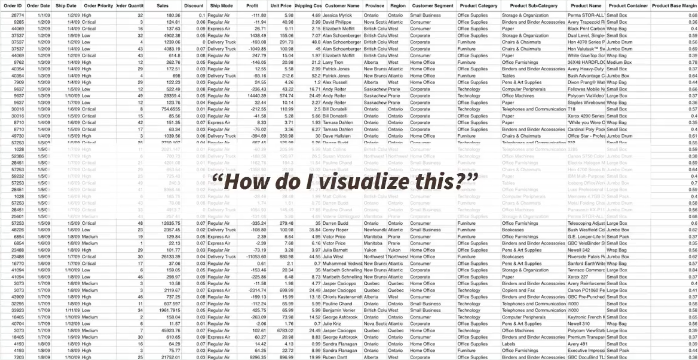{height="760" fig-align="center"}
:::
::::::

::: notes
Start with the fundamental question every data analyst faces. The process breaks down into two critical steps that we'll explore in detail today. This isn't just theory - it's the practical workflow you'll use in every visualization project.
:::

------------------------------------------------------------------------

## Two-Step Process

:::::: columns
:::incremental  
-   **Step1:** Decide what to visualize.
    -   Tipically, data is represented in a table and you must __SELECT__ attributes to create your visualization
    -   The selected attributes can also be __TRANSFORMED__ in order to generated useful information to answer the question
-   **Step2:** Choose/Design your visualization.
    -   Your visualization can be selected from a set of existing visualizations
    -   Based on well-defined principles, a novel visualization can be designed to answer the question
:::

::::::


------------------------------------------------------------------------


## Data Types Drive Design

:::::: columns
::: {.column width="40%"}
**Understanding your data:**

::: incremental
-   **Categorical** (nominal, ordinal)
-   **Quantitative** (continuous, discrete)
-   **Temporal** (time-based ordering)
-   **Spatial** (geographic coordinates)
:::

**The type determines suitable encodings**
:::

::: {.column width="60%"}
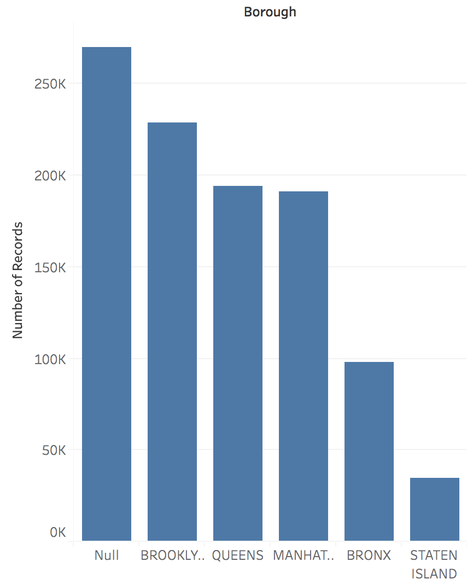{height="760" fig-align="center"}
:::
::::::

::: notes
This step is often underestimated but crucial. The wrong data selection can make even the best visual design ineffective. We'll see concrete examples of transformations that unlock insights.
:::

------------------------------------------------------------------------

## Same Data, Multiple Options

:::::: columns
::: {.column width="40%"}
**Design decisions:**

::: incremental
-   Which visual channels best represent your data?
-   How do you map data attributes to visual properties?
-   What design choices enhance clarity?
-   How do you avoid misleading representations?
:::

**Chart selection:** The attribute types can guide the chart selection!
:::

::: {.column width="60%"}
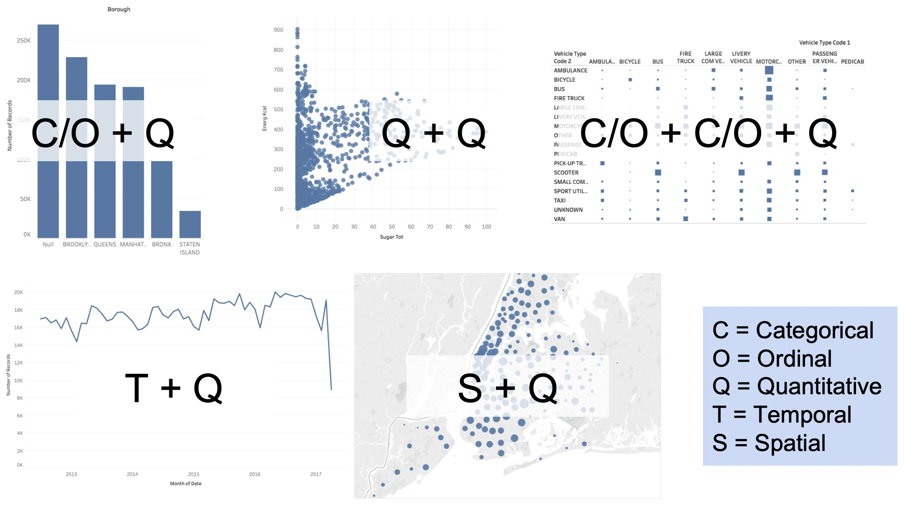{height="760" fig-align="center"}
:::
::::::

::: notes
This is where art meets science. We'll learn principled approaches to make these choices, backed by research on human perception and cognition.
:::

------------------------------------------------------------------------

## The Five Fundamental Graphs

:::: {.columns}
::: {.column width="100%"}
<!-- Top row content goes here -->
:::: {.columns}
::: {.column width="33%"}
**Bar Chart:**  
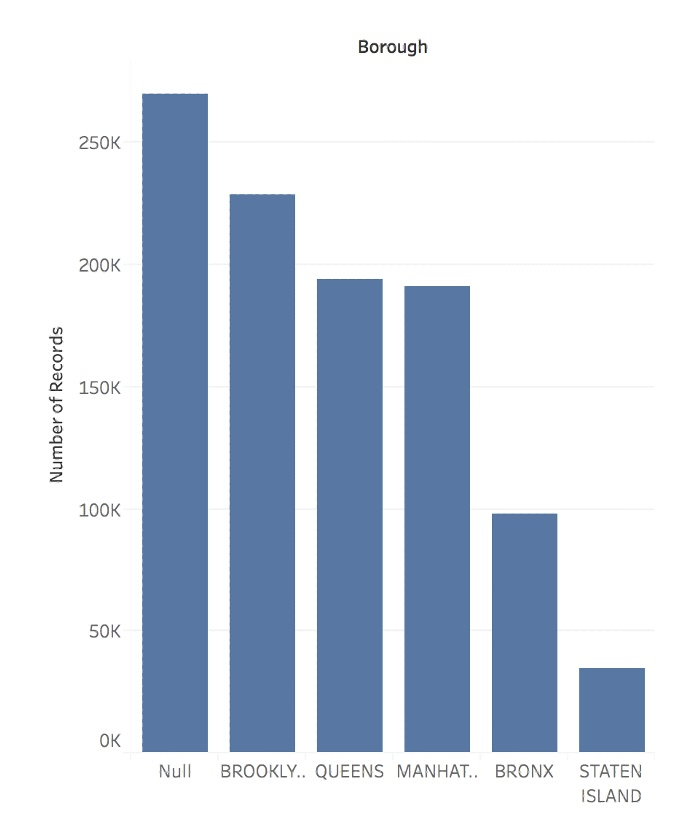{width="50%"} 
:::
::: {.column width="33%"}
**Line Chart:**  
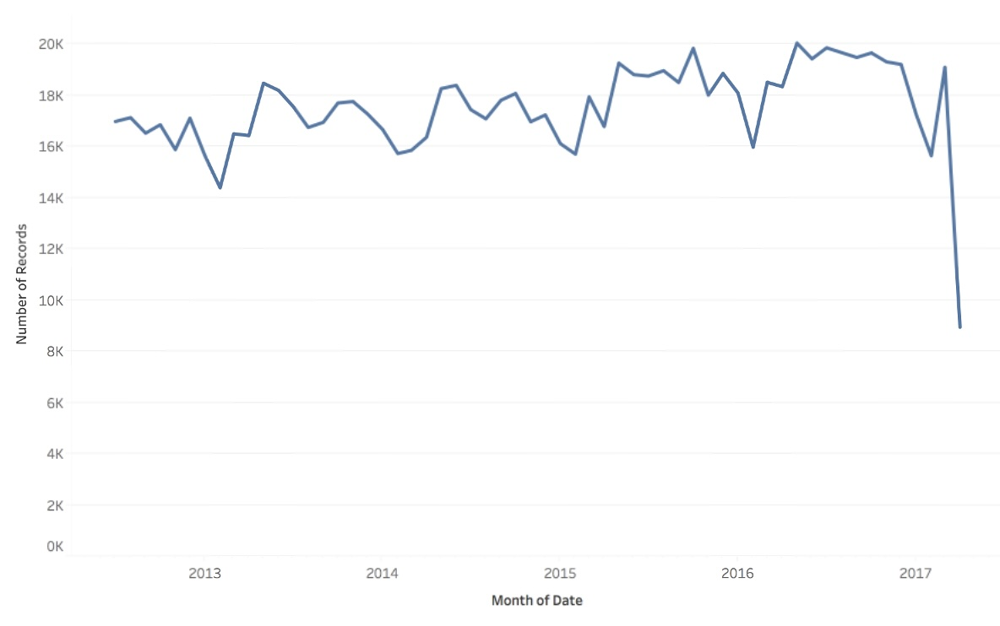{width="70%"}
:::
::: {.column width="33%"}
**Scatterplot:**  
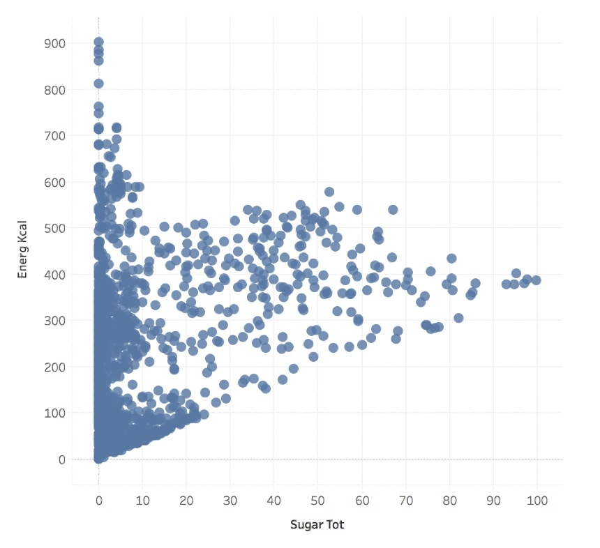{width="70%"}
:::
::::
:::
::::

:::: {.columns}
::: {.column width="100%"}
<!-- Bottom row content goes here -->
:::: {.columns}
::: {.column width="50%"}
**Matrix Chart:**  
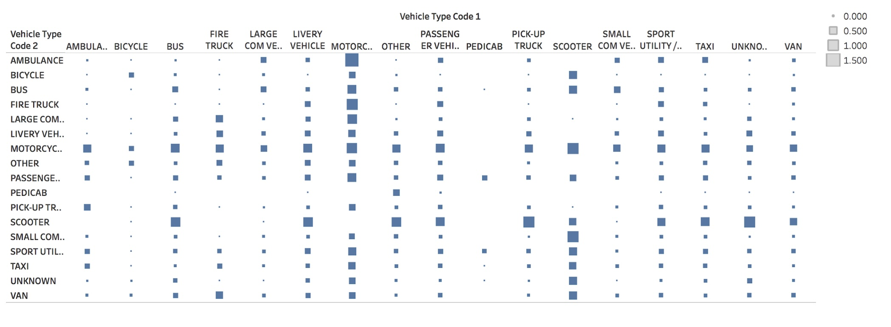{width="80%"}
:::
::: {.column width="50%"}
**Symbol Map:**  
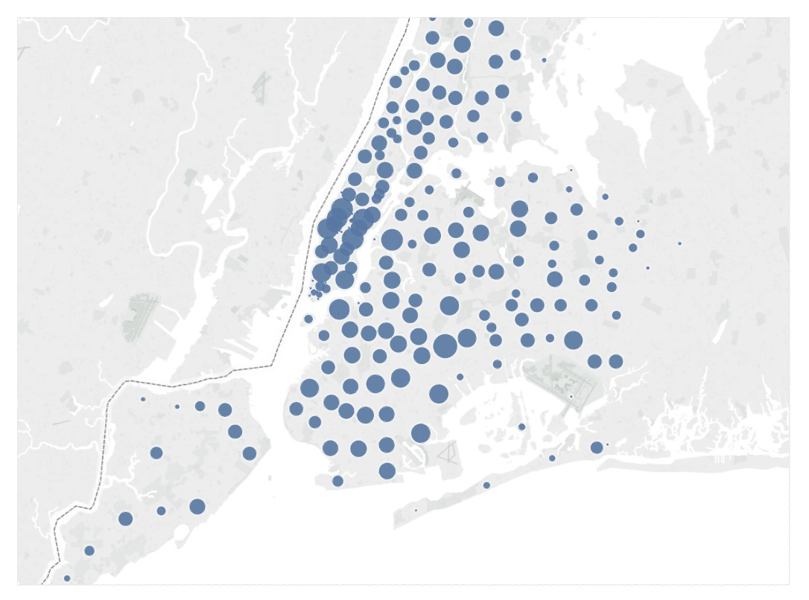{width="50%"}
:::
::::
:::
::::


<!-- ::::: columns
::: {.column width="60%"}
{width="45%"} {width="45%"}
:::

::: {.column width="40%"}
{width="90%"}

{width="45%"} {width="45%"}
:::
:::::

::: notes
These five chart types are your visualization toolkit's power tools. Master these, and you'll be able to tackle the vast majority of visualization challenges. They're also building blocks for more complex designs.
::: -->

------------------------------------------------------------------------

## Bar Chart: Categorical Comparisons

::::: columns
::: {.column width="40%"}
**Purpose:** Compare quantities across categories

**Data Types:**

- Categorical/Ordinal + Quantitative
- Example: Sales by product category

**Best For:**

- Rankings and comparisons
- Part-to-whole relationships

**Key principle:** Our visual system excels at comparing lengths along a common baseline.
:::

::: {.column width="60%"}
```{=html}
<div id="barchart-demo"></div>
<script>
{
  const data = [
    {category: "4-Seam Fastball", count: 187},
    {category: "Changeup", count: 100},
    {category: "Sinker", count: 85},
    {category: "Slider", count: 92},
    {category: "Curveball", count: 31}
  ];

  const width = 960, height = 600;
  const margin = {top: 24, right: 24, bottom: 56, left: 84};

  const svg = d3.select("#barchart-demo").append("svg")
    .attr("viewBox", [0, 0, width, height]);

  const x = d3.scaleBand()
    .domain(data.map(d => d.category))
    .range([margin.left, width - margin.right])
    .padding(0.3);

  const y = d3.scaleLinear()
    .domain([0, d3.max(data, d => d.count)])
    .nice()
    .range([height - margin.bottom, margin.top]);

  // Recessive horizontal grid (behind the marks)
  svg.append("g").attr("class", "grid")
    .attr("transform", `translate(${margin.left},0)`)
    .call(d3.axisLeft(y).ticks(5).tickSize(-(width - margin.left - margin.right)).tickFormat(""));

  // Bars
  svg.append("g")
    .selectAll("rect")
    .data(data)
    .join("rect")
    .attr("x", d => x(d.category))
    .attr("y", d => y(d.count))
    .attr("width", x.bandwidth())
    .attr("height", d => y(0) - y(d.count))
    .attr("rx", 4)
    .attr("fill", "#2a78d6");

  // X axis
  svg.append("g")
    .attr("transform", `translate(0,${height - margin.bottom})`)
    .call(d3.axisBottom(x).tickSizeOuter(0))
    .attr("font-size", 18);

  // Y axis
  svg.append("g")
    .attr("transform", `translate(${margin.left},0)`)
    .call(d3.axisLeft(y).ticks(5))
    .attr("font-size", 18)
    .call(g => g.select(".domain").remove());

  // Y axis label
  svg.append("text")
    .attr("transform", "rotate(-90)")
    .attr("y", 28)
    .attr("x", -(height / 2))
    .attr("text-anchor", "middle")
    .attr("font-size", 20)
    .text("Count");

}
</script>
```
:::
:::::

::: notes
Bar charts are the workhorses of categorical data visualization. The key insight: our visual system excels at comparing lengths along a common baseline. Always start the y-axis at zero for accurate magnitude comparison.
:::

------------------------------------------------------------------------

## Line Chart: Trends Over Time

::::: columns
::: {.column width="40%"}
**Purpose:** Show trends and changes over time

**Data Types:**

- Temporal + Quantitative
- Example: Stock prices over months

**Best For:**

- Trends and patterns
- Multiple series comparison

**Key principle:** Connecting lines imply continuity - use only for ordered data.
:::

::: {.column width="60%"}
```{=html}
<div id="linechart-demo"></div>
<script>
{
  // Average speed by inning
  const data = [
    {inning: 1, speed: 95.5},
    {inning: 2, speed: 95.1},
    {inning: 3, speed: 94.8},
    {inning: 4, speed: 94.9},
    {inning: 5, speed: 94.3},
    {inning: 6, speed: 94.1},
    {inning: 7, speed: 93.8}
  ];

  const width = 960, height = 600;
  const margin = {top: 48, right: 30, bottom: 70, left: 96};

  const svg = d3.select("#linechart-demo").append("svg")
    .attr("viewBox", [0, 0, width, height]);

  const x = d3.scaleLinear()
    .domain(d3.extent(data, d => d.inning))
    .range([margin.left, width - margin.right]);

  const y = d3.scaleLinear()
    .domain([93, 96])
    .range([height - margin.bottom, margin.top]);

  // Recessive horizontal grid (behind the marks)
  svg.append("g").attr("class", "grid")
    .attr("transform", `translate(${margin.left},0)`)
    .call(d3.axisLeft(y).ticks(6).tickSize(-(width - margin.left - margin.right)).tickFormat(""));

  // Line
  const line = d3.line()
    .x(d => x(d.inning))
    .y(d => y(d.speed));

  svg.append("path")
    .datum(data)
    .attr("fill", "none")
    .attr("stroke", "#2a78d6")
    .attr("stroke-width", 2)
    .attr("d", line);

  // Points
  svg.append("g")
    .selectAll("circle")
    .data(data)
    .join("circle")
    .attr("cx", d => x(d.inning))
    .attr("cy", d => y(d.speed))
    .attr("r", 7)
    .attr("fill", "#2a78d6")
    .attr("stroke", "#fafafa")
    .attr("stroke-width", 2);

  // X axis
  svg.append("g")
    .attr("transform", `translate(0,${height - margin.bottom})`)
    .call(d3.axisBottom(x).ticks(7).tickSizeOuter(0))
    .attr("font-size", 18);

  // Y axis
  svg.append("g")
    .attr("transform", `translate(${margin.left},0)`)
    .call(d3.axisLeft(y).ticks(6))
    .attr("font-size", 18)
    .call(g => g.select(".domain").remove());

  // X axis label
  svg.append("text")
    .attr("x", (margin.left + width - margin.right) / 2)
    .attr("y", height - 16)
    .attr("text-anchor", "middle")
    .attr("font-size", 20)
    .text("Inning");

  // Y axis label
  svg.append("text")
    .attr("transform", "rotate(-90)")
    .attr("y", 30)
    .attr("x", -(height / 2))
    .attr("text-anchor", "middle")
    .attr("font-size", 20)
    .text("Average Speed (mph)");

  // Title
  svg.append("text")
    .attr("x", width / 2)
    .attr("y", 24)
    .attr("text-anchor", "middle")
    .attr("font-weight", 600)
    .attr("font-size", 22)
    .text("Fastball velocity decline over game");
}
</script>
```
:::
:::::

::: notes
Line charts excel at showing continuity and change. The connecting lines imply a continuous relationship - use them only when this makes sense (typically with time or other ordered dimensions). Notice how the trend of declining velocity is immediately apparent.
:::

------------------------------------------------------------------------

## Scatter Plot: Relationships

::::: columns
::: {.column width="40%"}
**Purpose:** Explore relationships between variables

**Data Types:**

- Quantitative + Quantitative
- Example: Height vs. weight

**Best For:**

- Correlation analysis
- Outlier detection
- Pattern recognition

**Key principle:** Reveals relationships that summary statistics might miss.
:::

::: {.column width="60%"}
```{=html}
<div id="scatterplot-demo"></div>
<script>
{
  // Speed vs Spin Rate data
  const data = [
    {speed: 95.2, spin: 2250, type: "4-Seam"},
    {speed: 94.8, spin: 2310, type: "4-Seam"},
    {speed: 96.1, spin: 2180, type: "4-Seam"},
    {speed: 93.8, spin: 2420, type: "Sinker"},
    {speed: 94.2, spin: 2380, type: "Sinker"},
    {speed: 85.1, spin: 1620, type: "Changeup"},
    {speed: 84.9, spin: 1580, type: "Changeup"},
    {speed: 86.5, spin: 2650, type: "Slider"},
    {speed: 87.1, spin: 2720, type: "Slider"},
    {speed: 78.3, spin: 2580, type: "Curveball"},
    {speed: 77.9, spin: 2620, type: "Curveball"}
  ];

  const width = 960, height = 620;
  const margin = {top: 48, right: 210, bottom: 70, left: 96};

  const svg = d3.select("#scatterplot-demo").append("svg")
    .attr("viewBox", [0, 0, width, height]);

  const x = d3.scaleLinear()
    .domain([75, 100])
    .range([margin.left, width - margin.right]);

  const y = d3.scaleLinear()
    .domain([1500, 2800])
    .range([height - margin.bottom, margin.top]);

  const color = d3.scaleOrdinal()
    .domain(["4-Seam", "Sinker", "Changeup", "Slider", "Curveball"])
    .range(["#2a78d6", "#1baf7a", "#eb6834", "#eda100", "#e87ba4"]);

  // Recessive horizontal grid (behind the marks)
  svg.append("g").attr("class", "grid")
    .attr("transform", `translate(${margin.left},0)`)
    .call(d3.axisLeft(y).ticks(6).tickSize(-(width - margin.left - margin.right)).tickFormat(""));

  // Points
  svg.append("g")
    .selectAll("circle")
    .data(data)
    .join("circle")
    .attr("cx", d => x(d.speed))
    .attr("cy", d => y(d.spin))
    .attr("r", 9)
    .attr("fill", d => color(d.type))
    .attr("stroke", "#fafafa")
    .attr("stroke-width", 2)
    .attr("opacity", 0.9);

  // X axis
  svg.append("g")
    .attr("transform", `translate(0,${height - margin.bottom})`)
    .call(d3.axisBottom(x).ticks(6).tickSizeOuter(0))
    .attr("font-size", 18);

  // Y axis
  svg.append("g")
    .attr("transform", `translate(${margin.left},0)`)
    .call(d3.axisLeft(y).ticks(6))
    .attr("font-size", 18)
    .call(g => g.select(".domain").remove());

  // X axis label
  svg.append("text")
    .attr("x", (margin.left + width - margin.right) / 2)
    .attr("y", height - 16)
    .attr("text-anchor", "middle")
    .attr("font-size", 20)
    .text("Release Speed (mph)");

  // Y axis label
  svg.append("text")
    .attr("transform", "rotate(-90)")
    .attr("y", 30)
    .attr("x", -(height / 2))
    .attr("text-anchor", "middle")
    .attr("font-size", 20)
    .text("Spin Rate (rpm)");

  // Title
  svg.append("text")
    .attr("x", width / 2)
    .attr("y", 24)
    .attr("text-anchor", "middle")
    .attr("font-weight", 600)
    .attr("font-size", 22)
    .text("Speed vs Spin Rate by Pitch Type");

  // Legend
  const legend = svg.append("g")
    .attr("transform", `translate(${width - margin.right + 28}, ${margin.top + 8})`);

  const types = color.domain();  // all five pitch types (legend previously listed only three)
  legend.selectAll("circle")
    .data(types)
    .join("circle")
    .attr("cx", 0)
    .attr("cy", (d, i) => i * 32)
    .attr("r", 8)
    .attr("fill", d => color(d));

  legend.selectAll("text")
    .data(types)
    .join("text")
    .attr("x", 18)
    .attr("y", (d, i) => i * 32)
    .attr("dy", "0.35em")
    .attr("font-size", 18)
    .text(d => d);
}
</script>
```
:::
:::::

::: notes
Scatter plots reveal relationships that summary statistics might miss. They're essential for exploratory data analysis and can reveal clusters, outliers, and non-linear relationships. Notice how different pitch types cluster in different regions of the speed-spin space.
:::

------------------------------------------------------------------------

## Matrix (Heatmap): Two-Way Comparisons

::::: columns
::: {.column width="40%"}
**Purpose:** Compare across two categorical dimensions

**Data Types:**

- Categorical + Categorical + Quantitative
- Example: Sales by month and region

**Best For:**

- Cross-tabulations
- Correlation matrices
- Dense data display

**Key principle:** Color encoding allows rapid processing of many values.
:::

::: {.column width="60%"}
```{=html}
<div id="matrix-demo"></div>
<script>
{
  // Pitch type distribution by count (balls-strikes)
  const counts = ["0-0", "1-0", "2-0", "3-0", "0-1", "1-1", "2-1", "3-1", "0-2", "1-2", "2-2", "3-2"];
  const pitchTypes = ["4-Seam", "Changeup", "Sinker", "Slider", "Curve"];

  // Simulated data: percentage of each pitch type at each count
  const data = [];
  counts.forEach(count => {
    pitchTypes.forEach((type, i) => {
      // Vary by count - more fastballs in hitter's counts
      const base = [45, 15, 20, 12, 8][i];
      const variation = count.startsWith("3") ? [10, -2, -3, -3, -2][i] : 0;
      data.push({
        count: count,
        type: type,
        value: base + variation + Math.random() * 5
      });
    });
  });

  const width = 960, height = 640;
  const margin = {top: 96, right: 30, bottom: 110, left: 130};
  const cellWidth = 130, cellHeight = 36;

  const svg = d3.select("#matrix-demo").append("svg")
    .attr("viewBox", [0, 0, width, height]);

  // Title
  svg.append("text")
    .attr("x", width / 2)
    .attr("y", 28)
    .attr("text-anchor", "middle")
    .attr("font-weight", 600)
    .attr("font-size", 22)
    .text("Pitch Selection by Count");

  const x = d3.scaleBand()
    .domain(pitchTypes)
    .range([margin.left, margin.left + pitchTypes.length * cellWidth]);

  const y = d3.scaleBand()
    .domain(counts)
    .range([margin.top, margin.top + counts.length * cellHeight]);

  const color = d3.scaleSequential()
    .domain([0, 50])
    .interpolator(d3.interpolateBlues);

  // Cells
  svg.append("g")
    .selectAll("rect")
    .data(data)
    .join("rect")
    .attr("x", d => x(d.type))
    .attr("y", d => y(d.count))
    .attr("width", cellWidth)
    .attr("height", cellHeight)
    .attr("fill", d => color(d.value))
    .attr("stroke", "#fafafa")
    .attr("stroke-width", 2);

  // X axis (pitch types)
  svg.append("g")
    .attr("transform", `translate(0,${margin.top - 12})`)
    .selectAll("text")
    .data(pitchTypes)
    .join("text")
    .attr("x", d => x(d) + cellWidth / 2)
    .attr("y", 0)
    .attr("text-anchor", "middle")
    .attr("font-size", 18)
    .text(d => d);

  // Y axis (counts)
  svg.append("g")
    .attr("transform", `translate(${margin.left - 5},0)`)
    .selectAll("text")
    .data(counts)
    .join("text")
    .attr("x", 0)
    .attr("y", d => y(d) + cellHeight / 2)
    .attr("text-anchor", "end")
    .attr("dy", "0.35em")
    .attr("font-size", 17)
    .text(d => d);

  // Axis labels
  svg.append("text")
    .attr("x", margin.left + (pitchTypes.length * cellWidth) / 2)
    .attr("y", margin.top - 44)
    .attr("text-anchor", "middle")
    .attr("font-size", 20)
    .attr("font-weight", 600)
    .text("Pitch Type");

  svg.append("text")
    .attr("transform", `translate(${margin.left - 96}, ${margin.top + (counts.length * cellHeight) / 2}) rotate(-90)`)
    .attr("text-anchor", "middle")
    .attr("font-size", 20)
    .attr("font-weight", 600)
    .text("Count (Balls-Strikes)");

  // Legend
  const legendWidth = 320, legendHeight = 18;
  const legendX = margin.left, legendY = height - 72;

  const legendScale = d3.scaleLinear()
    .domain([0, 50])
    .range([0, legendWidth]);

  const legendAxis = d3.axisBottom(legendScale)
    .ticks(5)
    .tickFormat(d => d + "%");

  // Color gradient
  svg.append("defs").append("linearGradient")
    .attr("id", "legend-gradient")
    .selectAll("stop")
    .data(d3.range(0, 1.01, 0.01))
    .join("stop")
    .attr("offset", d => d)
    .attr("stop-color", d => color(d * 50));

  svg.append("rect")
    .attr("x", legendX)
    .attr("y", legendY)
    .attr("width", legendWidth)
    .attr("height", legendHeight)
    .style("fill", "url(#legend-gradient)");

  svg.append("g")
    .attr("transform", `translate(${legendX},${legendY + legendHeight})`)
    .call(legendAxis)
    .attr("font-size", 16)
    .call(g => g.select(".domain").remove());
}
</script>
```
:::
:::::

::: notes
Matrices efficiently display large amounts of data in compact form. Color encoding allows us to process many values quickly, though precise comparison is harder than with position-based encodings. Notice how patterns emerge - darker cells show where certain pitches are thrown more frequently at specific counts.
:::

------------------------------------------------------------------------

## Symbol Map: Spatial Distribution

::::: columns
::: {.column width="40%"}
**Purpose:** Show spatial distribution of data

**Data Types:**

- Spatial coordinates + Quantitative
- Example: Population by city

**Best For:**

- Geographic patterns
- Location-based analysis
- Spatial clustering
:::

::: {.column width="60%"}
{height="760" fig-align="center"}
:::
:::::

::: notes
Symbol maps leverage our spatial reasoning abilities. They're powerful for revealing geographic patterns but require careful design to avoid overlapping symbols and ensure accurate size perception.
:::

------------------------------------------------------------------------

## Alternate representations

**Question:** Is it possible to create different representations of the same data?

**It is. However, some representations might not follow the best design guidelines**

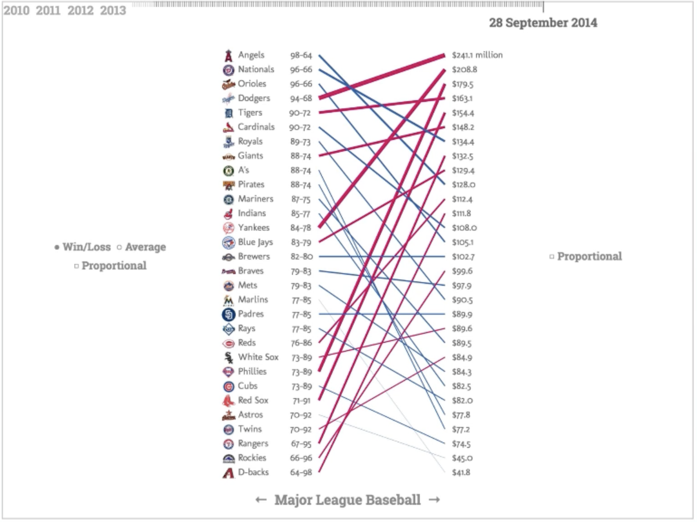{.nostretch width="50%" fig-align="center"}

------------------------------------------------------------------------

## Chart Selection Examples

**Scenario 1:** Monthly sales data for different product categories

::: fragment
**Answer:** Line chart (multiple series) - shows trends over time by category
:::

**Scenario 2:** Customer satisfaction ratings across departments

::: fragment
**Answer:** Bar chart - compares quantitative values across categories
:::

**Scenario 3:** Relationship between advertising spend and sales revenue

::: fragment
**Answer:** Scatter plot - explores correlation between two quantitative variables
:::

::: notes
Work through these examples with students to reinforce the decision-making process. Ask them to justify their choices based on the framework.
:::

------------------------------------------------------------------------

## Decomposing a chart: Marks and Channels

**Marks are the geometric primitives we use in a visualization. They are used to represent the items of a dataset.**

```{=html}
<div id="marks-demo"></div>
<script>
{
  // Simple data: five values
  const data = [
    {label: "A", value: 187},
    {label: "B", value: 100},
    {label: "C", value: 85},
    {label: "D", value: 92},
    {label: "E", value: 31}
  ];
  const max = d3.max(data, d => d.value);

  // Create container
  const container = d3.select("#marks-demo")
    .style("display", "flex")
    .style("flex-wrap", "wrap")
    .style("gap", "14px")
    .style("justify-content", "center");

  const W = 284, H = 232;

  function panel(title) {
    const svg = container.append("svg")
      .attr("width", W).attr("height", H)
      .attr("font-family", "sans-serif")
      .attr("font-size", 15);
    svg.append("text")
      .attr("x", W/2)
      .attr("y", 14)
      .attr("text-anchor", "middle")
      .attr("font-weight", 600)
      .attr("font-size", 17)
      .text(title);
    return svg;
  }

  const rows = d3.scaleBand(data.map(d => d.label), [26, H - 4]).padding(0.25);
  const cols = d3.scaleBand(data.map(d => d.label), [14, W - 4]).padding(0.15);
  const len = d3.scaleLinear([0, max], [18, W - 10]);
  const midRow = d => rows(d.label) + rows.bandwidth() / 2;
  const midCol = d => cols(d.label) + cols.bandwidth() / 2;

  // 1. Position
  const pos = panel("1. Position");
  pos.append("g").selectAll("text").data(data).join("text")
    .attr("x", 4).attr("y", midRow).attr("dy", "0.35em").text(d => d.label);
  pos.append("g").selectAll("line").data(data).join("line")
    .attr("stroke", "#e3e1da")
    .attr("x1", len(0)).attr("x2", len(max))
    .attr("y1", midRow).attr("y2", midRow);
  pos.append("g").selectAll("circle").data(data).join("circle")
    .attr("cx", d => len(d.value)).attr("cy", midRow).attr("r", 7);

  // 2. Length
  const bar = panel("2. Length");
  bar.append("g").selectAll("text").data(data).join("text")
    .attr("x", 4).attr("y", midRow).attr("dy", "0.35em").text(d => d.label);
  bar.append("g").selectAll("rect").data(data).join("rect")
    .attr("x", len(0))
    .attr("y", d => rows(d.label))
    .attr("width", d => len(d.value) - len(0))
    .attr("height", rows.bandwidth());

  // 3. Angle (Pie chart)
  const pie = panel("3. Angle");
  const arcs = d3.pie().sort(null).value(d => d.value)(data);
  const arc = d3.arc().innerRadius(0).outerRadius(88);
  const g = pie.append("g").attr("transform", `translate(${W/2},${H/2 + 16})`);
  g.selectAll("path").data(arcs).join("path")
    .attr("d", arc)
    .attr("fill", "#4c4b46")
    .attr("stroke", "#fff");
  g.selectAll("text").data(arcs).join("text")
    .attr("transform", a => `translate(${arc.centroid(a)})`)
    .attr("text-anchor", "middle")
    .attr("dy", "0.35em")
    .attr("fill", "#fff")
    .text(a => a.data.label);

  // 4. Area
  const area = panel("4. Area");
  const radius = d3.scaleSqrt([0, max], [0, cols.bandwidth() / 2]);
  area.append("g").selectAll("text").data(data).join("text")
    .attr("x", midCol).attr("y", H - 6)
    .attr("text-anchor", "middle").text(d => d.label);
  area.append("g").selectAll("circle").data(data).join("circle")
    .attr("cx", midCol)
    .attr("cy", H / 2 + 6)
    .attr("r", d => radius(d.value));

  // 5. Lightness
  const light = panel("5. Lightness");
  const grey = d3.scaleSequential([0, max], d3.interpolateGreys);
  light.append("g").selectAll("text").data(data).join("text")
    .attr("x", midCol).attr("y", H - 6)
    .attr("text-anchor", "middle").text(d => d.label);
  light.append("g").selectAll("rect").data(data).join("rect")
    .attr("x", d => cols(d.label))
    .attr("y", 54)
    .attr("width", cols.bandwidth())
    .attr("height", 124)
    .attr("fill", d => grey(d.value));

  // 6. Hue
  const hue = panel("6. Hue");
  const rainbow = d3.scaleSequential([0, max], d3.interpolateRainbow);
  hue.append("g").selectAll("text").data(data).join("text")
    .attr("x", midCol).attr("y", H - 6)
    .attr("text-anchor", "middle").text(d => d.label);
  hue.append("g").selectAll("rect").data(data).join("rect")
    .attr("x", d => cols(d.label))
    .attr("y", 54)
    .attr("width", cols.bandwidth())
    .attr("height", 124)
    .attr("fill", d => rainbow(d.value));
}
</script>
```

::: notes
These are the foundational principles from Jacques Bertin and Jock Mackinlay. They provide objective criteria for evaluating visualization designs and guide our decision-making process. This interactive demo shows the same five numbers encoded six different ways - notice how position and length are easiest to compare accurately, while hue provides no sense of order or magnitude.
:::

------------------------------------------------------------------------

## Decomposing a chart: Marks and Channels

::::: columns
::: {.column width="40%"}
**Channels:**

-   Channels are the appearance of the marks
-   They are used to represent the __attributes__ of a dataset
:::

::: {.column width="60%"}
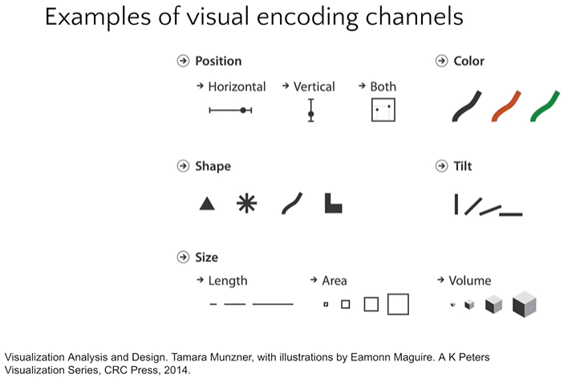{height="760" fig-align="center"}
:::
:::::

::: notes
These are the foundational principles from Jacques Bertin and Jock Mackinlay. They provide objective criteria for evaluating visualization designs and guide our decision-making process.
:::

------------------------------------------------------------------------

## Principles: Expressiveness & Effectiveness

::::: columns
::: {.column width="50%"}
**Expressiveness:** The visual encodings must show all and only the facts in the data.

-   The most fundamental expression of this principle is that __ordered data should be shown in a way that our perceptual system intrinsically senses as ordered__. Conversely, unordered data should not be shown in a way that perceptually implies an ordering that does not exist. Violating this principle is a common beginner’s mistake in visualization.

**Effectiveness:** Information should be readily perceived

-   The importance of the attribute should match the salience of the channel; that is, its noticeability. In other words, the __most important attributes should be encoded with the most effective channels__ in order to be most noticeable, and then decreasingly important attributes can be matched with less effective channels.
:::


:::::

::: notes
These are the foundational principles from Jacques Bertin and Jock Mackinlay. They provide objective criteria for evaluating visualization designs and guide our decision-making process.
:::

------------------------------------------------------------------------

## Expressiveness Violations

::::: columns
::: {.column width="60%"}
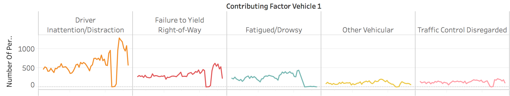{fig-align="center"}

**Problem:** Ordered visual channel (line) with unordered data
:::

::: {.column width="40%"}
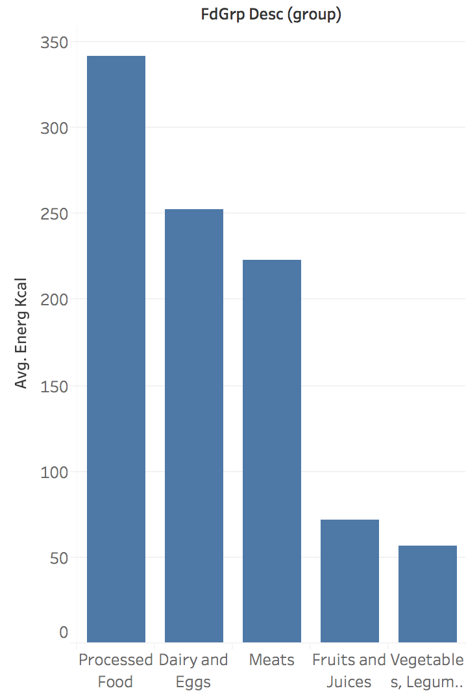{height="760" fig-align="center"}

**Problem:** Arbitrary ordering implies non-existent relationship
:::
:::::

::: notes
These examples show how visual choices can mislead. The line chart suggests temporal trends where none exist, while the bar chart ordering implies a ranking of categories that may be meaningless.
:::

------------------------------------------------------------------------

## Effectiveness: A Quick Experiment

**Which value is larger?**

{fig-align="center"}

{fig-align="center"}

::: fragment
**Result:** Length comparison is faster and more accurate than color comparison
:::

::: notes
This demonstrates why we need systematic understanding of visual channel effectiveness. Our perceptual system has different capabilities for different visual properties.
:::

------------------------------------------------------------------------

## Channel Effectiveness Rankings

**Use the most effective channel for your most important data**

{.nostretch width="55%" fig-align="center"}

::: notes
This ranking from Cleveland and McGill is based on empirical studies of human perception. Position along a common scale is most effective for quantitative data, while color hue works well for categorical distinctions but poorly for quantitative comparison.
:::

------------------------------------------------------------------------

## Applying Channel Rankings

::::: columns
::: {.column width="50%"}
**More Effective:**

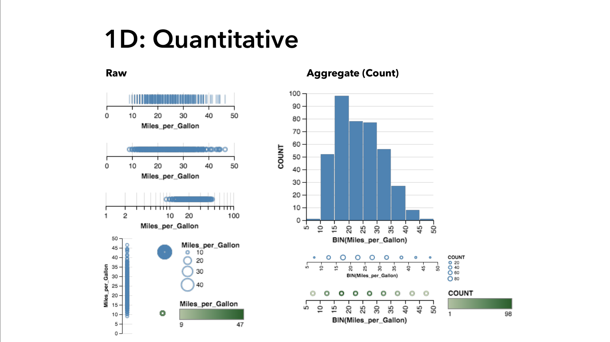{width="90%"}

Position encoding enables accurate comparison
:::

::: {.column width="50%"}
**Less Effective:**

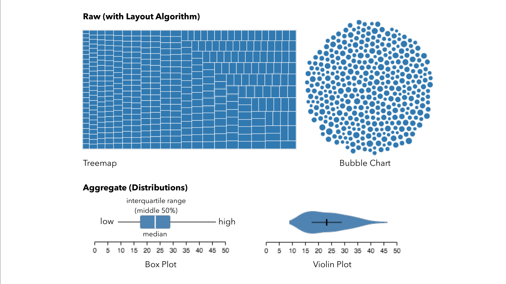{width="90%"}

Area and angle are harder to compare accurately
:::
:::::

::: notes
This principle explains why bar charts often outperform pie charts for precise comparison. When accuracy matters most, prioritize position-based encodings.
:::

------------------------------------------------------------------------

## Exercise

::::: columns
::: {.column width="40%"}
-   What are the marks?
    -   Bars
-   What are the channels?
    -   Size
    -   Horizontal position
:::

::: {.column width="60%"}
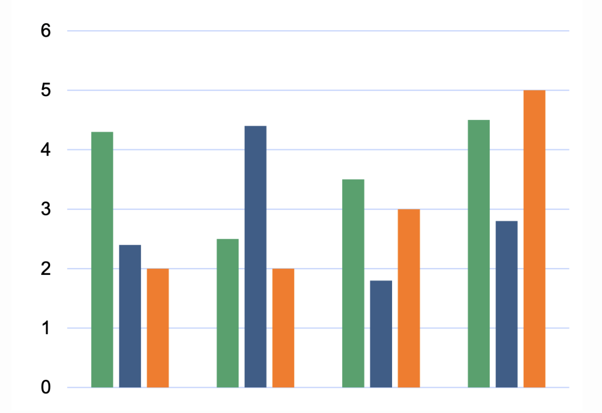{height="760" fig-align="center"}
:::
:::::


------------------------------------------------------------------------

## Chart Selection Framework

**How do you choose the right chart?**

::::: columns
::: {.column width="50%"}
**Ask these questions:**

1.  **What data types do I have?**
    -   Categorical vs. Quantitative
    -   Temporal vs. Non-temporal
2.  **What relationship am I showing?**
    -   Comparison, trend, correlation, distribution, composition
3.  **How many variables?**
    -   1D, 2D, 3D, multidimensional
:::

::: {.column width="50%"}
**Decision Tree:**

-   **Compare categories** → Bar Chart
-   **Show trends over time** → Line Chart
-   **Explore relationships** → Scatter Plot
-   **Cross-tabulate** → Matrix/Heatmap
-   **Show geographic distribution** → Symbol Map

**Rule of thumb:** Start simple, add complexity only when needed
:::
:::::

::: notes
This framework helps students make systematic chart choices rather than arbitrary decisions. The decision tree provides a quick reference for common scenarios.
:::

------------------------------------------------------------------------

## Scales and Axes: The Foundation

**Scale:** A function mapping data domain to visual range

**Data Domain → Scale Function → Visual Range**

::: incremental
-   **Linear scales:** Equal data differences = equal visual differences
-   **Logarithmic scales:** Equal ratios = equal visual differences\
-   **Ordinal scales:** Preserve order, not magnitude
:::

::: notes
Scales are fundamental but often invisible. The choice of scale dramatically affects what patterns are visible and how data relationships are perceived.
:::

------------------------------------------------------------------------

## Linear vs. Logarithmic Scales

**Choose scales based on whether absolute or relative change matters more.**

```{=html}
<div id="scales-demo"></div>
<script>
{
  // Exponential growth data (e.g., pitch counts over career years)
  const data = [
    {year: 1, count: 100},
    {year: 2, count: 150},
    {year: 3, count: 300},
    {year: 4, count: 600},
    {year: 5, count: 1200},
    {year: 6, count: 2400}
  ];

  const container = d3.select("#scales-demo")
    .style("display", "flex")
    .style("gap", "60px")
    .style("justify-content", "center")
    .style("flex-wrap", "wrap");

  function createChart(title, yScale, yLabel) {
    const width = 800, height = 520;
    const margin = {top: 48, right: 30, bottom: 96, left: 104};

    const svg = container.append("svg")
      .attr("width", width)
      .attr("height", height);

    svg.append("text")
      .attr("x", width / 2)
      .attr("y", 26)
      .attr("text-anchor", "middle")
      .attr("font-weight", 600)
      .attr("font-size", 22)
      .text(title);

    const x = d3.scaleLinear()
      .domain([1, 6])
      .range([margin.left, width - margin.right]);

    const y = yScale
      .range([height - margin.bottom, margin.top]);

    // Line
    const line = d3.line()
      .x(d => x(d.year))
      .y(d => y(d.count));

    svg.append("path")
      .datum(data)
      .attr("fill", "none")
      .attr("stroke", "#2a78d6")
      .attr("stroke-width", 2)
      .attr("d", line);

    // Points
    svg.append("g")
      .selectAll("circle")
      .data(data)
      .join("circle")
      .attr("cx", d => x(d.year))
      .attr("cy", d => y(d.count))
      .attr("r", 7)
      .attr("fill", "#2a78d6")
      .attr("stroke", "#fafafa")
      .attr("stroke-width", 2);

    // X axis
    svg.append("g")
      .attr("transform", `translate(0,${height - margin.bottom})`)
      .call(d3.axisBottom(x).ticks(6).tickSizeOuter(0))
      .attr("font-size", 17);

    // Y axis
    svg.append("g")
      .attr("transform", `translate(${margin.left},0)`)
      .call(d3.axisLeft(y).ticks(6))
      .attr("font-size", 17)
      .call(g => g.select(".domain").remove());

    // X label
    svg.append("text")
      .attr("x", (margin.left + width - margin.right) / 2)
      .attr("y", height - margin.bottom + 48)
      .attr("text-anchor", "middle")
      .attr("font-size", 19)
      .text("Year");

    // Y label
    svg.append("text")
      .attr("transform", "rotate(-90)")
      .attr("y", 30)
      .attr("x", -(height / 2))
      .attr("text-anchor", "middle")
      .attr("font-size", 19)
      .text(yLabel);

    // Add description
    const desc = svg.append("text")
      .attr("x", width / 2)
      .attr("y", height - 14)
      .attr("text-anchor", "middle")
      .attr("font-size", 17)
      .attr("fill", "#666");

    if (title.includes("Linear")) {
      desc.text("Shows absolute differences");
    } else {
      desc.text("Shows relative (%) changes");
    }
  }

  // Linear scale
  const linearY = d3.scaleLinear()
    .domain([0, d3.max(data, d => d.count)])
    .nice();
  createChart("Linear Scale", linearY, "Pitch Count");

  // Log scale
  const logY = d3.scaleLog()
    .domain([d3.min(data, d => d.count), d3.max(data, d => d.count)])
    .nice();
  createChart("Logarithmic Scale", logY, "Pitch Count (log)");
}
</script>
```

::::: columns
::: {.column width="50%"}
**Linear Scale:**

- Absolute differences
- Additive changes
- Most common choice
- Later years dominate visually
:::

::: {.column width="50%"}
**Logarithmic Scale:**

- Relative differences (%)
- Multiplicative changes
- Wide data ranges
- Equal growth rates appear as straight line
:::
:::::

::: notes
Stock prices are a classic example: linear scales show absolute price changes, while log scales show percentage changes. Choose based on whether absolute or relative change matters more for your analysis. Notice how the same data tells different stories depending on the scale.
:::

------------------------------------------------------------------------

## The Zero Baseline Rule

**Bar charts encode data as length. Truncating the axis changes the ratios readers perceive.**

```{=html}
<div id="zero-baseline-demo"></div>
<script>
{
  // Sample data: median speeds of different pitch types
  const data = [
    {type: "4-Seam Fastball", speed: 95.2},
    {type: "Changeup", speed: 85.1},
    {type: "Sinker", speed: 93.8},
    {type: "Slider", speed: 86.5},
    {type: "Curveball", speed: 78.3}
  ];
  const colors = ["#2a78d6", "#eb6834", "#1baf7a", "#eda100", "#e87ba4"];

  const container = d3.select("#zero-baseline-demo")
    .style("display", "flex")
    .style("gap", "40px")
    .style("justify-content", "center")
    .style("flex-wrap", "wrap");

  function createChart(title, domain) {
    const width = 860, height = 500;
    const margin = {top: 44, right: 90, bottom: 64, left: 250};

    const svg = container.append("svg")
      .attr("width", width)
      .attr("height", height);

    svg.append("text")
      .attr("x", width / 2)
      .attr("y", 26)
      .attr("text-anchor", "middle")
      .attr("font-weight", 600)
      .attr("font-size", 20)
      .text(title);

    const x = d3.scaleLinear()
      .domain(domain)
      .range([margin.left, width - margin.right]);

    const y = d3.scaleBand()
      .domain(data.map(d => d.type))
      .range([margin.top, height - margin.bottom])
      .padding(0.25);

    // X axis
    svg.append("g")
      .attr("transform", `translate(0,${height - margin.bottom})`)
      .call(d3.axisBottom(x).ticks(5).tickSizeOuter(0))
      .attr("font-size", 17)
      .call(g => g.select(".domain").remove());

    // Y axis
    svg.append("g")
      .attr("transform", `translate(${margin.left},0)`)
      .call(d3.axisLeft(y))
      .attr("font-size", 18)
      .call(g => g.select(".domain").remove());

    // X axis label
    svg.append("text")
      .attr("x", (margin.left + width - margin.right) / 2)
      .attr("y", height - 14)
      .attr("text-anchor", "middle")
      .attr("font-size", 19)
      .attr("fill", "#666")
      .text("Median Speed (mph)");

    // Bars
    const left = x.range()[0];
    svg.append("g")
      .selectAll("rect")
      .data(data)
      .join("rect")
      .attr("x", left)
      .attr("y", d => y(d.type))
      .attr("height", y.bandwidth())
      .attr("width", d => x(d.speed) - left)
      .attr("fill", (d, i) => colors[i]);

    // Value labels
    svg.append("g")
      .selectAll("text")
      .data(data)
      .join("text")
      .attr("x", d => x(d.speed) + 5)
      .attr("y", d => y(d.type) + y.bandwidth() / 2)
      .attr("dy", "0.35em")
      .attr("font-size", 17)
      .attr("fill", "#555")
      .text(d => d.speed.toFixed(1));
  }

  createChart("Truncated Axis (78-100 mph) - MISLEADING", [78, 100]);
  createChart("Zero Baseline (0-100 mph) - Honest", [0, 100]);
}
</script>
```

**Key insight:** On the left, the fastball bar appears ~7× longer than the curveball. In reality, it's only 20% faster.

::: notes
Bar charts encode data as length from a baseline. Without zero, these lengths misrepresent the data. This is one of the most common ways visualizations mislead, often unintentionally. Notice how dramatically the perception changes between these two charts showing the exact same data.
:::

------------------------------------------------------------------------

## When to Break the Rules

**Context determines when breaking rules is acceptable. Understand the "why" before breaking them.**

```{=html}
<div id="break-rules-demo"></div>
<script>
{
  // Small variations in large values - line chart case
  const data = [
    {day: 1, temp: 98.6},
    {day: 2, temp: 98.4},
    {day: 3, temp: 99.1},
    {day: 4, temp: 98.9},
    {day: 5, temp: 99.3},
    {day: 6, temp: 98.7},
    {day: 7, temp: 98.5}
  ];

  const container = d3.select("#break-rules-demo")
    .style("display", "flex")
    .style("gap", "40px")
    .style("justify-content", "center")
    .style("flex-wrap", "wrap");

  function createChart(title, domain, description) {
    const width = 800, height = 520;
    const margin = {top: 48, right: 30, bottom: 96, left: 104};

    const svg = container.append("svg")
      .attr("width", width)
      .attr("height", height);

    svg.append("text")
      .attr("x", width / 2)
      .attr("y", 26)
      .attr("text-anchor", "middle")
      .attr("font-weight", 600)
      .attr("font-size", 20)
      .text(title);

    const x = d3.scaleLinear()
      .domain([1, 7])
      .range([margin.left, width - margin.right]);

    const y = d3.scaleLinear()
      .domain(domain)
      .range([height - margin.bottom, margin.top]);

    // Line
    const line = d3.line()
      .x(d => x(d.day))
      .y(d => y(d.temp));

    svg.append("path")
      .datum(data)
      .attr("fill", "none")
      .attr("stroke", "#e87ba4")
      .attr("stroke-width", 2)
      .attr("d", line);

    // Points
    svg.append("g")
      .selectAll("circle")
      .data(data)
      .join("circle")
      .attr("cx", d => x(d.day))
      .attr("cy", d => y(d.temp))
      .attr("r", 7)
      .attr("fill", "#e87ba4")
      .attr("stroke", "#fafafa")
      .attr("stroke-width", 2);

    // X axis
    svg.append("g")
      .attr("transform", `translate(0,${height - margin.bottom})`)
      .call(d3.axisBottom(x).ticks(7).tickSizeOuter(0))
      .attr("font-size", 17);

    // Y axis
    svg.append("g")
      .attr("transform", `translate(${margin.left},0)`)
      .call(d3.axisLeft(y).ticks(6))
      .attr("font-size", 17)
      .call(g => g.select(".domain").remove());

    // X label
    svg.append("text")
      .attr("x", (margin.left + width - margin.right) / 2)
      .attr("y", height - margin.bottom + 48)
      .attr("text-anchor", "middle")
      .attr("font-size", 19)
      .text("Day");

    // Y label
    svg.append("text")
      .attr("transform", "rotate(-90)")
      .attr("y", 30)
      .attr("x", -(height / 2))
      .attr("text-anchor", "middle")
      .attr("font-size", 19)
      .text("Body Temperature (°F)");

    // Description
    svg.append("text")
      .attr("x", width / 2)
      .attr("y", height - 14)
      .attr("text-anchor", "middle")
      .attr("font-size", 17)
      .attr("fill", "#666")
      .text(description);
  }

  createChart("Zero baseline - Flattens variation", [0, 100], "Trend invisible");
  createChart("Truncated axis - Shows medically relevant changes", [98, 100], "ACCEPTABLE for line charts");
}
</script>
```

::::: columns
::: {.column width="50%"}
**When to break zero baseline:**

- Line charts (position, not length)
- Small changes in large values
- When trend matters more than magnitude
- Medical vitals, temperatures, etc.
:::

::: {.column width="50%"}
**When to use log scales:**

- Data spans orders of magnitude
- Ratios matter more than absolute values
- Exponential growth patterns
- **Never for bar charts!**
:::
:::::

::: notes
Rules exist for good reasons, but context matters. The key is understanding why the rules exist so you can make informed decisions about when to break them. For line charts, we encode by position and slope, not length, so truncating is acceptable when it reveals meaningful patterns. Body temperature is a perfect example - a one-degree change is medically significant even though it's tiny relative to zero.
:::

------------------------------------------------------------------------

## Design Exercise: Scale Choices

:::::: columns
::: {.column width="60%"}
**Scenario:** Visualizing country populations

**Data range:** 1,000 (Vatican) to 1.4 billion (China)
:::

:::: {.column width="40%"}
**Questions:** 1. What scale would you choose? 2. How would you handle the extreme range? 3. What alternatives might you consider?

::: fragment
**Consider:** Log scale vs. filtering vs. grouping
:::
::::
::::::

::: notes
This exercise highlights the challenge of extreme data ranges. Students should consider log scales, filtering small countries, or using different visualization types like maps where geographic size provides context.
:::

------------------------------------------------------------------------

## Putting It All Together

::::: columns
::: {.column width="40%"}
**The Visualization Design Process:**

1.  **Understand your question**
2.  **Transform data appropriately**
3.  **Choose effective visual encodings**
4.  **Select appropriate scales**
5.  **Test and iterate**

**Workflow:** Question → Transform → Encode → Scale → Iterate
:::

::: {.column width="60%"}
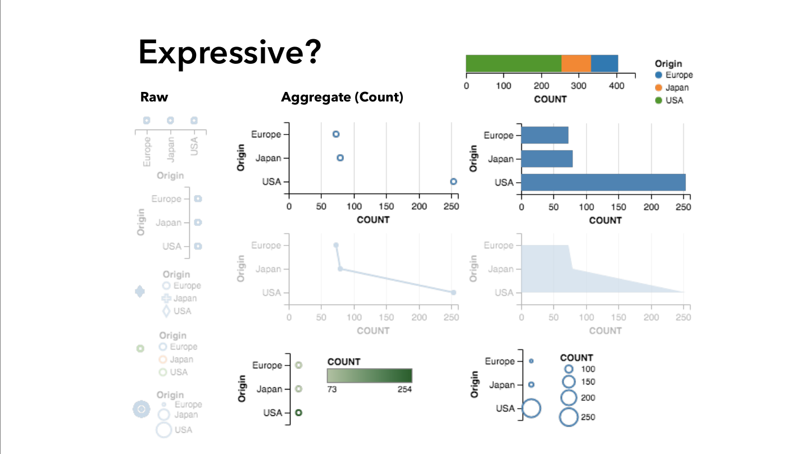{height="760" fig-align="center"}
:::
:::::

::: notes
This systematic approach helps avoid common pitfalls. Each step builds on the previous ones, and iteration often reveals better approaches. Don't expect to get it right on the first try.
:::

------------------------------------------------------------------------

## Common Pitfalls to Avoid

::: incremental
-   **Skipping data exploration:** Visualize without understanding the data
-   **Chart junk:** Adding visual elements that don't encode information
-   **Color overuse:** Using color when position would be more effective
-   **Ignoring scale effects:** Not considering how scale choices affect perception
-   **3D when 2D suffices:** Adding dimensions that don't encode information
:::

::: notes
These mistakes are common even among experienced practitioners. Developing an awareness of these pitfalls is the first step toward avoiding them.
:::

------------------------------------------------------------------------

## Specific Pitfalls to Avoid

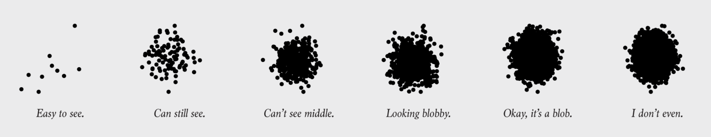{.nostretch width="50%" fig-align="center"}

------------------------------------------------------------------------

## Specific Pitfalls to Avoid

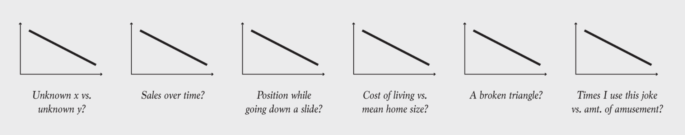{.nostretch width="50%" fig-align="center"}

------------------------------------------------------------------------

## Chart decoding

{.nostretch width="50%" fig-align="center"}


------------------------------------------------------------------------

## Best Practices Summary

**Expressiveness:** Match visual properties to data properties

**Effectiveness:** Use the most effective encoding for your most important data

**Transformation:** Prepare data to answer your specific questions

**Scales:** Choose scales that honestly represent relationships

**Iteration:** Test your designs with real users when possible

::: notes
These principles provide a framework for making systematic visualization decisions. They're not rigid rules but guidelines that help you think through design choices systematically.
:::

------------------------------------------------------------------------

## Interactive Quiz

:::::: columns
::: {.column width="70%"}
**Question 1:** For comparing sales across product categories, which encoding is most effective?

A)  Color saturation
B)  Bar length
C)  Symbol size
D)  Line style
:::

:::: {.column width="30%"}
::: fragment
**Answer:** B) Bar length (position along common scale)

*Why?* Position is the most effective visual channel for quantitative comparison.
:::
::::
::::::

::: notes
Use this quiz to reinforce key concepts. Encourage students to explain their reasoning, not just give answers.
:::

------------------------------------------------------------------------

## Interactive Quiz

:::::: columns
::: {.column width="70%"}
**Question 2:** You have website traffic data spanning 5 years. For showing long-term growth trends, you should:

A)  Use a zero baseline always
B)  Use a log scale if growth is exponential
C)  Show only the most recent year
D)  Use a pie chart for each year
:::

:::: {.column width="30%"}
::: fragment
**Answer:** B) Use a log scale if growth is exponential

*Why?* Log scales reveal multiplicative relationships and growth rates.
:::
::::
::::::

::: notes
This question tests understanding of when to break the zero baseline rule and when log scales are appropriate.
:::

------------------------------------------------------------------------

## Next Steps

**For next class:** - Read Tufte Chapter 1-2 (Graphical Excellence & Integrity) - Practice chart selection with your own datasets - Complete Exercise 3: Chart design and encoding alternatives

**Lab activities:** - Build all five chart types with real data - Compare encoding choices for the same dataset - Apply the chart selection framework to new scenarios

**Looking ahead:** - Interactive visualization techniques - Advanced visual encodings and multi-dimensional data - Design critique and evaluation methods

::: notes
Give students concrete actions to reinforce today's learning. The lab exercise helps them practice the concepts immediately while the reading prepares them for more advanced topics.
:::

------------------------------------------------------------------------

## Key Takeaways

::: incremental
-   **Five fundamental charts** are your visualization toolkit
-   **Data types** determine appropriate chart selection
-   **Visual encoding theory** provides systematic design principles
-   **Effectiveness rankings** guide channel choices
-   **Scale and axis design** dramatically affects perception
:::

::: notes
End with the core messages students should remember. These principles will guide them in every visualization project they undertake.
:::

------------------------------------------------------------------------

## Questions & Discussion

::::: columns
::: {.column width="70%"}
**Think about:** - What visualization challenges do you face in your work/research? - How might these principles apply to your domain? - What questions do you have about applying these techniques?

**Next class:** Interactive visualization techniques and advanced encodings
:::

::: {.column width="30%"}
{width="100%"}
:::
:::::

::: notes
End with open discussion to connect the general principles to students' specific interests and challenges. This helps them see the practical relevance of what they've learned.
:::