## Visual Perception and D3 Foundations

:::: {.columns}
::: {.column width="50%"}
### Visual Perception
- Pre-attentive processing
- Gestalt principles
- Perceptual accuracy
- Channel effectiveness

:::
::: {.column width="50%"}
### D3.js Introduction
- Core concepts
- DOM manipulation
- Data binding
- Basic charts
:::
::::

::: notes
Two halves today, and they are deliberately in this order: first how the visual system reads a display, then a first pass at D3, the tool we will use to build displays that respect what we learned in the first half. Everything in the perception half is a fact about the viewer, not about the data. Sources: Colin Ware's book for the brain material, Enrico Bertini's and Tamara Munzner's lecture material for the channel experiments, Matt Berger's for Gestalt.
:::
## Quick Recap

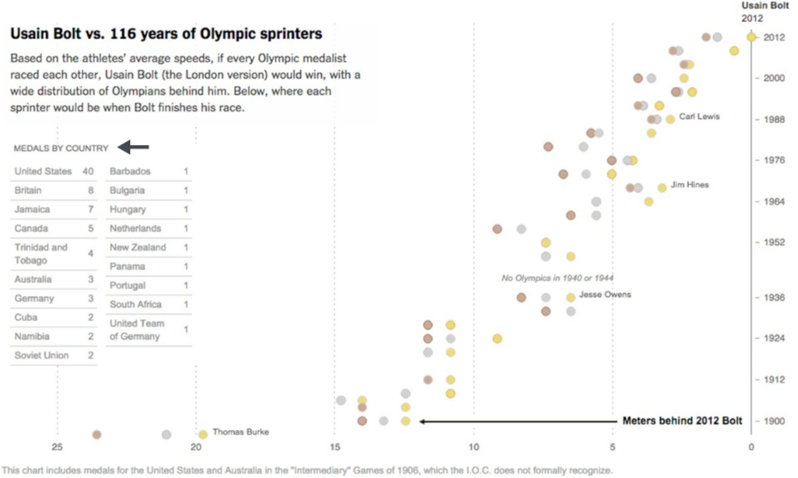{fig-align="center"}

::: notes
The NYT Usain Bolt chart from last week's decoding slide. Decode it once more, fast: marks are dots, one per medalist; x is metres behind 2012 Bolt, y is the Olympic year, colour is the medal. Ask: which channel carries the number you actually care about? Position. Which channel could you not read precisely? Colour. Today is about why that ranking exists.
:::
## Design Principles

- **Expressiveness**: A set of facts is expressible in a visual language if the sentences in the language express all the facts in the set of data, and only the facts in the data
- **Effectiveness**: A visualization is more effective than another visualization if the information conveyed by one visualization is more readily perceived than the information in the other visualization


::: footer
Mackinlay 86
:::

::: notes
Mackinlay 1986, the two criteria every encoding decision is judged by. Expressiveness is about the data: the picture must say everything the data says and nothing it does not. Effectiveness is about the viewer: given two expressive pictures, the better one is the one perceived faster or more accurately. Expressiveness is a logical property; effectiveness is a psychological one, and that is why we need perception.
:::
## Design Principles Translated 

- **Expressiveness**: Tell the truth and nothing but the truth (don't lie, and don't lie by omission)
- **Effectiveness**: Use encodings that people decode better (where better == faster and/or more accurate)

::: notes
Same two ideas in plain words. Tell the truth, the whole truth, nothing but the truth, and among truthful encodings pick the one people decode best. 'Better' means measurably faster or more accurate, which means we can run experiments, and people did.
:::
## Effectiveness measures

- **Accuracy**: Estimating magnitudes
- **Discriminability**: number of values one can distinguish
- **Saliency**: attracting attention
- **Separability**: interference between channels
- **Grouping**: pattern formation

::: notes
Five measurable properties of a visual channel. Accuracy: can I estimate a magnitude? Discriminability: how many levels can I tell apart? Saliency: does it grab attention? Separability: can I read it independently of another channel? Grouping: does it make things look like they belong together? The rest of the lecture goes through these more or less in order, after a detour through the hardware.
:::
## Perception for Design

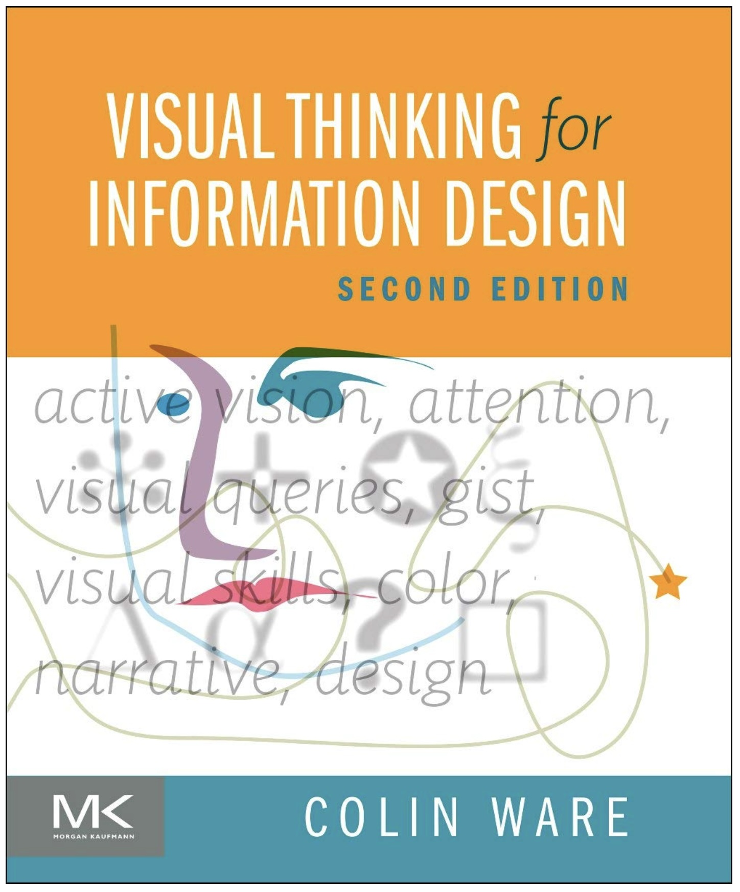{.nostretch width="35%" fig-align="center"}

::: notes
Colin Ware, Information Visualization: Perception for Design. The source for the next ten slides. Its thesis in one line: a visualization is an interface to the visual system, so design it for the visual system you actually have.
:::
## The Brain and Vision

**"Visual thinking consists of a series of acts of attention, driving eye movements, and tuning our pattern finding circuits" - Colin Ware**

{fig-align="center"}

::: footer
Image from Wikipedia: [Human brain](https://en.wikipedia.org/wiki/Human_brain)
:::

::: notes
Read the Ware quote slowly. Three verbs: attention, eye movements, pattern finding. The next twenty minutes is those three verbs in that order. Design is not about what is on the screen; it is about what the loop between eye and brain does with it.
:::
## The Visual Brain

{fig-align="center"}

::: footer
Image from Wikipedia: [Human brain](https://en.wikipedia.org/wiki/Human_brain)
:::

::: notes
Same idea with the visual areas lit up at the back of the brain. Roughly a third of cortex is doing vision. That is the resource we are designing for, and it is why a good chart feels effortless: it hands the work to hardware that was going to run anyway.
:::
## The Act of Perception

**Perception runs bottom-up and top-down at the same time**

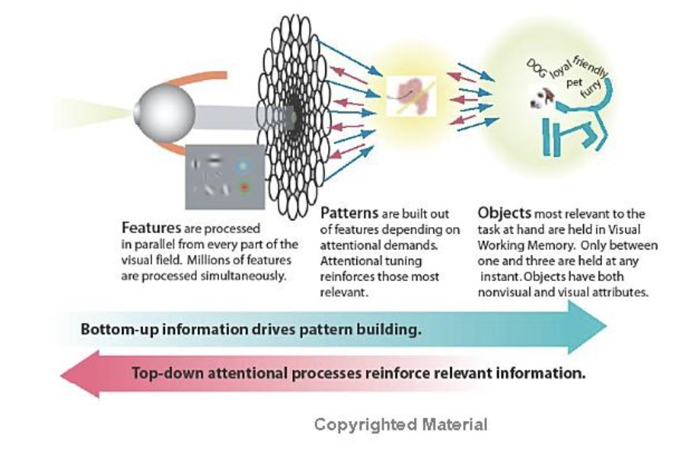{fig-align="center"}

::: footer
Material from Colin Ware's book
:::

::: notes
Ware's overview diagram. Read it left to right: eye, then features processed in parallel across the whole field, millions at once; then patterns built out of features under attentional demand; then one to three objects held in visual working memory. Two arrows underneath: bottom-up drives pattern building, top-down attention reinforces what is relevant. Every slide that follows is a zoom into one box of this picture.
:::
## Bottom-up Processing

:::: {.columns}
::: {.column width="40%"}
* Information is filtered into patterns through successive stages:
  1. Optic nerve to V1 cortex
  2. Texture and colour aggregate into *patterns*
  3. Objects assembled in *visual working memory*
* The face-vase: one input, two objects, never both at once
:::
::: {.column width="60%"}
{height="760" fig-align="center"}
:::
::::

::: footer
Image from "Eye and Brain: The Psychology of Seeing", Gregory
:::

::: notes
Bottom-up in three stages: optic nerve to V1; texture and colour aggregated into patterns; objects assembled in visual working memory. The face-vase (Rubin, via Gregory's Eye and Brain) is here because it shows stage three is not passive: the same input yields two objects and you cannot hold both at once. That is the one-to-three-object limit from the previous slide, felt.
:::
## Top-Down Processing

:::: {.columns}
::: {.column width="40%"}
* Every bottom-up stage has a matching top-down process
* Ware calls it "attention"
* We get the information we need, when we need it
* Circles are fixations, lines are saccades: most of the scene is never visited
:::
::: {.column width="60%"}
{width="100%" fig-align="center"}
:::
::::

::: footer
Material from Colin Ware's book
:::

::: notes
Top-down. This is an eye-tracking trace: circles are fixations, bigger means longer dwell, lines are saccades. Point out how little of the scene gets visited. We do not see the picture, we sample it, and attention decides the sampling. Ware's rule: we get the information we need, when we need it.
:::
## Implications for Design

:::: {.columns}
::: {.column width="40%"}
* "Just-in-time visual queries" (Ware)
* "The brain operates as a set of nested loops. Outer loops deal with generality while inner loops process detail." (Ware)
* Each saccade asks the display a question and expects the answer in one fixation
:::
::: {.column width="60%"}
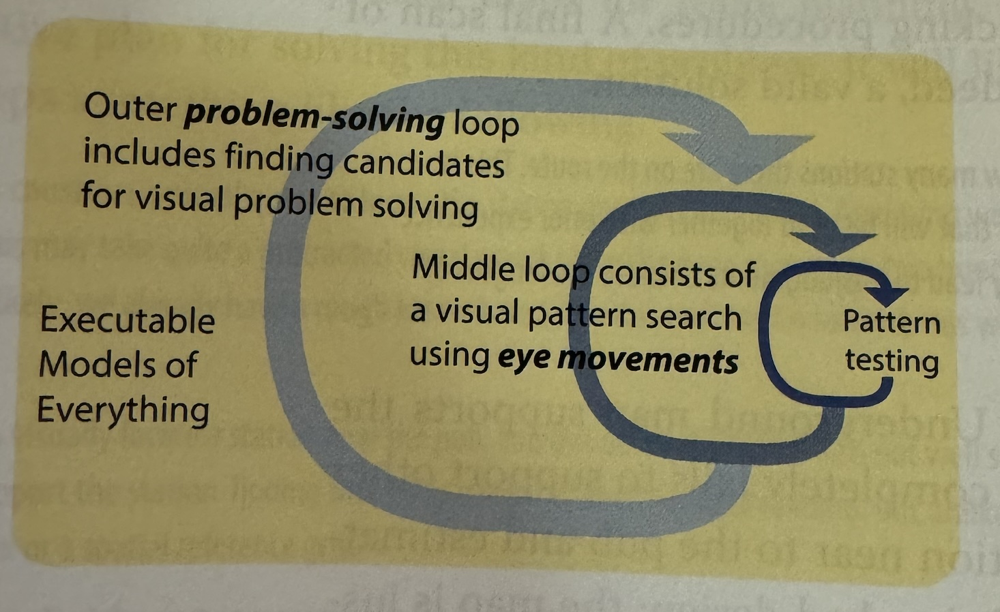{width="100%" fig-align="center"}
:::
::::

::: footer
Material from Colin Ware's book
:::

::: notes
Nested loops: an outer problem-solving loop, a middle loop of visual pattern search via eye movements, an inner loop of pattern testing. The design consequence is 'just-in-time visual queries': the viewer asks the display a question with each saccade and expects an answer in one fixation. A visualization is good to the extent that the answer to the likely next question is already sitting where the eye lands.
:::
## Low-Level Feature Analysis

**The visual cortex has specialized cells for edges, orientations and motion (Hubel & Wiesel, Nobel 1981)**

{fig-align="center"}

::: footer
Material from Colin Ware's book
:::

::: notes
Hubel and Wiesel, Nobel 1981. A fold of V1 with neurons that each respond to one simple feature: an orientation, a colour difference, a direction of motion. This is why orientation, colour and motion pop out later in the lecture: there is dedicated hardware for them, and nothing dedicated for, say, a junction between two lines.
:::
## What and Where Pathways

:::: {.columns}
::: {.column width="40%"}
* **What pathway**: Object identification
* **Where pathway**: Object location and eye movement
:::
::: {.column width="60%"}
{height="760" fig-align="center"}
:::
::::

::: footer
Material from Colin Ware's book
:::

::: notes
From V1 and V2 the signal splits. The what pathway, ventral, along the bottom, identifies objects. The where pathway, dorsal, along the top, handles location and drives eye movements. Layout is processed by a different system than identity, which is part of why position is such a strong channel.

They also run at different speeds. The where stream is fed by magnocellular cells: large, fast, transient, tuned to motion and luminance change, essentially colour-blind. The what stream is fed by slower parvocellular cells: sustained, high resolution, colour sensitive. Dorsal areas respond within roughly 20 ms of V1; ventral areas where identity lives some 40 to 50 ms later. You duck before you know what was thrown.

Two design consequences that come back today and next week: a flashing or moving element grabs attention before anyone knows what it is, and an alert that differs from its surroundings only in hue at equal luminance is invisible to the fast system.
:::
## Accuracy

**Psychophysics: vary a stimulus, ask how strong it feels (Fechner, 1860)**

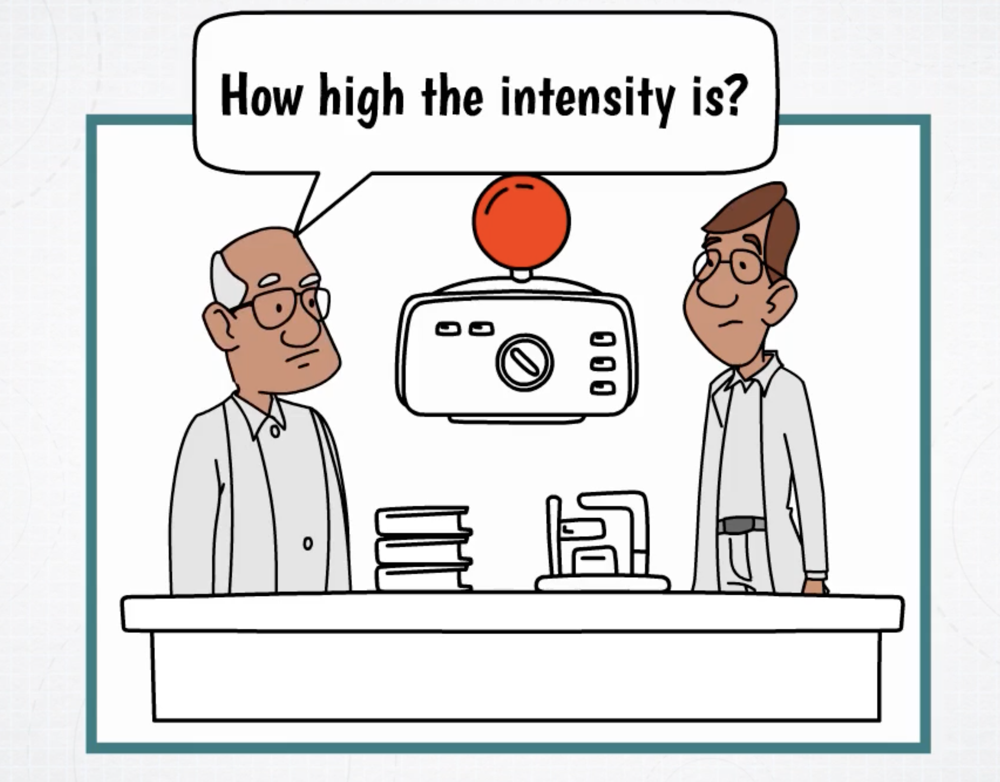{fig-align="center"}

::: notes
First channel property: accuracy. How faithfully does the channel carry a quantity? The cartoon is a psychophysics set-up, Fechner's programme from 1860: vary a physical intensity, ask the subject how strong it feels, and plot one against the other. The surprise is that the answer is not a straight line, and the shape differs by channel. Next slide.
:::
## Power Law

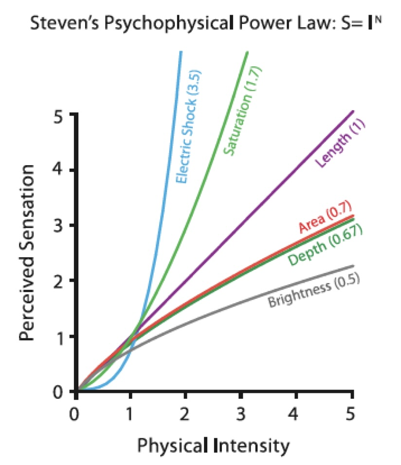{.nostretch width="40%" fig-align="center"}

::: notes
Stevens' power law: perceived sensation equals physical intensity raised to some exponent, one curve per channel. Length has exponent about 1.0, what you see is what is there. Area about 0.7 and depth about 0.67, systematically underestimated. Brightness 0.5, badly compressed. Saturation 1.7, exaggerated. Electric shock at 3.5 is on the chart for comedy but makes the point: exponents far from one mean the channel lies. Length is the only honest one here, which is the Cleveland and McGill result before Cleveland and McGill.
:::
## Graphical Perception

:::: {.columns}
::: {.column width="50%"}
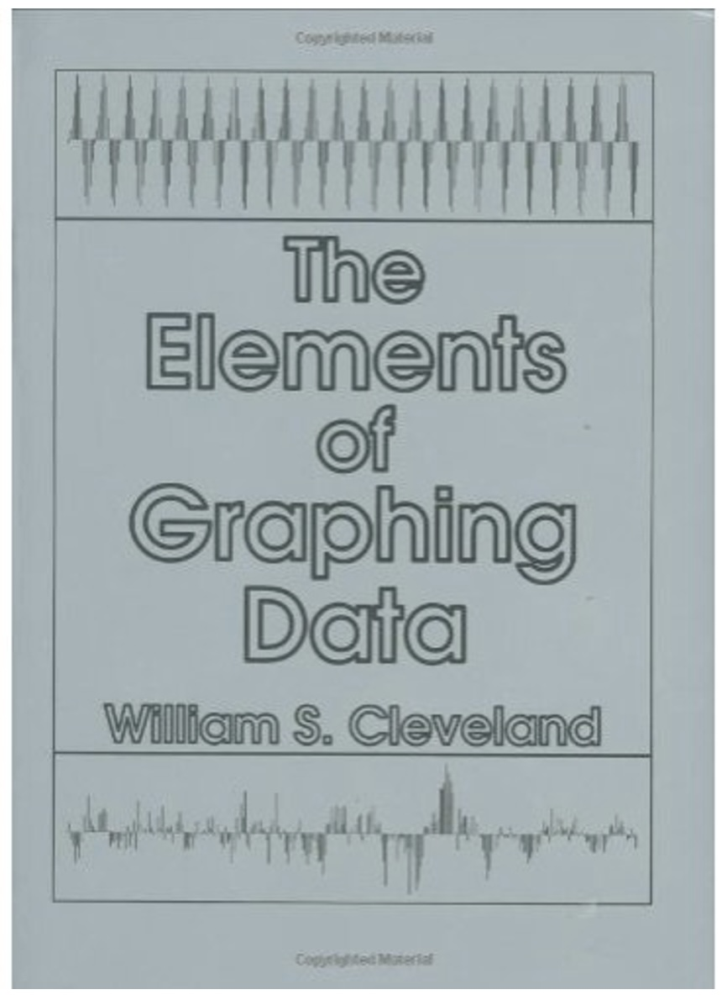{height="760" fig-align="center"}
:::
::: {.column width="50%"}
{height="760" fig-align="center"}
:::
::::

::: footer
Slides based on material from Prof. Enrico Bertini
:::

::: notes
Cleveland and McGill, 1984, JASA, plus Cleveland's book. The paper that turned 'which chart is better' from taste into measurement. Method: show people two marked values, ask for the ratio, measure the error. The next two slides are the experiment; the two after that are the follow-up and the modern replication.
:::
## Cleveland & McGill Experiment

**Task: judge what percentage the smaller marked value is of the larger**

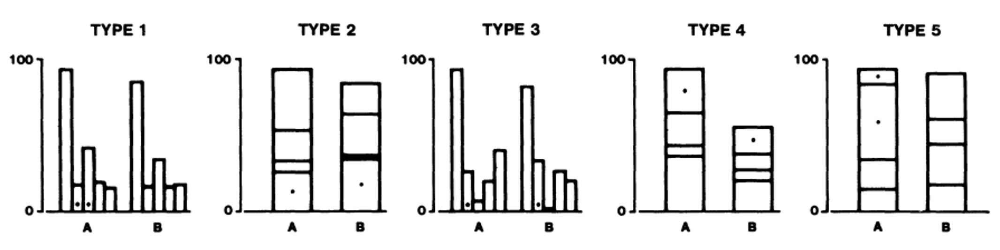{fig-align="center"}

::: footer
Slides based on material from Prof. Enrico Bertini
:::

::: notes
The five stimulus types. Types 1 to 3 are bar charts where A and B sit on a common baseline: position. Type 4 is a stacked bar where A and B are segments starting at different heights: length. Type 5 same, stacked differently. The dots mark the two values to compare.

What the subjects were actually asked, for every graph: first, which of the two marked values is the smaller; second, what percentage is the smaller of the larger. Ten graphs of each type, true ratios spread roughly from 18% to 83% so nobody can default to 'about half'. Error was scored as log base 2 of (|judged minus true| + 1/8).

Run it live: put Type 1 and Type 5 to the room using the experiment's own wording, 'what percentage is the smaller of the larger?'. Nobody hesitates on 1.
:::
## Cleveland & McGill Results

**Position > Length and Angle > Area**

{fig-align="center"}

::: footer
Slides based on material from Prof. Enrico Bertini
:::

::: notes
Read the axes first. Horizontal is log base 2 of absolute error averaged over all judgments of that type, so one unit to the right means the typical error doubled. Each row is a stimulus type; the dot is the mean, the bar a 95% confidence interval.

Error rises monotonically from Type 1 to Type 5, as predicted before the data came in. Types 1 to 3 are position judgments, Types 4 and 5 are length judgments, and the interval for Type 3 does not reach the interval for Type 4. That clean break between the clusters is the finding. Inside the clusters it is muddier, so do not oversell the fine ordering.

Second-order effects worth a sentence each: within position, adjacent bars (Type 1) beat bars in different groups (Type 3), so distance hurts even on a common scale; within length, the vertically offset Type 5 is worst of all.
:::
## Other Cleveland & McGill Experiment: Angle vs. Position

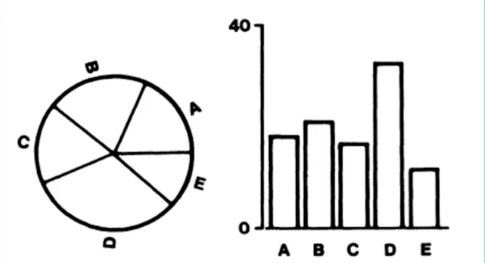{fig-align="center"}

::: footer
Cleveland & McGill 84
:::

::: notes
The companion experiment in the same paper: the same five values as a pie chart and as a bar chart, same ratio task. Ask the room to estimate C as a percentage of D on the pie, then on the bars. Angle judgments came out markedly worse than position judgments. This is the empirical basis for 'do not use pie charts when the comparison matters', and it is a bar chart with an axis versus a pie with none, so also note that the bar chart gives you a scale for free.
:::
## Replication: Heer & Bostock (2010)

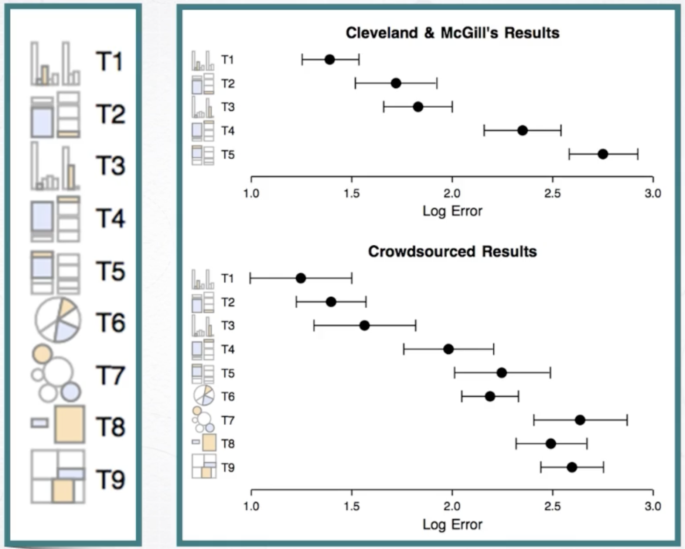{fig-align="center"}

::: footer
Top: Cleveland & McGill 84. Bottom: Heer & Bostock, *Crowdsourcing Graphical Perception*, CHI 2010.
:::

::: notes
Heer and Bostock, CHI 2010, replicated the whole study on Mechanical Turk with hundreds of participants instead of a few dozen. Top panel: Cleveland and McGill's original five types. Bottom: the crowdsourced results for the same five plus four more: T6 pie (angle), T7 bubbles (circular area), T8 rectangles of matched aspect (area), T9 treemap-style rectangles (area). Same ordering for T1 to T5, and the new area encodings land below length, exactly where the theory said they would. Two lessons: the 1984 result holds up, and crowdsourcing is a legitimate way to run graphical perception studies. This is why the ranking on the next slide can be stated with confidence.
:::
## Channel Effectiveness Ranking

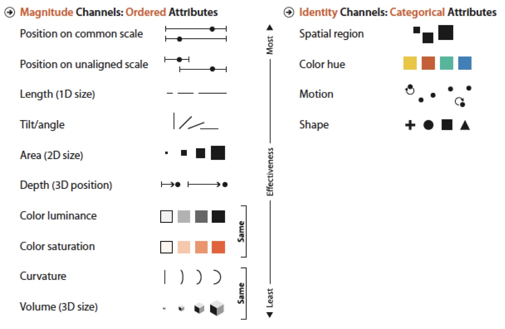{fig-align="center"}

::: notes
Munzner's channel ranking, Figure 5.6 in her book. Left column, ordered attributes, most to least effective: position on a common scale, position on an unaligned scale, length, tilt, area, depth, colour luminance and saturation, curvature and volume. Right column, categorical attributes: spatial region, hue, motion, shape. Two things to point out. The columns are different: hue is near the top for identity and near the bottom for magnitude. And the 'Same' brackets pair channels that are equally weak. This figure is the answer key for the encoding decisions they will make for the rest of the semester.
:::
## Accuracy Guidelines

* **Prioritize high-rank channels** (with reason)
* **Do not expect precise judgments** from low-rank channels
* Position > Length > Angle > Area > Volume > Color

**Application**:

- Use position for most important comparisons
- Use color for categorical distinctions
- Avoid 3D for quantitative data

::: footer
Slides based on material from Prof. Enrico Bertini
:::

::: notes
The takeaway, in order: position beats length and angle, which beat area, which beats volume and colour. Use the high-rank channels for the quantity you most need read correctly. Do not expect precision from the low-rank ones: if the number matters, do not put it in a colour. The 'with reason' on the first bullet matters: sometimes the most important comparison is categorical, and then hue is the right choice.
:::
## Relative vs. Absolute Judgments

**Humans are better at relative comparisons than absolute judgments**

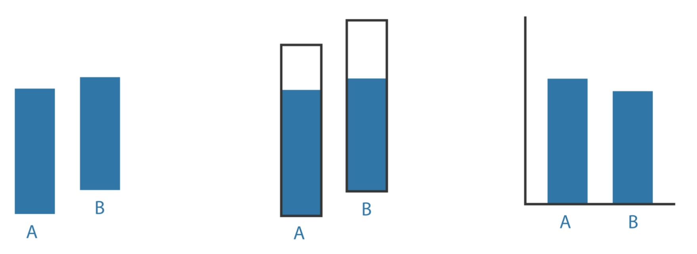{fig-align="center"}

::: notes
Three renderings of the same A and B. Left: bars floating with no common baseline, so you compare lengths, badly. Middle: each bar inside its own frame, so you read a fill fraction relative to the frame, which is a different question. Right: common baseline, position, and the answer is instant. This is Cleveland and McGill Types 1 versus 4 as a design choice: same data, three different questions answered, only one of them the one you asked.
:::
## Discriminability

:::: {.columns}
::: {.column width="40%"}
- **Discriminability**: How many values can be distinguished within a channel
- It depends on:
  - Channel properties
  - Spatial arrangement
  - **Size**
  - Cardinality
:::
::: {.column width="60%"}
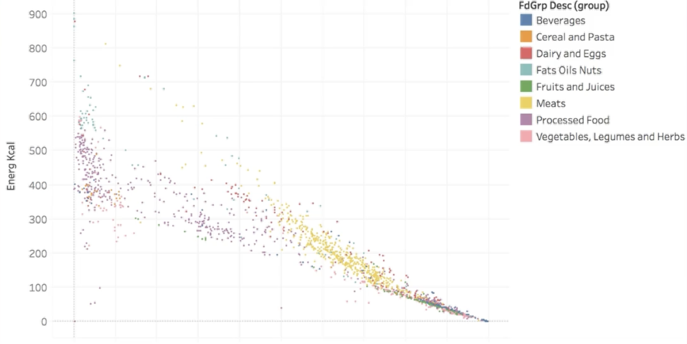{width="72%" fig-align="center"}

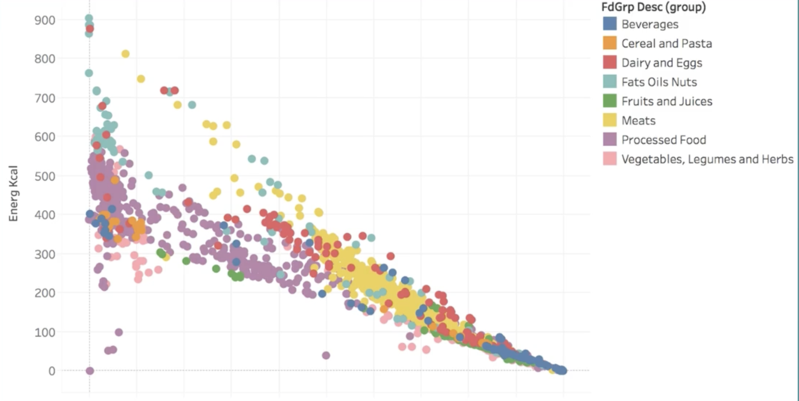{width="72%" fig-align="center"}
:::
::::

::: notes
Second property: discriminability, how many distinct levels a channel can carry. Two scatterplots of the same food data, energy versus water content, coloured by food group. Top: tiny dots. Bottom: large dots. Same eight hues, but on the tiny dots you can barely tell two of them apart, so the effective cardinality of the colour channel collapsed with mark size. Size is a property of the mark, but it changes what every other channel on that mark can carry.
:::
## Discriminability

:::: {.columns}
::: {.column width="40%"}
- **Discriminability**: How many values can be distinguished within a channel
- It depends on:
  - Channel properties
  - Spatial arrangement
  - Size
  - **Cardinality**
:::
::: {.column width="60%"}
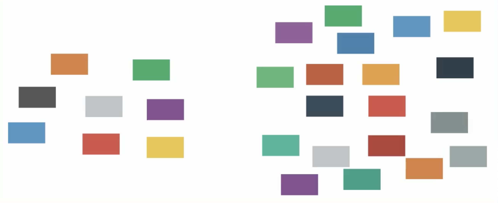{width="100%"}
:::
::::

::: notes
Cardinality of the encoding itself. Left: nine coloured rectangles, all distinguishable. Right: about two dozen, and several pairs are effectively the same colour: two greens, two greys, two blues, two reds. Ask them to find the two greens and say which is which. Hue does not scale; there are only so many nameable colours.
:::
## Discriminability

How many distinct values can be distinguished within a channel?

Depends on:

- Channel properties
- Spatial arrangement
- Size (resolution)
- Cardinality

**Practical limits**:

- Line width: ~3 levels
- Color hues: 5-6 maximum
- Symbol shapes: 5-6 maximum

::: footer
Material from [STAT4580](https://homepage.divms.uiowa.edu/~luke/classes/STAT4580/percep.html#discriminability)
:::

::: notes
Numbers to remember: line width, about three levels. Hue, five or six. Shape, five or six. If your attribute has twelve categories and your channel carries six, the channel is not going to expand; you have to aggregate the categories. Say this now because every student will try twelve hues at some point this semester. STAT4580 at Iowa has a good write-up, linked in the footer.
:::
## Discriminability Guidelines

**Do not overestimate the number of values viewers can discriminate**

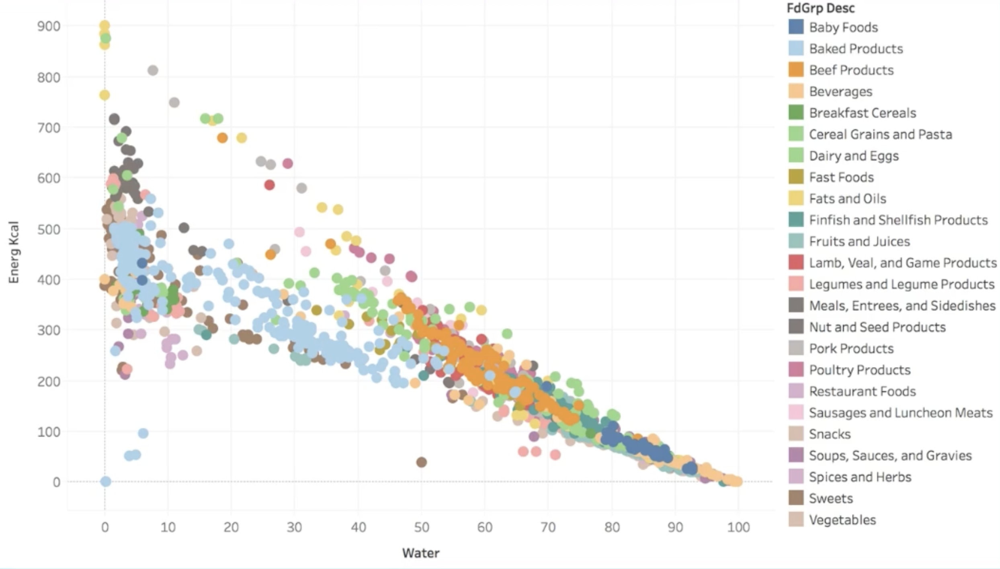{fig-align="center"}

::: notes
The failure case: the USDA food dataset, energy versus water, with all 25 food groups in the legend. Ask: which colour is Pork Products? Which is Snacks? Nobody can do it, and the legend has to be scanned serially. Twenty-five hues is not an encoding, it is a lookup table. The next three slides are the three ways out.
:::
## Strategies to overcome this problem

- How do we solve the problem of encoding a categorial attribute with high cardinality?
  - Grouping
  - Filtering
  - Faceting

::: notes
Three strategies for a categorical attribute with too many levels. Group: merge categories into fewer, semantically meaningful ones. Filter: show only the categories the question is about. Facet: move the category from colour to position, one panel per level. Each of the next three slides is the same food scatter under one of the three.
:::
## Grouping

**Grouping: merge categories semantically to reduce the number of classes to distinguish**

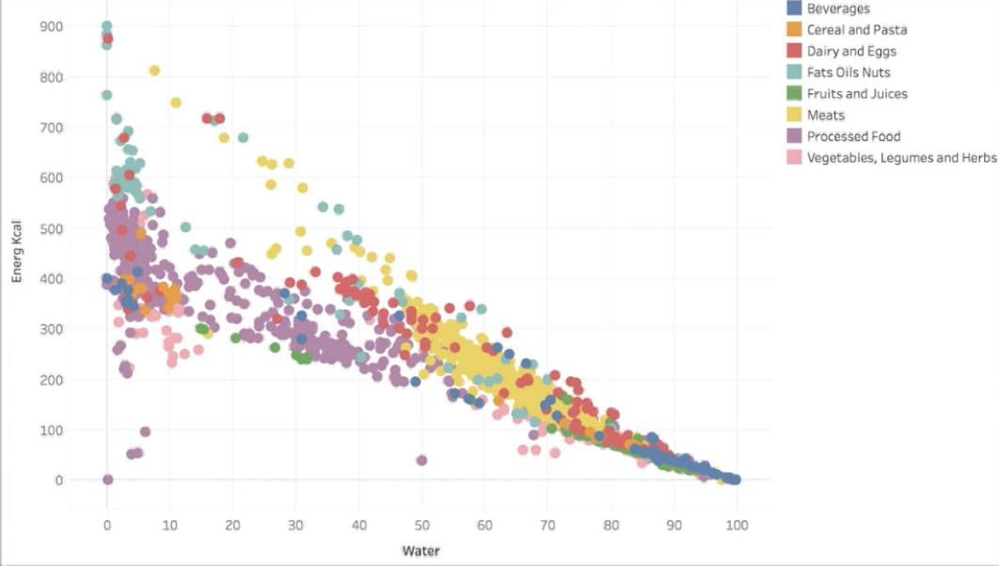{fig-align="center"}

::: notes
The 25 food groups collapsed into eight: beverages, cereal and pasta, dairy and eggs, fats oils nuts, fruits and juices, meats, processed food, vegetables legumes and herbs. Eight hues is at the limit but readable. Point out that the grouping is a modelling decision, not a visual one; the designer decided that baked products and snacks are both 'processed food'. That decision should be visible to the reader.
:::
## Filtering

**Filtering: keep only the classes the question is about**

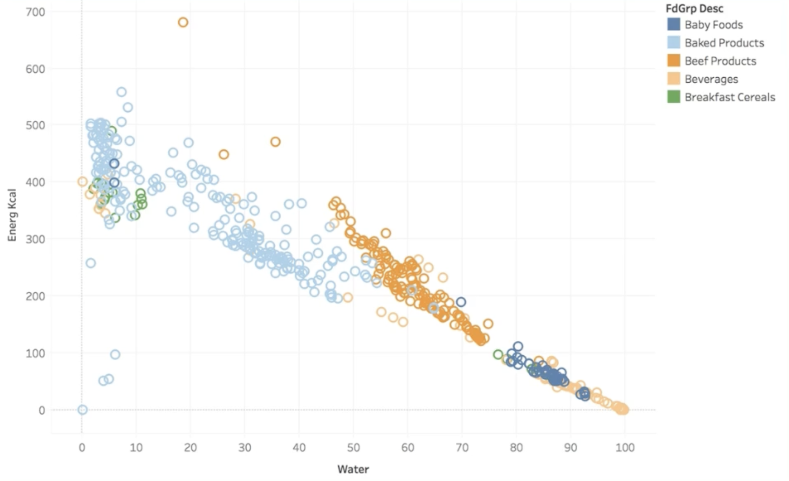{fig-align="center"}

::: notes
Filtering: only five groups kept, the rest dropped. Now the colours are trivially distinguishable and the structure inside each group is visible, for example the two beef clusters. The cost is on the slide: everything else is gone, and the reader has to trust that the missing groups did not matter for the question.
:::
## Faceting

**Faceting: move the category from colour to position, one panel per class**

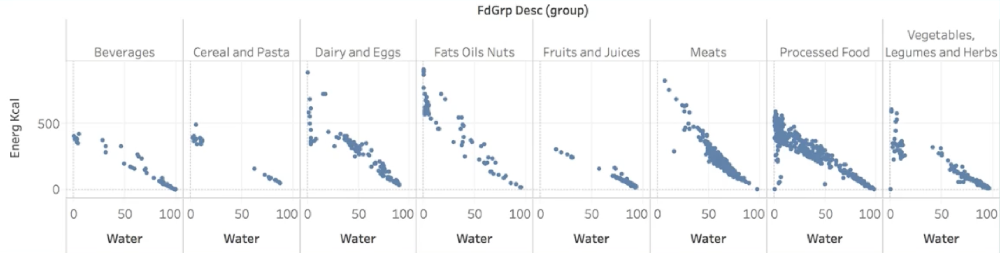{fig-align="center"}

::: notes
Faceting: the eight groups as eight small multiples with shared axes. Colour is no longer needed at all, the category is encoded in position, the highest-rank channel. You lose direct overlay comparison but gain the ability to see each group's shape, for example that fats have a completely different profile from beverages. This is the strategy that scales best.
:::
## Pre-attentive Processing: Popout

:::: {.columns}
::: {.column width="50%"}
{height="760" fig-align="center"}
:::
::: {.column width="50%"}
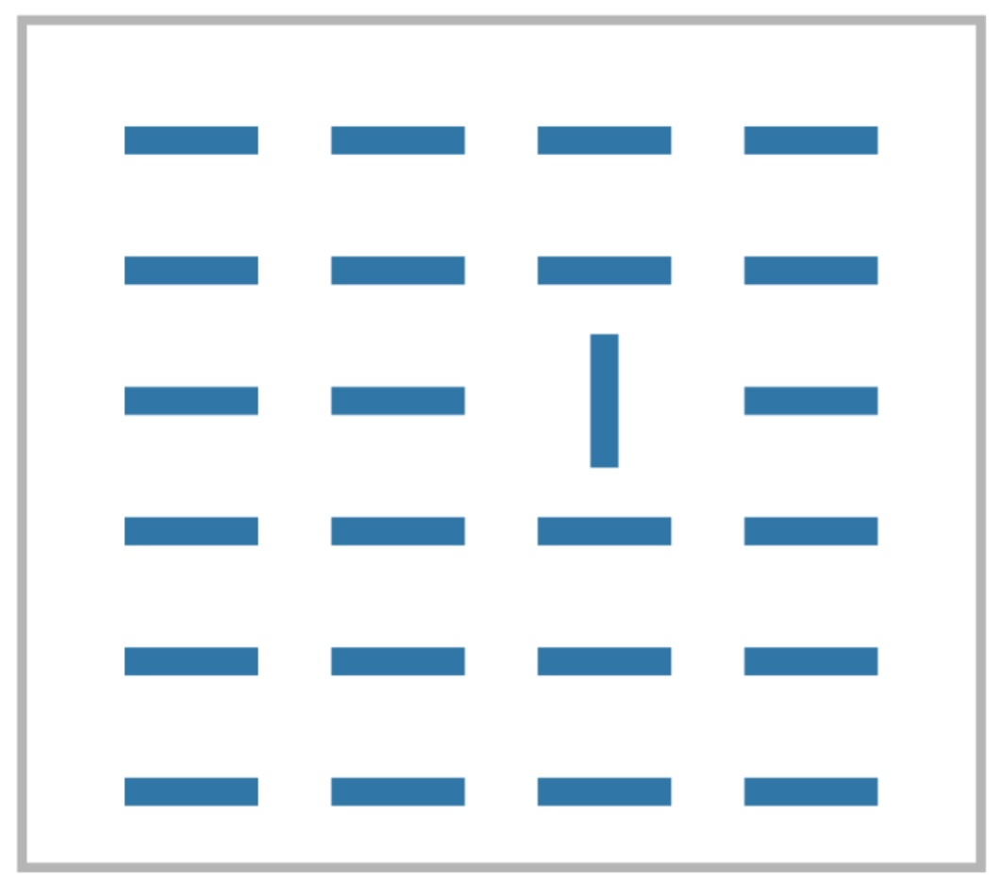{height="760" fig-align="center"}
:::
::::

**For some features, search time does not depend on the number of distractors (Treisman)**

::: footer
Material from Colin Ware's book
:::

::: notes
Third property: saliency, or pop-out. Anne Treisman's feature-integration work. Left: one red dot among blue, a hue difference. Right: one vertical bar among horizontals, an orientation difference. The finding is on the slide: for these targets, search time does not grow with the number of distractors. That flat line is the operational definition of pre-attentive. Ask them how long the red dot took. It did not take any time. That is the point.
:::
## Pre-attentive Processing: Popout

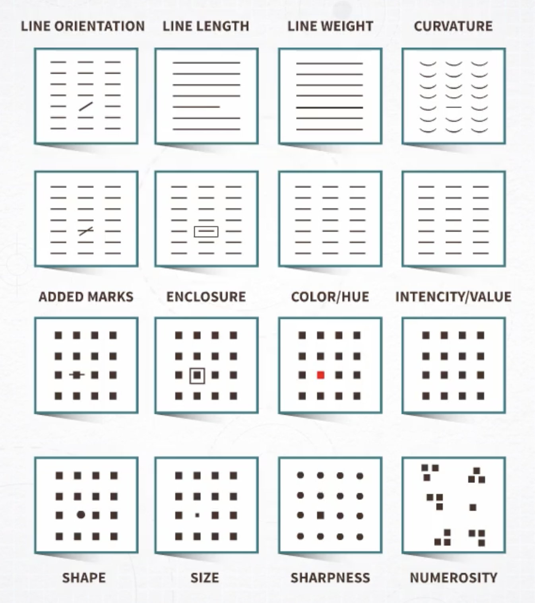{.nostretch width="40%" fig-align="center"}


::: footer
Material from Enrico Bertini
:::

::: notes
A catalogue of features that pop out, sixteen panels: line orientation, length, weight, curvature, added marks, enclosure, hue, intensity, shape, size, sharpness (blur), numerosity. Each panel has one odd element and it is found instantly. Enrico Bertini runs a short video experiment here where a target flashes for a fraction of a second; if you have the clip, play it now, otherwise pick two or three panels and have the room point. The design message: these are the channels you can use to make one thing findable among many.
:::
## Pre-attentive vs. Attentive

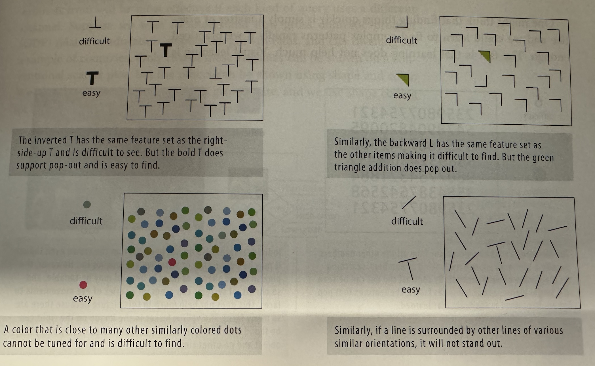{fig-align="center"}

::: footer
Material from Colin Ware's book
:::

::: notes
Ware's two-by-two. Top left: an inverted T among Ts is hard, a bold T is easy, same feature set versus a new one. Top right: a backward L is hard, a green triangle is easy. Bottom left: a dot whose colour is close to its neighbours cannot be tuned for; a red one can. Bottom right: a line among lines of similar orientation does not stand out. The pattern in all four: pop-out needs a feature the distractors do not share, not merely a different arrangement of the same features.
:::
## Attentive

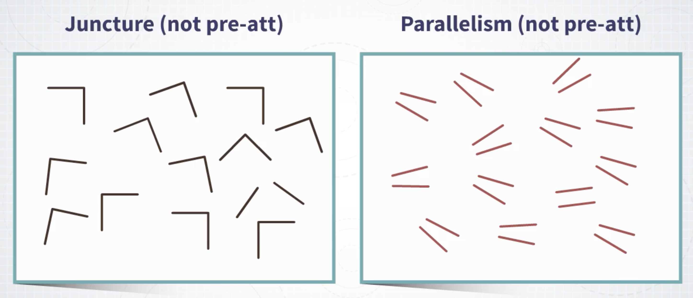{fig-align="center"}

::: footer
Material from Enrico Bertini
:::

::: notes
Two things that do not pop out. Left: juncture, the one L among corners of other shapes. Right: parallelism, the one pair of parallel lines among near-parallel pairs. Both are relations between features rather than features. No V1 neuron fires for 'these two lines are parallel', so it takes a serial search. Ask the room to find the parallel pair and watch their eyes move.
:::
## Serial search

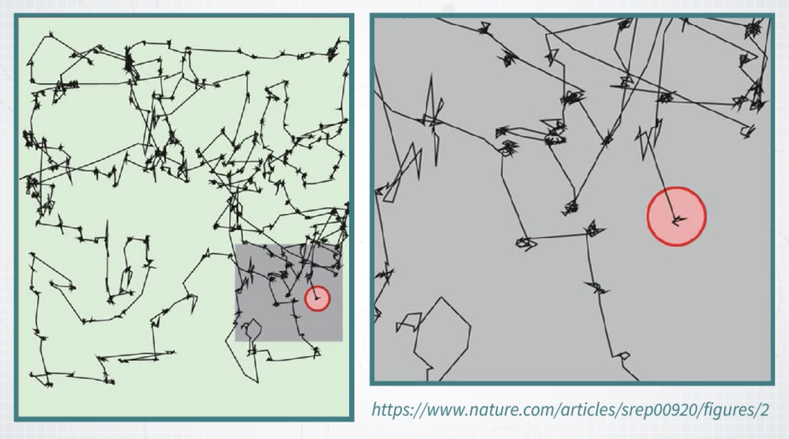{fig-align="center"}


::: footer
Material from Enrico Bertini
:::

::: notes
What serial search looks like: an eye-tracking scan path over a search display, from a Scientific Reports paper on visual search. Left: the whole trace, a random-walk-like path covering the display until the target (red circle) is found. Right: the zoomed corner. Every fixation costs a few hundred milliseconds. If your visualization requires this to find the interesting value, the viewer is doing the computation you should have done.
:::
## Multiple Channels Usually Not Pre-attentive

:::: {.columns}
::: {.column width="40%"}
* Red squares, blue circles, and one red circle
* Each feature alone pops out; the **conjunction** does not
* Encode the target in a single channel, not the intersection of two
:::
::: {.column width="60%"}
{height="760" fig-align="center"}
:::
::::

::: footer
Slides based on material from Prof. Enrico Bertini
:::

::: notes
Conjunction search. Red squares and blue circles, and one red circle. Each feature alone pops out; the combination does not, you have to scan. The design rule that falls straight out of this: encode the thing you want found in a single channel, not in the intersection of two.
:::
## Application to visualization design

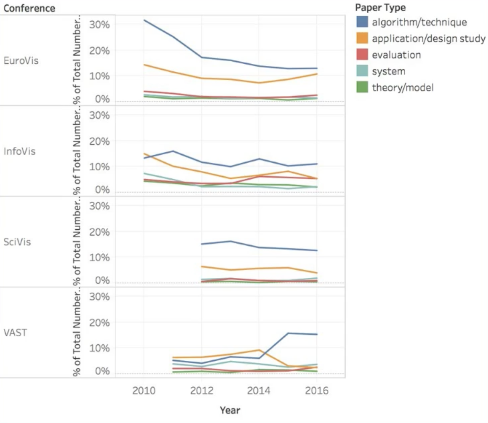{.nostretch width="50%" fig-align="center"}

::: notes
Saliency applied. Four conferences, five paper types, default categorical palette. Everything is equally loud, so nothing stands out. Ask: what is the story? Nobody knows, because the chart does not choose one.
:::
## Application to visualization design

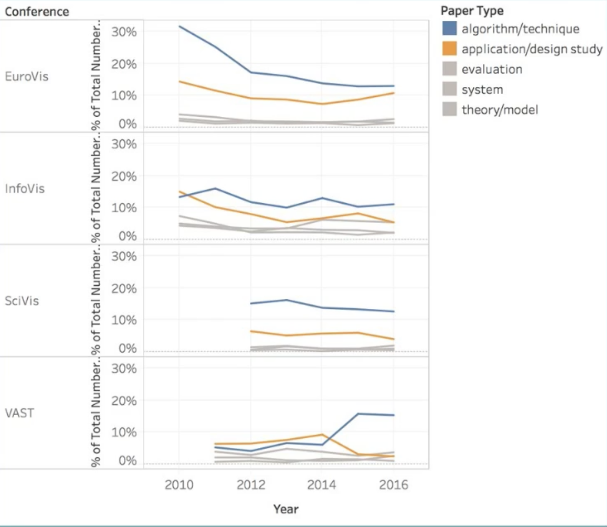{.nostretch width="50%" fig-align="center"}

::: notes
Same chart, three of the five paper types greyed out. Now the picture asks one question: how are algorithm papers and application papers trending relative to each other at each venue? The answer is readable in one fixation, VAST's crossover in 2015 especially. Nothing was removed, only de-emphasized. This is pop-out used as an authorial choice, and it is the single cheapest improvement most student charts can make.
:::
## Pre-attentive Processing

:::: {.columns}
::: {.column width="40%"}
* Tasks performed in less than 200-250 milliseconds
* Faster than eye movement initiation
* Suggests processing by the parallel low-level visual system
* Same display as before: pop-out does not habituate
:::
::: {.column width="60%"}
{height="760" fig-align="center"}
:::
::::

::: footer
Slides based on material from Prof. Enrico Bertini
:::

::: notes
Bertini's framing of the same phenomenon from the timing side. Under 200 to 250 milliseconds, faster than an eye movement can start, so it must be the parallel low-level system: the V1 hardware from earlier. Same red-dot display as before, on purpose. If it is still instant the second time, that tells you pop-out does not habituate. It is not attention, it is architecture.
:::
## Grouping: The Gestalt Principles

[Interactive demo](https://www.interaction-design.org/literature/topics/gestalt-principles)

* Visualization is a two-way street:
  - We (the vis designer) bring something to the table
  - The human (end user) brings their prior experience
* Design should take prior experience into account
* What is prior experience? **Gestalt laws**

::: footer
Material from Matt Berger
:::

::: notes
Fifth property: grouping. Transition from hardware to habits. The viewer brings prior experience, and the Gestalt laws are the parts of that experience we can rely on because everyone has them. Five coming up: closure, similarity, proximity, enclosure, connection. The link goes to the Interaction Design Foundation's Gestalt page, which has an embedded video plus a written explainer; it needs the network.
:::
## Gestalt: Closure

:::: {.columns}
::: {.column width="40%"}
* We complete incomplete shapes: there is no triangle here
* **Implications:**
  - Visualizations can mislead unintentionally
  - Sparse marks can be enough to convey a trend
:::
::: {.column width="60%"}
{height="760" fig-align="center"}
:::
::::

::: footer
Material from Matt Berger
:::

::: notes
The Kanizsa triangle. There is no white triangle on this slide, three pac-men and three angles, and the brain draws the rest. Two consequences, both on the slide: you can mislead by accident because viewers will close shapes you did not intend; and you can be sparse on purpose, a dot plot works because closure connects the dots for you.
:::
## Gestalt: Similarity

:::: {.columns}
::: {.column width="50%"}
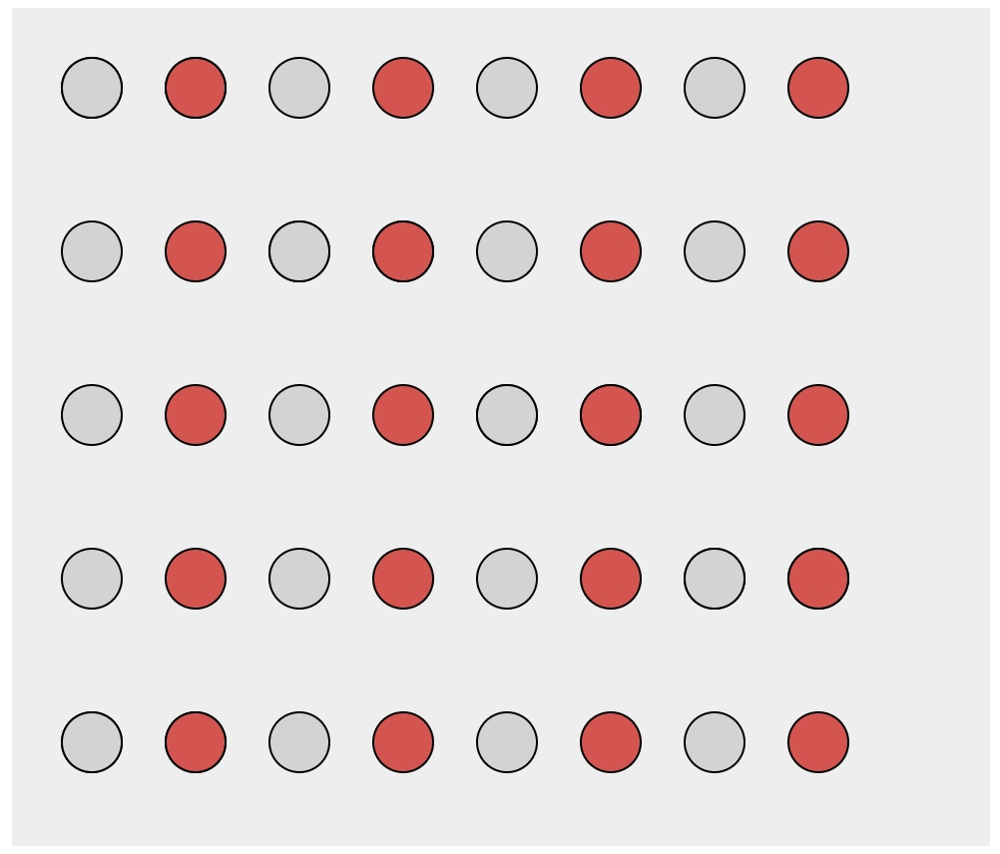{height="700" fig-align="center"}
:::
::: {.column width="50%"}
{width="100%"}
:::
::::

**Elements with the same visual properties are perceived as grouped**

::: footer
Material from Matt Berger and Enrico Bertini
:::

::: notes
Left: same colour, same shape, same size means same group. It is that simple and that unavoidable; similarity is not something you switch on, it is something you fail to switch off. Right: here it is doing damage. A bar chart of paper types where Null and application/design study share the same orange while algorithm/technique is blue. Whether or not anyone intended it, the eye groups Null with application. Ask: what does this chart claim? Then: did the author mean to claim it? Colour assignment is a claim.
:::
## Gestalt: Proximity

:::: {.columns}
::: {.column width="50%"}
{height="700" fig-align="center"}
:::
::: {.column width="50%"}
{width="100%"}
:::
::::

**Elements that are spatially close are perceived as grouped**

::: footer
Material from Matt Berger and Enrico Bertini
:::

::: notes
Left: things close together are a group, the pure case. Right: a real scatterplot, energy versus water content of foods, with a loop drawn around the dense cluster near zero water. The loop was drawn afterward; the cluster was visible before it. That is proximity working for you: clustering is a perceptual freebie. Note the loop itself is enclosure, next slide.
:::
## Gestalt: Enclosure

:::: {.columns}
::: {.column width="50%"}
{height="700" fig-align="center"}
:::
::: {.column width="50%"}
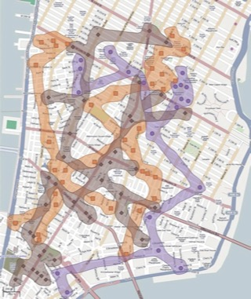{height="620" fig-align="center"}

[Bubblesets video](https://www.youtube.com/watch?v=P6CgBmIiXaE)
:::
::::

**Explicit visual encoding of enclosure depicts grouping**

::: footer
Material from Matt Berger and Enrico Bertini
:::

::: notes
Left: two boxes. Inside each box the dots are a grid of grey and red, and the red columns line up across the boxes, but the boxes win. Enclosure overrides both proximity and similarity. It is the strongest grouping cue on this list, which is exactly why you should spend it carefully. Right: Bubble Sets on a map of Manhattan, coloured blobs wrapping sets of points that share membership even when they are spatially interleaved. The video link shows them recomputed live. The image is a small file and looks soft at this size; the video is sharper if the network is up.
:::
## Gestalt: Connection

:::: {.columns}
::: {.column width="50%"}
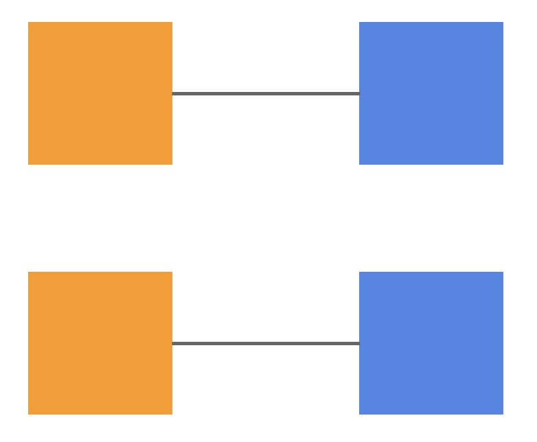{height="640" fig-align="center"}
:::
::: {.column width="50%"}
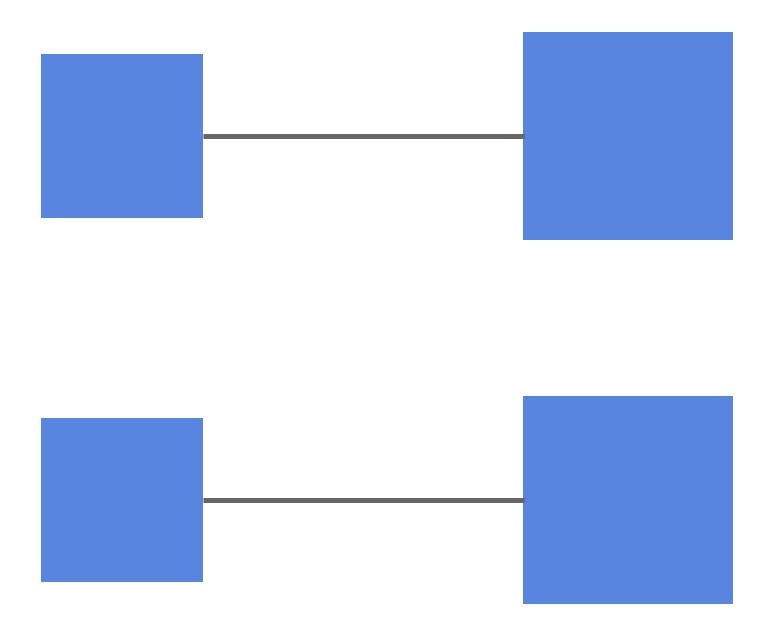{height="640" fig-align="center"}
:::
::::

**Objects connected together are perceived as a group**

::: footer
Material from Enrico Bertini
:::

::: notes
Left: a line between two objects makes them a group, the bare principle. Right: two squares of very different size, connected. The line beats the size difference; you read a pair, not a big one and a small one. Connection overrides similarity of size.
:::
## Connection Examples

:::: {.columns}
::: {.column width="50%"}
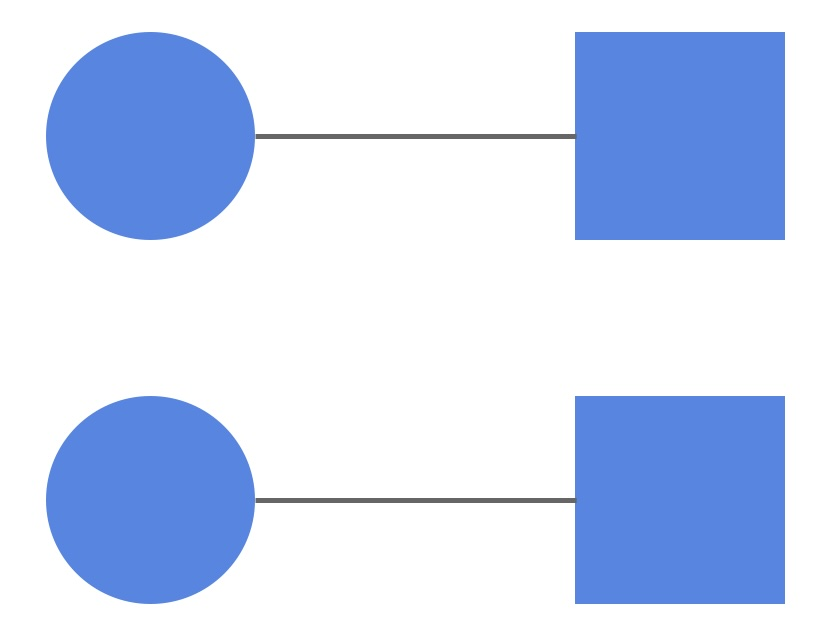{height="640" fig-align="center"}
:::
::: {.column width="50%"}
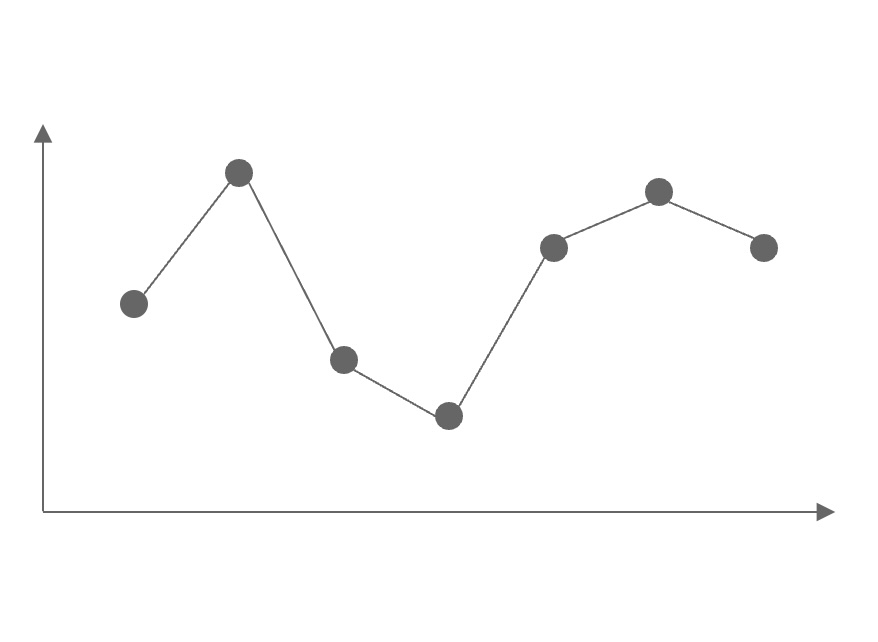{height="640" fig-align="center"}
:::
::::

::: footer
Material from Enrico Bertini
:::

::: notes
Left: a circle connected to a square. Connection beats shape similarity too. In the ranking of grouping cues, connection sits above similarity and proximity and below only enclosure. Right: this is why a line chart works at all. Seven dots with lines between them are read as one thing with a shape, a trend, rather than seven values. Remove the lines and you have a dot plot, read as individual values. Same data, different Gestalt, different question answered.
:::
## Just Noticeable Difference (JND)

:::: {.columns}
::: {.column width="40%"}
* The amount something must change to be noticed at least 50% of the time
* Weber's law: the JND is a constant fraction of the stimulus
* Stevens's power law is the cumulative version ([Wikipedia](https://en.wikipedia.org/wiki/Stevens%27s_power_law))
* A difference below the JND is not encoded, whatever the data says
:::
::: {.column width="60%"}
{height="760" fig-align="center"}
:::
::::

::: footer
Wikipedia: [Just-noticeable difference](https://en.wikipedia.org/wiki/Just-noticeable_difference)
:::

::: notes
JND: the smallest change detectable half the time. Strictly this is Weber's law territory, the JND is a constant fraction of the stimulus, and Stevens' power law is the cumulative version of it, which is why the same figure from the Power Law slide is here. The point for design: a difference below the JND of a channel is not encoded, no matter what the data says. A 2% difference in bar length is visible; a 2% difference in colour saturation is not.
:::
## Channel Separability

:::: {.columns}
::: {.column width="40%"}
* Amount of interference between channels
* Colour and shape are **separable**: attend to one, ignore the other
* Width and height of a rectangle are **integral**: they fuse into size and shape
* Separable channels can carry two variables; integral ones cannot
:::
::: {.column width="60%"}
{height="760" fig-align="center"}
:::
::::

::: footer
Slides based on material from Prof. Enrico Bertini
:::

::: notes
Fourth property: separability. Yellow and black, circles and triangles. You can attend to colour and ignore shape, or attend to shape and ignore colour; these two channels are separable. Not all pairs are: width and height of a rectangle fuse into 'size and shape' and cannot be read independently; red and green components of a colour fuse into one hue. Separable channels can encode two variables; integral ones cannot. This closes the perception half.
:::
## Introduction to D3.js

:::: {.columns .smaller}
::: {.column width="50%"}
### What is D3?

* **D**ata-**D**riven **D**ocuments
* JavaScript library for manipulating documents based on data
* Created by Mike Bostock (Observable, NYTimes)
* Low-level but powerful approach to visualization
:::
::: {.column width="50%"}
### Key Concepts:
- Bind data to DOM elements
- Use data to drive visual properties
- Declarative approach to visualization
:::
::::

::: notes
Switch gears. D3, Data-Driven Documents, Mike Bostock, 2011, out of the Stanford Vis Group's Protovis. The one idea to take away: D3 does not draw charts. It binds data to elements of the document and lets you set any property of those elements from the data. That is lower level than every charting library they have used, which is the cost, and it means anything they can draw in SVG they can drive from data, which is the payoff.
:::
## D3 Core Concepts

### Selections
```javascript
d3.select("body")      // Select single element
d3.selectAll("circle") // Select all circles
```

### Data Binding
```javascript
circles.data(dataset)  // Bind data to elements
```

### Enter, Update, Exit Pattern
```javascript
// Enter: Create new elements for new data
// Update: Update existing elements
// Exit: Remove elements with no data
```

::: notes
Three mechanisms. Selections: a jQuery-like way of grabbing DOM elements. Data binding: attach an array to a selection, one datum per element. The enter/update/exit pattern: what to do for data with no element yet, for existing pairs, and for elements with no data left. In modern D3 (v6 and later) selection.join() handles all three in one call; the lab will use join, but they should know the three cases exist because every D3 example on the web older than 2020 spells them out.
:::
## D3 Scales

Transform data values to visual values

```javascript
// Linear scale for continuous data
const xScale = d3.scaleLinear()
  .domain([0, 100])    // Data space
  .range([0, width]);  // Visual space

// Ordinal scale for categories
const colorScale = d3.scaleOrdinal()
  .domain(["A", "B", "C"])
  .range(["red", "green", "blue"]);
```

::: notes
Scales are the bridge between the two halves of today. A scale is a function from data space to visual space: domain in, range out. Linear for continuous quantities, band for categories on an axis, ordinal for categories to colours, and next week, colour scales specifically. Every encoding decision from the perception half becomes a choice of which scale maps which attribute to which channel.
:::
## Simple D3 Bar Chart: Setup

```javascript
// Set dimensions
const width = 500, height = 300;
const margin = {top: 20, right: 20, bottom: 30, left: 40};

// Create SVG
const svg = d3.select("body").append("svg")
  .attr("width", width)
  .attr("height", height);

// Create scales
const x = d3.scaleBand()
  .range([margin.left, width - margin.right])
  .padding(0.1);

const y = d3.scaleLinear()
  .range([height - margin.bottom, margin.top]);
```

::: notes
First half of a complete bar chart. Dimensions and margins, the SVG element appended to the page, and two scales with ranges set now and domains set once the data arrives. Point out that x is a band scale (categories) and y is linear (quantity), and that y's range is inverted because SVG y grows downward. Note margin.left of 40 is for the axis, which this snippet does not draw; the lab adds axes.
:::
## Simple D3 Bar Chart: Data and Bars

```javascript
// Load and visualize data
d3.csv("data.csv").then(data => {
  // Set domains
  x.domain(data.map(d => d.category));
  y.domain([0, d3.max(data, d => +d.value)]);

  // Create bars
  svg.selectAll(".bar")
    .data(data)
    .enter().append("rect")
    .attr("class", "bar")
    .attr("x", d => x(d.category))
    .attr("width", x.bandwidth())
    .attr("y", d => y(d.value))
    .attr("height", d => height - margin.bottom - y(d.value));
});
```

::: notes
Second half. d3.csv returns a promise; inside it, set the domains from the data, then the data join: selectAll rects that do not exist yet, bind data, enter, append one rect per row. Each attr is a function of the datum. The height expression is the classic first D3 confusion: height equals baseline minus y(value), because y(value) is the top of the bar in screen coordinates. This exact chart is what they build in the lab today; walk through it slowly.
:::
## D3 vs. Vega-Lite

:::: {.columns}
::: {.column width="50%"}
### D3.js
- **Imperative**: How to create
- Low-level control
- Full flexibility
- Steep learning curve
- ~100 lines for bar chart
:::
::: {.column width="50%"}
### Vega-Lite
- **Declarative**: What to create
- High-level abstraction
- Quick prototyping
- Limited customization
- ~10 lines for bar chart
:::
::::

**When to use which?**

- **Vega-Lite**: Exploration, standard charts
- **D3**: Custom visualizations, interactions

::: notes
Why both. Vega-Lite (and Altair, which they know) is declarative: say what the encoding is and the grammar renders it. Ten lines for a bar chart, and the grammar enforces most of what we said today. D3 is imperative: say how to build it, a hundred lines, complete freedom, including the freedom to violate every perception rule. Use Vega-Lite to explore and for anything standard; use D3 when the chart does not exist yet or when interaction is the point. The course teaches D3 because the group projects will need things no grammar provides.
:::
## Perception Principles in Practice

:::: {.columns .smaller}
::: {.column width="50%"}
### Design Guidelines:
1. **Use position** for primary comparisons
2. **Limit color categories** to 5-6
3. **Leverage pre-attentive features** for highlighting
4. **Apply Gestalt principles** for grouping
5. **Consider colorblindness** (~8% of males)
:::
::: {.column width="50%"}
### Common Mistakes:
- Too many colors in categorical data
- 3D charts for 2D data
- Relying on area/volume for precise values
- Ignoring perceptual limits
:::
::::

::: notes
The perception half as a checklist they can apply to their own work. Each guideline maps to a slide: position (Cleveland and McGill), colour limits (discriminability), pre-attentive features (pop-out), Gestalt (grouping), colourblindness (about 8% of men, 0.5% of women, next week's topic). The common mistakes list is what the graders will actually see in Exercise 4.
:::
## Lab Preview: Your First D3 Visualization

:::: {.columns .smaller}
::: {.column width="50%"}
### Today's Lab Activities:
1. Set up D3 development environment
2. Create basic selections and data binding
3. Build a simple bar chart
4. Add scales and axes
5. Implement basic interactions (hover)
:::
::: {.column width="50%"}
### Resources:
- [D3.js Official Site](https://d3js.org)
- [Observable D3 Gallery](https://observablehq.com/@d3/gallery)
- [D3 Graph Gallery](https://d3-graph-gallery.com)
:::
::::

::: notes
Ryan runs the lab after the break. Today's activities in order: environment, selections and data binding, the bar chart from the code slides, scales and axes, then hover. The three resource links are the ones to keep open while coding; the Observable gallery in particular is where most 'how do I' questions are already answered.
:::
## Summary

:::: {.columns .smaller}
::: {.column width="50%"}
### Visual Perception:
- Pre-attentive features enable rapid visual search
- Gestalt principles guide grouping and organization
- Channel effectiveness varies by task
- Humans excel at relative, not absolute judgments
:::
::: {.column width="50%"}
### D3 Foundations:
- Data-driven approach to visualization
- Selections, data binding, and scales
- More control but steeper learning curve than Vega-Lite

### Next Week (Oct 2):
**Color and D3 Scales** - color theory, perceptual color spaces, colorblindness, palette design, D3 scales

**Exercise 4** (perception-based design decisions + D3 implementation) is due **Oct 1**
:::
::::

::: notes
Summary in two columns of memory. Perception: pre-attentive features enable rapid search, Gestalt principles govern grouping, channel effectiveness depends on the task, and we are good at relative and bad at absolute judgments. D3: data binding, selections, scales, more control at the cost of a steeper curve. Next week, Oct 2, colour and D3 scales. Exercise 4 is due Oct 1, the day before.
:::
## For Next Week (Oct 2 - Color and D3 Scales)

:::: {.columns .smaller}
::: {.column width="50%"}
### Required:
- [Which color scale to use when visualizing data](https://blog.datawrapper.de/which-color-scale-to-use-in-data-vis/) - Lisa Charlotte Rost
- [Modeling Color Difference for Visualization Design](https://courses.cs.washington.edu/courses/cse512/25sp/uwnetid/readings/color/szafir2017modeling.pdf) - Danielle Szafir, IEEE TVCG 2017


### Due:
- **Exercise 4** - Perception-based design decisions + D3 implementation (due **Oct 1**)
:::
::: {.column width="50%"}
### Optional:
- [Somewhere Over the Rainbow: An Empirical Assessment of Quantitative Colormaps](http://idl.cs.washington.edu/papers/quantitative-color/) - Liu & Heer, CHI 2018
- [Color Use Guidelines for Mapping and Visualization](https://courses.cs.washington.edu/courses/cse512/25sp/uwnetid/readings/color/Brewer_1994b.pdf) - Cynthia Brewer, 1994
- [D3 Scales Tutorial](https://observablehq.com/@d3/introduction-to-d3s-scales) - warm-up for the D3 scales part of the lecture
:::
::::

::: notes
Readings for Week 5 per the schedule: Rost's Datawrapper piece on choosing colour scales and Szafir's TVCG paper on modelling colour difference are required; Liu and Heer's colormap study and Brewer's 1994 guidelines are optional, and the D3 scales notebook is a good warm-up for the second half of next week's lecture. Exercise 4 is due Oct 1.
:::

