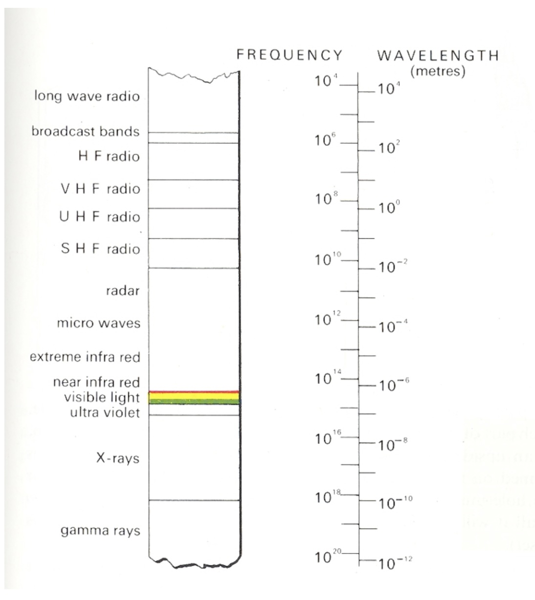
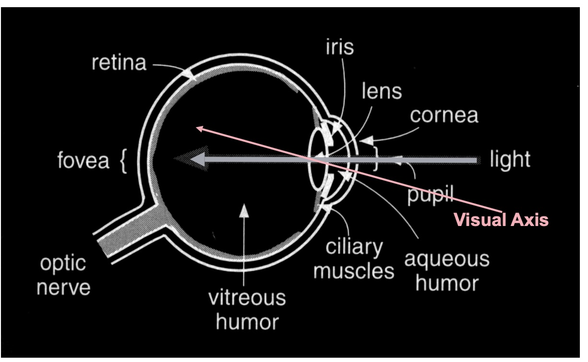
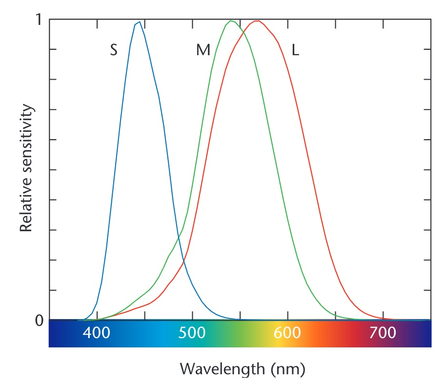
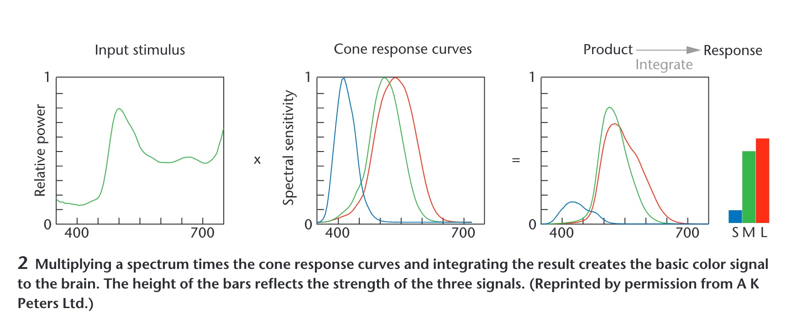
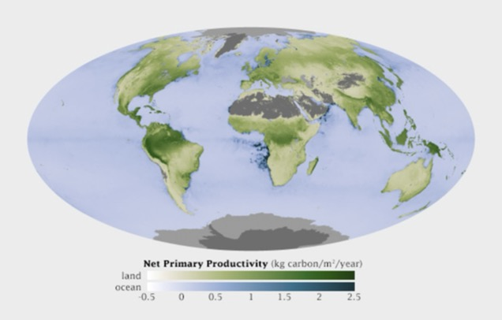
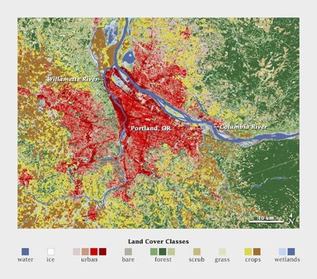
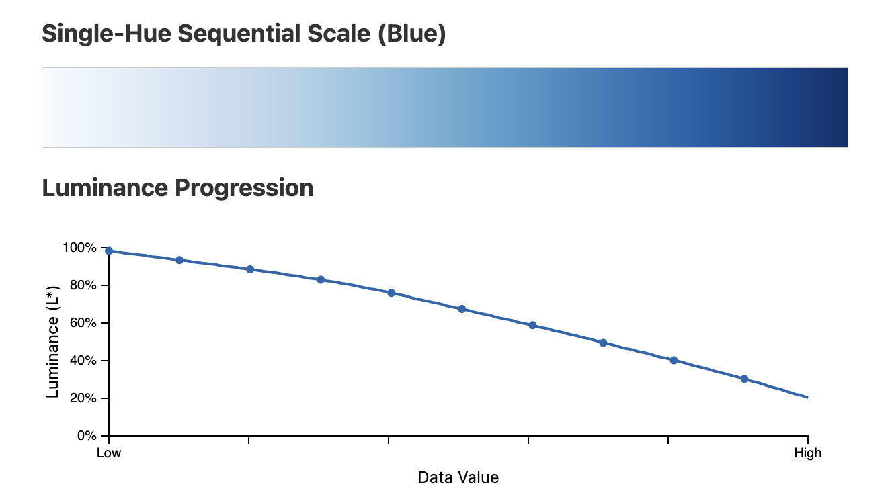
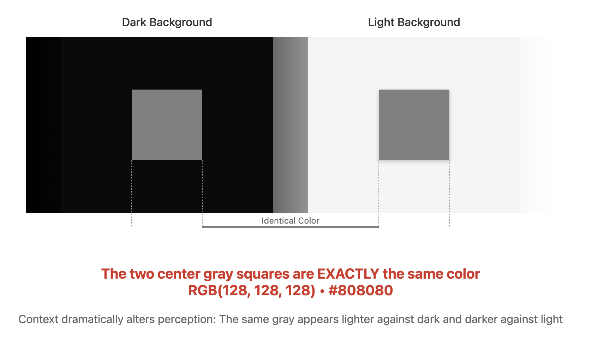
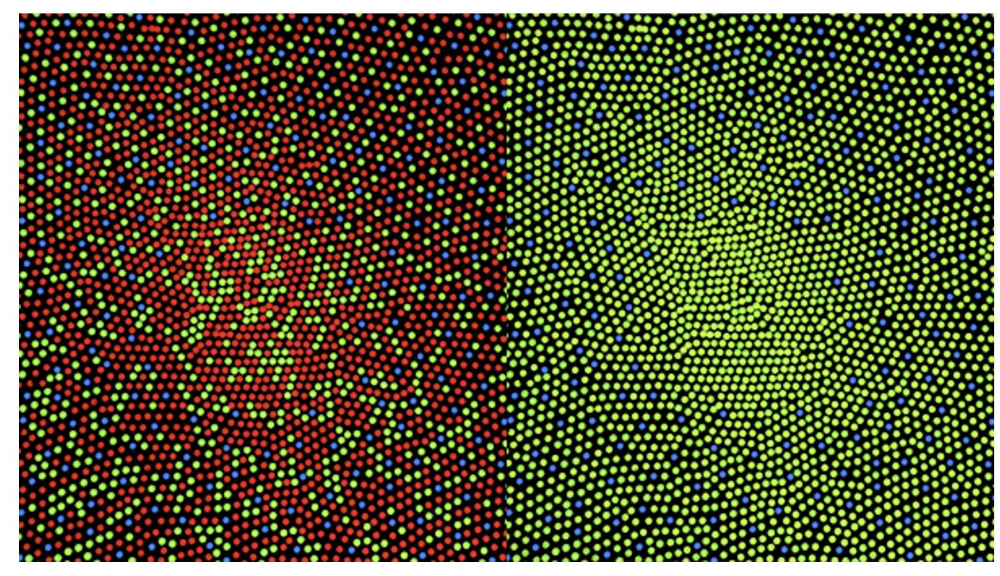
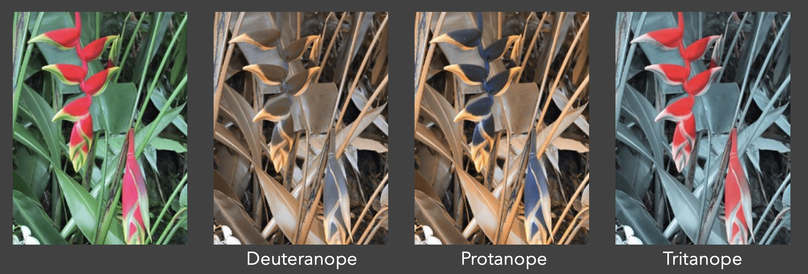

## Color Theory and D3 Scales

### Today's Journey

**Biology/Physics** → **Perception Theory** → **Design Principles** → **D3 Implementation** → **Best Practices**

<br>

:::: {.columns}
::: {.column width="50%"}
### Part 1: Color Theory

- Physics and physiology of color
- How humans perceive color
- Color spaces and models
- Perceptual principles
:::
::: {.column width="50%"}
### Part 2: D3 Implementation

- Color scales in D3
- Sequential, diverging, categorical
- Interpolation methods
- Accessibility and best practices
:::
::::

::: {.notes}
This lecture bridges the gap between the science of color perception and practical implementation in D3. We follow a logical progression: First understanding the biology and physics (WHY colors work the way they do), then perception theory (HOW humans process color), then design principles (WHAT makes effective color choices), then D3 implementation (HOW to code it), and finally best practices (WHEN to use each approach). This foundation is crucial - without understanding how humans perceive color, you'll make poor design decisions.
:::
## Color in Nature

{fig-align="center"}

::: footer
Vasas, V., Lowell, M. C., Villa, J., Jamison, Q. D., Siegle, A. G., Katta, P. K. R., Bhagavathula, P., Kevan, P. G., Fulton, D., Loukola, O. J., Penacchio, O., Tedore, C., & Hanley, D. (2024). [Recording animal-view videos of the natural world using a novel camera system and software package](https://doi.org/10.1371/journal.pbio.3002444). *PLOS Biology*, 22(1), e3002444.
Image from [PLOS Biology](https://journals.plos.org/plosbiology/article?id=10.1371/journal.pbio.3002444)
:::

::: {.notes}
Vasas et al., PLOS Biology 2024: the same flowers and butterflies imaged in a false-colour rendering of insect vision. Panel A is the scene as a bee would have it, with the small inset showing what we see; B and C are two butterflies, human view in the corner. Open with the claim this proves: colour is not a property of the object. It is what a particular visual system does with a spectrum. Change the system and the pink flowers disappear. Everything in the first half of today is about the particular system we happen to have.
:::
## The Visible Spectrum

:::: {.columns}
::: {.column width="40%"}
* Humans perceive wavelengths from roughly **390 to 700 nm**
* Shorter (UV) is scattered by the atmosphere; longer (IR) is absorbed by water
* Peak sensitivity near 555 nm, the peak of sunlight at the surface
* Every colour you have ever seen is a position on this strip, or a mixture of positions
:::
::: {.column width="60%"}
{height="760" fig-align="center"}
:::
::::

::: footer
Gregory, R.L. (1997). *Eye and Brain: The Psychology of Seeing* (5th ed.). Princeton University Press.
:::

::: {.notes}
Roughly 390 to 700 nanometres, a narrow band. The limits are environmental: shorter wavelengths (UV) are scattered by the atmosphere, longer ones (IR) are absorbed by water and heat molecules rather than exciting electrons. Peak sensitivity sits near 555 nm in the green-yellow, which is the peak of the solar spectrum at the surface. Evolution tuned the receiver to the available light. Every colour anyone has ever seen lives on this strip or is a mixture of positions on it.
:::
## Properties of Light

* **Visible range**: 390-700nm

* **Luminance has a huge dynamic range** (cd/m²):
  - 0.00003 — Moonless overcast night sky
  - 30 — Sky on overcast day
  - 3,000 — Sky on clear day
  - 16,000 — Snowy ground in full sunlight

* **Colors result from spectral curves**:
  - Dominant wavelength → **Hue**
  - Brightness → **Lightness**
  - Purity → **Saturation**

::: {.notes}
Key insight: Our eyes handle an enormous dynamic range (100,000:1) through adaptation. This is why absolute luminance values aren't as important as relative contrasts in visualization. The three properties (hue, lightness, saturation) form the basis of the HLS color model, which is more intuitive than RGB for design work. Note that computer screens can only display about 1000:1 contrast ratio, far less than what we can perceive.
:::
## Physiology of the Eye

**Light is focused through cornea, pupil and lens onto the retina, where photons become signals**

{fig-align="center"}

::: footer
Gregory, R.L. (1997). *Eye and Brain: The Psychology of Seeing* (5th ed.). Princeton University Press.
:::

::: {.notes}
Standard cross-section from Gregory's Eye and Brain. The only parts we need today: light enters through the cornea and pupil, the lens focuses it on the retina at the back, and the retina is where photons become signals. Everything interesting about colour happens from the retina onward, so the next slide zooms in there.
:::

## The Retina Structure

:::: {.columns}
::: {.column width="40%"}
* Wired upside down: light passes the nerve fibres, ganglion and bipolar cells before reaching the photoreceptors
* Signals run back the other way: photoreceptor, bipolar, ganglion, optic nerve
* ~100 million receptors converge on ~1 million ganglion axons: contrast and opponent differences are computed here, before anything leaves the eye
* In the fovea the overlying layers are pushed aside so light hits the cones directly
:::
::: {.column width="60%"}
{height="760" fig-align="center"}
:::
::::

::: footer
Gregory, R.L. (1997). *Eye and Brain: The Psychology of Seeing* (5th ed.). Princeton University Press.
:::

::: {.notes}
Cross-section of the retina, and it is wired upside down from what you would design. Light arrives at the top of the drawing, passes through the nerve fibres, past the ganglion cells and the bipolar cells, and only then reaches the photoreceptors, the rods and the one labelled cone, at the bottom, backed by the pigment epithelium. The signal then runs the other way, up the small arrows: photoreceptor to bipolar to ganglion cell, whose axons are the nerve fibres at the top that bundle into the optic nerve. Where that bundle leaves the eye there are no receptors: the blind spot on the density plot three slides on.

Two things to take from the wiring. Compression: on the order of a hundred million receptors converge onto about a million ganglion axons, so what leaves the eye is not a pixel array but a processed signal. Contrasts, edges, and the opponent differences on the Opponent Process slide are computed right here. And this is peripheral retina: rods dominate and there is a single cone in frame. In the fovea it inverts, cones only, and the overlying layers are pushed aside so light hits them directly. Detail and colour live where you look and nowhere else.
:::

## Photoreceptors: Rods and Cones

:::: {.columns}
::: {.column width="50%"}
### Rods

- Active at low light levels (scotopic vision)
- Only one wavelength-sensitivity function
- ~120 million in human eye
:::
::: {.column width="50%"}
### Cones

- Active at normal light levels (photopic vision)
- Three types with different peak sensitivities
- ~6 million in human eye
- Concentrated in fovea
:::
::::

::: {.notes}
Two receptor types, and the split matters more than the counts. Rods: on the order of a hundred million, one photopigment peaking near 500 nm, sensitive enough to work by starlight, but they saturate in daylight, so in any lit room they contribute almost nothing. With one pigment they cannot signal colour at all: a rod cannot distinguish a dim green from a bright red, only how many photons arrived. Cones: a few million, three types with three sensitivity curves on the next slide, active at normal light levels. All of colour is a comparison between their three outputs.

One fact for your pocket: the ratio of L to M cones varies several-fold between people with normal colour vision, yet their colour judgements agree. The later stages normalise. First hint that colour is computed, not sensed.
:::

## Cone Sensitivity Curves

:::: {.columns}
::: {.column width="40%"}
* Three cone types: **S** (short, peak ~445 nm), **M** (medium, ~545 nm), **L** (long, ~565 nm)
* The curves overlap, so no wavelength excites one cone type alone
* M and L are only ~20 nm apart, which is why red-green deficiency is the common one
* S cones are sparse and far from the others: blue carries the least detail
:::
::: {.column width="60%"}
{height="760" fig-align="center"}
:::
::::

::: footer
Stone, M. (2005). [Representing Color as Three Numbers](../refs/Stone_2005_Representing_Colors_Three_Numbers.pdf). *IEEE Computer Graphics and Applications*, 25(4), 78-85.
:::

::: {.notes}
Critical slide! This is the foundation of trichromatic color theory. Note the overlapping sensitivity curves - this is why we can't see "pure" wavelengths. The brain interprets the relative activation of all three cone types. Point out that the L and M curves are very close, which is why red-green colorblindness is most common.
:::
## Density of Cones Across Retina

:::: {.columns}
::: {.column width="40%"}
* Cones (dashed) are packed into the fovea, the central ~2°, at up to ~150,000 per mm²
* Rods (solid) peak about 20° out and are absent from the fovea
* The gap at the optic disk is the blind spot
* You have colour vision only where you are looking: peripheral colour coding does not work
:::
::: {.column width="60%"}
{height="760" fig-align="center"}
:::
::::

::: footer
Gregory, R.L. (1997). *Eye and Brain: The Psychology of Seeing* (5th ed.). Princeton University Press.
:::

::: {.notes}
Emphasize the importance of the fovea (the central 2° of vision). This is where acuity and color discrimination are highest - cone density reaches 150,000 per mm². This biological fact explains why legends and critical information should be placed centrally or made salient enough to attract foveal attention. Teaching Point: When the visualization requires reading fine detail or discerning subtle color differences, the viewer must consciously shift their gaze. This is why we can't rely on peripheral vision for detailed color work - the cone density drops dramatically outside the fovea. Practical implication: Don't put critical color-coded information in the periphery of a visualization.
:::
## Rods vs. Cones Sensitivity

**Rods (scotopic) peak near 507 nm and see no colour; cones (photopic) peak near 555 nm and carry it**

{fig-align="center"}

::: footer
Gregory, R.L. (1997). *Eye and Brain: The Psychology of Seeing* (5th ed.). Princeton University Press.
:::

::: {.notes}
Spectral sensitivity of the two systems, each normalised to its own peak, so the curves show shape, not absolute sensitivity; in absolute terms rods are far more sensitive. Scotopic is rod vision, peaking near 507 nm in the blue-green. Photopic is cone vision, light-adapted, peaking near 555 nm in the yellow-green. The horizontal offset is the Purkinje shift: as light falls and vision hands over from cones to rods, sensitivity slides toward the blue end. Reds go dark first; blue-greens hold on longest. A red flower at dusk looks black while the leaves still look grey-green.

Three design consequences. A red alert is the worst possible choice for a dimmed or night-time environment; it is the first hue to vanish. Dark-mode dashboards behave differently in a bright office and at night because the viewer's adaptation state changed, not the pixels. And a projector room is closer to the dim mesopic range than your laptop is: small hue differences and desaturated palettes that look fine at your desk disappear on the wall. Test on the projector.
:::

## How We Perceive Color

**A spectrum is reduced to three cone responses; spectra with the same three numbers look identical (metamers)**

{fig-align="center"}

::: footer
Stone, M. (2005). [Representing Color as Three Numbers](../refs/Stone_2005_Representing_Colors_Three_Numbers.pdf). *IEEE Computer Graphics and Applications*, 25(4), 78-85.
:::

::: {.notes}
Maureen Stone's figure, and the most important slide in the first half. A spectrum, an entire curve, is multiplied by the three cone curves and integrated. Out come three numbers: S, M, L. Everything about the curve that is not captured by those three integrals is gone. Consequence: infinitely many different spectra produce the same three numbers, so they look identical. Those are metamers, and they are the reason a screen with three primaries can show you a colour at all. It is also why 'colour' is three-dimensional, which is where every colour space in the second half comes from.
:::

## Opponent Process Theory

:::: {.columns}
::: {.column width="50%"}
### Three Opponent Channels

**Color Opposition:**

- 🔴 Red ↔️ Green 🟢 (cannot see "reddish-green")
- 🔵 Blue ↔️ Yellow 🟡 (cannot see "yellowish-blue")
- ⚫ Black ↔️ White ⚪ (luminance channel)

**Key Insights:**

- Explains why we see afterimages in complementary colors
- Processed in retinal ganglion cells and LGN
- Some cells excited by red, inhibited by green (and vice versa)
- Explains unique hues: red, green, blue, yellow
:::

::: {.column width="50%"}
{width="100%"}
:::
::::

::: footer
Hering, E. (1964). *Outlines of a Theory of the Light Sense*. Harvard University Press. (Original work published 1920); Hurvich, L. M., & Jameson, D. (1957). An opponent-process theory of color vision. *Psychological Review*, 64(6), 384-404.
:::

::: {.notes}
This is THE theory that bridges trichromatic theory (3 cone types) with how we actually experience color. The opponent channels are why we have four unique hues (red, green, blue, yellow) even though we have three cone types. Modern color spaces like LAB are built on this principle - L for luminance, A for red-green, B for blue-yellow.

**The Neural Processing:** In V1 (primary visual cortex), the raw signals from the cones in the retina are transformed. Some neurons compute differences between red- and green-sensitive cone signals. Some neurons compute the sum of red- and green-sensitive cones. Still others compute yellow-blue differences. The result is three kinds of color signals that are called color-opponent channels. This transformation happens early in visual processing - starting in retinal ganglion cells and continuing through the lateral geniculate nucleus (LGN) to V1.
:::
## Opponent Process Applications

### Practical Impact:

- **Color space design**: LAB uses opponent channels (A = red-green, B = blue-yellow)
- **Categorical perception**: Explains why we naturally group colors into categories
- **Accessible color choices**: Understanding oppositions guides colorblind-safe palettes

### Demonstrations you can run in class:

1. **Afterimage** - stare at a red square for 30 s, look at white, see green
2. **Impossible colours** - try to picture a reddish green or a yellowish blue

::: footer
Hering, E. (1964). *Outlines of a Theory of the Light Sense*. Harvard University Press. (Original work published 1920); Hurvich, L. M., & Jameson, D. (1957). An opponent-process theory of color vision. *Psychological Review*, 64(6), 384-404.
:::

::: {.notes}
Demo: Have students stare at a red square for 30 seconds, then look at white - they'll see green! This isn't a "trick" - it's fundamental to how our visual system works. Fun fact: some people claim they can see "impossible colors" like reddish-green using special viewing conditions, but this is controversial.
:::
## Color Matching Experiments

**Any colour can be matched by adjusting three primaries: the empirical basis of trichromacy**

{fig-align="center"}

::: footer
Stone, M. (2005). [Representing Color as Three Numbers](../refs/Stone_2005_Representing_Colors_Three_Numbers.pdf). *IEEE Computer Graphics and Applications*, 25(4), 78-85.
:::

::: {.notes}
Explain that this is the empirical basis for all modern color spaces. The key finding from these experiments (starting with Thomas Young in 1801 and refined by Maxwell and others) is that the human visual system is 3-dimensional (trichromatic). This confirms that any physical color can be replicated by mixing three primary lights, leading directly to the RGB model used in computers. Important: Some colors require "negative" amounts of a primary (subtracting light), which is why no three real primaries can produce all visible colors - this led to the development of the CIE XYZ color space with imaginary primaries.
:::
## Color Models for Visualization

### Trichromacy
Humans perceive colors through three channels

### Most useful color description for visualization:

- **Hue**: What color (red, blue, green...)
- **Saturation**: Purity of color
- **Luminance/Lightness**: Brightness

::: {.notes}
This is where we transition from biology to design principles. These three dimensions map to how we actually think about color. Luminance is the strongest channel for ordered data (we easily see light-to-dark progression). Hue is best for categorical distinctions (red vs blue vs green). Saturation is the weakest channel - hard to judge precise values. This hierarchy guides our encoding choices.
:::
## Just Noticeable Difference (JND)

### The smallest detectable difference in a stimulus

**For Color:**

- **Luminance**: **`~1-2%`** change detectable
- **Hue**: Varies by wavelength (most sensitive in blue-green)
- **Saturation**: **`~5-10%`** change needed

**Implications for Visualization:**

- Need sufficient steps between colors in a scale
- Can't encode too many distinct values
- Background affects perception (simultaneous contrast)

::: footer
Ware, C. (2012). *Information Visualization: Perception for Design* (3rd ed.). Morgan Kaufmann. Chapter 4.
:::

::: {.notes}
JND is fundamental to color scale design. It determines how many distinct values you can encode. For continuous scales, you want steps larger than JND to be clearly distinguishable. This is why we can only reliably encode about 5-7 distinct colors, or about 7-10 distinct luminance levels. The background color affects JND - a color that's distinguishable on white might not be on gray. Ware's book provides the definitive treatment of JND in visualization contexts.
:::
## How Do We Use Color in Visualization?

Two primary purposes:

:::: {.columns}
::: {.column width="50%"}
### 1. Quantify
Show numerical values
:::
::: {.column width="50%"}
### 2. Label
Distinguish categories
:::
::::

::: {.notes}
Two jobs, and each wants the opposite kind of scale. Quantify: the attribute is ordered, so vary a magnitude channel, luminance and secondarily saturation, and hold hue fixed. Label: the attribute is categorical, so vary the identity channel, hue, and hold luminance roughly constant so no category shouts. That is the magnitude-versus-identity split from the perception lecture applied to colour, and it is the single most useful sentence in this half of the lecture.

Almost every colour mistake you will grade this semester is a cross-use. A rainbow on a quantity, hue carrying magnitude, has no perceptual order, so the viewer cannot tell more from less without the legend. A light-to-dark ramp on categories invents an order that is not in the data and makes the darkest category look most important. Before advancing, ask the room to call out which job each of the next two slides is doing.
:::

## Color to Quantify

**Quantify: luminance carries the number, light means low and dark means high**

{fig-align="center"}

::: {.notes}
NASA net primary productivity, kilograms of carbon fixed per square metre per year. Read the legend: two sequential ramps, white through green for land and white through blue for ocean, both monotone in luminance so higher is darker everywhere. That is the whole recipe for quantify: one hue family per quantity, luminance carries the number, light means low and dark means high.

Two subtleties. There are two hues here, green and blue, and that is not a violation: hue is doing the label job, land versus ocean, while luminance does the quantify job within each. And the grey, deserts, ice sheets, Antarctica, is missing or not-applicable data, placed outside the ramp in a neutral that cannot be mistaken for a low value. Never encode 'no data' as the bottom of the scale. One to argue about: the legend runs from -0.5 to 2.5, so strictly this is a diverging quantity around zero drawn with a sequential ramp. Defensible, because the negatives are small and rare. Hold that for the Diverging slide.
:::
## Color to Label

:::: {.columns}
::: {.column width="40%"}
* Label: distinct hues at similar lightness, no implied order
* Land cover around Portland: water, ice, urban, forest, scrub, grass, crops, wetlands
* Semantically resonant choices (blue water, green forest) make the legend almost unnecessary
* Keep saturation consistent, or one category will dominate
:::
::: {.column width="60%"}
{height="600" fig-align="center"}
:::
::::

::: {.notes}
Land cover around Portland: water, ice, urban, bare, forest, scrub, grass, crops, wetlands. Distinct hues at similar lightness, and there is no ordering among them because there is no ordering among the categories. The palette is not arbitrary either: the semantically resonant choices, blue for water and green for forest, make the legend almost unnecessary. Common mistake to name now: mixing bright and pastel colours in one categorical palette. The bright ones will dominate attention, so keep saturation consistent unless you mean to highlight. The image is a small file and is shown below full column height on purpose.
:::
## Quantitative Color Scales

### Desired Properties:

- **Uniformity**: Value difference = Perceived difference
- **Discriminability**: As many distinct values as possible

### Challenge:
Human perception is non-linear!

::: {.notes}
This is a key insight students often miss. Equal steps in RGB values don't produce equal perceptual steps. This is why we need perceptually uniform color spaces like LAB or HCL. Use the example of yellow appearing brighter than blue even at the same RGB intensity.
:::
## Single Hue Sequential Scales

**The luminance (L*) channel falls monotonically from light to dark; that ordering, not the blueness, encodes the value**

{fig-align="center"}

::: {.notes}
This visualization perfectly demonstrates why single-hue sequential scales work. The top shows the actual color scale, while the bottom graph reveals the underlying mechanism: a steady, monotonic decrease in luminance from ~100% to ~20%. This is what our visual system interprets as "less to more" or "low to high". The other channels (hue and saturation) remain relatively constant. Students should understand that it's the luminance change, not the "blueness," that encodes the data values.
:::
## Categorical Color Scales

:::: {.columns}
::: {.column width="40%"}
* U.S. county unemployment, a **quantity**, drawn with a categorical palette: nothing reads as high or low
* Categorical palettes want **uniform saliency**: nothing stands out unintentionally
* And **maximum discriminability**: each category clearly distinct
* The right tool for labels, the wrong tool for a quantity
:::
::: {.column width="60%"}
{width="100%" fig-align="center"}
:::
::::

::: {.notes}
Read the legend before saying anything: this is U.S. county unemployment, a quantitative variable, drawn with a categorical palette. Nothing reads as high or low; the map is noise. The two properties on the slide, uniform saliency and discriminability, are exactly right for labels and exactly wrong for a quantity. Use this as the negative example: this is what the quantify job looks like when handed the label tool. Then state the positive rule: for real categories, distinct hues, similar lightness and saturation, and stop at the limit on the next slide.
:::

## Categorical Scale Limits

### How many distinct colors can we use effectively?

Research suggests: **5-10 distinct categories maximum**

Beyond this limit:

- Colors become confusable
- Need additional encoding (shape, pattern)
- Consider grouping categories

::: footer
Healey, C.G. (1996). [Choosing effective colours for data visualization](https://ieeexplore.ieee.org/document/567774). IEEE Visualization '96, pp. 263-270.
:::

::: {.notes}
Reference the Magic Number 7 ± 2 rule (Miller's Law, 1956) for cognitive load. Beyond 5-7 categories, users stop instantly recognizing differences (pre-attentive processing) and must rely on a legend, which slows down analysis dramatically. Healey's research confirmed this specifically for color. Alternatives when you have too many categories: (1) Group data into super-categories with related sub-hues, (2) Use interactivity - show only relevant categories on demand (filtering/highlighting), (3) Apply texture or shape as redundant encoding, (4) Use "focus + context" - highlight important categories and gray out others, (5) Consider if all categories really need to be shown simultaneously. Remember: Every time users look at the legend, they break their analysis flow.
:::
## Diverging Color Scales

For data with meaningful midpoint (zero, average, neutral)

:::: {.columns}
::: {.column width="50%"}
{width="100%"}

Sequential scale obscures the critical 50% threshold
:::
::: {.column width="50%"}
{width="100%"}

Diverging scale clearly shows above/below threshold
:::
::::

::: footer
Data from [County Level Election Results](https://github.com/tonmcg/County_Level_Election_Results_12-16)
:::

::: {.notes}
Perfect example of why choosing the right scale matters! The left map makes it hard to see which counties voted majority Republican vs Democrat. The diverging scale immediately reveals the pattern. Other good use cases: temperature anomalies (above/below average), profit/loss, survey responses (agree/disagree). Key insight: the midpoint should be meaningful, not arbitrary.
:::
## Color Context Effects

:::: {.columns .smaller}
::: {.column width="50%"}
### Simultaneous Contrast
The same color appears different depending on surrounding colors

**Key Effects:**

- Colors appear lighter on dark backgrounds
- Colors appear more saturated next to gray
- Complementary colors enhance each other

**Design Implications:**

- Test colors in context, not isolation
- Be consistent with backgrounds
- Use borders/whitespace to separate regions
- Consider the whole visualization, not just the palette
:::

::: {.column width="50%"}
{width="100%"}
:::
::::

::: footer
Albers, J. (1963). *Interaction of Color*. Yale University Press; Adelson, E.H. (1993). Perceptual organization and the judgment of brightness. *Science*, 262(5142), 2042-2044.
:::

::: {.notes}
This is why color palettes that look good in a swatch panel might fail in your visualization. The classic example: a gray square looks yellowish on a blue background and bluish on a yellow background. For maps, this means adjacent regions can affect color perception. Solution: add thin white borders between regions, or test your palette with actual data patterns. Albers' classic work and Adelson's checker shadow illusion are foundational demonstrations of these effects.
:::
## Semantic Color Associations

### Cultural and Contextual Meanings

:::: {.columns}
::: {.column width="50%"}
**Universal Associations:**

- **Red**: Heat, danger, stop 🔥 🛑
- **Blue**: Cold, water, calm 💧 ❄️
- **Green**: Nature, growth, go 🌱 ✅
- **Yellow**: Caution, energy ⚠️ ⚡
:::

::: {.column width="50%"}
**Domain-Specific:**

- **Finance**: Red = loss (↓), Green = profit (↑)
- **Politics**: Red/Blue = parties (varies by country!)
- **Temperature**: Blue = cold ❄️, Red = hot 🌡️
- **Health**: Red = critical 🚨, Yellow = warning ⚠️, Green = normal ✅
:::
::::

::: footer
Lin, S., Fortuna, J., Kulkarni, C., Stone, M., & Heer, J. (2013). [Selecting Semantically-Resonant Colors for Data Visualization](../refs/Lin_Fortuna_Kulkarni_Stone_Heer_2013_Selecting_Semantically_Resonant_Colors.pdf). Computer Graphics Forum, 32(3), 401-410.
:::

::: {.notes}
Leverage semantic associations when they help, but be aware they're not universal. In China, red means prosperity. In finance, Western markets use red for losses, but East Asian markets use red for gains! Always consider your audience. Sometimes you should intentionally break conventions - use blue for hot if you're showing cooling needs, not temperature. Lin et al.'s research provides empirical data on color-concept associations.
:::
## Color Blindness Considerations

**About 8% of men and 0.5% of women have a colour vision deficiency, mostly red-green**

{fig-align="center"}

::: footer
Oliveira, M. "Towards More Accessible Visualizations for Color-Vision-Deficient Individuals" Computing in Science & Engineering, 2013
:::

::: {.notes}
Emphasize that this means in a typical classroom, 2-3 students likely have some form of color vision deficiency. Red-green is most common (deuteranopia and protanopia). Always design with this in mind - use redundant encoding (shape, pattern) and test with simulators. The Viridis colormap was specifically designed to be perceptually uniform AND colorblind-safe.
:::
## Color Vision Simulators

:::: {.columns .smaller}
::: {.column width="50%"}
### Tools for Testing Accessibility

**Browser Extensions:**

- [Colorblinding](https://chrome.google.com/webstore/detail/colorblinding) (Chrome)
- [Let's Get Color Blind](https://addons.mozilla.org/en-US/firefox/addon/let-s-get-color-blind/) (Firefox)
- Real-time webpage simulation

**Design Software Plugins:**

- Adobe Photoshop: View → Proof Setup → Color Blindness
- Sketch: Stark plugin for accessibility testing
- Figma: Able plugin for color vision simulation

**Online Simulators:**

- [Coblis](https://www.color-blindness.com/coblis-color-blindness-simulator/)
- [Sim Daltonism](https://michelf.ca/projects/sim-daltonism/) (macOS app)
- Upload images for instant simulation
:::

::: {.column width="50%"}
{width="100%"}
:::
::::

**Best Practice:** Always test your visualizations with simulators during development, not after

::: {.notes}
Demo one of these tools live if possible! Show how a seemingly clear red/green encoding becomes indistinguishable. Point out that deuteranopia (missing green cones) affects ~6% of males, protanopia (missing red cones) ~2%, and tritanopia (missing blue cones) is rare (~0.01%). The tools are free and take seconds to use - there's no excuse for not testing. Emphasize: "If you're not testing for colorblindness, you're excluding 8% of your male audience."
:::
## Color Spaces

:::: {.columns .smaller}
::: {.column width="50%"}
### RGB (Red, Green, Blue)
- Device-oriented
- Not perceptually uniform
- Common in programming

### HSL/HSV (Hue, Saturation, Lightness/Value)
- More intuitive for humans
- Better for color selection
- Still not perceptually uniform
:::
::: {.column width="50%"}
### LAB/LCH
- Perceptually uniform
- Better for interpolation
- Used in professional design
:::
::::

::: {.notes}
Critical concept: RGB is how devices work, but not how humans perceive. Equal steps in RGB space don't produce equal perceptual steps - this is why RGB interpolation looks muddy. HSL is better for picking colors manually but still has issues (yellow appears brighter than blue at same L value). LAB/LCH are based on human perception studies and produce smooth gradients. Always use LAB or HCL for color interpolation in visualizations.
:::
## Perceptual Color Spaces

### Why Perceptual Uniformity Matters

In RGB space, equal numerical steps ≠ equal perceptual steps

```javascript
// RGB interpolation can produce muddy colors
d3.interpolateRgb("red", "blue")

// LAB interpolation maintains perceptual uniformity
d3.interpolateLab("red", "blue")

// HCL even better for many visualizations
d3.interpolateHcl("red", "blue")
```

::: {.notes}
Demo this live if possible! RGB interpolation between red and blue passes through muddy purple. LAB maintains brightness consistency. HCL (Hue-Chroma-Luminance) follows the color wheel, producing vibrant intermediates. For diverging scales, HCL is often best. For sequential scales, LAB works well. The key is that perceptual uniformity means your data differences map linearly to perceived color differences.
:::
## Design Implications of Color Processing

### From Biology to Design

Our visual system's structure creates constraints and opportunities:

**Three Opponent Channels Process Color:**

- **Luminance (Black-White)**: Best for detail and patterns
- **Red-Green**: Categorical distinctions
- **Yellow-Blue**: Categorical distinctions (weaker than red-green)

**Key Biological Facts:**

- Far fewer blue-sensitive cones (~2% of total)
- Blue cones less sensitive than red/green
- Chromatic channels cannot convey fine detail

::: {.notes}
This bridges the gap between understanding the biology and applying it to design. The three opponent channels have very different capabilities - luminance is king for detail, while chromatic channels are better for categorical coding. The scarcity of blue cones explains why blue is problematic for fine detail.
:::
## Luminance Contrast is Critical for Detail

### Text and Fine Details Require Strong Luminance Contrast

**ISO Standard Recommendation:**

- **Minimum 3:1 luminance ratio** between text and background
- Chromatic channels (red-green, yellow-blue) **cannot** convey fine detail

**Common Mistakes:**

- ❌ Blue text on dark backgrounds (illegible - lacks luminance contrast)
- ❌ Red text on green background (relies only on chromatic contrast)
- ✅ Black text on white (maximum luminance contrast)
- ✅ High-contrast text with color used sparingly for emphasis

::: {.notes}
This is one of the most practical design guidelines. Many students think "red on green should work because they're opposite" - but if the luminance values are similar, it fails for small text. Demo if possible: show red text on green background with matched luminance - it's nearly unreadable. Blue on dark is particularly bad because blue cones are scarce and less sensitive.
:::
## Color Coding Limitations

:::: {.columns .smaller}
::: {.column width="50%"}
### How Many Colors Can Users Distinguish?

**Research Finding: Only 6-12 colors work reliably as codes**

**Best Practice - Use Unique Hues First:**

1. 🔴 **Red**
2. 🟢 **Green**
3. 🟡 **Yellow**
4. 🔵 **Blue**
5. ⚫ **Black**
6. ⚪ **White**
:::
::: {.column width="50%"}
**Why These Work Best:**

- Most easily learned and identified
- Correspond to opponent channel structure
- Universal across cultures (mostly)

**Beyond 6 categories?** Add redundant encoding (shape, pattern, labels)
:::
::::

::: {.notes}
The 6-12 limit is empirically validated. The unique hues are special because they align with our opponent process channels - they're the "purest" examples of each channel. After these 6, you can add orange, purple, brown, pink, etc., but discriminability drops. This is why Tableau and other tools default to 6-10 color palettes. Real-world tip: If you have 20 categories, color alone won't work - consider grouping or interactive filtering.
:::
## Size-Dependent Color Choices

### Small Symbols vs. Large Areas

:::: {.columns}
::: {.column width="50%"}
### Small Symbols/Text

**Requirements:**

- Strong, **saturated colors**
- High **luminance contrast** with background
- Avoid subtle color differences

**Examples:**

- Points on scatter plots
- Line graphs
- Small icons
- Text labels
:::

::: {.column width="50%"}
### Large Areas

**Requirements:**

- **Subdued, low-saturation** colors
- Avoid overwhelming the design
- Prevent contrast effects on smaller elements

**Examples:**

- Background fills
- Map regions
- Area charts
- Dashboard panels
:::
::::

::: {.notes}
This is counterintuitive for many students. Bright saturated colors work great for small elements but become overwhelming for large areas. Large saturated areas also create strong simultaneous contrast effects that distort perception of smaller elements. Think of heatmaps - the cells should be relatively muted, while outliers or highlights can be saturated. Geographic maps are a classic example: countries should be pastel/muted, while city markers can be bright and saturated.
:::
## Simultaneous Contrast & Design Practice

### Context Affects Color Perception

**Simultaneous Contrast Effects:**

- Backgrounds affect small color patches more than vice versa
- Same color appears different on different backgrounds
- Critical for visualization design

**Highlighting Best Practices:**

- ✅ **Maintain or increase luminance contrast** for emphasis
- ❌ Common mistake: Reducing contrast (e.g., light text on light highlight)
- ✅ Dark text on light highlight, or light text on dark highlight

**Shape and Color Together:**

- Light-colored patterns interfere **less** with shape perception
- Dark saturated patterns dominate and obscure 3D shape

::: footer
Ware, C. (2022). *Visual Thinking for Information Design* (2nd ed.). Morgan Kaufmann.
:::

::: {.notes}
PowerPoint's default highlighting (yellow background) often reduces contrast by making black text appear lighter - this is exactly wrong! Good highlighting increases luminance difference. For 3D visualizations colored by data values, use light colors so shading cues for shape remain visible. The simultaneous contrast demo (gray squares on different backgrounds) should be shown if available - it's a powerful demonstration that context is everything in color perception.
:::
## D3 Color Scales

### Sequential Scales

```javascript
// Single hue
const blueScale = d3.scaleSequential()
  .domain([0, 100])
  .interpolator(d3.interpolateBlues);

// Multi-hue
const viridisScale = d3.scaleSequential()
  .domain([0, 100])
  .interpolator(d3.interpolateViridis);
```

### Built-in Color Schemes:

- Blues, Greens, Reds, Purples, Oranges, Greys
- Viridis, Inferno, Magma, Plasma (perceptually uniform)

::: {.notes}
The D3 half starts here. scaleSequential takes a domain and an interpolator, a function from [0,1] to a colour, and d3-scale-chromatic ships dozens of them. Two families: the single-hue Brewer ramps (Blues, Greens and so on) and the multi-hue perceptually uniform ones from matplotlib (Viridis, Inferno, Magma, Plasma). Both increase luminance monotonically, which is the property from the Single Hue slide. Point out that interpolateBlues is exactly the ramp whose L* curve we plotted earlier. Live demo if the network is up: the Observable colour schemes notebook shows every one of these side by side.
:::

## D3 Diverging Scales

```javascript
// Diverging scale with custom midpoint
const divergingScale = d3.scaleDiverging()
  .domain([-50, 0, 100])  // min, midpoint, max
  .interpolator(d3.interpolateRdBu);

// Common diverging schemes:
// RdBu (red-blue), RdYlGn (red-yellow-green),
// BrBG (brown-green), PuOr (purple-orange)
```

Perfect for:

- Temperature anomalies
- Election results
- Profit/loss
- Any data with meaningful zero

::: {.notes}
Guide students to choose an interpolator like d3.interpolateRdBu because it is perceptually uniform around the critical midpoint, preventing the muddy gray region that RGB interpolation creates. The domain([min, midpoint, max]) structure is critical - the midpoint should be meaningful (0 for anomalies, average for deviations, 50% for proportions). Common mistake: Using diverging scales when data doesn't have a meaningful midpoint. If your data is all positive (e.g., 0-100%), use sequential instead. The midpoint in the interpolator gets white/neutral color, so it must represent a true neutral value in your data.
:::
## D3 Categorical Scales

```javascript
// Ordinal scale with color scheme
const categoryScale = d3.scaleOrdinal()
  .domain(["A", "B", "C", "D"])
  .range(d3.schemeCategory10);

// Available categorical schemes:
// schemeCategory10 - 10 distinct colors
// schemeSet1 - 9 saturated colors (NOT colorblind-safe)
// schemeSet2 - 8 muted colors (print friendly)
// schemeDark2 - 8 colors, the safest Brewer set for CVD
// schemeTableau10 - 10 colors, Tableau default
// schemeSet3 - 12 colors (pastel)
// schemePaired - 12 colors (paired)
```

::: {.notes}
Important: schemeSet1 is colorblind-safe but has very saturated colors that can be overwhelming. schemeSet2 is better for professional presentations. schemePaired is great when you have natural pairs in your data (e.g., before/after, male/female). Always test your chosen scheme with actual data - what looks good in isolation may not work with your specific visualization.
:::
## Color Scale Best Practices

:::: {.columns}
::: {.column width="50%"}
### Sequential Data

✅ Use single or multi-hue sequential

❌ Don't use rainbow scales

### Categorical Data

✅ Use distinct hues with similar saturation/lightness

❌ Don't use more than ~8 categories
:::

::: {.column width="50%"}
### Diverging Data

✅ Use when there's a meaningful midpoint

❌ Don't use for purely positive data

### Accessibility

✅ Test with colorblind simulators

✅ Provide redundant encoding when possible
:::
::::

::: {.notes}
Use this slide to review common student errors. Sequential Data: Rainbow maps are the #1 mistake—they create false edges where the color suddenly shifts (e.g., yellow band appears as a boundary). Show example: weather maps where rainbow creates artificial storm boundaries. Categorical Data: Reiterate that Saturation should be kept consistent across categories to avoid unintended emphasis. If one category is bright red and another is pale blue, the red will dominate. Diverging: Students often use these for data without true midpoints. Accessibility: Not optional - in any professional setting, colorblind-safe design is required, not suggested.
:::
## D3 Data Transformation Scales (Beyond Color)

### Time Scales
```javascript
const timeScale = d3.scaleTime()
  .domain([new Date(2020, 0, 1), new Date(2025, 0, 1)])
  .range([0, width]);
```

### Log Scales
```javascript
const logScale = d3.scaleLog()
  .domain([1, 1000])
  .range([0, width]);
```

### Power Scales
```javascript
const sqrtScale = d3.scaleSqrt()  // same as scalePow().exponent(0.5)
  .domain([0, 100])
  .range([0, width]);
```

::: {.notes}
Important distinction: These scales transform your data space, not color space. They map data values to positions, sizes, or other visual properties. Time scales understand JavaScript dates and create nice tick marks at meaningful intervals (days, months, years). Log scales are essential for data with large ranges - use when data spans multiple orders of magnitude (e.g., population, income). Square root scales are crucial for encoding data as area - since area grows with radius squared, sqrt scale makes the area proportional to data value, not the radius.
:::
## Quantized Scales

Transform continuous domains into discrete ranges

```javascript
// Quantize scale - equal intervals
const quantizeScale = d3.scaleQuantize()
  .domain([0, 100])
  .range(["low", "medium", "high"]);

// Quantile scale - equal quantities
const quantileScale = d3.scaleQuantile()
  .domain(data)
  .range(["Q1", "Q2", "Q3", "Q4"]);

// Threshold scale - custom breakpoints
const thresholdScale = d3.scaleThreshold()
  .domain([30, 70])
  .range(["cold", "comfortable", "hot"]);
```

::: {.notes}
Critical for choropleth maps and binned visualizations. Quantize creates equal-width bins (like a histogram). Quantile creates bins with equal numbers of data points - useful for skewed distributions. Threshold gives you complete control over breakpoints - use for meaningful boundaries like freezing point, poverty line, etc. Always show the binning method in your legend!
:::
## Color Interpolation

D3 provides multiple interpolation methods:

```javascript
// RGB interpolation (can be muddy)
d3.interpolateRgb("red", "blue")(0.5);

// HSL interpolation (follows hue wheel)
d3.interpolateHsl("red", "blue")(0.5);

// LAB interpolation (perceptually uniform)
d3.interpolateLab("red", "blue")(0.5);

// HCL interpolation (best for many cases)
d3.interpolateHcl("red", "blue")(0.5);

// Cubehelix (multi-hue with monotonic luminance)
d3.interpolateCubehelix("red", "blue")(0.5);
```

::: {.notes}
Same two endpoints, red to blue, five interpolation spaces, and the midpoints differ. RGB averages the channels and lands on a dull purple with lower perceived lightness than either end. HSL walks the hue wheel, so you pass through magenta or through yellow and green depending on direction. Lab and HCL keep perceived lightness on a straight line, which is what a sequential scale needs. Cubehelix is Dave Green's scheme for astronomy: it rotates through hues while luminance climbs monotonically, so it prints in greyscale. Rule for the lab: interpolate in Lab or HCL, never RGB, and never HSL for quantities.
:::

## Creating Custom Color Scales

```javascript
// Custom sequential scale
const customSequential = d3.scaleSequential()
  .domain([0, 100])
  .interpolator(t => d3.interpolateHcl("#e8f4f8", "#004c6d")(t));

// Custom diverging scale
const customDiverging = d3.scaleDiverging()
  .domain([-1, 0, 1])
  .interpolator(t => t < 0.5
    ? d3.interpolateHcl("#67001f", "#f7f7f7")(t * 2)
    : d3.interpolateHcl("#f7f7f7", "#053061")((t - 0.5) * 2));

// Piecewise scale
const piecewise = d3.scaleLinear()
  .domain([0, 50, 100])
  .range(["#2166ac", "#f7f7f7", "#b2182b"]);
```

::: {.notes}
Three ways to build a scale that does not come in the box. Custom sequential: pick two endpoints and an HCL interpolator. Custom diverging: two half-ramps glued at a neutral, which is exactly how the built-in RdBu is constructed. Piecewise linear: a plain scaleLinear with three domain stops and three range colours, and D3 interpolates between neighbouring stops; note the default interpolation there is RGB unless you set .interpolate(d3.interpolateHcl). The Unicode minus signs that used to be in this code have been replaced with ASCII hyphens; the snippet is now copy-pasteable.
:::

## Practical Color Guidelines

:::: {.columns .smaller}
::: {.column width="50%"}
### For Print
- Consider grayscale reproduction
- Use ColorBrewer schemes
- Test on actual printer

### For Screen
- Consider monitor variations
- Use sufficient contrast
- Test on different devices
:::
::: {.column width="50%"}
### For Accessibility
- Use colorblind-safe palettes
- Provide alternative encodings
- Test with simulators
:::
::::

::: {.notes}
Three deployment targets, three checks. Print: will it survive greyscale? Photocopiers still exist, and so do black-and-white PDF printers. ColorBrewer marks schemes that are print-friendly. Screen: monitors vary in gamut and calibration, projectors wash out saturation, so contrast that is generous on your laptop is barely adequate on the wall. Accessibility: colourblind-safe palettes, a second encoding, and a simulator run. The common thread is: the palette you see is not the palette they see.
:::

## Color Tools and Resources

:::: {.columns .smaller}
::: {.column width="50%"}
### Online Tools:

- [ColorBrewer](https://colorbrewer2.org) - Color schemes for maps
- [Accessible Colors](https://accessible-colors.com) - WCAG compliance
- [Coblis](https://www.color-blindness.com/coblis-color-blindness-simulator/) - Colorblind simulator
:::
::: {.column width="50%"}
### D3 Resources:

- [D3 Scale Chromatic](https://github.com/d3/d3-scale-chromatic) - All color schemes
- [Observable Color Notebooks](https://observablehq.com/@d3/color-schemes) - Interactive examples

### Research:

- [ColorBrewer Paper](http://colorbrewer2.org/learnmore/schemes_full.html) - Harrower & Brewer
- [Viridis Explanation](https://www.youtube.com/watch?v=xAoljeRJ3lU) - Why we need better colormaps
:::
::::

::: {.notes}
The three you actually need bookmarked: ColorBrewer for choosing a scheme, Coblis or Sim Daltonism for checking it, and the D3 colour schemes notebook for the code. The Harrower and Brewer paper behind ColorBrewer is short and worth a read. The viridis talk is the SciPy 2015 presentation where Smith and van der Walt explain why matplotlib abandoned jet; twenty minutes, and it covers perceptual uniformity, colour blindness and greyscale printing in one go.
:::

## Common Color Mistakes

:::: {.columns}
::: {.column width="50%"}
### 1. Don't Use Rainbow Scales
**Why:** Perceptually non-uniform, creates false boundaries
**Instead:** Use Viridis or single-hue sequential

### 2. Don't Exceed 7-8 Categories
**Why:** Colors become indistinguishable
**Instead:** Group data or use interactive filtering
:::

::: {.column width="50%"}
### 3. Don't Ignore Cultural Context
**Why:** Red = profit in Asia, loss in West
**Instead:** Know your audience, test assumptions

### 4. Don't Use Poor Contrast
**Why:** Fails WCAG accessibility standards
**Instead:** Test contrast ratios (4.5:1 minimum)
:::
::::

::: {.notes}
Show real examples: (1) Rainbow map - point out the artificial yellow band that appears as a boundary but isn't in the data. (2) Too many categories - show a 20-category pie chart where you can't distinguish colors. (3) Context - red in Western culture means "stop/bad" but in Chinese culture can mean "prosperity/good". (4) Poor contrast - show light yellow on white background, fails WCAG standards.
:::
## Lab Preview: Color and Scales in D3

:::: {.columns .smaller}
::: {.column width="50%"}
### Today's Lab Activities:
1. Implement different scale types (linear, log, time)
2. Create color scales for different data types
3. Build a choropleth map with sequential colors
4. Design accessible categorical palettes
5. Test colorblind safety
:::
::: {.column width="50%"}
### Key Concepts to Practice:

- Scale domains and ranges
- Color interpolation methods
- Legends for color scales
- Interactive scale adjustments
:::
::::

::: {.notes}
The lab will be hands-on with Observable notebooks. Students will see the immediate impact of different color choices. The choropleth exercise is particularly important - it combines everything: data binning, color scales, and geographic visualization. Make sure students test their palettes with the colorblind simulator. Common mistakes to watch for: using too many colors, poor contrast, and forgetting to add legends.
:::
## Putting It All Together

### Example: Temperature Visualization

```javascript
// Temperature data with anomalies
const tempScale = d3.scaleDiverging()
  .domain([-10, 0, 10])  // Anomaly in degrees
  .interpolator(d3.interpolateRdBu)
  .clamp(true);  // Prevent extrapolation

// Apply to data
svg.selectAll("rect")
  .data(temperatureData)
  .enter().append("rect")
  .attr("fill", d => tempScale(d.anomaly))
  .attr("opacity", 0.8);  // Slight transparency

// Add legend (d3-svg-legend plugin, not core d3)
const legend = d3.legendColor()
  .scale(tempScale)
  .title("Temperature Anomaly (°C)");
```

::: {.notes}
One complete example that uses everything. A diverging scale for temperature anomalies: the domain is [-10, 0, 10] because zero is the meaningful midpoint, RdBu puts the neutral at zero, and clamp(true) stops values outside the domain from extrapolating to colours that are not in the legend. The join binds one rect per observation and the fill is the scale applied to the anomaly. Note the legend line uses d3-svg-legend, a separate plugin by Susie Lu; core D3 has no legend helper, and the lab shows how to draw one by hand. Ask the room what would go wrong if the domain were [-10, 5, 10].
:::

## Color Gamut and Display Limitations

:::: {.columns .smaller}
::: {.column width="50%"}
### Not All Colors Are Equal

**Display Constraints:**

- **sRGB**: Standard web/monitor gamut (most limited)
- **Adobe RGB**: Wider gamut for professional displays
- **P3**: Modern displays (iPhone, Mac)
- **Print CMYK**: Different gamut than screens
:::
::: {.column width="50%"}
**Practical Implications:**

- Highly saturated colors may not reproduce
- Test on target devices
- Provide fallbacks for older displays
- Consider print requirements early
:::
::::

::: {.notes}
Use the analogy: "Color gamut is the vocabulary of the display." P3 has a richer vocabulary than sRGB - about 25% more colors. A color defined in P3 might be "out of gamut" for an sRGB display and will be clamped to the nearest available color, potentially changing your carefully designed palette. This is essential for professional design where a visualization might be seen on a high-end monitor (designer's machine) but needs to be accessible on standard web displays (user's machine). Action: Always work in or constrain colors to the sRGB space for maximum web compatibility. Test on different devices. For print, convert to CMYK early and adjust - never trust screen colors for print work. Modern CSS supports color-gamut media queries to provide fallbacks.
:::
## Summary: Key Concepts

:::: {.columns .smaller}
::: {.column width="50%"}
### Vision & Perception
- **Trichromatic vision**: 3 cone types → 3D color space
- **Non-uniform perception**: JND varies by channel
- **Foveal concentration**: Color discrimination best in center
:::
::: {.column width="50%"}
### Color Uses in Visualization
- **Sequential**: Ordered data (light → dark)
- **Diverging**: Data with meaningful midpoint
- **Categorical**: Distinct groups (max 5-8)

### Accessibility is Essential
- **~8% of men, 0.5% of women** have a colour vision deficiency (mostly red-green)
- **Always provide redundant encoding**
- **Test with simulators** before deployment
:::
::::

::: {.notes}
These are the foundational concepts that explain WHY we make certain color choices. The biology constrains what's possible; the use case determines what's appropriate; accessibility ensures what's ethical and professional.
:::
## Summary: Implementation & Practices

:::: {.columns .smaller}
::: {.column width="50%"}
### D3 Color Implementation
- **Perceptual spaces**: Use LAB/HCL for interpolation
- **Built-in schemes**: Viridis, ColorBrewer, etc.
- **Scale types**: Sequential, diverging, ordinal

### Critical Best Practices
- **Avoid rainbow scales** for continuous data
- **Maintain uniform saliency** in categories
- **Consider display gamut** (sRGB for web)
:::
::: {.column width="50%"}
### Testing Checklist
✓ Colorblind safe?
✓ Prints in grayscale?
✓ Works on different displays?
✓ Context effects considered?
:::
::::

::: {.notes}
These are the practical guidelines for implementation. Remember: Less is often more with color. When in doubt, test with real users and real data. Color should enhance understanding, not dominate the visualization.
:::
## Next Week (Oct 9): Group Projects and Design Ethics

:::: {.columns}
::: {.column width="50%"}
### Topics:

- Group project overview, timeline and the five milestones
- Team formation and choosing a topic (NYC urban data)
- Example projects and evaluation criteria
- Deceptive visualization and design ethics

### Due:

- **Exercise 5** - Color design with D3 scales (**Oct 8**)
- Form teams by **Oct 16**
:::
::: {.column width="50%"}
### Required reading:

- Tufte, *The Visual Display of Quantitative Information*, Chapter 2: Graphical Integrity
- [Misinformed by Visualization](https://arxiv.org/pdf/2104.14332.pdf) - Lo, Gupta & Shigyo, EuroVis 2022

### Optional:

- [Truncating the Y-Axis: Threat or Menace?](https://arxiv.org/pdf/1907.02035.pdf) - Correll, Bertini & Franconeri, 2020
- [Viral Visualizations](https://arxiv.org/pdf/2101.07993.pdf) - Lee et al., CHI 2021
:::
::::

::: {.notes}
Next week is the group projects session: the project timeline, the five milestones, how to form a team and choose an NYC dataset, and a discussion of deceptive visualization and design ethics. The reading is Tufte's Graphical Integrity chapter plus Lo, Gupta and Shigyo's EuroVis paper; Correll's truncated-axis paper and Lee et al.'s viral visualizations paper are optional. Two dates: Exercise 5 is due Oct 8, and teams must be formed by Oct 16. Fall Break is Monday Oct 12 and does not affect Friday sessions.
:::

## Required Readings

### Core Papers & Resources

:::: {.columns}
::: {.column width="50%"}
**[Which Color Scale to Use](https://blog.datawrapper.de/which-color-scale-to-use-in-data-vis/)**
*Lisa Charlotte Rost, Datawrapper Blog*

- Practical guide to choosing color scales
- Covers sequential, diverging, and categorical palettes
- Real-world examples from data journalism
- Interactive examples you can modify

**[Modeling Color Difference](../refs/Szafir_2018_Modeling_Color_Difference_Visualization.pdf)**
*Szafir, D.A. (2018). IEEE TVCG*

- Empirical study of color perception in visualization
- Shows RGB interpolation problems
- Proposes perceptually-uniform color models
- Critical for understanding why we use LAB/HCL
:::

::: {.column width="50%"}
**[D3 Scale Chromatic](https://observablehq.com/@d3/color-schemes)**
*Observable Interactive Notebook*

- Live code examples of all D3 color schemes
- Interactive comparisons between scales
- Copy-paste ready code snippets
- Includes accessibility information
:::
::::

::: {.notes}
These three readings form the foundation: Rost gives practical advice, Szafir provides the science behind perceptual uniformity, and the Observable notebook gives hands-on practice. Students should spend most time on the Observable notebook - actually trying the code.
:::
## Optional Readings

### Advanced Color Theory

:::: {.columns .smaller}
::: {.column width="50%"}
**[Somewhere Over the Rainbow](https://idl.cs.washington.edu/papers/quantitative-color/)**
*Liu, Y. & Heer, J. (2018). CHI 2018*

- Large-scale empirical study (n=9,871 participants)
- Quantifies effectiveness of different color scales
- Proves why rainbow colormaps are problematic
- Recommendations: single-hue and multi-hue scales outperform rainbow

**[Color Use Guidelines for Mapping](https://www.personal.psu.edu/cab38/ColorSch/Schemes.html)**
*Brewer, C.A. (1994). Cartography and GIS*

- Foundation of ColorBrewer tool
- Systematic approach to color selection
- Addresses print, screen, and colorblind considerations
- Still the definitive reference 30 years later
:::

::: {.column width="50%"}
**[The Viridis Color Palettes](https://cran.r-project.org/web/packages/viridis/vignettes/intro-to-viridis.html)**
*Garnier et al. (2021)*

- Story behind the most popular scientific colormap
- Perceptually uniform, colorblind-safe, print-friendly
- Mathematical derivation and testing methodology

**[Color Naming Models for Color Selection](../refs/Heer_Stone_2012_Color_Naming_Models.pdf)**
*Heer, J. & Stone, M. (2012). IEEE CG&A*

- Data-driven approach to color selection using natural language
- Based on XKCD color survey with 3.5 million judgments
- Probabilistic model for color naming and selection
- Foundation for many modern color tools

**Visual Thinking for Information Design** (2nd Edition)
*Colin Ware (Morgan Kaufmann, 2022)*

- Comprehensive coverage of color perception
- Practical design guidelines
- Chapters on color theory and visual encoding
:::
::::

::: {.notes}
Optional, in order of usefulness for this course. Liu and Heer is the large-scale study behind the 'no rainbow' rule, with nearly ten thousand participants. Brewer 1994 is the cartographic origin of the sequential, diverging, qualitative taxonomy we used all lecture. The viridis vignette tells the design story. Heer and Stone's colour-naming model is the basis for tools that pick nameable palettes. Ware's book is the reference for everything in the first half.
:::

