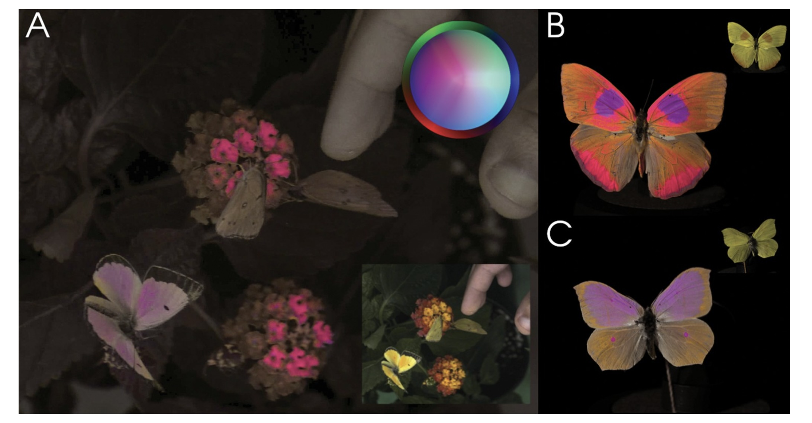
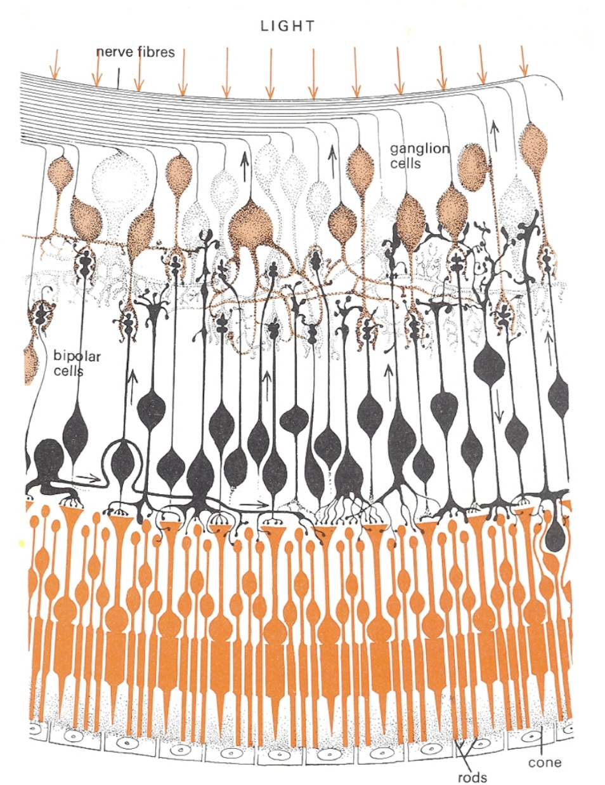
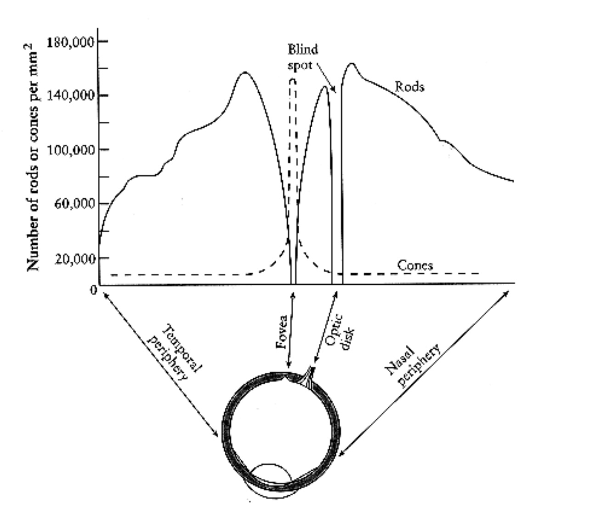
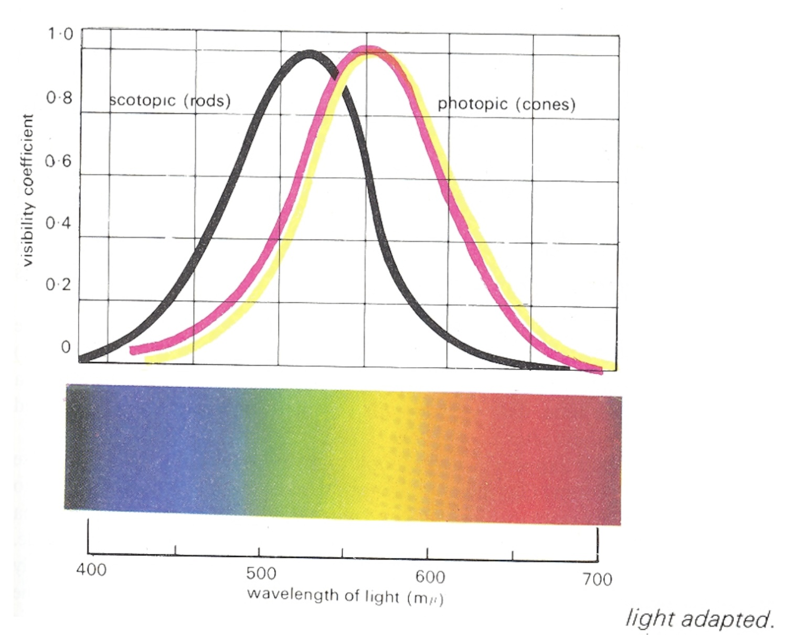
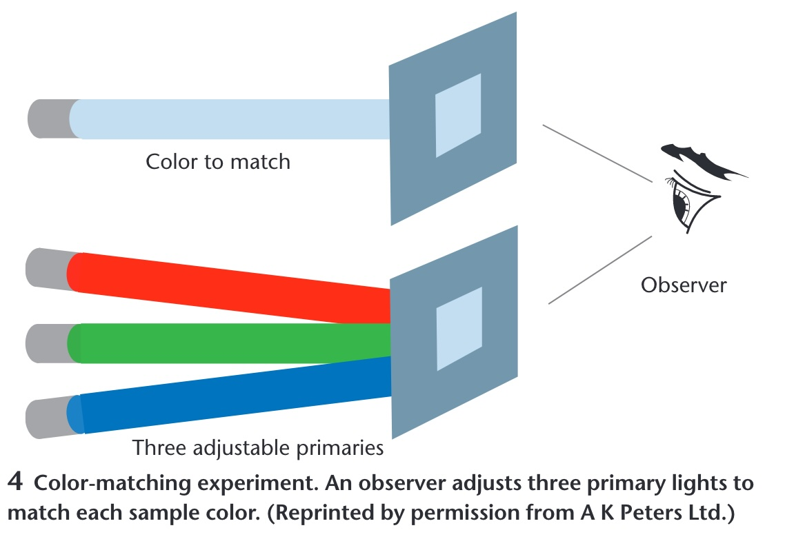
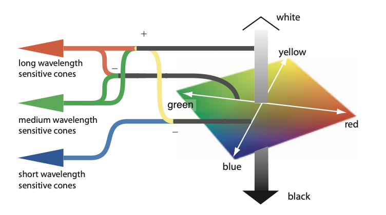
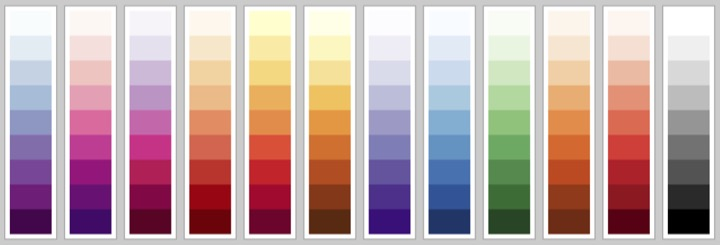
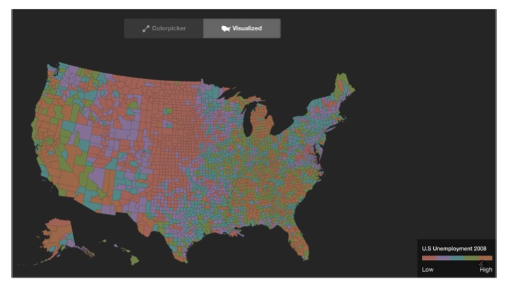

## Color

Vasas et al, PLOS Biology, 2024

::: footer
Image from [link](https://journals.plos.org/plosbiology/article?id=10.1371/journal.pbio.3002444)
:::

::: {.notes}
Vasas et al., PLOS Biology 2024: the same flowers and butterflies imaged in a false-color rendering of insect vision. Panel A is the scene as a bee would have it, with the small inset showing what we see; B and C are two butterflies, human view in the corner. Open with the claim this proves: color is not a property of the object. It is what a particular visual system does with a spectrum. Change the system and the pink flowers disappear.
:::

## Visible Spectrum

{.nostretch width="40%" fig-align="center"}

::: {.notes}
Roughly 390 to 700 nanometers, a narrow band. Every color anyone has ever seen lives on this strip or is a mixture of positions on it.
:::

## Light

* Visible range: 390-700nm

* Luminance has a large dynamic range:

  – 0.00003 -- Moonless overcast night sky 

  – 30 -- Sky on overcast day

  – 3000 -- Sky on clear day

  – 16,000 -- Snowy ground in full sunlight

* Colors result from spectral curves 

  – dominant wavelength, hue

  – brightness, lightness

  – purity, saturation

::: {.notes}
Two facts from this slide carry forward. Luminance spans about nine orders of magnitude and we handle all of it, which tells you the system is adaptive and relative, not absolute - keep that for the color-scale slides. And a color is a whole spectral curve, which we summarize with three words: hue for dominant wavelength, lightness for brightness, saturation for purity.
:::

## Physiology of the Eye

::: {.notes}
Standard cross-section. The only parts we need: light enters, is focused on the retina at the back, and the retina is where photons become signals.
:::

## The Retina

{.nostretch width="35%" fig-align="center"}

::: {.notes}
Cross-section of the retina, and it is wired upside down from what you would design. Light arrives at the top of the drawing, passes through the nerve fibres, past the ganglion cells and the bipolar cells, and only then reaches the photoreceptors - the rods and the one labelled cone - at the bottom, backed by the pigment epithelium. The signal then runs the other way, up the small arrows: photoreceptor to bipolar to ganglion cell, whose axons are the nerve fibres at the top that bundle into the optic nerve. Where that bundle leaves the eye there are no receptors - the blind spot on the density plot two slides on.

Two things to take from the wiring. Compression: on the order of a hundred million receptors converge onto about a million ganglion axons, so what leaves the eye is not a pixel array but a processed signal - contrasts, edges, and the opponent differences on slide 12 are computed right here, in these bipolar and ganglion layers. And this is peripheral retina: rods dominate and there is a single cone in frame. In the fovea it inverts - cones only, and the overlying layers are pushed aside so light hits them directly. Detail and colour live where you look and nowhere else.
:::

## Photoreceptors

* Discrete sensors that measure energy 
  – Adaptation
* Rods
  - active at low light levels (scotopic vision)
  - only one wavelength-sensitivity function
* Cones
  - active at normal light levels (photopic)
  - three types: sensitivity functions with different peaks

::: {.notes}
Two receptor types, and the split matters more than the counts. Rods: on the order of a hundred million, one photopigment peaking near 500 nm, sensitive enough to work by starlight - but they saturate in daylight, so in any lit room they contribute almost nothing. And with one pigment they cannot signal colour at all: a rod cannot distinguish a dim green from a bright red, only how many photons arrived. Cones: a few million, three types with three sensitivity curves - the next slide - active at normal light levels. All of colour is a comparison between their three outputs.

The adaptation bullet is the one students skip. Receptors adjust their gain over many orders of magnitude - that is how the dynamic range on the Light slide is survivable - which means the signal sent onward is relative to the recent surround, not an absolute reading. Consequence for us: nobody reads a colour value off a screen; every colour is judged against its neighbours. Legends, reference marks and consistent backgrounds are not decoration, they are the measuring instrument.

One fact for your pocket: the ratio of L to M cones varies several-fold between people with normal colour vision, yet their colour judgements agree. The later stages normalise. First hint that colour is computed, not sensed.
:::

## Cone Sensitivity

{.nostretch width="55%" fig-align="center"}

::: footer
Image from [link](https://wrfranklin.org/Teaching/graphics-f2019/files/stone_colors.pdf)
:::

::: {.notes}
The three cone curves - S, M, L - peaking near 445, 545 and 565 nanometers. Two things to point at. M and L overlap almost entirely; they are separated by about 20 nanometers. That is why red-green deficiency is the common one - it takes very little to collapse them. And S is far away and sparse, which is why blue text on a dark background is hard to focus and why blue carries less detail.
:::

## Density of Cones

{.nostretch width="50%" fig-align="center"}

::: {.notes}
Receptors per square millimeter across the retina. Cones - dashed - are packed into the fovea and almost absent elsewhere. Rods - solid - peak about twenty degrees out and are zero at the fovea. The gap at the optic disk is the blind spot. Consequence for design: you have color vision only where you are looking. Peripheral color coding does not work, and a colored alert in the corner is invisible until an eye movement finds it.
:::

## Cones and Rods

::: {.notes}
Spectral sensitivity of the two systems, each normalised to its own peak - so the curves show shape, not absolute sensitivity; in absolute terms rods are far more sensitive. Scotopic, the black curve, is rod vision, peaking near 507 nm in the blue-green. Photopic, the coloured curves, is cone vision - light-adapted, as the caption says - peaking near 555 nm in the yellow-green. The horizontal offset is the Purkinje shift: as light falls and vision hands over from cones to rods, sensitivity slides toward the blue end. Reds go dark first; blue-greens hold on longest. A red flower at dusk looks black while the leaves still look grey-green.

Between the two regimes is the mesopic range - dim rooms, dusk, a lecture hall with the lights half down - where both systems contribute and colour judgement is at its least reliable.

Three design consequences. A red alert is the worst possible choice for a dimmed or night-time environment - it is the first hue to vanish. Dark-mode dashboards behave differently in a bright office and at night because the viewer's adaptation state changed, not the pixels. And a projector room is closer to mesopic than your laptop is: small hue differences and desaturated palettes that look fine at your desk disappear on the wall. Test on the projector.
:::

## Color Stimulus

::: {.notes}
Maureen Stone's figure, and the most important slide in the deck. A spectrum - an entire curve - is multiplied by the three cone curves and integrated. Out come three numbers: S, M, L. Everything about the curve that is not captured by those three integrals is gone. Consequence: infinitely many different spectra produce the same three numbers, so they look identical. Those are metamers, and they are the reason a screen with three primaries can show you a color at all.
:::

## Color Matching Experiments

::: {.notes}
How the three-number claim was established. An observer sees a test color on one side and three adjustable primaries on the other and turns knobs until they match. It always works with three, never reliably with two. The CIE color spaces are these knob settings tabulated across the spectrum, which is why they are the standard - they are measurements of people, not physics.
:::

## Opponent Process Theory

:::: {.columns}
::: {.column width="40%"}
**Three cone signals are re-coded into three opponent channels**

* Black ↔ White — luminance: L + M
* Red ↔ Green — L - M
* Blue ↔ Yellow — S - (L + M)

* No "reddish green" or "bluish yellow": each pair shares one channel
* Afterimages appear in the opponent hue
:::
::: {.column width="60%"}
{width="100%" fig-align="center"}
:::
::::

::: footer
Hering, E. (1964). *Outlines of a Theory of the Light Sense*. Harvard University Press. (Original work published 1920); Hurvich, L. M., & Jameson, D. (1957). An opponent-process theory of color vision. *Psychological Review*, 64(6), 384-404.
:::

::: {.notes}
SKIPPABLE - new slide. If running long, go straight to Color in Visualization.

Read the figure left to right. Three cones - long, medium and short wavelength - feed junctions marked plus and minus. Long plus medium becomes the achromatic channel: the vertical grey bar on the right, white at the top, black at the bottom. Long minus medium becomes the red-green axis of the diamond. Short, set against long-plus-medium, becomes the blue-yellow axis. The diamond is the colour space the brain actually works in.

This is the second stage of a two-stage model. Stage one is trichromacy - the matching experiments on the previous slide established three receptor signals. Stage two, in the retinal ganglion cells and the LGN, re-codes them into one luminance channel and two colour-difference channels. Hering proposed it from phenomenology in the 1870s - you can picture a bluish green but never a reddish green - and Hurvich and Jameson quantified it in 1957 with hue cancellation; the physiology was found afterwards.

Why it is in this deck - four things downstream rest on it:

1. The luminance channel carries the finest spatial detail and the blue-yellow channel the coarsest. That is why quantity and detail belong in luminance (Quantify, Single Hue Sequential) and why small blue text is hard to read.
2. Red-green colour deficiency is a weakened L-minus-M channel - one opponent axis collapses. That is the Color Blindness slide, and the reason a diverging scale should straddle a different axis: blue-orange, not red-green (Diverging Color Scales).
3. CIELAB's a* and b* are exactly these two axes; perceptually uniform colour spaces are built on this.
4. Simultaneous contrast and afterimages are the channels rebalancing - a grey patch on a red field looks greenish.

Live demo, if you want a breakpoint that needs no network: have everyone stare at a saturated red square for thirty seconds, then look at the white wall. They will see green. Not a trick - it is this figure running in their heads.
:::

## Color in Visualization

* Trichromacy: Humans perceive colors according to three channels

* Most usable and useful way to describe colors (especially for visualization):
  - Hue, Saturation, Luminance

::: footer
Material from Enrico Bertini
:::

::: {.notes}
Trichromacy is the physiology; hue, saturation and luminance is the vocabulary - and the previous slide is why it is the right vocabulary. The opponent recoding turns three cone signals into one luminance axis and two colour-difference axes. Hue, saturation, luminance is that same space in polar coordinates: luminance is the vertical axis, hue is the angle around the red-green / blue-yellow plane, saturation is the distance out from grey. RGB, by contrast, is the monitor's coordinate system - three phosphor intensities - and nothing in perception lines up with it. Nobody experiences a colour as 'more R'.

From here on we treat H, S and L as three separate channels with separate jobs: luminance and saturation are magnitude channels, hue is an identity channel - the same split as the Effectiveness ranking in the perception deck this morning.

One caveat to plant now so it does not bite later: the HSL in CSS or a colour picker is a geometric convenience, not a perceptual one. Equal steps in CSS-HSL are not equal steps to the eye - a yellow and a blue at the same nominal lightness differ enormously in perceived brightness. The perceptually uniform versions are CIELAB, CIELUV and HCL, which is the space ColorBrewer and viridis were designed in. Design in HCL or Lab; convert to RGB only for the screen.
:::

## How do we use color in visualization?

* Quantify

* Label

::: footer
Material from Enrico Bertini
:::

::: {.notes}
Two jobs, and each wants the opposite kind of scale. Quantify: the attribute is ordered, so vary a magnitude channel - luminance, secondarily saturation - and hold hue fixed. Label: the attribute is categorical, so vary the identity channel - hue - and hold luminance roughly constant so no category shouts. That is the magnitude-versus-identity split from the perception deck applied to colour, and it is the single most useful sentence in this half of the lecture.

Almost every colour mistake you will grade this semester is a cross-use. A rainbow on a quantity - hue carrying magnitude - has no perceptual order, so the viewer cannot tell more from less without the legend. A light-to-dark ramp on categories invents an order that is not in the data and makes the darkest category look most important.

A third job sometimes gets listed - highlight, one saturated accent against a desaturated field - but it is label with a single category.

Before advancing, ask the room to call out which job each of the next two slides is doing. They will get it right, which is the point: obvious once named, and violated constantly anyway.
:::

## Quantify

::: footer
Material from Enrico Bertini
:::

::: {.notes}
NASA net primary productivity - kilograms of carbon fixed per square metre per year. Read the legend: two sequential ramps, white through green for land and white through blue for ocean, both monotone in luminance so higher is darker everywhere. That is the whole recipe for quantify: one hue family per quantity, luminance carries the number, light means low and dark means high.

Two subtleties students will meet. There are two hues here, green and blue, and that is not a violation: hue is doing the label job - land versus ocean - while luminance does the quantify job within each. The two jobs composed cleanly. And the grey - deserts, ice sheets, Antarctica - is missing or not-applicable data, placed outside the ramp in a neutral that cannot be mistaken for a low value. Never encode 'no data' as the bottom of the scale.

One to argue about: the legend runs from -0.5 to 2.5. Productivity goes negative where respiration exceeds photosynthesis, so strictly this is a diverging quantity around zero, yet the map uses a sequential ramp. Defensible - the negatives are small and rare, and a diverging scale would spend half its range on almost nothing. Hold that tension for the Diverging slide.
:::

## Label

{.nostretch width="50%" fig-align="center"}

::: footer
Material from Enrico Bertini
:::

::: {.notes}
Land cover around Portland: water, ice, urban, bare, forest, scrub, grass, crops, wetlands. Distinct hues at similar lightness, and there is no ordering among them because there is no ordering among the categories. Note the palette is not arbitrary either - the semantically resonant choices, blue for water and green for forest, make the legend almost unnecessary.
:::

## Quantitative Color Scales

* Desired Properties of Quantitative Color Scale:
  - Uniformity (value difference = perceived difference)
  - Discriminability (as many distinct values as possible)

::: footer
Material from Enrico Bertini
:::

::: {.notes}
Two properties. Uniformity: equal steps in the data should look like equal steps in color, which is where the rainbow fails - it has visible bands at yellow and cyan that the data does not have. Discriminability: as many distinguishable levels as you can get. Luminance ramps deliver both; hue ramps deliver neither.
:::

## Single Hue Sequential Scales

* Choose one hue
* Map value to luminance

::: footer
Material from Enrico Bertini
:::

::: {.notes}
Twelve single-hue ramps, ColorBrewer style. Each one fixes a hue and walks luminance from near-white to near-black. Any of these is a safe default for quantify. Ask them to pick the one with the most discriminable steps - the answer is that they are all about the same, six to eight, and that is the ceiling for an unlabeled color scale.
:::

## Categorical Color Scales

:::: {.columns}
::: {.column width="40%"}
* Properties:
  - Uniformity (uniform saliency / nothing stands out)
  - Discriminability (as many distinct values as possible)
:::
::: {.column width="60%"}
{width="100%" fig-align="center"}
:::
::::

::: footer
Material from Enrico Bertini
:::

::: {.notes}
Read the legend before saying anything: this is U.S. county unemployment, a quantitative variable, drawn with a categorical palette. Nothing reads as high or low - the map is noise. The two properties on the slide, uniform saliency and discriminability, are exactly right for labels and exactly wrong for a quantity. Use this as the negative example: this is what the quantify job looks like when handed the label tool.
:::

## Categorical Color Scales

* How many distinct values can one perceive?

* how many can you use in a visualization?

* Estimates are between 5-10 distinct codes.

* Healey, Christopher G. "Choosing effective colours for data visualization." Proceedings of IEEE Visualization'96, 1996.

::: footer
Material from Enrico Bertini
:::

::: {.notes}
Healey 1996 and everything since land in the same range: five to ten distinguishable categorical codes, and the low end of that range if the marks are small or the viewing is quick. Beyond that, group the categories or use a different channel. Same message as the discriminability slide in the perception deck, now with a citation.
:::

## Diverging Color Scales

* Sometimes useful/necessary to distinguish values above and below a threshold.

::: columns
::: {.column width="50%"}

:::

::: {.column width="50%"}

:::

:::

Created using these data: [link](https://github.com/tonmcg/County_Level_Election_Results_12-16)

::: footer
Material from Enrico Bertini
:::

::: {.notes}
Same county data twice. Left, a single-hue sequential ramp: you can see where values are high, but there is no way to see where they cross a threshold. Right, a diverging orange-to-blue scale with a light neutral in the middle: above and below the midpoint are now different hues, and the crossover is visible at a glance. Use diverging only when the midpoint means something - zero, fifty percent, an average. If it does not, you have invented a threshold.
:::

## Color Blindness

:::: {.columns}
::: {.column width="40%"}
* Missing or defective photoreceptors:
   - 10% male and 1% female have some color deficiencies

Oliveira, Manuel. "Towards More Accessible Visualizations for Color-Vision-Deficient Individuals." Comput. Sci. Eng., 2013.
:::
::: {.column width="60%"}
{width="100%" fig-align="center"}
:::
::::

::: footer
Material from Enrico Bertini
:::

::: {.notes}
A colorblind-safety demonstration: the left panel is a red-green-blue dot pattern with a red shape hidden in it; the right panel is the same image under a deuteranopia simulation, and the shape is gone because red and green have collapsed. Roughly eight percent of men - the ten percent on the slide is the generous figure. In a class of seventy-five, expect three. Practical rules: never encode a critical distinction as red versus green alone; keep luminance differences in every palette so it survives the collapse; and run your palette through a simulator before you ship it. Close the deck on that - the last four slides were all about choosing scales, and this is the test every choice has to pass.
:::
