## Perception for Design

{.nostretch width="35%" fig-align="center"}

::: {.notes}
Frame the whole session in one sentence: everything on these slides is a fact about the viewer, not about the data. Ware's book is the source for the first half; Bertini's and Munzner's material for the second.
:::

## Brain 

"Visual thinking consists of a series of acts of attention, driving eye movements, and tuning our pattern finding circuits", Colin Ware

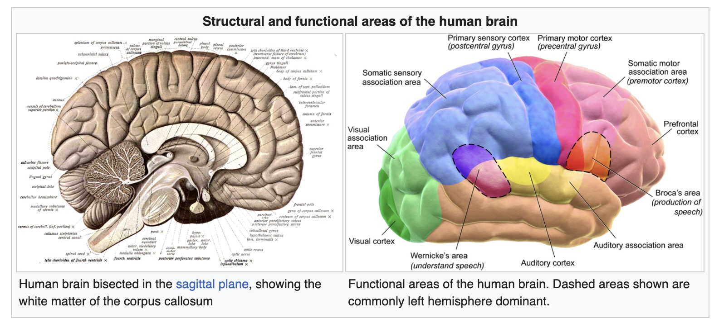

::: footer
Image from Wikipedia: [link](https://en.wikipedia.org/wiki/Human_brain)
:::

::: {.notes}
Read the Ware quote slowly - three verbs: attention, eye movements, pattern finding. The next forty minutes is those three verbs in that order. Design is not about what is on the screen; it is about what the loop does with it.
:::

## The Vision Brain 

"Visual thinking consists of a series of acts of attention, driving eye movements, and tuning our pattern finding circuits", Colin Ware

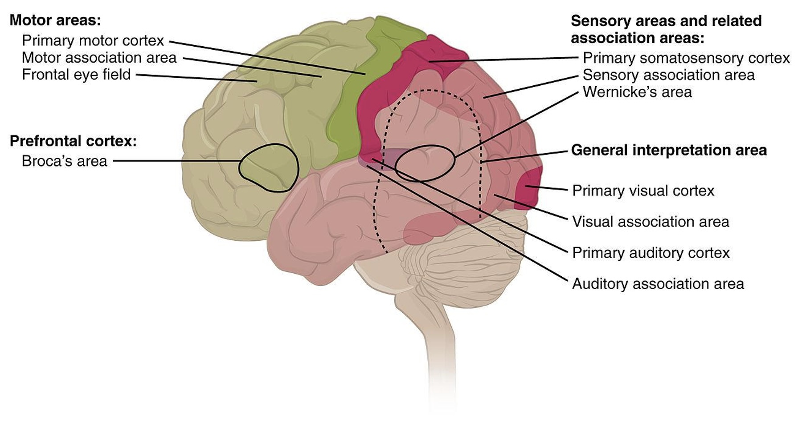

::: footer
Image from Wikipedia: [link](https://en.wikipedia.org/wiki/Human_brain)
:::

::: {.notes}
Same quote, now with the visual areas lit up at the back of the brain. Roughly a third of cortex is doing vision. That is the resource we are designing for, and it is the reason a good chart feels effortless: it hands the work to hardware that was going to run anyway.
:::

## The Act of Perception

* Bottom-Up and Top-Down Processes

::: footer
Material from Colin Ware's book
:::

::: {.notes}
Ware's overview diagram. Read it left to right: eye -> features processed in parallel across the whole field (millions at once) -> patterns built out of features under attentional demand -> one to three objects held in visual working memory. Two arrows underneath: bottom-up drives pattern building, top-down attention reinforces what is relevant. Every slide that follows is a zoom into one box of this picture.
:::

## The Act of Perception

:::: {.columns}
::: {.column width="40%"}
* Bottom-up: information is successively selected and filtered into patterns as it passes a sequence of stages. Ware outlines three stages: 1) optical nerve to V1 Cortex; 2) use texture and colors to aggregate *patterns*; 3) visual objects are recognized in the *visual working memory*.
:::
::: {.column width="60%"}
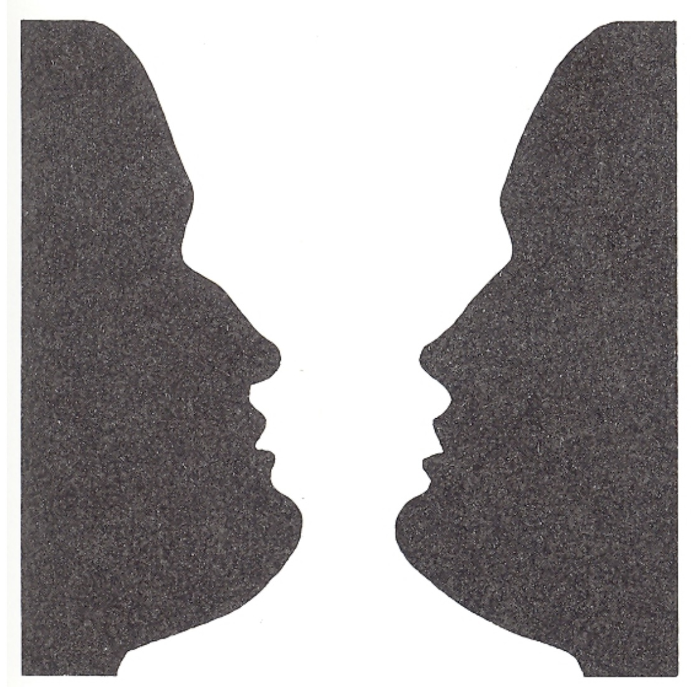{height="760" fig-align="center"}
:::
::::

::: footer
Image from the book: "Eye and Brain: The Psychology of Seeing", Gregory
:::

::: {.notes}
Bottom-up, in three stages: optic nerve to V1; texture and color aggregated into patterns; objects assembled in visual working memory. The face-vase is here because it shows stage three is not passive - the same input yields two objects and you cannot hold both at once. That is the one-to-three-object limit from the previous slide, felt.
:::

## The Act of Perception

* Top-Down: Every stage of bottom-up processing contains a corresponding top-down process. Ware describes the process as "attention". The dominant principle is that we only get the information that we need, when we need it.

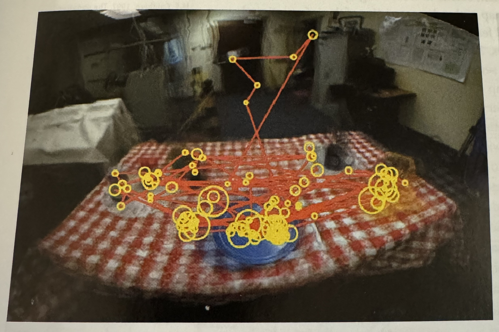

::: footer
Material from Colin Ware's book
:::

::: {.notes}
Top-down: this is an eye-tracking trace of someone looking at a table - yellow circles are fixations (bigger circle, longer dwell), red lines are saccades. Point out how little of the scene gets visited. We do not see the picture; we sample it, and attention decides the sampling. Ware's rule: we get the information we need, when we need it.
:::

## The Implications for Design

:::: {.columns}
::: {.column width="40%"}
* "Just-in-time visual queries" (Ware)

* "One way to look at how the brain operates is as a set of nested loops. Outer loops deal with generality while inner loops process detail." (Ware)
:::
::: {.column width="60%"}
{width="100%" fig-align="center"}
:::
::::

::: footer
Material from Colin Ware's book
:::

::: {.notes}
Nested loops: outer problem-solving loop, middle loop of visual pattern search via eye movements, inner loop of pattern testing. The design consequence is 'just-in-time visual queries' - the viewer asks the display a question with each saccade and expects an answer in one fixation. A visualization is good to the extent that the answer to the likely next question is already sitting where the eye lands.
:::

## Low-Level Feature Analysis

* David Hubel and Torsten Wiesel won Nobel prize for this discovery.

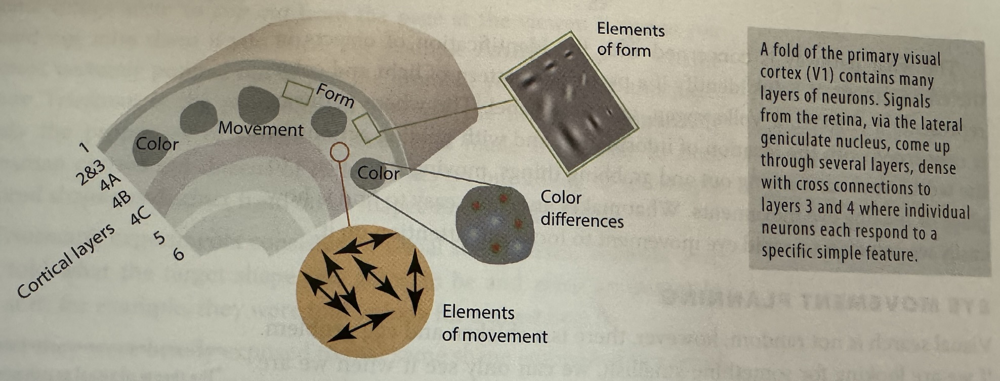

::: footer
Material from Colin Ware's book
:::

::: {.notes}
Hubel and Wiesel, Nobel 1981. A fold of V1 with neurons that each respond to one simple feature: an orientation, a color difference, a direction of motion. The inset patches are literally the receptive fields. This is why orientation, color and motion pop out on the next slides - there is dedicated hardware for them and nothing dedicated for, say, a juncture.
:::

## What and Where Pathways

:::: {.columns}
::: {.column width="40%"}
* What: identification of objects in environment.

* Where: location of objects and eye movement.
:::
::: {.column width="60%"}
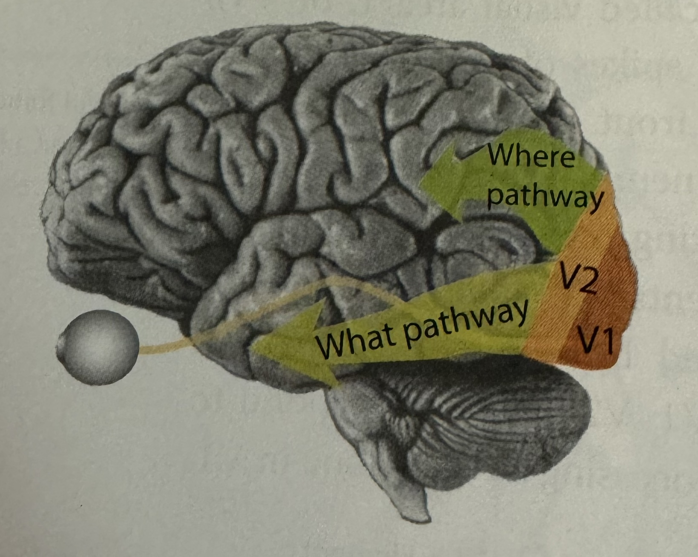{width="100%" fig-align="center"}
:::
::::

::: footer
Material from Colin Ware's book
:::

::: {.notes}
From V1 and V2 the signal splits. What pathway (ventral, along the bottom) identifies objects. Where pathway (dorsal, up top) handles location and drives eye movement. Layout is processed by a different system than identity, which is part of why position is such a strong channel.

And the two run at different speeds. The where/dorsal stream is fed mainly by the magnocellular cells - large, fast-conducting, transient, tuned to motion and luminance change, essentially color-blind. The what/ventral stream is fed mainly by the slower parvocellular cells - sustained, high-resolution, color-sensitive. In monkey recordings dorsal areas like MT respond within roughly 20 ms of V1; ventral IT, where identity lives, some 40-50 ms later. Goodale and Milner's reframing: dorsal is vision for action, fast and largely unconscious; ventral is vision for recognition, slower and conscious. You duck before you know what was thrown.

Two design consequences, both of which come back today. Motion and luminance change are caught by the fast system - that is why a flashing or moving element grabs attention before anyone knows what it is. And because the magno system runs on luminance, not hue, an alert that differs from its surroundings only in color at equal luminance is invisible to it. Hold that thought for the color deck.
:::

## What Stands Out (Popout)

* Anne Treisman studied how to find patterns and shapes when surrounded by others.

::: columns
::: {.column width="50%"}
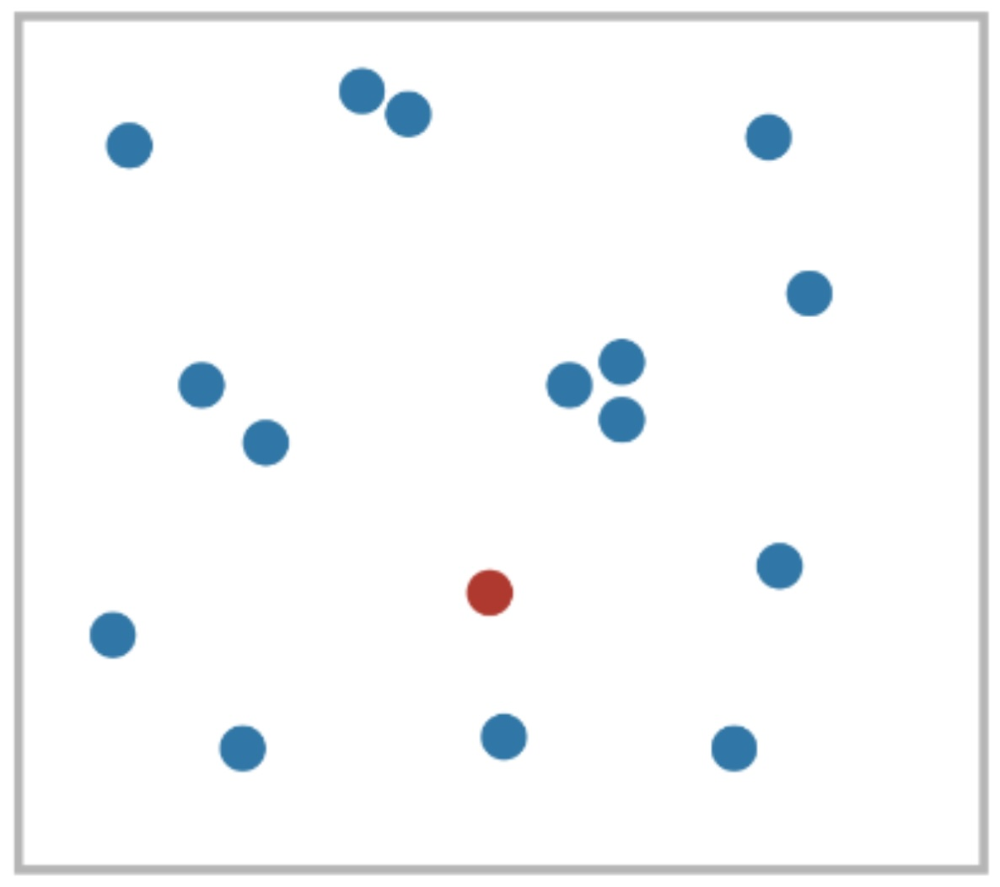
:::

::: {.column width="50%"}

:::

:::

For some configurations the time *did not* depend on the number of distracters (pre-attentive).

::: footer
Material from Colin Ware's book
:::

::: {.notes}
Two of Treisman's displays. Left: one red dot among blue - hue. Right: one vertical bar among horizontals - orientation. The finding: for these targets search time does not grow with the number of distractors. That flat line is the operational definition of pre-attentive. Ask them to count how long the red dot took. It did not take any time - that is the point.
:::

## What Stands Out (Popout)

::: footer
Material from Colin Ware's book
:::

::: {.notes}
Ware's two-by-two. Top left: an inverted T among Ts is hard, a bold T is easy - same feature set versus a new one. Top right: a backward L is hard, a green triangle is easy. Bottom left: a dot whose color is close to its neighbors cannot be tuned for; a red one can. Bottom right: a line among lines of similar orientation does not stand out. Pattern in all four: pop-out needs a feature the distractors do not share, not merely a different arrangement of the same features.
:::

## The Gestalt Principles [link, see video](https://www.interaction-design.org/literature/topics/gestalt-principles)

* Visualization is a two-way street:
  - We (the vis designer) bring something to the table.
  - The human (end user) brings their prior experience.
* Design should take such prior experience into account!
* What is prior experience? Gestalt laws.

::: footer
Material from Matt Berger
:::

::: {.notes}
Transition from hardware to habits. The viewer brings prior experience; the Gestalt laws are the parts of that experience we can rely on because everyone has them. Five coming up: closure, similarity, proximity, enclosure, connection. The link in the title goes to the Interaction Design Foundation's Gestalt page, which has an embedded video plus a written explainer. If you want to play the video it needs the network; it works as a short breather before walking through the five principles.
:::

## Closure

:::: {.columns}
::: {.column width="40%"}
* We can complete incomplete shapes

* Implications: visualizations can be unintentionally misleading! Conversely: sometimes only necessary to show sparse set of marks to convey trend (dot plot)
:::
::: {.column width="60%"}
{height="760" fig-align="center"}
:::
::::

::: footer
Material from Matt Berger
:::

::: {.notes}
Kanizsa triangle. There is no white triangle on this slide - three pac-men and three angles, and the brain draws the rest. Two consequences, both on the slide: you can mislead by accident because viewers will close shapes you did not intend; and you can be sparse on purpose - a dot plot works because closure connects the dots for you.
:::

## Similarity

:::: {.columns}
::: {.column width="40%"}
* Elements with the same visual properties considered to be grouped
:::
::: {.column width="60%"}
{height="760" fig-align="center"}
:::
::::

::: footer
Material from Matt Berger
:::

::: {.notes}
Same color, same shape, same size means same group. It is that simple and that unavoidable - similarity is not something you switch on, it is something you fail to switch off.
:::

## Similarity

* Elements with the same visual properties considered to be grouped

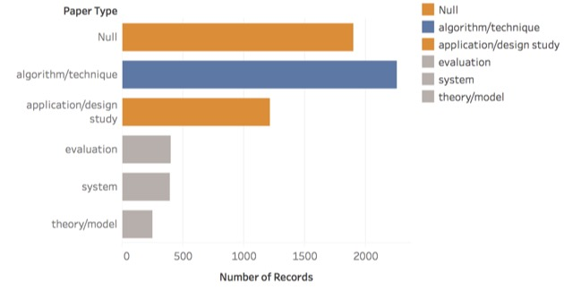

::: footer
Material from Enrico Bertini
:::

::: {.notes}
Here it is doing damage. A bar chart of paper types where Null and application/design study happen to share the same orange while algorithm/technique is blue. Whether or not anyone intended it, the eye groups Null with application/design study. Ask: what does this chart claim? Then: did the author mean to claim it? Color assignment is a claim.
:::

## Proximity

:::: {.columns}
::: {.column width="40%"}
* Elements that are of close spatial proximity are somehow grouped. 
:::
::: {.column width="60%"}
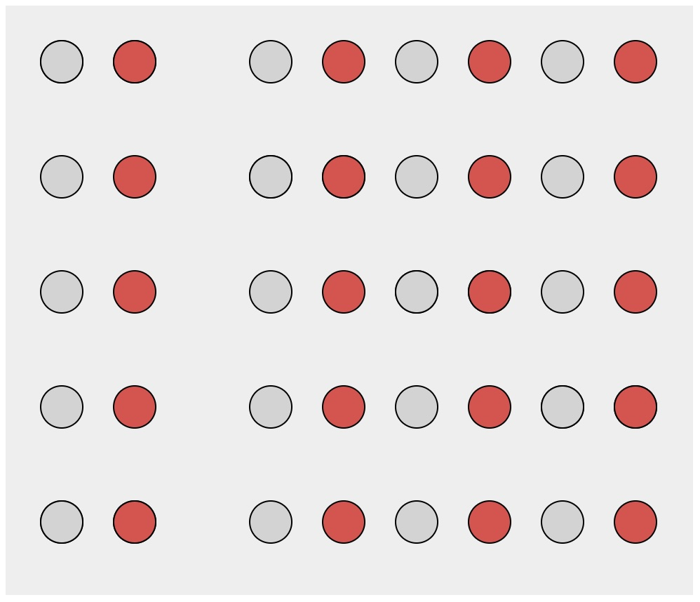{height="760" fig-align="center"}
:::
::::

::: footer
Material from Matt Berger
:::

::: {.notes}
Things close together are a group. The diagram is the pure case.
:::

## Proximity

* Elements that are of close spatial proximity are somehow grouped. 

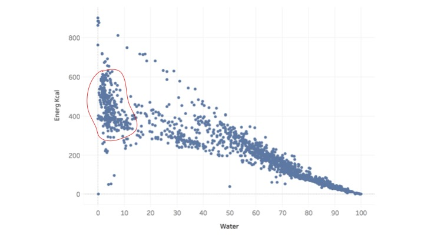

::: footer
Material from Enrico Bertini
:::

::: {.notes}
A real scatterplot - energy versus water content of foods - with a loop drawn around the dense cluster near zero water. The loop was drawn afterward; the cluster was visible before it. That is proximity working for you: clustering is a perceptual freebie. Note the loop itself is enclosure, two slides on.
:::

## Enclosure

:::: {.columns}
::: {.column width="40%"}
* Explicit visual encoding of enclosure also depicts grouping.
:::
::: {.column width="60%"}
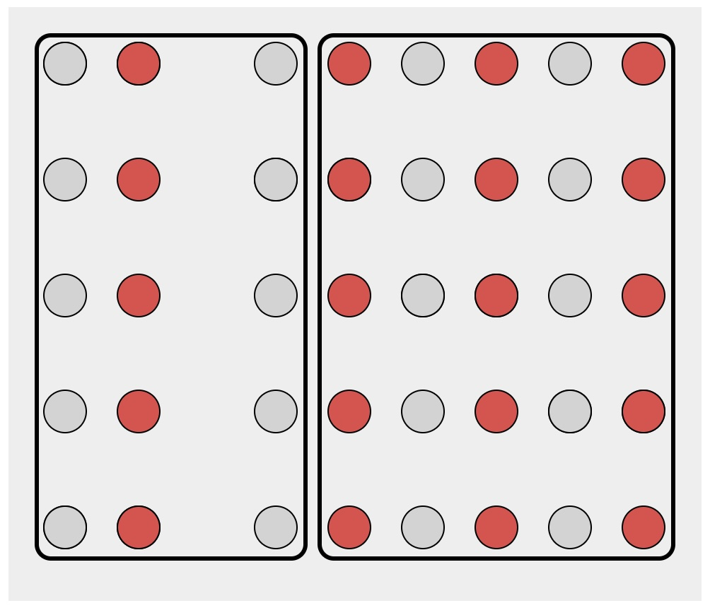{height="760" fig-align="center"}
:::
::::

::: footer
Material from Matt Berger
:::

::: {.notes}
Two boxes. Inside each box the dots are a grid of grey and red, and the red columns line up across the boxes - but the boxes win. Enclosure overrides both proximity and similarity. It is the strongest grouping cue on this list, which is exactly why you should spend it carefully.
:::

## Enclosure

:::: {.columns}
::: {.column width="40%"}
* Explicit visual encoding of enclosure also depicts grouping.

[Bubblesets video link](https://www.youtube.com/watch?v=P6CgBmIiXaE)
:::
::: {.column width="60%"}
{height="760" fig-align="center"}
:::
::::

::: footer
Material from Enrico Bertini
:::

::: {.notes}
Bubble Sets on a map of Manhattan: colored blobs wrapping sets of points that share membership even when they are spatially interleaved. The video link shows them recomputed live. This is enclosure used deliberately to draw groups that proximity would not give you.
:::

## Connection

* Objects connected together are perceived as a group.

::: footer
Material from Enrico Bertini
:::

::: {.notes}
A line between two objects makes them a group. The diagram shows the bare principle.
:::

## Connection

* Objects connected together are perceived as a group.

::: footer
Material from Enrico Bertini
:::

::: {.notes}
Two squares of very different size, connected. The line beats the size difference - you read a pair, not a big one and a small one. Connection overrides similarity of size.
:::

## Connection

* Objects connected together are perceived as a group.

::: footer
Material from Enrico Bertini
:::

::: {.notes}
A circle connected to a square. Connection beats shape similarity too. In the ranking of grouping cues, connection sits above similarity and proximity and below only enclosure.
:::

## Connection

* Objects connected together are perceived as a group.

::: footer
Material from Enrico Bertini
:::

::: {.notes}
And this is why a line chart works at all. Seven dots with lines between them are read as one thing with a shape - a trend - rather than seven values. Remove the lines and you have a dot plot, which is read as individual values. Same data, different Gestalt, different question answered.
:::

## Just Noticeable Difference (JND)

:::: {.columns}
::: {.column width="40%"}
* In psychophysics a just-noticeable difference or JND is the amount something must be changed in order for a difference to be noticeable, detectable at least half the time. 

* Stevens's power law: [link](https://en.wikipedia.org/wiki/Stevens%27s_power_law)
:::
::: {.column width="60%"}
{height="760" fig-align="center"}
:::
::::

::: footer
Wikipedia: [link](https://en.wikipedia.org/wiki/Just-noticeable_difference)
:::

::: {.notes}
JND: the smallest change detectable half the time. The plot is Stevens' power law, perceived sensation equals intensity to some exponent, one curve per channel with its exponent: length 1.0 - what you see is what is there; area 0.7 and depth 0.67 - systematically underestimated; brightness 0.5 - badly compressed; saturation 1.7 - exaggerated. Electric shock at 3.5 is on the chart for comedy but makes the point: exponents far from one mean the channel lies. Length is the only honest one here, which is the Cleveland-McGill result before Cleveland and McGill.
:::

## Accuracy

* How accurately a channel can express quantitative information

::: {.notes}
First of four channel properties - accuracy, discriminability, pop-out, separability. Accuracy is how faithfully the channel carries a quantity. The next four slides are the experiment that settled this.
:::

## Graphical Perception

::: columns
::: {.column width="50%"}

:::

::: {.column width="50%"}
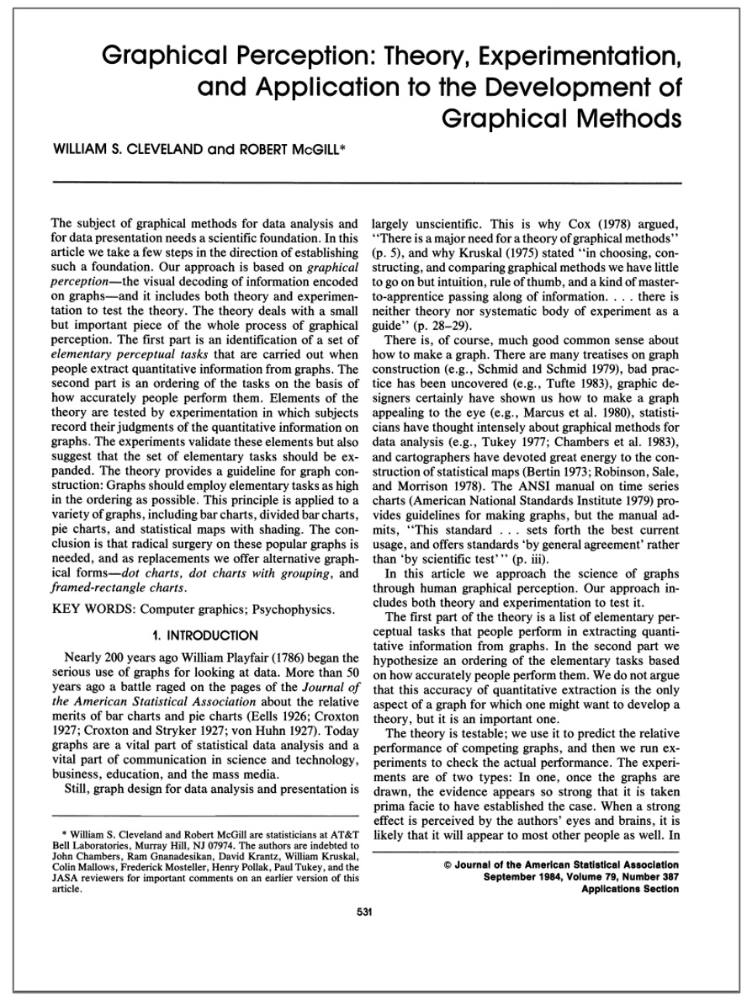
:::

:::

::: footer
Slides based on material from Prof. Enrico Bertini
:::

::: {.notes}
Cleveland and McGill, 1984, JASA. The paper that turned 'which chart is better' from taste into measurement. Method: show people two marked values, ask for the ratio, measure the error.
:::

## Graphical Perception Experiment

::: footer
Slides based on material from Prof. Enrico Bertini
:::

::: {.notes}
The five stimulus types. Types 1 to 3 are bar charts where A and B sit on a common baseline - position. Type 4 is a stacked bar where A and B are segments starting at different heights - length. Type 5 same, stacked differently. The dots mark the two values to compare. Ask the room to estimate A over B in Type 1, then in Type 5. Nobody hesitates on 1.

What the subjects were actually asked, for every graph: first, which of the two marked values is the smaller; second, what percentage is the smaller of the larger. That is the whole task - a ratio judgment. Ten graphs of each of the five types, with true ratios spread roughly from 18% to 83% so nobody can default to 'about half'. Error was scored as log base 2 of (|judged minus true| + 1/8) - the eighth keeps a perfect answer finite - and the next slide plots the mean of that per type with 95% confidence intervals.

When you put Type 1 and Type 5 to the room, use the experiment's own wording - 'what percentage is the smaller of the larger?' - so their experience is the experiment, not a paraphrase of it.
:::

## Graphical Perception Results

{.nostretch width="90%" fig-align="center"}

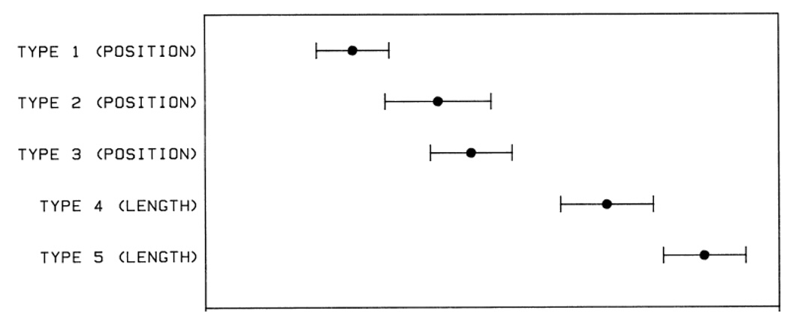{.nostretch width="55%" fig-align="center"}

::: footer
Slides based on material from Prof. Enrico Bertini
:::

::: {.notes}
Read the axes first. Horizontal is log base 2 of absolute error, averaged over all judgments of that type, so one unit to the right means the typical error doubled. Each row is a stimulus type; the dot is the mean and the bar is a 95% confidence interval.

Now the ordering, top to bottom: error rises monotonically from Type 1 to Type 5, exactly as the theory predicted before the data came in. Types 1 to 3 are position judgments - the two marked values sit on a common baseline. Types 4 and 5 are length judgments - the marked segments float mid-bar with no shared baseline.

Point at the gap. The three position types sit together on the left; the two length types sit together on the right; and the interval for Type 3 does not reach the interval for Type 4. That clean break between the clusters is the finding. Inside the clusters it is muddier - Types 2 and 3 overlap, and 4 and 5 nearly touch - so do not oversell the fine ordering.

Two second-order effects worth a sentence each. Within position, Type 1 (the two bars adjacent) beats Type 3 (the two bars in different groups): distance hurts - comparing things far apart is harder even on a common scale. Within length, Type 5, where the segments are offset vertically, is worst of all.

From this and their companion position-versus-angle experiment (bars versus pies, same task, position won again) Cleveland and McGill wrote down the ranking the next two slides are built on: position on a common scale, then position on non-aligned scales, then length, direction and angle, then area, then volume and curvature, then shading and saturation.

Caveats a sharp student will raise, and the answers: yes, it is one lab with a few dozen subjects and ratios only between about 18% and 83%. But Heer and Bostock replicated the whole thing on Mechanical Turk in 2010 with hundreds of participants, got the same ordering, and extended it to area - circles and rectangles - which landed below length, exactly where the ranking put them.
:::

## Accuracy

* Position > Length and Angle > Area

* Prioritize high-rank channels (with reason)

* Do not expect precise judgments from low-rank channels

::: footer
Slides based on material from Prof. Enrico Bertini
:::

::: {.notes}
The takeaway, in order: position beats length and angle, which beat area. Use the high-rank channels for the quantity you most need read correctly. And do not expect precision from the low-rank ones - if the number matters, do not put it in a color.
:::

## Effectiveness Effect

::: {.notes}
Munzner's channel ranking, Figure 5.6. Left column, ordered attributes, most to least effective: position on common scale, position on unaligned scale, length, tilt, area, depth, luminance and saturation, curvature and volume. Right column, categorical attributes: spatial region, hue, motion, shape. Two things to point out. The columns are different - hue is near the top for identity and near the bottom for magnitude. And 'Same' brackets pair channels that are equally weak. This figure is the answer key for the encoding decisions they will make for the rest of the course.
:::

## Discriminability

* How many distinct values can be distinguished within a channel

* It depends on:
  - Channel properties
  - Spatial arrangement
  - Size (resolution)
  - Cardinality

* Warning: Do not overestimate the number of values viewers can perceive/discriminate

::: footer
Slides based on material from Prof. Enrico Bertini
:::

::: {.notes}
Second property: how many distinct levels a channel can carry. It depends on the channel, on how the marks are arranged, on how big they are, and on how many levels you actually need. The warning line is the important one - designers reliably overestimate this.
:::

## Discriminability

* Many channels, in particular identity channels, can only support a limited number of discriminable levels.
    - Line width is one of the most limited with perhaps 3 levels.
    - Using more than 5 or 6 color hues is not recommended.
    - Similarly, using more than 5 or 6 symbol shapes can create difficulties.
* If the number of levels that can be represented by a channel is smaller than the number of attribute levels then some form of meaningful aggregation is needed.

::: footer
Material from [link](https://homepage.divms.uiowa.edu/~luke/classes/STAT4580/percep.html#discriminability)
:::

::: {.notes}
Numbers to remember: line width, maybe three levels. Hue, five or six. Shape, five or six. If your attribute has twelve categories and your channel carries six, the channel is not going to expand - you have to aggregate the categories. Say this now because every student will try twelve hues at some point this semester.
:::

## Popout

* Tasks performed in less than 200 to 250 milliseconds.

* Faster than eyes movement initiation.

* Suggest processing by parallel low-level visual system.

::: footer
Slides based on material from Prof. Enrico Bertini
:::

::: {.notes}
Third property, now in Bertini's framing. Under 200 to 250 milliseconds, faster than an eye movement can start, so it must be the parallel low-level system - the V1 hardware from earlier. This is the same phenomenon as Treisman's flat search curve, seen from the timing side.
:::

## Popout

{.nostretch width="50%" fig-align="center"}

::: footer
Slides based on material from Prof. Enrico Bertini
:::

::: {.notes}
Same red-dot display as before, on purpose. If it is still instant the second time, that tells you pop-out does not habituate - it is not attention, it is architecture.
:::

## Some features are not pre-attentive

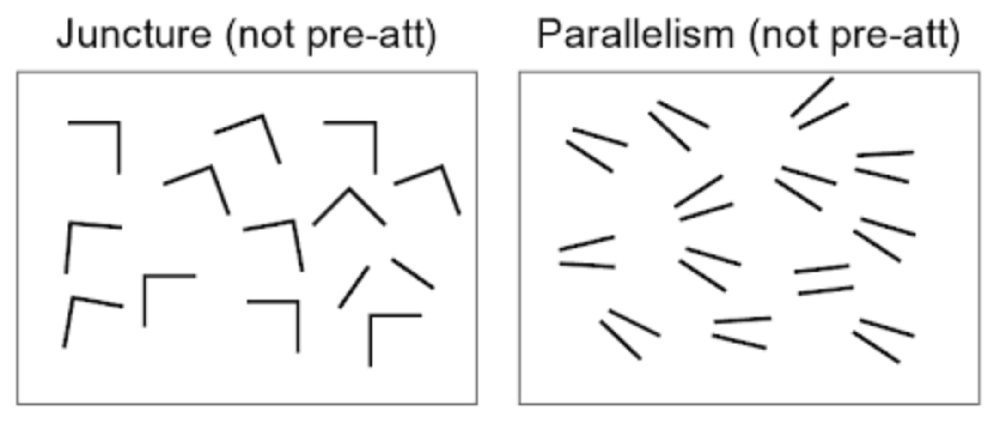

::: footer
Slides based on material from Prof. Enrico Bertini
:::

::: {.notes}
Two things that do not pop out: a juncture - the one L among corners - and parallelism - the one pair of parallel lines among near-parallel pairs. Both are relations between features rather than features. No V1 neuron fires for 'these two lines are parallel', so it takes a serial search.
:::

## Tasks requiring the use of multiple channels are (most of the time) not preattentive 

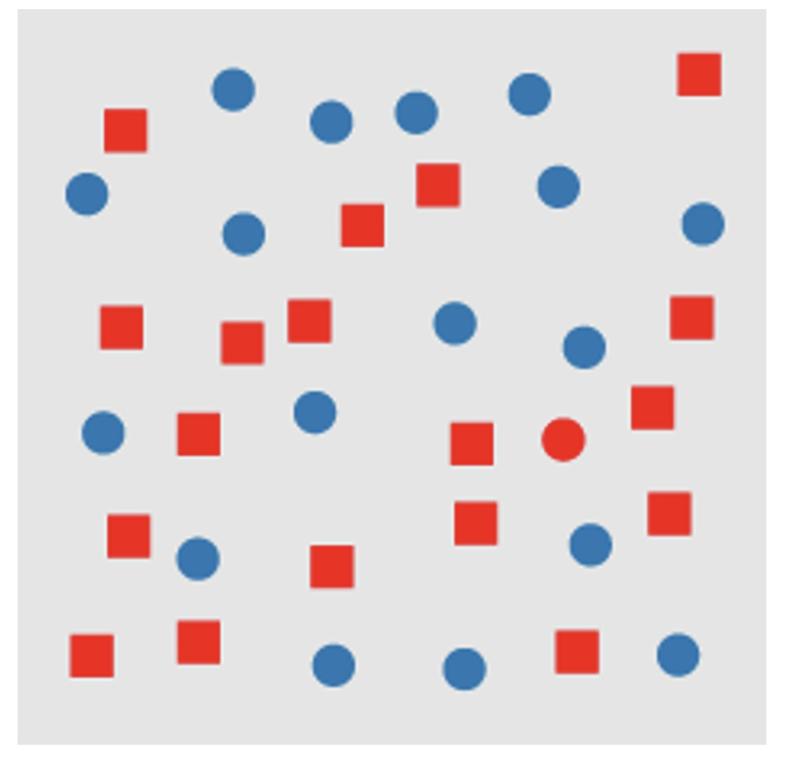{.nostretch width="45%" fig-align="center"}

::: footer
Slides based on material from Prof. Enrico Bertini
:::

::: {.notes}
Conjunction search. Red squares and blue circles, and one red circle. Each feature alone pops out; the combination does not - you have to scan. Design rule that falls straight out of this: encode the thing you want found in a single channel, not in the intersection of two.
:::

## Separability

:::: {.columns}
::: {.column width="40%"}
* Amount of interference between channels
:::
::: {.column width="60%"}
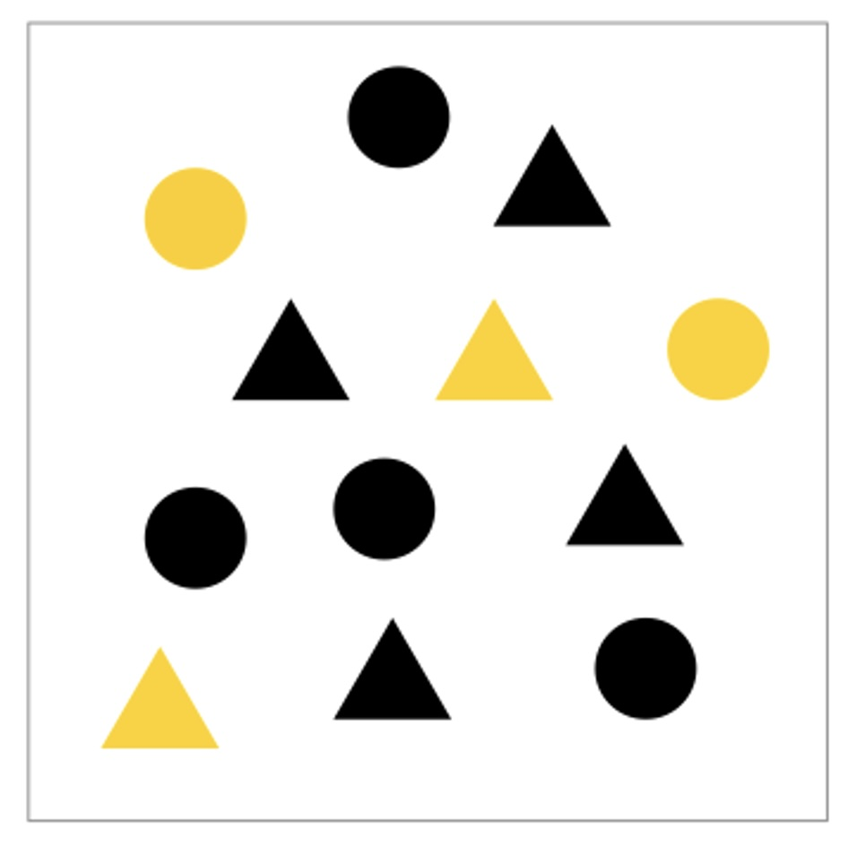{height="760" fig-align="center"}
:::
::::

::: footer
Slides based on material from Prof. Enrico Bertini
:::

::: {.notes}
Fourth property. Yellow and black, circles and triangles. You can attend to color and ignore shape, or attend to shape and ignore color - these two channels are separable. Not all pairs are: width and height of a rectangle fuse into 'size and shape' and cannot be read independently. Separable channels can encode two variables; integral ones cannot.
:::

## Relative vs Absolute

::: {.notes}
Three renderings of the same A and B. Left: bars floating with no common baseline - you compare lengths, badly. Middle: each bar inside its own frame - you read a fill fraction relative to the frame, which is a different question. Right: common baseline - position, and the answer is instant. This is Cleveland-McGill types 1 versus 4 as a design choice, and a good closing image before the color deck: the same data, three different questions answered, only one of them the one you asked.
:::
