# Model Assessment

## Agenda

\

1. Confusion Matrices and ROC Curves

2. Visual Analytics Systems for Model Performance

3. Calibration

::: {.notes}
Today we're going to talk about model assessment and evaluation. We'll start with some of the most common tools: confusion matrices and ROC curves. Then we'll look at some more advanced visual analytics systems for evaluating model performance. Finally, we'll do a deep dive into the concept of calibration, which is becoming increasingly important in modern machine learning.
:::

# Confusion Matrices, ROC Curves

## Scenario: Disease Prediction

* Consider a disease prediction model. Suppose the hypothetical disease has a 5% prevalence in the population

* The given model converges on the solution of predicting that nobody has the disease (i.e., the model predicts "0" for every observation)

* Our model is 95% accurate

* Yet, public health officials are stumped

::: {.notes}
This scenario illustrates a common problem with using a single metric like accuracy to evaluate a model, especially with imbalanced datasets. A model can achieve high accuracy by simply predicting the majority class, but it will be useless in practice. This is why we need more sophisticated evaluation methods.
:::

## Scenario: Handwritten Digits

:::: {.columns}
::: {.column width="55%"}
* Consider a model to identify handwritten digits. All digits are equally probable and equally represented in the training and test datasets.

* The model correctly identifies all of the digits, except for digit $5$, classifying half of the $5$s samples as $6$ and the other half is correctly identified

* The accuracy of this model is $95\%$. Is this information enough to determine whether the model is good or not?
:::
::: {.column width="45%"}
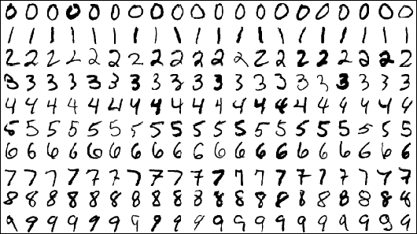{width="100%" fig-align="center"}
:::
::::

::: {.notes}
Second way accuracy misleads. The model is 95% accurate, but the 5% is not spread around: it is one systematic error, half of the 5s read as 6s. A single number cannot distinguish this model from one that makes a scattering of random mistakes, and the fix is completely different in the two cases. What we need is a view that shows which errors, not how many. The digits on the right are MNIST, which comes back on the Squares and Alsallakh slides.
:::

## Extended Confusion Matrix

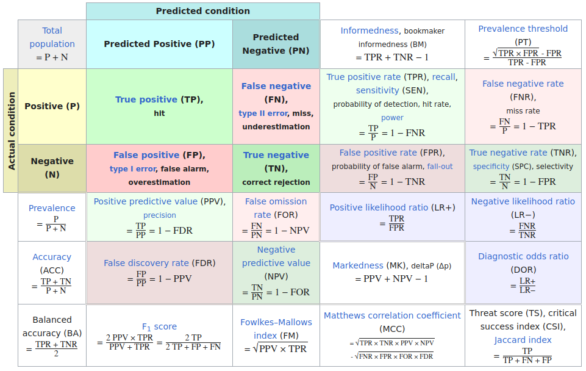{fig-align="center"}

::: footer
Table from Wikipedia: [Confusion matrix](https://en.wikipedia.org/wiki/Confusion_matrix)
:::

::: {.notes}
Wikipedia's table, and it is worth a minute because the whole first third of the lecture lives in it. The coloured two-by-two in the top left is the confusion matrix: TP, FN, FP, TN. Everything else on the slide is a ratio of those four numbers. Point at the four we use today: true positive rate or recall (TP over P) and false positive rate (FP over N) are the two axes of the ROC curve; precision or positive predictive value (TP over predicted positive) and recall are the two axes of the PR curve; accuracy is bottom left. Note that TPR and FPR each stay within one row, so they do not depend on class balance, while precision mixes the rows and does. That one observation explains the ROC versus PR discussion later.
:::

## Confusion Matrices: A Deeper Look

::::::: {.columns .smaller}
::: {.column}
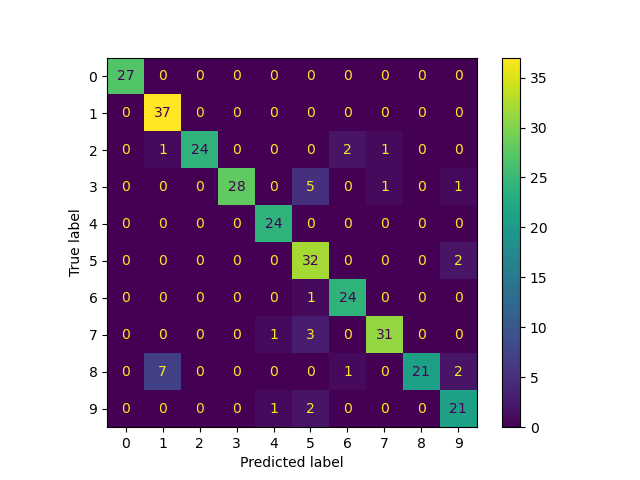{width="100%" fig-align="center"}
:::
::: {.column}

**Pros**

- **Intuitive:** Easy to understand the concept of correct and incorrect classifications.
- **Standardized Metrics:** Forms the basis for many standard evaluation metrics like precision, recall, and F1-score.
- **Error Analysis:** Helps to identify which classes are being confused with each other.

**Cons**

- **Scalability:** Can be hard to visualize and interpret for a large number of classes. The matrix becomes a large, dense grid.
- **Probabilistic Output:** Doesn't directly show the model's confidence in its predictions. A prediction that was 'barely wrong' is treated the same as one that was 'very wrong'.
- **Instance-level Detail:** Hides instance-level details. You can't see individual errors.
- **The "Squares" paper by Ren et al. (2016) points out that confusion matrices can obscure important patterns in model behavior and make it hard to prioritize what to fix.**

:::
::::

::: {.notes}
A real ten-class matrix from the scikit-learn digits example. Read it with them: the diagonal is bright, and the off-diagonal mass is concentrated in a few cells: seven 8s read as 1s, five 3s read as 5s, three 7s read as 5s. That is the 'which errors' view the last slide asked for. Then the limits, on the right. It does not scale past a few dozen classes. It throws away the scores: a prediction that was barely wrong looks the same as one that was confidently wrong. And it hides the instances, so you cannot click through to the seven offending 8s. Squares, Neo and the confusion wheel, later today, are each an answer to one of those three complaints.
:::

## Confusion Matrices in sklearn

```{python}
#| echo: true
from sklearn import datasets
from sklearn.linear_model import LogisticRegression
from sklearn.model_selection import train_test_split

X,y = datasets.make_classification(5000, 10, random_state=42)
X_train, X_test, y_train, y_test = train_test_split(X, y, random_state=42)
clf = LogisticRegression(random_state=0)
```

```{python}
#| echo: true
#| output-location: column
import matplotlib.pyplot as plt
from sklearn.metrics import ConfusionMatrixDisplay

clf.fit(X_train, y_train)

ConfusionMatrixDisplay.from_estimator(clf, X_test, y_test, cmap=plt.cm.Blues)
plt.show()
```

::: {.notes}
The scikit-learn version, and the pattern repeats for every display today: build data, fit, then a Display class with from_estimator. Here it is a synthetic binary problem, 5,000 samples and 10 features, logistic regression. The figure on the right is the live output of the cell on the left, executed when the deck was rendered. Read the matrix: two large diagonal cells, two small off-diagonal ones, roughly balanced errors. The colour ramp is a single-hue sequential scale, the right choice from last week's colour lecture.
:::

## Neo: Hierarchical Confusion Matrix



::: footer
Görtler, J., Hohman, F., Moritz, D., et al. (2022). [*Neo: Generalizing Confusion Matrix Visualization to Hierarchical and Multi-Output Labels*](../refs/Goertler_Hohman_Moritz_2022_Neo_Confusion_Matrix.pdf). CHI.
:::

::: {.notes}
Neo is a research project that introduces a hierarchical confusion matrix. This is particularly useful when you have a large number of classes that have a natural hierarchy. For example, if you are classifying animals, you might have a hierarchy of mammals, birds, reptiles, etc. A hierarchical confusion matrix can help you see if your model is making errors at a high level (e.g., confusing a mammal for a bird) or at a low level (e.g., confusing a cat for a dog).
:::

## Receiver Operating Characteristic (ROC)

:::: {.columns}
::: {.column width="60%"}
* ROC analysis is another way to assess a classifier's output

* ROC analysis developed out of radar operation in the second World War, where operators were interested in detecting signal (enemy aircraft) versus noise

* We create an ROC curve by plotting the true positive rate (TPR) against the false positive rate (FPR) at various thresholds

    * **True Positive Rate (TPR)**, also known as Recall or Sensitivity, is the proportion of actual positives that are correctly identified as such (TP / (TP + FN)).

    * **False Positive Rate (FPR)** is the proportion of actual negatives that are incorrectly identified as positive (FP / (FP + TN)).
:::

::: {.column width="35%"}
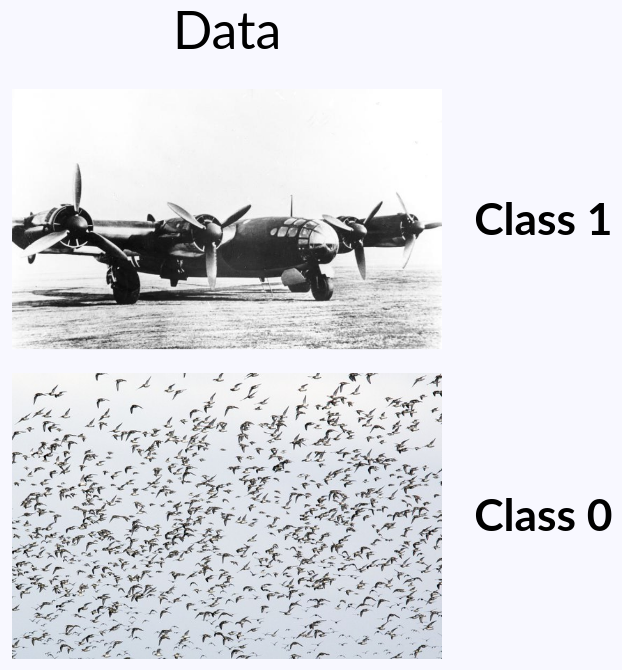{width="100%" fig-align="center"}
:::
::::

::: {.notes}
ROC comes out of signal detection theory and wartime radar: an operator looks at a blip and has to decide aircraft or flock of birds, which is exactly the picture on the right, class 1 and class 0. The operator's willingness to say 'aircraft' is a threshold. Lower it and you catch more aircraft and raise more false alarms. The ROC curve is the plot of that trade-off: true positive rate against false positive rate as the threshold sweeps. Both rates are defined on the slide; note each is computed within one true class, which is why the curve does not move when class balance changes.
:::

## ROC Curve

:::: {.columns}
::: {.column width="60%"}
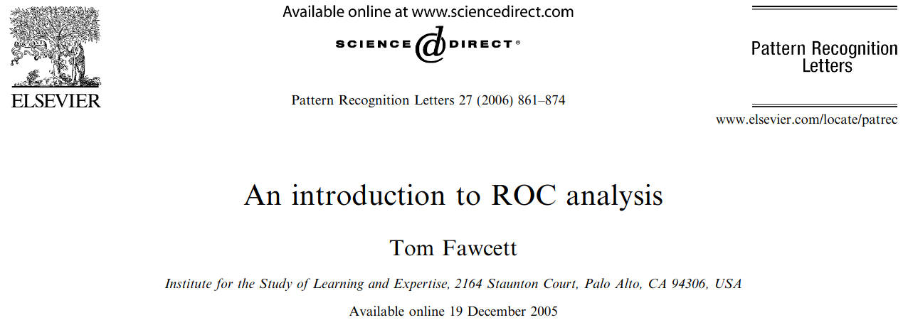{width="100%"}

::: {.fragment}
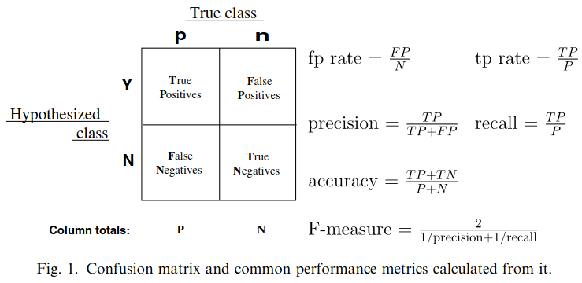{width="100%"}
:::
:::

::: {.column width="40%"}
::: {.fragment}
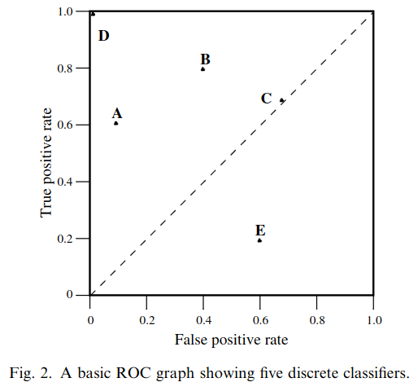{width="100%"}
:::
:::
::::

::: footer
Fawcett, T. (2006). [*An introduction to ROC analysis*](../refs/Fawcett_2006_Introduction_ROC_Analysis.pdf). Pattern Recognition Letters, 27(8), 861-874.
:::

::: {.notes}
Three figures from Tom Fawcett's 2006 tutorial, which is the reference for this section and is linked in the footer. First his confusion matrix, with the rates written out. Then, on the click, ROC space with five discrete classifiers. Walk through them: D at the top left is perfect. A is conservative, few false positives but it misses positives. B is more liberal. C sits on the diagonal, which is random guessing. E is below the diagonal, worse than random, and the classic remark is that E is informative: negate its output and you get a classifier above the diagonal. A discrete classifier is one point; a scoring classifier, next slide, traces a whole curve.
:::

## ROC Curve

:::: {.columns}
::: {.column width="45%"}
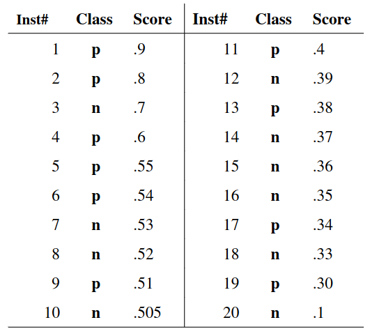{height="700" fig-align="center"}
:::

::: {.column width="55%"}
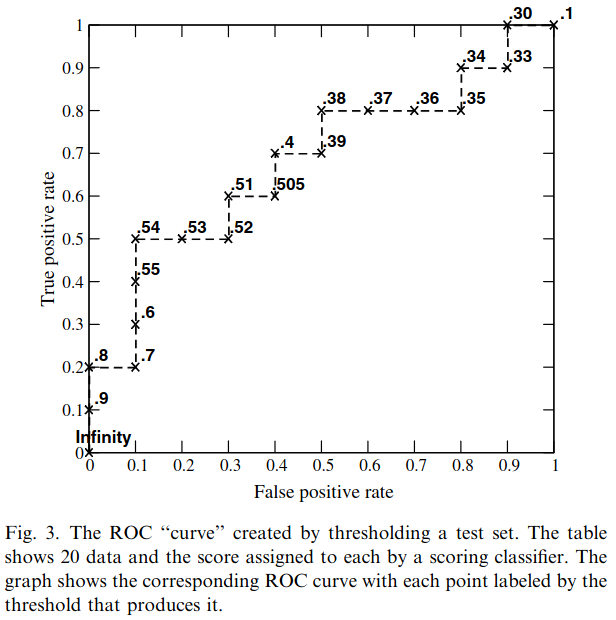{height="760" fig-align="center"}
:::
::::

::: footer
Fawcett, T. (2006). [*An introduction to ROC analysis*](../refs/Fawcett_2006_Introduction_ROC_Analysis.pdf). Pattern Recognition Letters, 27(8), 861-874.
:::

::: {.notes}
How the curve is built, Fawcett's Figure 3. Left: twenty test instances sorted by score, with their true class. Right: start at the origin with the threshold at infinity. Lower the threshold past each instance in turn: if it is a positive, step up; if it is a negative, step right. The labels on the curve are the thresholds. Ask them where threshold 0.5 lands and what the accuracy is there: 60 percent. Then ask where the best accuracy is: at 0.54, 70 percent. The default threshold is not the best one. The curve depends only on the ordering of the scores, not their values, which sets up the next slide.
:::

## ROC Curve

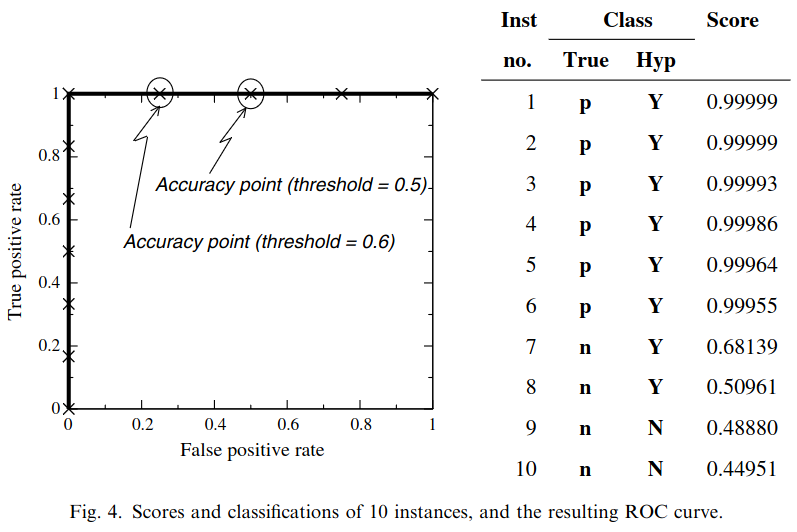{fig-align="center"}

::: footer
Fawcett, T. (2006). [*An introduction to ROC analysis*](../refs/Fawcett_2006_Introduction_ROC_Analysis.pdf). Pattern Recognition Letters, 27(8), 861-874.
:::

::: {.notes}
Fawcett's Figure 4, and it is the bridge to calibration. Ten instances. The ROC curve is perfect, it goes straight up and then straight across, because every positive outscores every negative. But at the default threshold of 0.5, instances 7 and 8, both negatives with scores 0.68 and 0.51, are called positive, so accuracy is 80 percent. At 0.6 it is 90 percent; anywhere between 0.69 and 0.99 it is 100 percent. So the ranking is perfect and the scores are wrong: they are not probabilities. That is a miscalibrated model, and it is exactly what Naive Bayes does. Hold that thought for the last third of the lecture.
:::

## Area under an ROC curve (AUC)

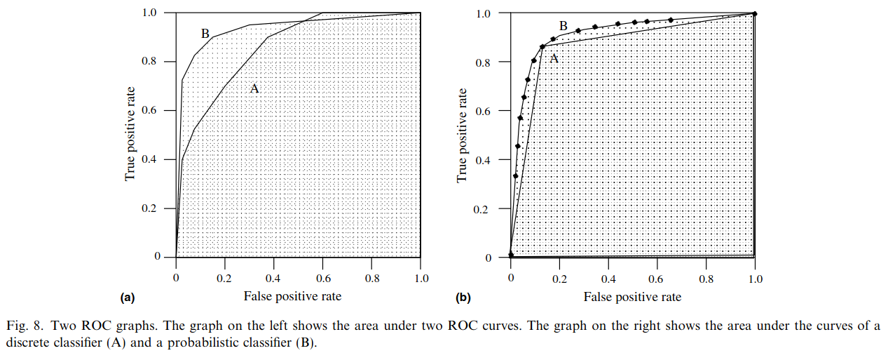{fig-align="center"}

::: footer
Fawcett, T. (2006). [*An introduction to ROC analysis*](../refs/Fawcett_2006_Introduction_ROC_Analysis.pdf). Pattern Recognition Letters, 27(8), 861-874.
:::

::: {.notes}
AUC, Fawcett's Figure 8. It has a clean interpretation: the probability that a randomly chosen positive is scored above a randomly chosen negative. One is perfect, 0.5 is chance. Left panel: B has the larger area and is better on average, but look past x equals 0.6, where A is on top. A single number hides crossings, so if you operate at a high false positive rate you would pick the 'worse' model. Right panel: a discrete classifier A is a single point, and its area is what you get by joining it to the corners; the scoring classifier B it was derived from dominates it. Summary numbers are for ranking models, the curve is for choosing an operating point.
:::

## ROC curve in sklearn

```{python}
#| echo: false
# Setup code - hidden from slides
from sklearn import datasets
from sklearn.linear_model import LogisticRegression
from sklearn.model_selection import train_test_split

X,y = datasets.make_classification(5000, 10, random_state=42)
X_train, X_test, y_train, y_test = train_test_split(X, y, random_state=42)
clf = LogisticRegression(random_state=0)
clf.fit(X_train, y_train)
print()
```

```{python}
#| echo: true
import matplotlib.pyplot as plt
from sklearn.metrics import RocCurveDisplay

RocCurveDisplay.from_estimator(clf, X_test, y_test, plot_chance_level=True)
plt.show()
```

::: {.notes}
Same recipe as the confusion matrix: RocCurveDisplay.from_estimator. The setup cell is hidden; it is the same synthetic data and logistic regression. The figure is live output. plot_chance_level draws the diagonal. The legend reports AUC of 0.94. Remind them what that number means from the previous slide, and that it says nothing about whether 0.5 is a sensible threshold.
:::

## Multiclass ROC curve

:::: {.columns}
::: {.column width="65%"}
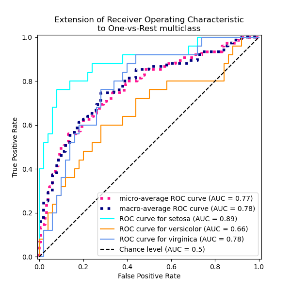{height="760" fig-align="center"}
:::
::: {.column width="35%"}
\

**Micro-average:** Aggregate contributions of all classes to calculate the metric. Useful if there is class imbalance.

**Macro-average:** Compute the metric for each class separately, then take average (treats all classes equally)
:::
::::

:::footer
[code](https://scikit-learn.org/stable/auto_examples/model_selection/plot_roc.html)
:::

::: {.notes}
Multiclass ROC from the scikit-learn iris example, one-versus-rest: one curve per class, that class against the other two. Setosa 0.89, virginica 0.78, versicolor 0.66, which tells you versicolor is the class the model struggles to separate. Then two ways to average. Micro pools every decision across classes and computes one curve, so big classes dominate: 0.77 here. Macro averages the per-class curves, every class counts equally: 0.78. They are close here because iris is balanced. On imbalanced data they diverge, and which one you report is a decision about whose errors matter.
:::

## ROC Curves: Strengths and Limitations

* **What they show:** True Positive Rate (TPR) vs. False Positive Rate (FPR)
* **Best for:** Balanced datasets
* **Limitation:** Can be misleading on imbalanced datasets because the FPR can be very small, even with a large number of false positives

::: {.notes}
ROC curves are widely used and intuitive, but they have an important limitation. On imbalanced datasets, the false positive rate can appear very small even when the model is making many false positive errors, simply because the denominator (total negatives) is very large. This can make a poor model appear better than it actually is.
:::

## Precision-Recall (PR) Curves

* **What they show:** Precision vs. Recall (TPR)
* **Best for:** Imbalanced datasets
* **Advantage:** A model that has high precision and high recall is truly a good model
* **Research insight:** As mentioned in "Visual methods for analyzing probabilistic classification data" by Alsallakh et al. (2014), PR curves are more informative than ROC curves when dealing with imbalanced datasets

::: {.notes}
Precision-Recall curves are often more informative than ROC curves, especially for imbalanced datasets. They focus directly on the performance for the positive class, which is usually the class of interest in imbalanced problems. The Alsallakh paper provides an excellent discussion on when to use PR curves over ROC curves.
:::

## Precision-Recall curve in sklearn

```{python}
#| echo: false
# Setup code - hidden from slides
from sklearn import datasets
from sklearn.linear_model import LogisticRegression
from sklearn.model_selection import train_test_split

X,y = datasets.make_classification(5000, 10, random_state=42)
X_train, X_test, y_train, y_test = train_test_split(X, y, random_state=42)
clf = LogisticRegression(random_state=0)
clf.fit(X_train, y_train)
print()
```

```{python}
#| echo: true
#| fig-cap: "Precision-Recall Curve"
import matplotlib.pyplot as plt
from sklearn.metrics import PrecisionRecallDisplay

PrecisionRecallDisplay.from_estimator(clf, X_test, y_test)
plt.show()
```

::: {.notes}
And here is how you can generate a Precision-Recall curve in scikit-learn. The `PrecisionRecallDisplay` works similarly to the other display objects we've seen. It takes a classifier and test data to generate the curve.
:::


# Visual Analytics Systems for Model Performance

## Squares (2016)

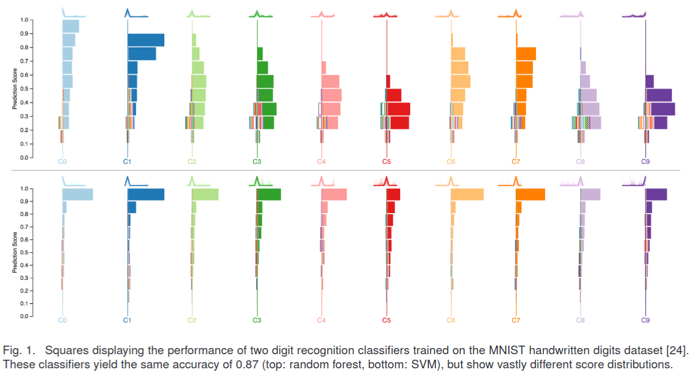{fig-align="center"}

:::footer
Ren, D., Amershi, S., Lee, B., Suh, J., & Williams, J. D. (2016). [*Squares: Supporting interactive performance analysis for multiclass classifiers*](../refs/Ren_Amershi_Lee_Suh_Williams_2016_Squares_Interactive_Performance_Analysis.pdf). IEEE TVCG.
:::

::: {.notes}
Squares, from Microsoft Research, and the reading for today. Read the caption with them because it is the whole argument: two MNIST classifiers, a random forest on top and an SVM below, with the same accuracy, 0.87. One column per class. Within a column, boxes are stacked by prediction score, high at the top. Solid boxes are correct predictions, striped boxes are errors, coloured by the class they were confused with. The SVM is confident: its mass sits at 0.9 and above. The random forest spreads its scores between 0.2 and 0.6. Same accuracy, completely different behaviour, and a confusion matrix would show them as nearly identical. This answers the 'it throws away the scores' complaint from earlier.
:::

---



::: {.notes}
This video demonstrates the Squares system in action. Pay attention to how the interactive nature of the tool allows for a more in-depth analysis of the classifier's performance compared to a static confusion matrix.
:::

## Alsallakh et al. (2014)

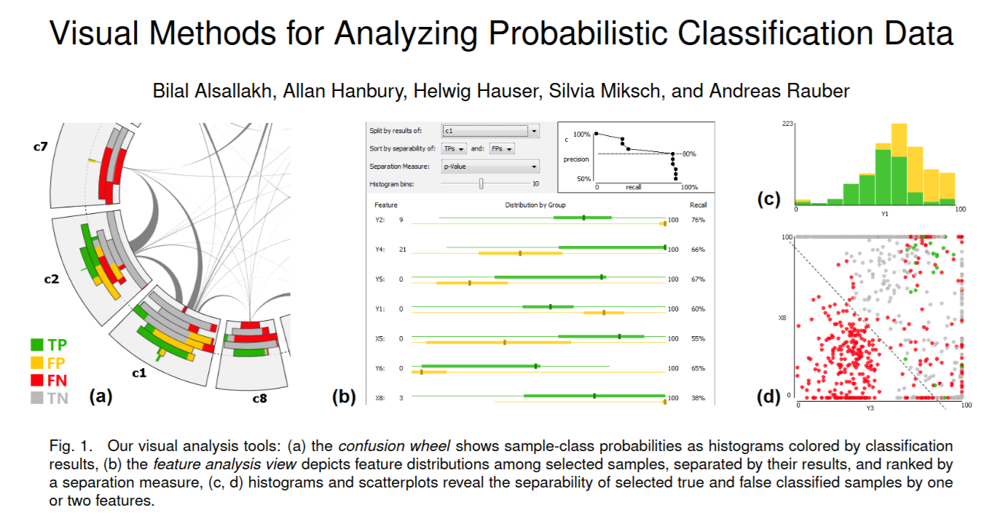{fig-align="center"}

:::footer
Alsallakh, B., Hanbury, A., Hauser, H., Miksch, S., & Rauber, A. (2014). [*Visual methods for analyzing probabilistic classification data*](../refs/Alsallakh_Hanbury_Hauser_Miksch_Rauber_2014_Visual_Methods_Analyzing_Probabilistic_Classification.pdf). IEEE TVCG.
:::

::: {.notes}
Alsallakh and colleagues, TVCG 2014, the teaser. Three linked views. (a) The confusion wheel: one sector per class, histograms of predicted probability inside each sector, coloured green for true positives, yellow false positives, red false negatives, grey true negatives; chords between sectors show confusion. (b) The feature analysis view: for a selected class, which features separate the true positives from the false positives, ranked by a separation measure. (c) and (d) histograms and scatterplots of the chosen features. The idea that carries forward: do not stop at 'which classes are confused', go on to 'which features explain the confusion'.
:::

## Alsallakh et al. (2014)

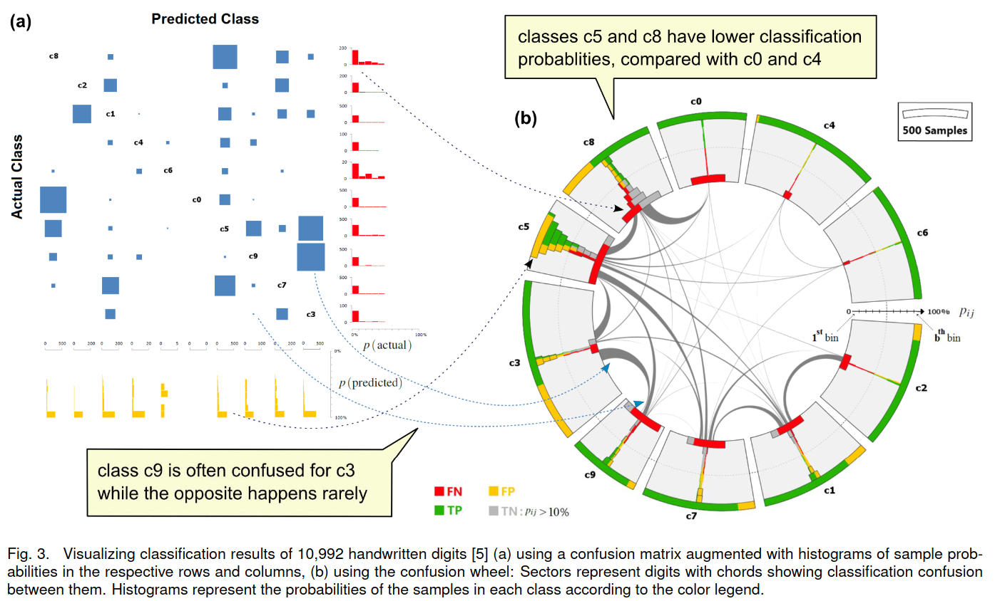{fig-align="center"}

:::footer
Alsallakh, B., Hanbury, A., Hauser, H., Miksch, S., & Rauber, A. (2014). [*Visual methods for analyzing probabilistic classification data*](../refs/Alsallakh_Hanbury_Hauser_Miksch_Rauber_2014_Visual_Methods_Analyzing_Probabilistic_Classification.pdf). IEEE TVCG.
:::

::: {.notes}
The same paper on 10,992 handwritten digits. Left, a confusion matrix drawn with squares sized by count and augmented with probability histograms along the rows and columns. Right, the confusion wheel. Read the two callouts: 'class c9 is often confused for c3 while the opposite happens rarely', which is an asymmetry you can see in the chord thickness at each end; and 'c5 and c8 have lower classification probabilities than c0 and c4', which you read off the histograms inside the sectors. A plain confusion matrix gives you the first with effort and cannot give you the second at all.
:::

## Beauxis-Aussalet and Hardman (2014)

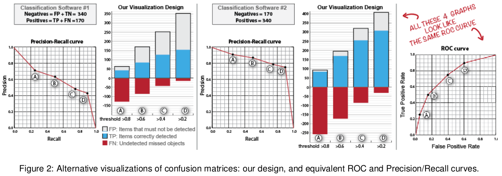{fig-align="center"}

:::footer
Beauxis-Aussalet, E., & Hardman, L. (2014). [*Visualization of confusion matrix for non-expert users*](../refs/Beauxis_Aussalet_Hardman_2014_Visualization_Confusion_Matrix_Non_Expert_Users.pdf). IEEE VAST.
:::

::: {.notes}
Beauxis-Aussalet and Hardman, VAST 2014, designing for non-experts, and the red handwriting is the point. Two classifiers, one tested on 340 negatives and 170 positives, the other with the proportions reversed. Their ROC curves are identical, because ROC is built from within-class rates. Their precision-recall curves differ. And the authors' own design, stacked bars by threshold with true positives in blue, false positives in grey above, and missed objects in red below the axis, shows raw counts, so the difference is obvious. This is the concrete version of 'ROC can mislead under class imbalance': it does not mislead, it simply does not show class proportions, and the end user usually cares about counts.
:::

## Beauxis-Aussalet and Hardman (2014)

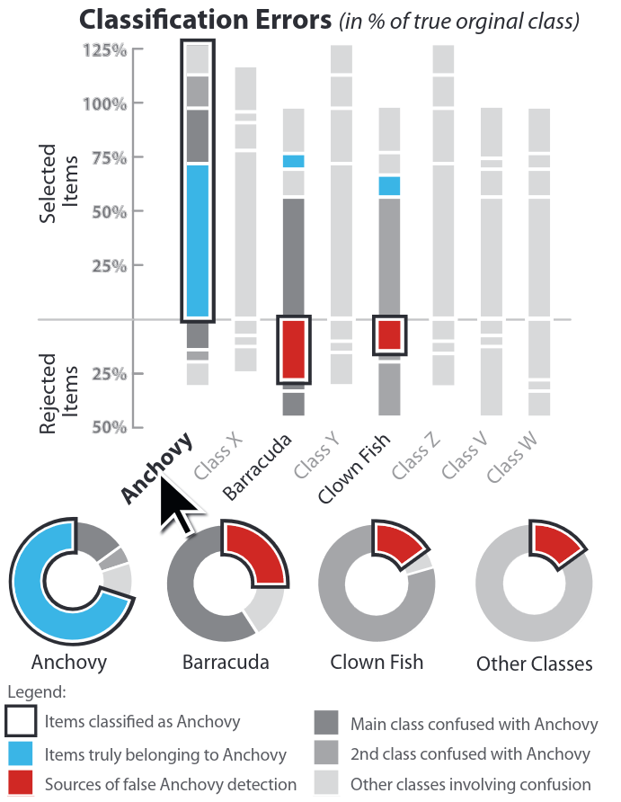{.nostretch width="35%" fig-align="center"}

:::footer
Beauxis-Aussalet, E., & Hardman, L. (2014). [*Visualization of confusion matrix for non-expert users*](../refs/Beauxis_Aussalet_Hardman_2014_Visualization_Confusion_Matrix_Non_Expert_Users.pdf). IEEE VAST.
:::

::: {.notes}
Their design for a multiclass problem, fish species from underwater video, with 'Anchovy' selected. Above the axis: everything classified as anchovy, the blue part truly anchovy, the grey parts other species. Below the axis: true anchovies that were rejected. The red segments in the other columns are where the false anchovy detections came from, here mostly barracuda and clown fish, and the donuts repeat that per class. Percentages are of the true class, which is why a bar can exceed 100 percent. The design lesson: non-experts ask 'of the things you told me were anchovies, how many were?', so answer that question directly rather than handing them a matrix.
:::

## EnsembleMatrix (2009)

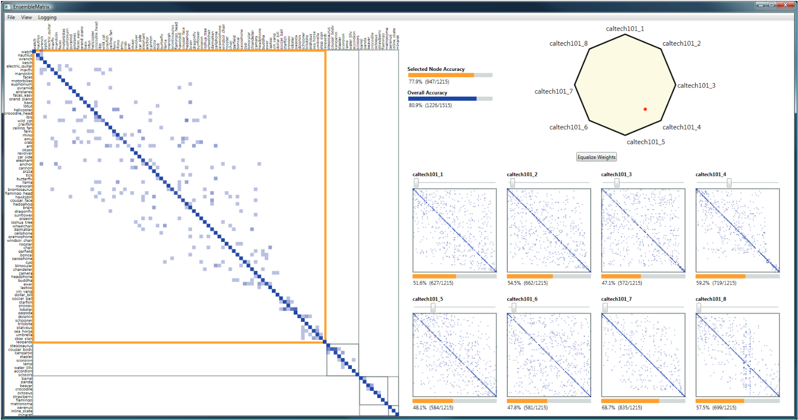{fig-align="center"}

:::footer
Talbot, J., Lee, B., Kapoor, A., & Tan, D. S. (2009). [*EnsembleMatrix: interactive visualization to support machine learning with multiple classifiers*](../refs/Talbot_Lee_Kapoor_Tan_2009_EnsembleMatrix_Interactive_Visualization_Multiple_Classifiers.pdf). CHI.
:::

::: {.notes}
EnsembleMatrix, Talbot and colleagues, CHI 2009, the oldest system today. Caltech-101, eight classifiers trained on different features; their individual confusion matrices are the eight thumbnails, with accuracies from 47 to 69 percent. The polygon at top right is the control: drag the red dot toward a vertex to give that classifier more weight in a linear combination, and the large matrix on the left updates live. Overall accuracy of the combination is 80.9 percent, better than any single member. The orange outline is a partition: you can split the matrix and weight the classifiers differently for different groups of classes. An early example of a human steering a model through a visualization of its errors.
:::

# Calibration

## What is calibration?

* When performing classification, we often are interested not only in predicting the class label, but also in the probability of the output

* This probability gives us a kind of confidence score on the prediction

* However, a model can separate the classes well (having a good accuracy/AUC), but be poorly **calibrated**. In this case, the estimated class probabilities are far from the true class probabilities

* We can calibrate the model, changing the scale of the predicted probabilities 

::: {.notes}
Now we are moving to the third part of our lecture: calibration. Calibration is about whether the probabilities predicted by a model are reliable. For example, if a model predicts a 70% probability of rain, it should rain 70% of the time. A model can be very accurate in its predictions, but still be poorly calibrated. This is a subtle but important point that we will explore in this section.
:::

## Calibration - Forecast Example

Weather forecasters started thinking about calibration a long time ago (Brier, 1950): a forecast of "70% chance of rain" should be followed by rain 70% of the time. Let's consider a small toy example:

:::: {.columns}
::: {.column width="30%"}
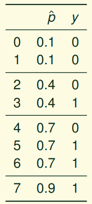{height="600" fig-align="center"}
:::
::: {.column width="70%"}
This forecast is doing well at predicting the rain:

- "10% chance of rain" was a slight over-estimate:
$(\bar{y} = 0/2 = 0\%)$
- "40% chance of rain" was a slight under-estimate: $(\bar{y} = 1/2 = 50\%)$
- "70% chance of rain" was a slight over-estimate: $(\bar{y} = 2/3 = 67\%)$
- "90% chance of rain" was a slight under-estimate: $(\bar{y} = 1/1 = 100\%)$
:::
::::

::: footer
Slides based on [classifier-calibration.github.io](https://classifier-calibration.github.io/)
:::

::: {.notes}
The classic motivating example, from the classifier-calibration tutorial this section follows. Eight days, four distinct forecasts. Group the days by forecast and check the outcome: of the two 10 percent days, none had rain; of the two 40 percent days, one did; of the three 70 percent days, two did; the single 90 percent day had rain. Each group is off by a little, in alternating directions. This forecaster is reasonably calibrated. Note what we just did: we binned by predicted value and compared the bin's mean prediction with the bin's observed frequency. That is a reliability diagram, next slide.
:::

## Visualizing forecasts - The Reliability Diagram

:::: {.columns}
::: {.column width="30%"}
{height="600" fig-align="center"}
:::
::: {.column width="70%"}
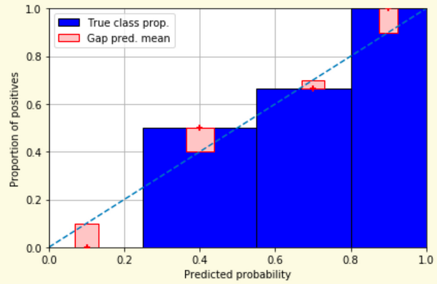{width="100%" fig-align="center"}
:::
::::

::: footer
Slides based on [classifier-calibration.github.io](https://classifier-calibration.github.io/)
:::

::: {.notes}
The same eight forecasts as a reliability diagram. X is predicted probability, y is the observed proportion of positives. One blue bar per group, its height the observed frequency. The red box is the gap between the bar and the mean prediction in that bin, marked with the plus; the dashed diagonal is perfect calibration. Read it against the table: the 0.1 bin has height zero and a gap of 0.1; the 0.4 bin is at 0.5, the 0.7 bin at 0.67, the 0.9 bin at 1.0. Bars below the diagonal mean over-estimates, above mean under-estimates.
:::

## Reliability diagram - Changing values

:::: {.columns}
::: {.column width="30%"}
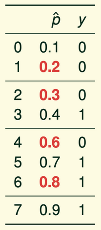{height="600" fig-align="center"}
:::
::: {.column width="70%"}
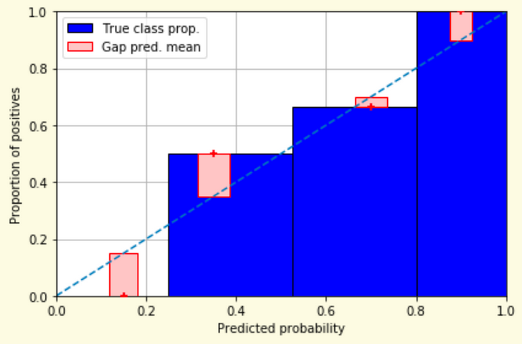{width="100%" fig-align="center"}
:::
::::

::: footer
Slides based on [classifier-calibration.github.io](https://classifier-calibration.github.io/)
:::

::: {.notes}
Now perturb four of the forecasts, the red values: 0.2, 0.3, 0.6, 0.8. The outcomes have not changed and we keep the same four groups, so the blue bars are identical. What moves is the mean prediction in each bin, to 0.15, 0.35, 0.7 and 0.9, and so the red gaps change. The point: in real data predictions are not repeated values, so we have to bin, and the bin's mean prediction is what gets compared with its observed frequency.
:::

## Reliability diagram - Changing grouping

:::: {.columns}
::: {.column width="30%"}
{height="600" fig-align="center"}
:::
::: {.column width="70%"}
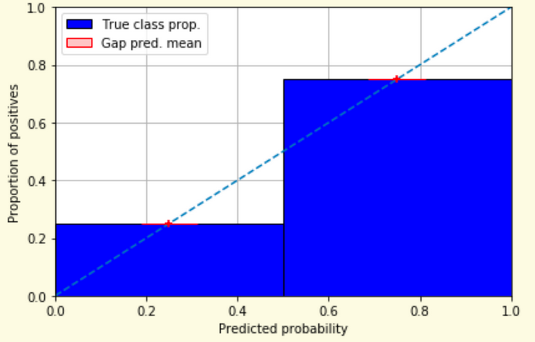{width="100%" fig-align="center"}
:::
::::

::: footer
Slides based on [classifier-calibration.github.io](https://classifier-calibration.github.io/)
:::

::: {.notes}
Same perturbed forecasts, regrouped into two bins instead of four. Left bin: mean prediction 0.25, one positive in four, observed 0.25. Right bin: mean 0.75, three in four, observed 0.75. Both plus signs sit exactly on the diagonal and the gaps vanish. The model now looks perfectly calibrated. Nothing about the forecasts changed, only the binning. Ask the room which of the last two slides is the truth. Neither: the reliability diagram is an estimate with a hyperparameter, and the second half of this section, Calibrate and Smooth ECE, is about that problem.
:::

## Reliability Diagram in sklearn

```{python}
#| echo: false
from sklearn import datasets
from sklearn.linear_model import LogisticRegression
from sklearn.naive_bayes import GaussianNB
from sklearn.model_selection import train_test_split

X,y = datasets.make_classification(5000, 10, random_state=42)
X_train, X_test, y_train, y_test = train_test_split(X, y, random_state=42)

lg = LogisticRegression(random_state=0)
nb = GaussianNB()

lg.fit(X_train, y_train)
nb.fit(X_train, y_train)
print()
```

```{python}
#| echo: true
#| output-location: column
import matplotlib.pyplot as plt
from sklearn.calibration import CalibrationDisplay

fig = plt.figure()
ax = fig.add_subplot(111)

CalibrationDisplay.from_estimator(lg, X_test, y_test, n_bins=10, ax=ax,
                                  label='Logistic Regression')
CalibrationDisplay.from_estimator(nb, X_test, y_test, n_bins=10, ax=ax,
                                  label='Naive Bayes')
```

::: {.notes}
Two classifiers on the same synthetic data: logistic regression and Gaussian Naive Bayes, set up in a hidden cell. CalibrationDisplay.from_estimator with ten bins, both on one axis; the figure on the right is live output. Logistic regression hugs the diagonal, which is expected because it is trained by minimizing log-loss, a proper scoring rule. Naive Bayes bends away from it: its independence assumption counts correlated evidence several times and pushes probabilities toward 0 and 1. Both have similar accuracy. Next slide names the shapes.
:::

## Common sources of miscalibration

* **Underconfidence:** a classifier thinks it's worse at separating classes than it actually is.

    - Underconfidence typically gives sigmoidal distortions
    - To calibrate these means to pull predicted probabilities away from the centre

*   **Overconfidence:** a classifier thinks it's better at separating classes than it actually is

    - Here, distortions are inverse-sigmoidal
    - Calibrating these means to push predicted probabilities toward the centre

A classifier can be overconfident for one class and underconfident for the other

::: {.notes}
Miscalibration can occur in two main ways: underconfidence and overconfidence. Underconfident models produce probabilities that are too close to 0.5, while overconfident models produce probabilities that are too close to 0 or 1. The shape of the reliability diagram can help us diagnose which of these problems is occurring.
:::

::: footer
Slides based on [classifier-calibration.github.io](https://classifier-calibration.github.io/)
:::

## Reliability Diagram in sklearn

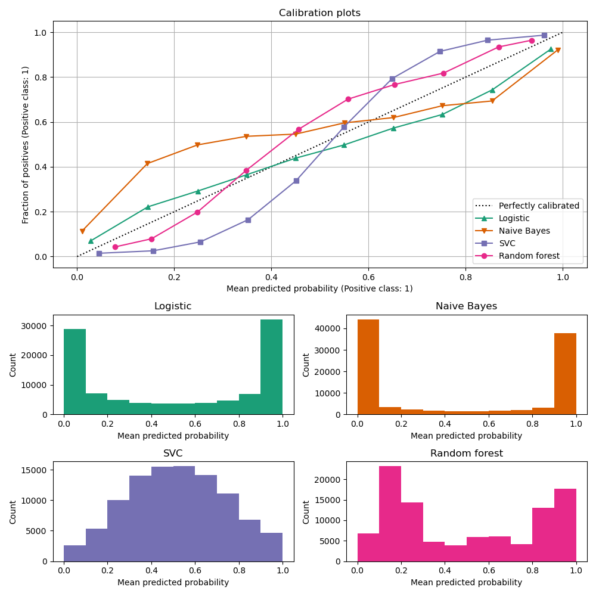{.nostretch width="45%" fig-align="center"}

:::footer
[code](https://scikit-learn.org/stable/modules/calibration.html)
:::

::: {.notes}
The scikit-learn comparison, four models, and it puts a face on both failure modes from the previous slide. Naive Bayes, orange: an inverse-sigmoid, above the diagonal at low predictions and below it at high ones. It says 0.15 when the truth is 0.4 and 0.85 when the truth is 0.7, and its histogram below is piled at 0 and 1. That is overconfidence. The SVC, purple: a sigmoid, and its histogram is a hump in the middle; it rarely commits. That is underconfidence, typical of max-margin methods. Random forest, pink, is mildly sigmoid too, because averaging trees pulls predictions away from 0 and 1. Logistic regression, green, is close to the diagonal. Always read the histogram with the curve: it tells you where the curve is supported by data.
:::

## Calibration metrics

Let $N$ be the total number of samples, $B$ the number of bins, $n^b$ the samples in bin $b$, $acc(b)$ the fraction of positives in bin $b$, and $conf(b)$ the average predicted probability in bin $b$.

- Expected Calibration Error:

$ECE = \sum_{b=1}^B \frac{n^b}{N}|acc(b) - conf(b)|$

- Maximum Calibration Error:

$MCE = \underset{b \in \{1,2,\dots,B\}}{\text{max}} |acc(b) - conf(b)|$


::: {.notes}
Besides visualizing calibration with reliability diagrams, we can also quantify it using metrics like Expected Calibration Error (ECE) and Maximum Calibration Error (MCE). ECE gives an overall measure of miscalibration, while MCE tells us the worst-case deviation.
:::

## Calibration of modern models

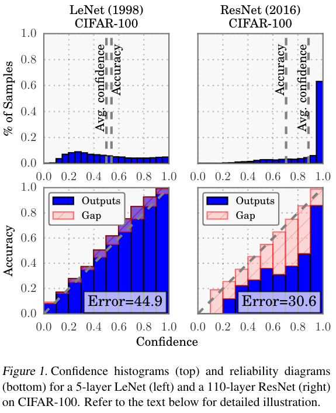{.nostretch width="35%" fig-align="center"}

:::footer
Guo, C., Pleiss, G., Sun, Y., & Weinberger, K. Q. (2017). [*On calibration of modern neural networks*](../refs/Guo_Pleiss_Sun_Weinberger_2017_Calibration_Modern_Neural_Networks.pdf). ICML.
:::

::: {.notes}
Figure 1 of Guo et al., ICML 2017, the paper that made calibration a deep learning topic. Two networks on CIFAR-100: a 5-layer LeNet from 1998 and a 110-layer ResNet from 2016. Top row, confidence histograms: LeNet's average confidence roughly equals its accuracy, the two dashed lines coincide; the ResNet's confidence is piled up near 1 and its average confidence is well above its accuracy. Bottom row, reliability diagrams: LeNet's bars follow the diagonal; the ResNet's sit well below it with large red gaps. Careful with the numbers in the boxes: 'Error' is classification error, 44.9 versus 30.6 percent. So the ResNet is much more accurate and much worse calibrated. Their explanation: depth, width, batch norm and less weight decay let the network keep reducing log-loss by becoming more confident after accuracy stops improving. Their fix is temperature scaling, a one-parameter Platt scaling.
:::

## Calibration of modern models

:::: {.columns}
::: {.column width="30%"}
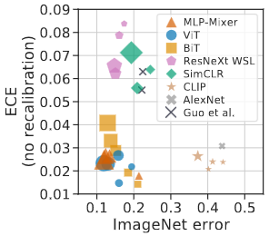{width="100%"}
:::
::: {.column width="70%"}
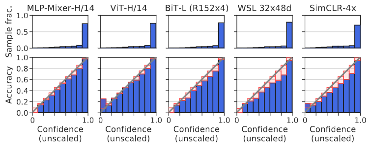{width="100%"}
:::
::::

**The 2017 trend did not continue: the most accurate recent models (ViT, MLP-Mixer) are also among the best calibrated**

:::footer
Image taken from Minderer, Matthias, et al. (2021). *Revisiting the calibration of modern neural networks*. Advances in Neural Information Processing Systems.
:::

::: {.notes}
Minderer et al., NeurIPS 2021, revisiting that story four years on. Left: ECE against ImageNet error for several model families, marker size is model size. Guo's conclusion would predict that the accurate models in the bottom left are badly calibrated. They are not: the vision transformers and MLP-Mixers are both the most accurate and among the best calibrated, while the ResNeXt WSL and SimCLR families sit higher. Right: reliability diagrams for five of them, the gaps small for Mixer, ViT and BiT and visibly larger for WSL and SimCLR. Their reading: architecture and pretraining matter more than size, and the trend 'bigger means worse calibrated' was a property of a generation of convolutional nets, not a law. The general lesson for the class: measure calibration for your model, do not inherit it from a paper.
:::

## Proper Scoring Rules

:::: {.columns}
::: {.column width="40%"}
* Proper scoring rules are calculated at the observation level, whereas ECE is binned

* Think of them as putting each item in its separate bin, then computing the average of some loss for each predicted probability and its corresponding observed label
:::
::: {.column width="60%"}
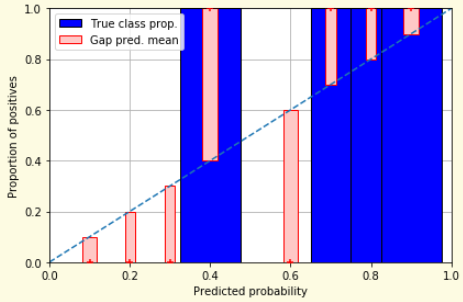{width="100%" fig-align="center"}
:::
::::

::: footer
Slides based on [classifier-calibration.github.io](https://classifier-calibration.github.io/)
:::

::: {.notes}
Proper scoring rules evaluate each prediction on its own rather than per bin. The figure is the limit of the last three slides: give every distinct prediction its own bin. Each bar is then either 0 or 1, the observed label, and the red gap is the distance from the prediction to that label. Average a loss over those gaps and you have a scoring rule. 'Proper' means the expected score is optimized by reporting your true belief, so a model cannot game it by shading its probabilities.
:::

## Proper Scoring Rules

* Brier Score/Quadratic error/Euclidean distance:

$$BS = \frac{1}{N} \sum_{i=1}^N (\hat{y}_i - y_i)^2$$

* Log-loss/Cross entropy:

    - Frequently used as the training loss of machine learning methods, such as neural networks

    - Only penalises the probability given to the true class

$$LL = -\frac{1}{N} \sum_{i=1}^N [y_i \text{log}(\hat{y}_i) + (1-y_i)\text{log}( 1 - \hat{y}_i)]$$

::: footer
Slides based on [classifier-calibration.github.io](https://classifier-calibration.github.io/)
:::

::: {.notes}
The two you will meet. Brier score is mean squared error on probabilities: bounded between 0 and 1 in this binary form, easy to interpret. Log-loss is cross-entropy, the training loss of most neural networks and of logistic regression, which is why those models tend to be calibrated on their training distribution. The practical difference is in the tails: log-loss goes to infinity if you assign probability zero to something that happens, Brier is forgiving. Both reward calibration and sharpness together, which is the next slide.
:::

## Proper Scoring Rules

An intuitive way to decompose proper scoring rules is into refinement and calibration losses

* **Refinement loss:** is the loss due to producing the same probability for instances from different classes

* **Calibration loss:** is the loss due to the difference between the probabilities predicted by the model and the proportion of positives among instances with the same output

::: footer
Slides based on [classifier-calibration.github.io](https://classifier-calibration.github.io/)
:::

::: {.notes}
The decomposition, due to Murphy and generalized by Kull and Flach. Every proper score splits into two parts. Refinement loss: you gave the same probability to instances that differ in class, which is a failure to discriminate, and no recalibration can fix it. Calibration loss: within a group that received the same prediction, the prediction differs from the observed frequency, which a monotone remapping can fix. This is why calibration methods on the next slides never change the ranking, and therefore never change the ROC curve or AUC: they only attack the second term.
:::

## Calibration Techniques

**Parametric** calibration involves modelling the score distributions within each class

- **Platt scaling:** Logistic calibration can be derived by assuming that the scores within both classes are normally distributed with the same variance (Platt, 2000)

- **Beta calibration:** employs Beta distributions instead, to deal with
scores already on a [0, 1] scale (Kull et al., 2017)

- **Dirichlet calibration** for more than two classes (Kull et al., 2019)

**Non-parametric** calibration often ignores scores and employs ranks

- **Isotonic regression** fits a non-parametric isotonic regressor, which outputs a step-wise non-decreasing function

::: footer
Slides based on [classifier-calibration.github.io](https://classifier-calibration.github.io/)
:::

::: {.notes}
The map of methods, all of which learn a function from the model's score to a probability on held-out data. Parametric methods assume a shape. Platt scaling fits a sigmoid and is what you get from assuming Gaussian class-conditional scores with equal variance. Beta calibration handles scores already in [0,1] and can fit inverse-sigmoid shapes that Platt cannot. Dirichlet is the multiclass generalization, and temperature scaling for neural nets is its one-parameter special case. Non-parametric: isotonic regression assumes only monotonicity. Two practical rules: always fit the calibrator on data the model was not trained on, and choose by data size, parametric when you have hundreds of samples, isotonic when you have thousands.
:::

## Platt scaling

* Assumes the calibration curve can be corrected by applying a sigmoid to the raw predictions. This means finding $\mathbf{A}$ and $\mathbf{b}$ via MLE:

$p(y_i = 1 | \hat{y}_i) = \frac{1}{1 + exp(\mathbf{A}\hat{y}_i + \mathbf{b})}$


* Works best if the calibration error is symmetrical (classifier output for each binary class is normally distributed with the same variance)

* This can be a problem for highly imbalanced classification problems, where outputs do not have equal variance

* In general it is most effective when the un-calibrated model is under-confident and has similar calibration errors for both high and low outputs

::: {.notes}
Platt scaling is a simple and widely used calibration method. It learns a logistic regression model on the outputs of the original model. This method is most effective when the calibration error is symmetric, but it can be less effective for imbalanced datasets.
:::

## Isotonic regression

* Fits a non-parametric isotonic regressor, which outputs a step-wise non-decreasing function

* Isotonic regression is more general when compared to Platt scaling, as the only restriction is that the mapping function is monotonically increasing

* Is more powerful as it can correct any monotonic distortion of the un-calibrated model

* However, it is more prone to overfitting, especially on small datasets

::: {.notes}
Isotonic regression is a more powerful, non-parametric calibration method. It can correct any monotonic distortion in the model's outputs. However, because it is more flexible, it is also more prone to overfitting, especially when the dataset is small.
:::

## Calibration in sklearn

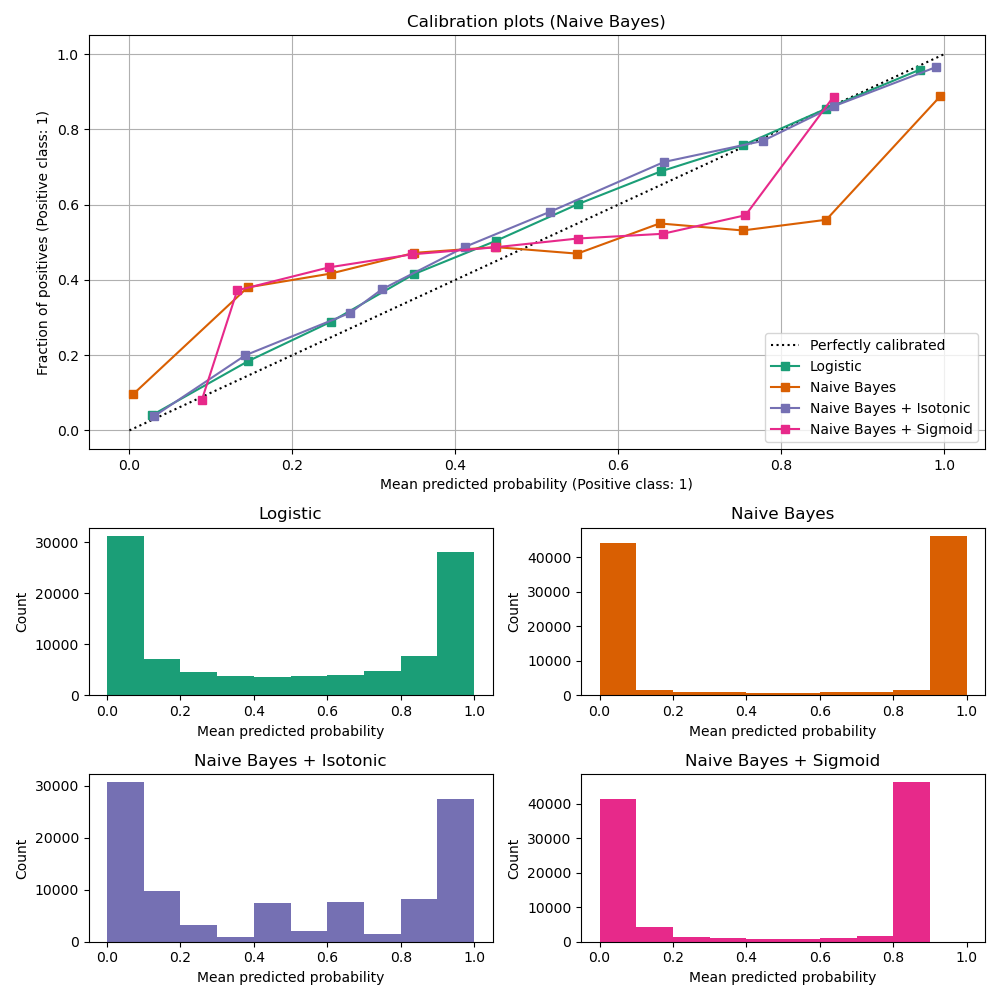{.nostretch width="45%" fig-align="center"}

:::footer
[code](https://scikit-learn.org/stable/auto_examples/calibration/plot_calibration_curve.html)
:::

::: {.notes}
The scikit-learn calibration example, Naive Bayes. The uncalibrated curve, orange, is the inverse-sigmoid of an overconfident model, and its histogram is two spikes at 0 and 1. Isotonic regression, purple, brings it onto the diagonal alongside logistic regression. Platt or sigmoid scaling, pink, barely helps: it still sits well off the diagonal between 0.2 and 0.8. That is the point of the slide. Platt can only fit a sigmoid-shaped distortion, and this one has the opposite shape. Note also what calibration does to the histograms: isotonic spreads the predictions back across the range.
:::

## Calibration in sklearn

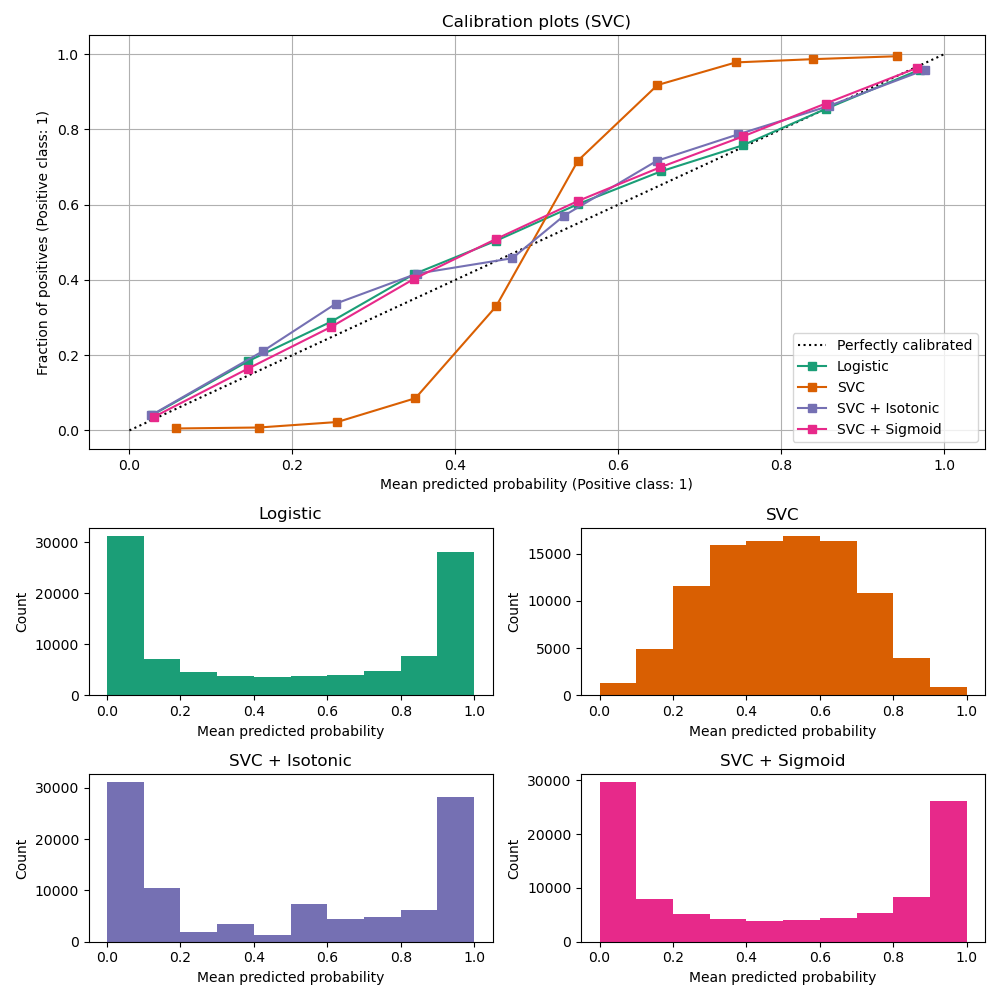{.nostretch width="45%" fig-align="center"}

:::footer
[code](https://scikit-learn.org/stable/auto_examples/calibration/plot_calibration_curve.html)
:::

::: {.notes}
Same example with a linear SVC. Now the uncalibrated curve is a clean sigmoid, the underconfident shape, with its histogram humped in the middle. Here both methods work: sigmoid and isotonic land on the diagonal and are indistinguishable from logistic regression. Put the two slides side by side in their heads: Platt scaling fixes underconfident sigmoid distortions and fails on overconfident ones; isotonic fixes both but needs more data. Diagnose the shape before choosing the method.
:::

## Calibration Takeaways

* Reliability diagrams are a standard way to visualize calibration

* ECE is a summary of what reliability diagrams show

* Proper scoring rules (Log loss, Brier score) measure different aspects of probability correctness

* However, proper scoring rules cannot tell us where a model is miscalibrated


::: {.notes}
To summarize the key points on calibration: reliability diagrams are the primary tool for visualizing calibration. ECE and MCE are metrics to quantify it. Proper scoring rules like Brier score and log-loss provide a more detailed view of the correctness of the predicted probabilities. And finally, there are different techniques to calibrate a model, each with its own trade-offs.
:::

## Hyperparameters of reliability diagrams

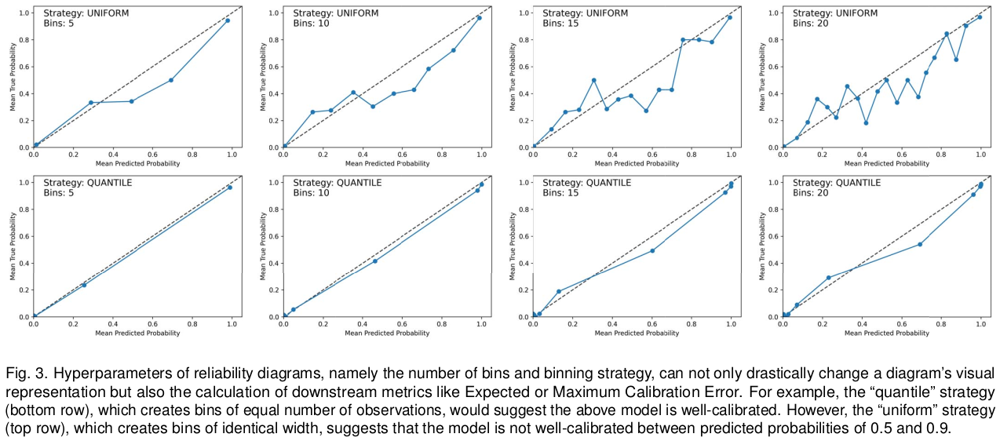{fig-align="center"}

:::footer
Image taken from Xenopoulos, P., Rulff, J., Nonato, L. G., Barr, B., & Silva, C. (2022). *Calibrate: Interactive analysis of probabilistic model output*. IEEE Transactions on Visualization and Computer Graphics.
:::

::: {.notes}
Figure 3 of our Calibrate paper, and it is the two-bin surprise from earlier at full scale. One model, eight reliability diagrams. Top row: uniform-width bins with 5, 10, 15 and 20 bins. Bottom row: quantile bins, equal counts, same numbers. With quantile bins the model looks well calibrated in every panel. With uniform bins it is visibly off between 0.5 and 0.9, and the curve gets noisier as bins are added because the middle bins hold few samples. ECE and MCE computed from these diagrams inherit the same instability. Most published ECE numbers do not report these choices.
:::

## Calibrate (2023)

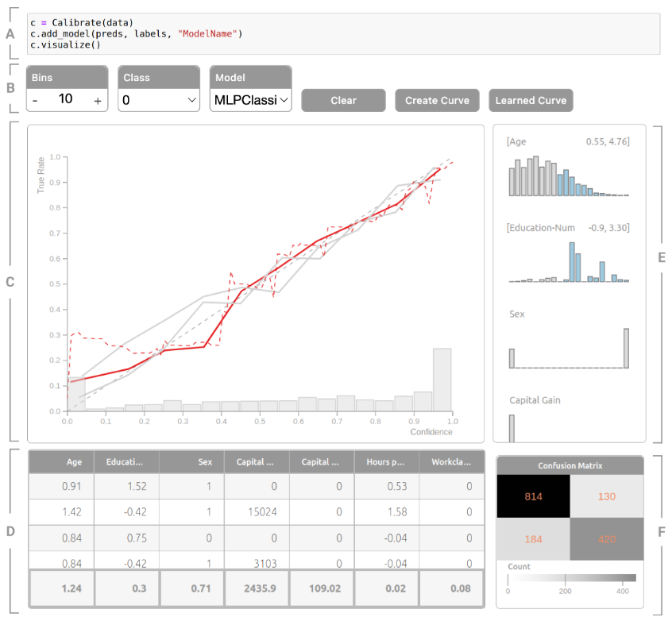{.nostretch width="50%" fig-align="center"}

:::footer
Xenopoulos, P., Rulff, J., Nonato, L. G., Barr, B., & Silva, C. (2022). [*Calibrate: Interactive analysis of probabilistic model output*](../refs/Xenopoulos_Rulff_Nonato_Barr_Silva_2022_Calibrate_Interactive_Analysis_Probabilistic_Output.pdf). IEEE TVCG.
:::

::: {.notes}
Calibrate, from our group, TVCG. Letters follow the caption. A: it is one line in a Jupyter notebook. B: controls for bins, class and model. C: the calibration view, with a conventional binned reliability curve in solid and the learned reliability diagram as the red dashed line, over a histogram of predictions so you can see where the curve is supported. D: the instance view, populated by brushing a region of the calibration view. E: the feature view, histograms per feature, where brushing a range defines a subgroup, here a range of age and education, and its curve is drawn against the full population. F: a confusion matrix for the brushed region. The task is income prediction on Census data. The argument: calibration is rarely uniform, a model can be calibrated overall and badly off for a subgroup, and you only find that interactively.
:::

## Calibrate (2023) - Learned Reliability Diagram

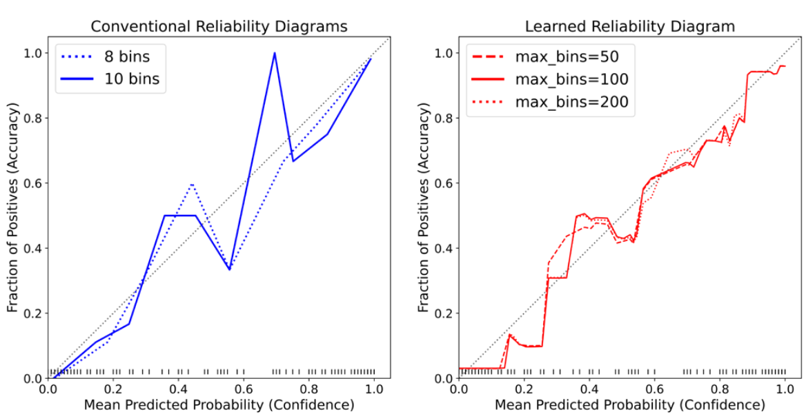{fig-align="center"}

:::footer
Xenopoulos, P., Rulff, J., Nonato, L. G., Barr, B., & Silva, C. (2022). [*Calibrate: Interactive analysis of probabilistic model output*](../refs/Xenopoulos_Rulff_Nonato_Barr_Silva_2022_Calibrate_Interactive_Analysis_Probabilistic_Output.pdf). IEEE TVCG.
:::

::: {.notes}
Our answer to the binning problem. Left: conventional diagrams for a random forest on Wisconsin breast cancer, 8 bins dotted and 10 bins solid. Two more bins and the curve changes shape completely, with a spike to 1.0 near 0.7. The rug along the bottom shows why: almost no predictions fall in the middle. Right: the learned reliability diagram. Instead of binning, fit a model that predicts the label from the predicted probability and plot that function. We use an Explainable Boosting Machine, and the three curves are max_bins of 50, 100 and 200: they nearly coincide. ECE is then the area between the curve and the diagonal. Same idea as the calibration maps two slides back, used for diagnosis rather than correction.
:::

## Calibrate (2023)



:::footer
Xenopoulos, P., Rulff, J., Nonato, L. G., Barr, B., & Silva, C. (2022). [*Calibrate: Interactive analysis of probabilistic model output*](../refs/Xenopoulos_Rulff_Nonato_Barr_Silva_2022_Calibrate_Interactive_Analysis_Probabilistic_Output.pdf). IEEE TVCG.
:::

::: {.notes}
Four-minute video of Calibrate in use: loading a model, reading the learned curve, brushing features to define subgroups, inspecting instances. It is a local file, so it plays without the network. If time is short, show the subgroup brushing part and skip the rest.
:::

## Smooth ECE (2023)

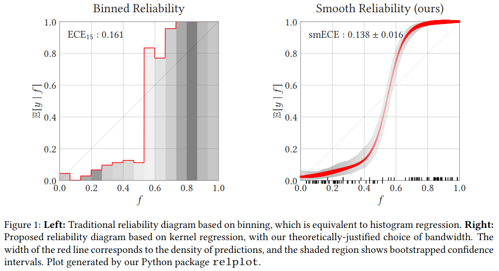{fig-align="center"}

:::footer
Błasiok, J., & Nakkiran, P. (2023). *Smooth ECE: Principled Reliability Diagrams via Kernel Smoothing*. arXiv preprint arXiv:2309.12236.
:::

::: {.notes}
Błasiok and Nakkiran, 2023, a second answer to binning, from the theory side. Left: a binned reliability diagram with 15 bins, shaded by bin population, ECE 0.161. Right: the same predictions as a kernel regression of the label on the prediction. The red curve's thickness encodes the density of predictions, so you see where the curve has support, and the grey band is a bootstrapped confidence interval. smECE is 0.138 plus or minus 0.016: the metric comes with an error bar. This model is a clean sigmoid, underconfident, which the binned version only hints at. The bandwidth is chosen by their theory rather than by the user, so there is no hyperparameter left to argue about.
:::

## Smooth ECE (2023)

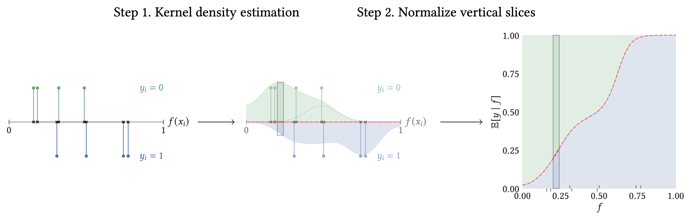{fig-align="center"}

:::footer
Błasiok, J., & Nakkiran, P. (2023). *Smooth ECE: Principled Reliability Diagrams via Kernel Smoothing*. arXiv preprint arXiv:2309.12236.
:::

::: {.notes}
How the smooth diagram is built. Left: predictions on a line, negatives drawn up in green and positives down in blue. Step 1: kernel density estimate for each class separately. Step 2: at each value of f, take a vertical slice and normalize: the blue fraction of the slice is the estimated probability of a positive given that prediction. The red dashed curve on the right is that fraction. It is a reliability diagram where every point borrows strength from its neighbours instead of being hard-assigned to a bin. Available as the relplot Python package.
:::

## Visualizing Calibration for Multi-Class Problems

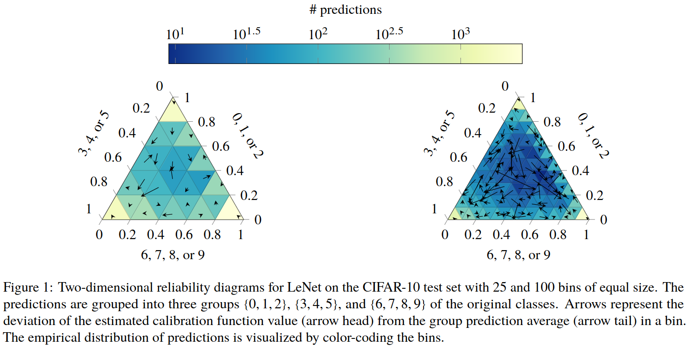{fig-align="center"}

:::footer
Vaicenavicius, J., Widmann, D., Andersson, C., et al. (2019). [*Evaluating model calibration in classification*](../refs/Vaicenavicius_Widmann_Andersson_Lindsten_Roll_Schon_2019_Evaluating_Model_Calibration.pdf). AISTATS.
:::

::: {.notes}
Calibration beyond binary. Vaicenavicius et al., AISTATS 2019. Reducing a multiclass model to its top-class confidence, as the Guo figure does, hides miscalibration among the other classes. Here a CIFAR-10 LeNet's ten classes are merged into three groups so that a prediction is a point in a triangle. Each small triangle is a bin, coloured by how many predictions fall in it, most are at the corners, and the arrow goes from the bin's mean prediction to its observed class frequencies. Long arrows mean miscalibration, and their direction says which class is over-predicted. Left 25 bins, right 100 bins, and the same binning sensitivity shows up again. It stops at three dimensions, which is the open problem.
:::

## Suggested Calibration Literature

* Niculescu-Mizil, A., & Caruana, R. (2005). [Predicting good probabilities with supervised learning](../refs/Niculescu_Mizil_Caruana_2005_Predicting_Good_Probabilities_Supervised_Learning.pdf). ICML.

* Nixon, J., Dusenberry, M. W., Zhang, L., Jerfel, G., & Tran, D. (2019, June). [Measuring Calibration in Deep Learning](http://openaccess.thecvf.com/content_CVPRW_2019/papers/Uncertainty%20and%20Robustness%20in%20Deep%20Visual%20Learning/Nixon_Measuring_Calibration_in_Deep_Learning_CVPRW_2019_paper.pdf). In CVPR Workshops (Vol. 2, No. 7).

* Guo, C., Pleiss, G., Sun, Y., & Weinberger, K. Q. (2017). [On calibration of modern neural networks](../refs/Guo_Pleiss_Sun_Weinberger_2017_Calibration_Modern_Neural_Networks.pdf). ICML.

* Vaicenavicius, J., Widmann, D., Andersson, C., Lindsten, F., Roll, J., & Schön, T. (2019, April). [Evaluating model calibration in classification](http://proceedings.mlr.press/v89/vaicenavicius19a/vaicenavicius19a.pdf). In The 22nd International Conference on Artificial Intelligence and Statistics (pp. 3459-3467). PMLR.

::: {.notes}
This slide provides a list of important papers on calibration. The Niculescu-Mizil and Caruana paper is a classic in this area. The other papers discuss more recent work on calibration, especially in the context of deep learning.
:::

## Suggested Calibration Literature

* Kull, M., & Flach, P. (2015). [Novel decompositions of proper scoring rules for classification: Score adjustment as precursor to calibration](../refs/Kull_Flach_2015_Novel_Decompositions_Proper_Scoring_Rules.pdf). ECML-PKDD, pp. 68-85.

* Silva Filho, T. et al. (2020). [ECML/PKDD 2020 Tutorial: Evaluation metrics and proper scoring rules](../refs/Silva_Filho_2020_ECML_PKDD_Tutorial_Evaluation_Metrics.pdf). Full tutorial at [classifier-calibration.github.io](https://classifier-calibration.github.io/).

* [Google Colab notebook for calibration curves](https://colab.research.google.com/drive/1mqDVJICMBg2eoIr2VPaDjQFUzlDT3grc?usp=sharing)

::: {.notes}
Where to go deeper. Kull and Flach is the source for the refinement and calibration decomposition. The ECML-PKDD 2020 tutorial by Silva Filho, Song, Perello-Nieto, Kull and Flach is the source for this whole section, and its website has the slides, videos and notebooks. The Colab notebook reproduces the reliability diagrams from today.
:::
