## Week 4: White-box Model Interpretation
- Model Interpretation and Explanation
- White-box Approaches and Visualizations
- Related Research in VIS & AI

::: {.notes}
Today we focus on interpretable machine learning models and their visualization. We'll explore intrinsically interpretable models like linear regression, GAMs, decision trees, and rule-based systems. We'll see how visualization helps us understand model behavior and how different model types offer different forms of interpretability.

Frame the week against last week and next week. Two weeks ago we asked whether a model is any good: confusion matrices, ROC, calibration. That whole apparatus treats the model as a box that emits predictions, and never asks how it got them. Today we open the box, and we do it the easy way, by using models whose insides are readable. Next week is the hard way: explaining a model you cannot see.

The organizing claim for the next two hours: for these model families the visualization is not an add-on, it is the interpretation. A GAM's meaning *is* the set of shape curves. A tree's meaning *is* the diagram. So every design decision, what to draw, at what size, in what order, is a decision about what the model means to the person reading it, which is why half this lecture is visual analytics papers rather than algorithms.

Practical note for their projects: the proposal is due this week, and several of these systems, Gamut, GAM Changer, RuleMatrix, are reasonable models for what a project deliverable can look like.
:::

## Outline
- Model Interpretation and Explanation
- <span style="color: grey;">White-box Approaches and Visualizations</span>
- <span style="color: grey;">Related Research in VIS & AI</span>

## What is Interpretability?

> **"Interpretability is the degree to which a human can understand the cause of a decision"**

::: {.incremental}
- Can you predict what the model will do?
- Can you understand *why* it made a particular decision?
- Can you trust the model's reasoning process?
- **Key Dimensions:** Local (single prediction) vs. Global (overall model logic)
:::

::: footer
Molnar, C. (2022). [*Interpretable Machine Learning*](https://christophm.github.io/interpretable-ml-book/). 2nd Edition.
:::

::: {.notes}
Interpretability fundamentally means understanding causation - why did the model produce this output? A more operational definition: a model is interpretable if a human can correctly and efficiently predict the model's results. Interpretability has two scopes: global means understanding the overall model logic, local means understanding a single prediction.

Spend a minute on the operational definition, because it is the one that can be tested. "A human can predict what the model will do" turns a vague property into an experiment: show someone the model and some inputs, ask them for the model's output, measure the error. That measure has a name, simulatability, and there is a large study of exactly this at the end of the lecture, with a result that should make everyone uncomfortable.

Then the warning that comes with it. Being able to predict what a model will do is not the same as knowing whether it should do it. A person can learn to anticipate a model that is confidently using a spurious feature, and interpretability of that kind produces smooth agreement rather than scrutiny.

Insist on the local versus global split now, because every system today sits somewhere on it. Global: what has the model learned, overall? Local: why this applicant, this patient, this case? They need different displays, and they are used by different people, a model developer versus the person receiving the decision. A common failure in student projects is to build a global tool and then answer a local question with it.

Worth adding: the audience determines what counts as an explanation. A clinician, a regulator, and a data scientist debugging a pipeline want three different objects. There is no such thing as the interpretable model, only a model interpretable to someone for some purpose.
:::

## Why Model Interpretation & Explanation?

::: {.columns}
::: {.column width="45%"}
### Four Key Functions:

**🔧 Debugging & Validation**

- Detect bugs, biases, data leakage
- Identify spurious correlations

**🔬 Knowledge Discovery**

- Learn patterns, generate hypotheses
- Extract scientific insights

**🤝 Building Trust**

- Increase confidence, social acceptance
- Enable stakeholder buy-in

**⚖️ Compliance & Ethics**

- Meet legal/ethical requirements
- Conduct fairness audits
:::

::: {.column width="55%"}
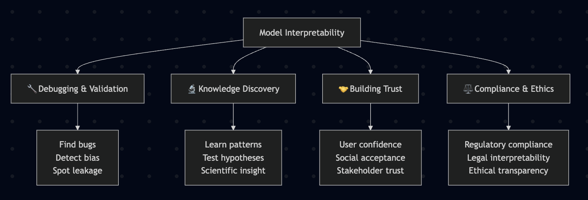{width="100%"}

<!-- MERMAID CODE FOR FUTURE REFERENCE:
Save this to figs/white-box/model-interpretability-overview.mmd and use mermaid.live to generate PNG:

```{mermaid}
graph TD
    MI[Model Interpretability]
    MI --> D[🔧 Debugging & Validation]
    MI --> K[🔬 Knowledge Discovery]
    MI --> T[🤝 Building Trust]
    MI --> C[⚖️ Compliance & Ethics]

    D --> D1[Find bugs<br/>Detect bias<br/>Spot leakage]
    K --> K1[Learn patterns<br/>Test hypotheses<br/>Scientific insight]
    T --> T1[User confidence<br/>Social acceptance<br/>Stakeholder trust]
    C --> C1[Legal requirements<br/>Fairness audits<br/>Ethical guidelines]

    style MI fill:#2d3e50,stroke:#1f77b4,stroke-width:3px,color:#fff
    style D fill:#e74c3c,stroke:#c0392b,stroke-width:2px,color:#fff
    style K fill:#3498db,stroke:#2980b9,stroke-width:2px,color:#fff
    style T fill:#2ecc71,stroke:#27ae60,stroke-width:2px,color:#fff
    style C fill:#f39c12,stroke:#e67e22,stroke-width:2px,color:#fff
    style D1 fill:#ffebee,stroke:#c0392b,stroke-width:1px,color:#333
    style K1 fill:#e3f2fd,stroke:#2980b9,stroke-width:1px,color:#333
    style T1 fill:#e8f5e9,stroke:#27ae60,stroke-width:1px,color:#333
    style C1 fill:#fff3e0,stroke:#e67e22,stroke-width:1px,color:#333
```
-->
:::
:::

::: {.notes}
Interpretability serves multiple critical functions. For debugging, we can catch issues like the model learning spurious correlations. For science, interpretable models reveal domain insights. For deployment, stakeholders need to trust the system. In regulated domains like healthcare and finance, interpretability may be legally required to justify decisions.

Give each function a concrete anchor rather than leaving them abstract.

Debugging is the one they will use most: the model that identified horses by the photographer's watermark, or the pneumonia model that learned that asthmatic patients have better outcomes, which was true in the data and lethal as a policy, because asthmatics were sent straight to intensive care. Both were caught by looking at what the model used, not by looking at accuracy. Accuracy was excellent in both cases.

Knowledge discovery is the next slide, a Nature paper where the model was the instrument rather than the product.

Trust, with a caveat worth planting early: the goal is calibrated trust, not maximal trust. An explanation that makes people believe a bad model has done harm, not good.

Compliance: GDPR's provisions on automated decisions, and in the US the adverse action notice requirements in credit, which oblige a lender to state the principal reasons for a denial. Whether or not that amounts to a legal right to explanation is argued about, but the operational pressure on teams is real.

Ask the room which of the four they think is most common in practice. It is debugging, by a wide margin, and yet almost all of the research attention goes to the other three.
:::

## Machine-learning-assisted materials discovery using failed experiments

::: {.columns}
::: {.column width="40%"}
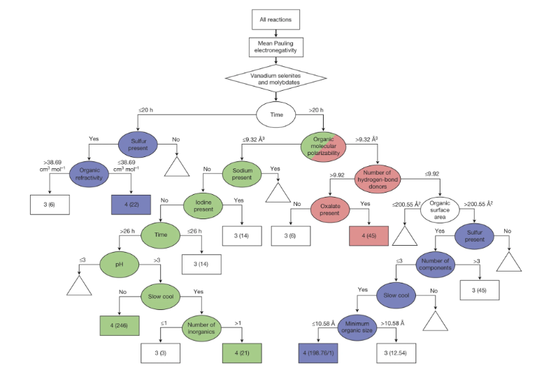{width="100%" fig-align="center"}
:::

::: {.column width="60%"}
- Researchers firstly built a database of chemistry experiments (new material).
- Then they train an SVM to predict whether a new chemistry experiment will be successful.
- Then they train a surrogate DT to explain the model to learn more about the experiment.
:::
:::

::: footer
Raccuglia, P., et al. (2016). [Machine-learning-assisted materials discovery using failed experiments](https://doi.org/10.1038/nature17439). *Nature*, 533, 73-76.
:::

::: {.notes}
This Nature paper is the knowledge-discovery case, and it is a lovely one. Raccuglia and colleagues, 2016, on the synthesis of new materials.

The idea that makes it memorable: they trained on the failures. Chemistry labs record every attempted synthesis in notebooks, and the ones that do not work are never published, so the literature is a record of successes only, which is survivorship bias built into a whole field. They call these the "dark" reactions, mined them out of archived laboratory notebooks, and added computed physicochemical descriptors to the raw notebook entries.

The headline result, from the abstract, is worth quoting exactly: using previously untested, commercially available organic building blocks, the model "outperformed traditional human strategies, and successfully predicted conditions for new organically templated inorganic product formation with a success rate of 89 per cent". Note what the baseline is: experienced chemists' intuition about which reactions to try.

The part that belongs in this lecture is what came next. A predictive model that says "try this one" is useful but tells a chemist nothing. So they inverted the model into human-readable form, which is what the decision tree on the slide is, and read hypotheses about *why* certain conditions work off its structure. That is the global surrogate idea, arriving 40 minutes before we define it, in a real scientific setting.

One caution if anyone asks for specifics: the widely repeated details about the exact classifier and the human baseline number are not in the abstract, and the paper is paywalled, so quote the 89 percent and the dark-reactions idea, and leave the rest.
:::

## Properties of Good Explanations

Human explanations are naturally:

::: {.incremental}
1. **Contrastive**: "Why this, rather than that?" (not exhaustive)
   - Example: "Loan denied because debt-to-income ratio was 45%, not the required ≤30%"
2. **Selective**: Focus on 1-3 key reasons (not all causes)
3. **Social**: Tailored to audience and context
4. **Focused on abnormal**: Highlight surprising factors
5. **Truthful but simple**: Balance accuracy with understandability
:::

::: footer
Molnar, C. (2022). [*Interpretable Machine Learning*](https://christophm.github.io/interpretable-ml-book/interpretability.html). 2nd Edition.
:::

::: {.notes}
Research on human explanations reveals important patterns. People don't want exhaustive causal chains - they want contrastive answers comparing to alternatives. Good explanations are selective, providing just a few key factors rather than everything. They should be tailored to the audience's knowledge and focus on surprising or abnormal causes rather than routine factors.

This list comes out of philosophy and cognitive science rather than machine learning, largely via Tim Miller's survey of that literature for the XAI community, and it is worth the minute because it predicts which of our tools will actually land.

Contrastive is the deepest point. Nobody asks "why was my loan denied?" in the abstract; they mean "why was it denied *rather than approved*", or "why me and not my neighbour". A feature importance list answers neither. A counterfactual, change income by this much and the decision flips, answers both, which is why the counterfactual interaction in Gamut, dragging an instance along a shape curve, feels so natural.

Selective, with a number: people handle something like seven items at once, which is the empirical basis for the sparsity constraints in the interpretable-models literature. A twenty-feature explanation is not twenty times better than a three-feature one, it is worse.

Abnormal-focused: the interesting cause is the one that deviates. A model explanation that lists the base rate contributions of every routine feature buries the one unusual thing that drove the decision.

Turn it into a design checklist they can apply to every system today: does it let you compare? Does it stop at a few factors? Does it adapt to who is asking? By that standard, most feature-importance bar charts fail on all three.
:::

## Why Model Interpretation & Explanation?

::: {.columns}
::: {.column width="60%"}
{height="760" fig-align="center"}
:::

::: {.column width="40%"}
- Fairness
- Privacy
- Reliability or Robustness
- Causality
- Trust
:::
:::

::: {.notes}
This is Doshi-Velez and Kim's "Towards a Rigorous Science of Interpretable Machine Learning", the paper that gave the field its vocabulary, and the list on the right is their account of *why* we want interpretability at all.

Their central argument is worth stating because it reframes the whole enterprise: interpretability is not an end in itself, it is a proxy we reach for when the problem is incompletely specified. If you could write down everything you cared about, fairness, safety, the cost of each error, you could optimize it directly and would not need to inspect the model. We ask for explanations exactly when the objective function does not capture everything that matters. Fairness, privacy, robustness, causality and trust on this slide are all examples of that gap.

Their second contribution is the evaluation taxonomy, which is directly useful for the projects. Three levels: functionally grounded, where you use a proxy such as sparsity or tree depth with no humans involved; human grounded, where lay users do a simplified task; and application grounded, where domain experts do the real task. Cheap to expensive, weak to strong evidence. When someone claims a method is "more interpretable", ask which of the three they did. Most papers do the first and write as if they had done the third.

The Poursabzi-Sangdeh study at the end of today is an unusually careful example of the middle level, and its results are humbling.
:::

## Taxonomy of Interpretability Methods

::: {.columns}
::: {.column width="50%"}
**Intrinsic (White-box)**

- Interpretability built into model structure
- Examples: Linear models, short decision trees, sparse models
- Understand by examining model internals
- *Today's focus*

:::

::: {.column width="50%"}
**Post-hoc (Black-box)**

- Explain after training
- Works with any model (neural nets, ensembles)
- Examples: LIME, SHAP, saliency maps
- *Next week's topic*

:::
:::

**Additional dimensions:**
Model-specific vs Model-agnostic | Local vs Global | Feature importance vs Feature effects

::: footer
[Christoph Molnar: Interpretable Machine Learning](https://christophm.github.io/interpretable-ml-book/taxonomy-of-interpretability-methods.html)
:::

::: {.notes}
Intrinsic interpretability means the model structure itself is understandable - you can look at a decision tree and trace the logic. Post-hoc methods generate explanations after the fact for any model. We also distinguish: model-specific vs model-agnostic, local vs global, and feature importance vs feature effects.

This slide is the map for the next two weeks, so make the columns concrete. Left column, intrinsic, is today: the model is the explanation, so the explanation is exact and cannot be unfaithful. Right column, post-hoc, is next week: the model stays opaque and we build a second thing that describes it. That second thing is an approximation, and everything that follows from that, its fidelity, its instability, its potential to mislead, is the subject of next week's lecture and of the Rudin paper at the end of today.

On the additional dimensions, two are worth dwelling on. Local versus global we have already met. Feature importance versus feature effects is the one students conflate: importance is a scalar ranking, "age matters a lot"; effects are functional, "here is how the prediction changes across the range of age". SHAP gives importance; a shape function gives effects. Only the second lets you say anything about a specific value of the feature.

Then the honest complication: the boundary is not as clean as the slide suggests. A PDP is a post-hoc method, but applied to a GAM it recovers the model exactly. A deep tree is intrinsically interpretable and practically unreadable. So the useful question is not which column a method is in, but whether a human can actually use the artifact it produces on this model at this size.
:::

## Outline
- <span style="color: grey;">Model Interpretation and Explanation</span>
- White-box Approaches and Visualizations
- <span style="color: grey;">Related Research in VIS & AI</span>

## White-box Models

We discuss the following models that are intrinsically interpretable:

- Linear Regression
- Generalized Additive Models (GAM)
- Tree-based Models
- Decision Rules

::: {.notes}
These model families offer varying degrees of expressiveness and interpretability. Linear models are simplest but most limited; GAMs add non-linear flexibility; trees provide natural visual structure; rules offer explicit logic.

Set up the through-line for the next hour. All four are interpretable *by construction*: the model's own parameters are the explanation, so there is nothing to approximate and nothing that can be unfaithful. That is the contrast with next week, where we explain a model we are not allowed to see, and the explanation is itself a model that can be wrong.

Order them by what they give up. A linear model gives you one number per feature, and assumes the effect is constant everywhere. A GAM gives you a curve per feature, and drops the constant-effect assumption while keeping additivity. A tree gives you regions and interactions for free, and drops additivity. Rules give you logic you can read aloud, and drop the requirement that the pieces be mutually exclusive.

The thing to notice as we go: in each case the visualization is not decoration, it *is* the interpretation. A GAM is interpretable because you can draw f_j. A tree is interpretable because you can draw the tree. When the drawing stops being readable, at a few hundred rules or a depth-20 tree, the interpretability claim quietly expires, and that is the failure mode the visual analytics papers in this lecture are each attacking.
:::

## Linear Regression
Linear models can be used to model the dependence of a regression target y on some features x in a format as below:
\begin{equation}
y = \beta_0 + \beta_1 x_1 + \ldots + \beta_n x_n + \varepsilon\end{equation}

The predicted target $y$ is a linear combination of the weighted features $\beta_i x_i$.
The estimated linear equation is a hyperplane in the feature/target space (a simple line in the case of a single feature). 

The weights specify the slope (gradient) of the hyperplane in each direction.

::: {.notes}
Linear regression remains one of the most interpretable models. Each coefficient directly tells us how much the prediction changes when that feature increases by one unit, holding all else constant. This direct interpretability makes linear models valuable for policy decisions and scientific inference.

Be precise about what the model claims, because everything later in the lecture is a reaction to one of these commitments. The prediction is a weighted sum: every feature contributes independently, its effect is the same size at every value, and the contributions add. Those three commitments, plus the error term, are what buy you the one-number-per-feature explanation.

Make the epsilon explicit. The model is y = beta_0 + sum beta_j x_j + epsilon, and the assumptions that license inference live in epsilon, not in the fit. You can fit any data by least squares; whether the coefficients mean anything is a separate question, which is the next three slides.

Worth saying once, clearly: interpretability here is conditional on the model being roughly right. If the true relationship curves, the coefficient is the best straight-line summary of a curve, and it is perfectly interpretable and substantively wrong. A model that is easy to read is not the same as a model that is telling the truth.
::: 

## Linear Regression
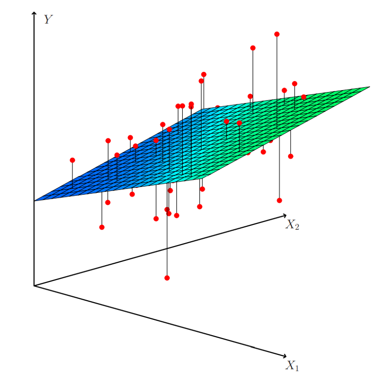

::: {.notes}
This visualization shows the geometric interpretation of linear regression as fitting a hyperplane through the data points. The residuals (vertical distances from points to the plane) are minimized during training using least squares optimization.

Walk the picture. Two features, so the model is a plane in three dimensions; the red segments are the residuals, and note that they are vertical, in the y direction only. That is a real asymmetry: we assume the features are known and only the target has noise. Least squares minimizes the sum of the squares of those segments, which has a closed form, so there is no learning rate, no seed and no random restart. Fit it twice and you get the same plane, which is itself part of the interpretability story.

Two things to say about why the squares. Squaring makes the objective differentiable and gives the closed-form solution, and it is equivalent to maximum likelihood under Gaussian noise. It also means one distant point can tilt the whole plane, so a single outlier can change every coefficient on the slide.

Then the honest limitation of this picture: it works because there are two features. At ten features the hyperplane is real but not drawable, and from here on the visualization has to encode the coefficients rather than the geometry. That shift, from drawing the model to drawing its parameters, is the whole design problem in this lecture.
:::

## Linear Regression: An Example of Housing Price
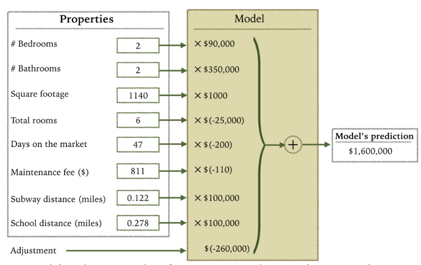

How do you interpret the influence of each property on the prediction of housing price?

::: {.notes}
In this housing price model, we can directly read off the coefficients: each additional bedroom adds a certain amount to the price, each square foot contributes its value, proximity to schools has a measurable effect. The sign tells us direction (positive/negative), the magnitude tells us importance.

Read the figure as an addition problem: each property is multiplied by its weight, the products are summed with an adjustment term, and the result is the prediction. This is the cleanest picture of what "additive" means, and it comes back twice today, for GAMs, where each weight becomes a curve, and for rule lists, where the sum becomes a sequence of tests.

Now slow down on two entries, because this slide is a trap worth springing. Bathrooms are worth 350,000 each and bedrooms 90,000: does anyone believe that adding a bathroom to their apartment adds a third of a million dollars? And total rooms carries a *negative* weight. Ask the room how a house can be worth less for having another room.

The answer is the next two slides. These features are strongly correlated with each other and with size, so the fit splits credit between them in whatever way minimizes error, and the split can put a negative sign on a feature that is positively associated with price on its own. The coefficients are jointly a good predictor and individually not a causal statement about renovating your apartment.

Also flag the units: 100,000 per mile of subway distance is a coefficient on a feature measured in miles, and the values here are around a tenth of a mile. Magnitude on this slide means nothing until you know the scale of the feature, which is the first bullet on the next slide.
:::


## Interpreting Linear Model Coefficients

**Basic interpretation:** An increase in feature $x_j$ by one unit changes the prediction by $\beta_j$ units

::: {.incremental}
- ✅ **Numerical features**: Direct marginal effect (holding others constant)
- ✅ **Categorical features**: Coefficients show difference from reference category
- ⚠️ **Scale-dependent**: Coefficients change with feature units
- ⚠️ **"Holding others constant" assumes Feature Independence** (a strong assumption!)
:::

::: footer
Molnar, C. (2022). [*Interpretable Machine Learning*](https://christophm.github.io/interpretable-ml-book/limo.html). Chapter 4.1.
:::

::: {.notes}
The standard interpretation is deceptively simple: each coefficient tells you the marginal effect of that feature. But be careful - this interpretation assumes you can change one feature while holding others constant, which may not be realistic. Coefficients are also scale-dependent - standardizing features helps comparisons.

Take the three caveats in turn, with the housing slide still in mind.

Scale. A coefficient is in units of target per unit of feature, so a coefficient on square footage and a coefficient on number of bathrooms are not comparable, any more than a speed in km/h is comparable to a price. If you want to rank features by importance, standardize first, so every coefficient is per standard deviation, or report the coefficient times the feature's spread. Students routinely present the largest raw coefficient as the most important feature, and it is usually the feature with the smallest units.

Categorical features. A coefficient is a contrast against the reference category, so it is not a property of the category alone; change the reference and every one of those coefficients changes. Whenever a categorical coefficient is quoted, ask "compared with what?".

Ceteris paribus. "Holding all others constant" is a statement about the arithmetic, not about the world. In the housing model you cannot add a bedroom while holding square footage and total rooms fixed. When features cannot move independently, the coefficient describes a comparison the data may not contain, and the model is extrapolating. That is the bridge to the next slide.
:::

## Important Assumptions for Interpretation

Linear models make strong assumptions:

::: {.incremental}
1. **Linearity**: Effects are additive (no interactions unless explicitly added)
2. **Independence**: Features are not strongly correlated
3. **Homoscedasticity**: Constant error variance
4. **No multicollinearity**: Correlated features can flip coefficient signs!

   **Example:** Housing model with both "square footage" AND "number of rooms"
   - These features are highly correlated (VIF > 10)
   - Coefficients become unstable and unreliable for interpretation
   - Model predicts well, but individual coefficients are meaningless
:::

::: footer
Molnar, C. (2022). [*Interpretable Machine Learning*](https://christophm.github.io/interpretable-ml-book/limo.html). Chapter 4.1.
:::

::: {.notes}
When features are correlated (multicollinearity), coefficients become unstable and can even change signs in counterintuitive ways. VIF (Variance Inflation Factor) measures this: VIF = 1 means no correlation, VIF > 10 indicates severe multicollinearity. In the housing example, square footage and rooms are highly correlated - bigger houses have more rooms. The model can still predict well, but you shouldn't interpret individual coefficients.

Make VIF concrete, since it is on the slide. To compute it for one feature, regress that feature on all the others and take its R squared, then VIF is 1 over 1 minus that R squared. So VIF 10 means the other features already explain 90 percent of the variation in this one, and VIF 100 means 99 percent. It is not an arbitrary threshold, it is a statement about how little independent information the feature carries.

Why the coefficients go unstable: if two features move together, many different weightings produce nearly identical predictions, so the fit is nearly flat along that direction and the solution is decided by noise. Resample the data and the split flips, sometimes past zero, which is the negative sign on total rooms.

State the practical rule clearly, because it is the one that survives the course. Multicollinearity damages *interpretation*, not *prediction*. If you only need forecasts, ignore it. If you are going to say "square footage is worth X per foot" in a meeting, check VIF or the correlation matrix first.

Remedies, briefly: drop one of the pair, combine them into one feature such as rooms per square foot, or regularize. Note that ridge stabilizes the coefficients by shrinking them, so they become more reproducible and no longer unbiased estimates of anything, which is a trade many people make without noticing.
:::

## Evaluation of Linear Regression Model

**Notation:**

- $y_i$ = actual/true value for sample $i$
- $\hat{y}_i$ = predicted value for sample $i$
- $\bar{y}$ = mean of all actual values
- $N$ = number of samples

### R Square

$R^2$ (R-squared): Proportion of variance explained
\begin{equation}
R^2 = 1 - \frac{\sum (y_i - \hat{y}_i)^2}{\sum (y_i - \bar{y})^2}
\end{equation}

Mean Square Error (MSE)/Root Mean Square Error (RMSE)
\begin{equation}
MSE = \frac{1}{N} \sum_{i=1}^{N} (y_i - \hat{y}_i)^2, \quad RMSE = \sqrt{MSE}
\end{equation}

Mean Absolute Error (MAE)
\begin{equation}
MAE = \frac{1}{N} \sum_{i=1}^{N} |y_i - \hat{y}_i|
\end{equation}

::: {.notes}
R-squared tells us the proportion of variance explained by the model (ranges 0-1, higher is better). MSE/RMSE penalize large errors more heavily than MAE due to squaring. Choose metrics based on your application's tolerance for outliers - use MAE if you want robust estimates, MSE if large errors are particularly costly. Note that R-squared can be misleading with many features - adjusted R-squared accounts for model complexity.

Three things worth adding, all of which show up in student projects.

R squared has a baseline built in. Its denominator is the error of predicting the mean for everyone, so R squared is a comparison against that constant model: zero means you have matched the mean, and it can go negative on test data, which surprises people. It also rises whenever you add a feature, even a column of random numbers, which is why adjusted R squared exists.

RMSE and MAE are in the units of the target, and R squared is not. For a housing model, "we are off by 65,000 dollars on average" is a sentence a stakeholder can act on, and "R squared is 0.83" is not. Report at least one metric in real units.

The choice between them is a statement about costs, and it is the same argument as the proper scoring rules discussion two weeks ago. Squared error says one 100,000 dollar mistake is worth a hundred 10,000 dollar mistakes; absolute error says it is worth ten. Neither is neutral, so pick the one that matches what the errors actually cost, and say which you picked.

Last: these are all computed on some data. Quote them on held-out data, and in a course project, say which split they came from.
:::


## Visual Analytics (VA) Systems for Linear Regression


::: {.columns}
::: {.column width="55%"}
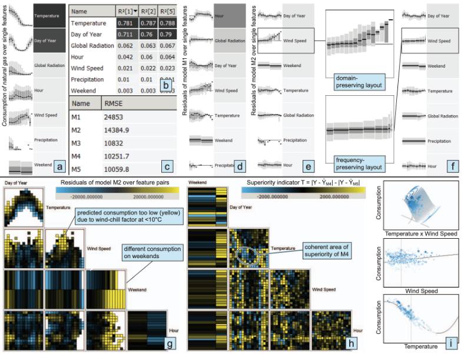{width="100%" fig-align="center"}

:::

::: {.column width="45%"}
**Core Visualizations:**

- **Scatterplot Matrix**: Explore feature relationships and partitions
- **Parallel Coordinates**: Analyze high-dimensional patterns
- **Interactive Partitioning**: Split data to test model stability

**Key Insights:**

- Trade-off between model complexity and accuracy
- Feature ranking and selection
- Model validation across partitions
:::
:::

::: footer
Mühlbacher, T., & Piringer, H. (2013). [A Partition-Based Framework for Building and Validating Regression Models](https://doi.org/10.1109/TVCG.2013.125). *IEEE TVCG*. **Best Paper Award, IEEE VAST 2013**.
:::

::: {.notes}
Mühlbacher and Piringer, TVCG, presented at VAST 2013 where it won best paper. It is the oldest system in the lecture and still the best argument for why model building is a visualization problem.

The core idea is partitioning. Rather than assuming a functional form and fitting it, they chop a feature's range into regions and show the distribution of the target inside each one, drawn like a box plot: median, quartiles, and the 5th and 95th percentiles. Do that for one feature and you see its relationship to the target without assuming linearity. Do it for pairs of features, shown as a matrix coloured by a summary of each cell's distribution, and you see interactions. Then rank every feature and every pair by how much a small local model fitted inside those regions explains, so the analyst gets an ordered list of what is worth adding next.

The move I most want them to take away: you can retarget the whole ranking onto the *residuals* of the current model. So the question stops being "which features matter" and becomes "what does my model still not explain", and the system answers it over pairs as well as single features. In their energy case study that surfaced a systematic underestimation at high wind speed and low temperature, which the analyst immediately recognized as wind chill, a physical interaction the model lacked.

Two more things worth a sentence each. Their layout choice changes conclusions: in one view wind speed looks strongly related to the target, and switching to a frequency-preserving layout reveals that the apparent effect lives where there is almost no data. Same data, two layouts, opposite readings, which is the whole argument for this course in one figure.

And the evaluation is unusual: not a lab study but eleven domain experts at two energy companies using the tool daily for two months. They report that analyses that took about a day were reduced to about half an hour. That is the kind of claim you can only get from deployment, and it is the strongest evidence in today's lecture.
:::


## Pros, Cons, and Limitations of Linear Models

::: {.columns}
::: {.column width="50%"}
### ✅ Pros:

- **Highly interpretable**: Each coefficient has clear meaning
- **Statistical guarantees**: Inference possible when assumptions hold
- **Fast**: Analytical solution, no hyperparameters
- **Transparent**: Easy to explain to stakeholders

:::

::: {.column width="50%"}
### ⚠️ Cons & Limitations:

- **Linearity assumption**: Cannot capture non-linear relationships
- **Gaussian assumption**: Features assumed to follow normal distribution
- **Multicollinearity**: Correlated features break interpretation
- **No interactions**: Must manually add interaction terms
- **Assumption violations**: Wrong inference if residuals not normal

**What if your dataset does not follow these assumptions?**

:::
:::

::: {.notes}
Linear models shine when relationships are truly linear and assumptions hold (normal residuals, homoscedasticity, no multicollinearity). But real-world data often violates these assumptions - many real phenomena have non-linear relationships (diminishing returns, threshold effects) and feature interactions (temperature and humidity jointly affecting comfort). When data violates linear assumptions, we need more flexible models like GAMs.

Before moving on, give them the diagnostic habit, because it is the cheapest useful thing in this whole section: plot the residuals against the fitted values. If the model is right, that plot is a formless cloud. Structure in it is the model telling you what it missed. A U shape means a curved relationship fitted with a straight line; a widening fan means the error grows with the prediction, so a constant-variance assumption is wrong and the confidence intervals are fiction. Five seconds of looking, and it catches most of the bullets on the right of this slide.

Then set up the transition properly by asking the question the slide asks: what if your data does not follow these assumptions? There are three answers and we take them in order today. Transform the features by hand, which works and does not scale and requires you to guess the shape. Let the model learn the shape per feature, which is a GAM, next. Or let the model carve the space into regions, which is a tree, later.

Worth naming the fourth answer, so nobody thinks interpretability is mandatory: fit the black box and explain it afterwards, which is next week, and which Rudin at the end of today argues you should not do for consequential decisions.
:::

## Generalized Additive Models (GAMs)

GAMs extend linear models by replacing linear terms with flexible shape functions:

\begin{equation}
g(\mathbb{E}[y|X]) = \beta_0 + \sum_{j=1}^{p} f_j(x_{j})
\end{equation}

**Key idea:** Replace $\beta_j x_j$ (linear) with $f_j(x_j)$ (flexible smooth function)

::: {.incremental}
- Each $f_j$ is learned from data (typically using splines)
- Maintains additive structure → still interpretable
- Can mix linear and non-linear terms
:::

::: footer
Molnar, C. (2022). [*Interpretable Machine Learning*](https://christophm.github.io/interpretable-ml-book/extend-lm.html). Chapter 4.2.
:::

::: {.notes}
GAMs replace linear terms with smooth functions that can capture non-linear patterns. Each feature gets its own learned shape function (often splines or smoothing functions). The model remains additive (no interactions by default) which preserves interpretability - we can visualize each function independently. The link function g allows for different target distributions (normal for regression, logistic for classification).

Read the formula as one substitution: beta_j x_j becomes f_j(x_j). Everything else about the linear model is unchanged, and that is the point. We drop the assumption that the effect is a straight line, and we keep the assumption that effects add. Hastie and Tibshirani introduced these in the mid-1980s, so this is not a new idea, it is a rediscovered one.

What the substitution buys, in interpretation terms: instead of one number per feature you get one curve per feature, and the curve is the complete story of that feature's contribution. Nothing is hidden, because the model is literally the sum of what is on the plot. The whole model can be printed on one page as a small multiple of curves, which is why this family keeps coming back in the visualization literature.

Mention the link function so the notation is not mysterious. With the identity link, this is regression. With the logit link, it is a classifier and each f_j is a contribution to the log odds, which is how the EBM plots later should be read: the y axis is a score, not a probability.

One identifiability detail that explains the plots: each f_j is centered, its average contribution is zero, so the curves show deviation from the overall mean, and the intercept carries the rest. That is why the y axes on the coming figures are centered on zero.
:::

## GAMs are Interpretable via Partial Dependence Plots (PDPs)

::: {.columns}
::: {.column width="50%"}
**Linear Model:** $y = \beta_j x_j$

- Fixed slope $\beta_j$
- Constant effect across all values
- Example: Each year of age adds $1,000 to salary

:::

::: {.column width="50%"}
**GAM:** $y = f_j(x_j)$

- Flexible shape function
- Effect varies across feature range
- Example: Salary peaks at age 45-55, declines after

:::
:::

**Visualization:** PDPs show $f_j(x_j)$ - the contribution of feature $x_j$ to the prediction across its range

::: {.notes}
Partial Dependence Plots are what make GAMs interpretable. Instead of a single coefficient, we get a curve showing how the feature's contribution changes across its range. This reveals patterns like U-shapes (high at extremes), S-shapes (threshold effects), or plateaus (saturation). The y-axis shows contribution relative to the mean prediction.

Contrast the two columns on the slide as claims about the world. The linear model says "each year of age adds the same 1,000 dollars, at 22 and at 64". The GAM says "the effect of age has a shape, and we learned it". Ask which is more plausible for salary, then for dose response, then for temperature and energy use. The answer is almost always that the effect has a shape.

There is a subtlety here worth stating explicitly, because it recurs when we get to PDPs for arbitrary models. For a GAM, the partial dependence *is* the shape function f_j: there is nothing to average, because the model is already a sum of one-dimensional functions. For a model that is not additive, a random forest or a neural network, partial dependence has to be computed by averaging predictions over the other features, and it becomes an approximation that can mislead. Same plot, two very different epistemic statuses. We come back to this in a few slides.

Practical reading advice for their projects: always plot the data density under the curve, as a rug or a histogram. The interesting wiggles are often in the region where there are twelve data points, and a shape function is only as trustworthy as its support.
:::

## How GAMs Work: Splines as Building Blocks

GAMs use **splines** (piecewise polynomial functions) to approximate smooth curves:

::: {.columns}
::: {.column width="50%"}
**Technical approach:**

- Replace feature $x_j$ with basis functions
- Fit weights to these basis functions
- Add penalty term for smoothness
:::

::: {.column width="50%"}
**Interpretation:**

- Visualize each $f_j(x_j)$ as a curve
- Y-axis shows contribution to prediction
- Relative to mean prediction
:::
:::

::: footer
Molnar, C. (2022). [*Interpretable Machine Learning*](https://christophm.github.io/interpretable-ml-book/extend-lm.html). Chapter 4.2.
:::

::: {.notes}
Under the hood, GAMs convert each feature into multiple "basis functions" (like polynomial terms or spline segments). The model learns weights for these basis functions, similar to how linear regression learns coefficients. A smoothness penalty prevents overfitting by penalizing overly wiggly curves. This is controlled by cross-validation. The result: smooth, interpretable curves showing each feature's effect.

The trick worth naming: this is still linear regression. Expand x into a handful of basis functions, then fit a linear model in that expanded space. All the machinery, including the closed-form solution, carries over. What has changed is what the columns mean.

The knots are where the pieces join. More knots means more flexibility and more wiggle; the penalty term, usually on the integrated squared second derivative, buys the wiggle back. So there is a tuning parameter, lambda, and it is chosen by cross-validation or by generalized cross-validation rather than by eye. Say the consequence out loud: the shape of the curve you are about to interpret is partly a hyperparameter choice, exactly as the reliability diagram's bins were two weeks ago. If you show a GAM curve to a domain expert, show it at two smoothness settings first, and only build a story on the features that survive both.

One vocabulary item they will meet in the R and Python packages: effective degrees of freedom. It is the honest count of how much flexibility the penalty actually left in a curve. A feature with effective degrees of freedom near 1 has been fitted as a straight line, and the model is telling you a linear term was enough.
:::

## Generalized Additive Models (GAMs): An Example

\begin{equation}
Wage = f(year, age, education) = b_0 + f_1(year) + f_2(age) + f_3(education)
\end{equation}

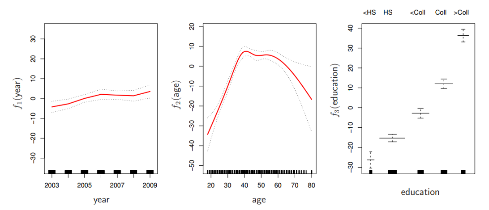{.nostretch width="90%" fig-align="center"}

::: {.notes}
This wage prediction example shows how GAMs capture different functional forms: year has a roughly linear upward trend, age shows a non-monotonic curve peaking in mid-career years, and education shows discrete jumps between levels. Each function is learned from data while the additive structure keeps the model interpretable.

This is the standard wage example from the statistical learning literature, and it is a good one because the three panels are three different kinds of effect in one model.

Left, year: nearly a straight line, a slow upward drift. This is the panel where a linear term would have done the job, and the GAM tells you so.

Middle, age: the shape a linear model cannot express. Wages rise steeply through the twenties and thirties, flatten around the mid-forties, and decline after about sixty. A linear coefficient on age would average the rise and the decline into one lukewarm positive number, and every individual statement made from it would be wrong at both ends.

Right, education: a categorical feature, so not a curve at all but a set of levels with error bars, increasing monotonically. It is worth pointing out that the same additive framework handles both continuous and categorical features, and that the visual language changes accordingly, points and intervals rather than a line.

Two details to point at on the figure itself. The dashed bands are pointwise uncertainty, and they flare where the data thins, at the youngest and oldest ages. And the tick marks along the bottom axis are the data itself. Read the curve and the ticks together, always: the decline after sixty is estimated from comparatively few people, which is exactly the kind of caveat a shape function invites you to forget.
:::


<!-- ## Training GAMs (Backfitting)
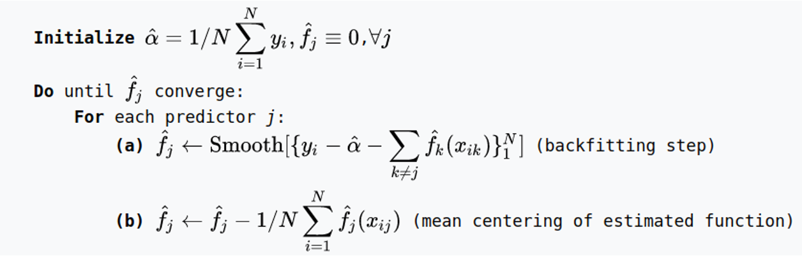

::: {.notes}
The backfitting algorithm trains GAMs iteratively using a coordinate descent approach. Start with initial functions, then repeatedly update each function to fit the residuals from all other functions. This process converges to the optimal additive decomposition. It's computationally efficient and works well even with many features.
::: -->


## Generalized Additive Models (GAMs): Pros and Cons

::: {.columns}
::: {.column width="50%"}
### ✅ Pros:

- **Non-linear flexibility**: Automatically learns smooth curves for each feature
- **Better predictions**: Captures non-linear relationships without manual feature engineering
- **Still interpretable**: Visualize each $f_j(x_j)$ independently
- **Maintains additivity**: Easy to understand feature contributions

:::

::: {.column width="50%"}
### ⚠️ Cons:

- **No interactions by default**: Must explicitly add interaction terms
- **Computationally expensive**: Finding all pairwise interactions is infeasible with many features
- **Harder to explain**: Shape functions less intuitive than linear coefficients
- **Overfitting risk**: Requires careful smoothness tuning

:::
:::

::: {.notes}
GAMs balance flexibility and interpretability nicely - more expressive than linear models but still visualizable. But the no-interaction constraint can be limiting. If temperature and humidity interact to affect outcomes (e.g., heat index), a pure GAM will miss this synergistic effect and may underfit.

Push on the interaction point, because it is what motivates the next three slides. A pure GAM assumes the effect of humidity is the same shape at 15 degrees and at 35 degrees. For comfort, or for mortality, that is plainly false: humidity barely matters when it is cold and dominates when it is hot. An additive model can only fit the average of those two shapes.

The fix is to add a term f_ij(x_i, x_j) for a chosen pair, which is a surface rather than a curve and can still be drawn, as a heatmap. That is a GA2M, and it is what an Explainable Boosting Machine gives you. The catch is combinatorial: with 50 features there are 1,225 candidate pairs, so you cannot simply add them all, and you need a way to decide which pairs earn their place.

The second honest cost, since the slide raises it: shape functions are harder to communicate than coefficients. "Each bedroom adds 90,000" fits in an email. "Here is the curve for square footage" requires the reader to look at a picture and read it correctly, which is a visualization problem, and is precisely why papers like Gamut and GAM Changer exist.
:::

## Explainable Boosting Machines
::: {.columns}
::: {.column width="65%"}
\begin{equation}
g(\mathbb{E}[y]) = \beta_0 + \sum f_j(x_j) 

\end{equation}

\begin{equation}
g(\mathbb{E}[y]) = \beta_0 + \sum f_j(x_j) + \sum f_{ij}(x_i, x_j)

\end{equation}

:::

::: {.column width="35%"}
What if we have a lot of interactions?
How do we choose our interactions?

:::
:::

::: {.notes}
Automatically selecting which interactions to include is an active research area. EBMs use gradient boosting to greedily select the most important pairwise interactions during training. The boosting process alternates between improving main effects and interactions, naturally prioritizing the most impactful terms.

Describe the training loop, because it explains why the result is still readable. An EBM boosts with very small trees, and it cycles through the features in round-robin: a tiny tree on feature 1, then feature 2, and so on, thousands of passes with a small learning rate. Because each tree only ever sees one feature, the contributions never entangle, and at the end the model collapses into exactly one lookup function per feature. The round-robin also reduces the order dependence you would get if you fitted features one at a time to convergence.

Then the interactions are chosen in a second stage, by measuring which candidate pairs would most reduce the remaining error and keeping a small number of them. So the model is main effects plus a handful of named pairs, and the pairs are reported, not hidden.

The two claims to emphasize. First, accuracy: on tabular data these are routinely competitive with random forests and boosted trees, which undercuts the reflex that interpretable means weak, and connects to the Rudin argument at the end of the lecture. Second, exactness: the explanation is not an approximation of the model, it is the model. You can hand someone the curves and they can reproduce any prediction with addition. Every post-hoc method we meet next week is an estimate; this is an identity.
:::

## Explainable Boosting Machines

::: {style="text-align: center;"}

:::

::: {.notes}
This video from Microsoft Research demonstrates the InterpretML library and EBMs in action. Watch how the system automatically discovers important feature interactions and visualizes their effects on predictions using partial dependence plots and interaction heatmaps.

Things to point at while it plays: the global view, one small multiple per feature, which is the whole model; the ability to sort features by importance, where importance is the average absolute contribution rather than a coefficient; and the local explanation for a single prediction, which for this model class is just the list of the terms that were added up.

Say the practical line: this is a pip install away, interpret is the package, and an EBM is a drop-in classifier or regressor with the usual fit and predict. For a course project on tabular data it is a reasonable first model rather than a consolation prize, and if it matches your gradient boosting baseline you get the explanation for free.

If the video does not load, this is a file:// problem with the YouTube embed rather than a broken link; serve the deck over HTTP.
:::
<!-- 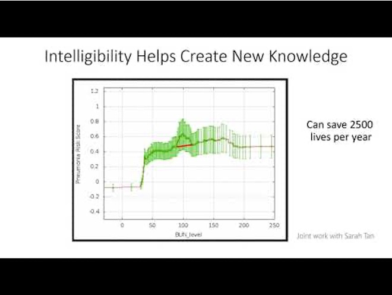 -->

## Partial Dependence Plots (PDPs)

::: {.columns}
::: {.column width="60%"}
**What PDPs show:** The marginal effect of a feature on the predicted outcome

**Mathematical idea:** Average the model's predictions across all data points while varying one feature

::: {.incremental}
- **Y-axis**: Change in prediction (relative to baseline)
- **X-axis**: Feature values
- **Curve shape**: Reveals linear, monotonic, or complex relationships (U-shaped in example)
:::
:::

::: {.column width="40%"}
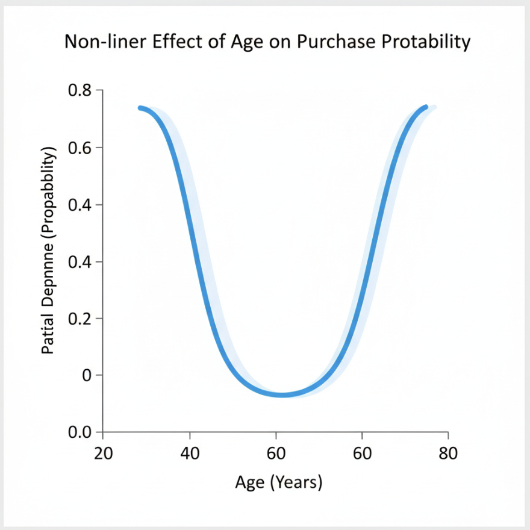{height="760" fig-align="center"}
:::
:::

::: footer
Molnar, C. (2022). [*Interpretable Machine Learning*](https://christophm.github.io/interpretable-ml-book/pdp.html). Chapter 8.1.
:::

::: {.notes}
PDPs marginalize the model output over the distribution of other features. For each value of feature X, we compute predictions for all data points with X set to that value, then average those predictions. This shows the average effect of X on predictions. The curve reveals whether the relationship is linear (straight line), monotonic (always increasing/decreasing), or more complex with peaks and valleys.

Give them the recipe as an algorithm, because it is three lines and it demystifies the plot. To get the partial dependence at age 40: take every row of your dataset, overwrite the age column with 40 while leaving all other columns as they are, ask the model to predict, and average those predictions. Repeat for a grid of ages and join the dots. Friedman introduced this in the gradient boosting paper, and it is entirely model-agnostic: it only needs a predict function, so it works on a random forest or a neural network.

Note the cost: it is one pass over the whole dataset per grid point, so a hundred grid points means a hundred full prediction passes. Implementations subsample for a reason.

Now the point that matters for this lecture. For a GAM the partial dependence is exact, it recovers f_j up to a constant, because the model really is additive. For any other model it is a summary: the curve is an average over interactions and correlations that the model is using but the plot cannot show. So the same picture means "the model" in one case and "one projection of the model" in the other. When you read a PDP in a paper, check which situation you are in. The next slide is about what goes wrong in the second case.
:::

## PDPs: Advantages and Limitations

::: {.columns}
::: {.column width="50%"}
### ✅ Advantages:
- **Intuitive**: Easy to understand and explain
- **Model-agnostic**: Works with any model
- **Causal hints**: Suggests feature importance
- **Shows shape**: Reveals non-linear patterns
:::

::: {.column width="50%"}
### ⚠️ Limitations:
- **Independence assumption**: Assumes features are independent (often violated!)
- **Averages hide details**: Misses heterogeneous effects
- **Unrealistic combinations**: May average over impossible feature values
- **Max 2 features**: Can't visualize high-dimensional interactions
:::
:::

::: footer
Molnar, C. (2022). [*Interpretable Machine Learning*](https://christophm.github.io/interpretable-ml-book/pdp.html). Chapter 8.1.
:::

::: {.notes}
The independence assumption is critical: PDPs assume you can vary one feature while holding others at their marginal distribution. But if features are correlated (e.g., house size and number of rooms), the PDP may average over unrealistic combinations. For example, it might average predictions for "1000 sq ft with 10 bedrooms" which doesn't exist in reality.

This is the same defect as the ceteris paribus problem with linear coefficients, now in visual form, and it is worth naming the connection: both procedures answer a question about a world where features move independently, and in the actual data they do not.

Spell out the consequence. When you overwrite square footage with 4,000 for every row, you are asking the model about 4,000 square foot studios, and the model will happily answer, because it extrapolates. Those predictions come from a region with no training data, they can be arbitrary, and they are averaged into the curve with the same weight as the sensible ones. So the least trustworthy part of the plot looks exactly like the rest of it.

Two standard repairs, worth naming so they recognize them in papers. ICE plots draw one line per instance instead of the average, which reveals when the average is hiding opposite effects in different subgroups, a flat PDP over a fan of rising and falling lines. ALE plots, accumulated local effects, replace the global average with local differences computed within small windows of the feature, so the model is never asked about combinations that do not occur.

The second limitation on the slide, the two-feature ceiling, is really a visualization limit rather than a mathematical one: partial dependence is defined for any subset, but we can only look at a curve or a surface. That is the opening the visual analytics systems in the next section walk through.
:::

## Visualizing EBMs (or GAMs)
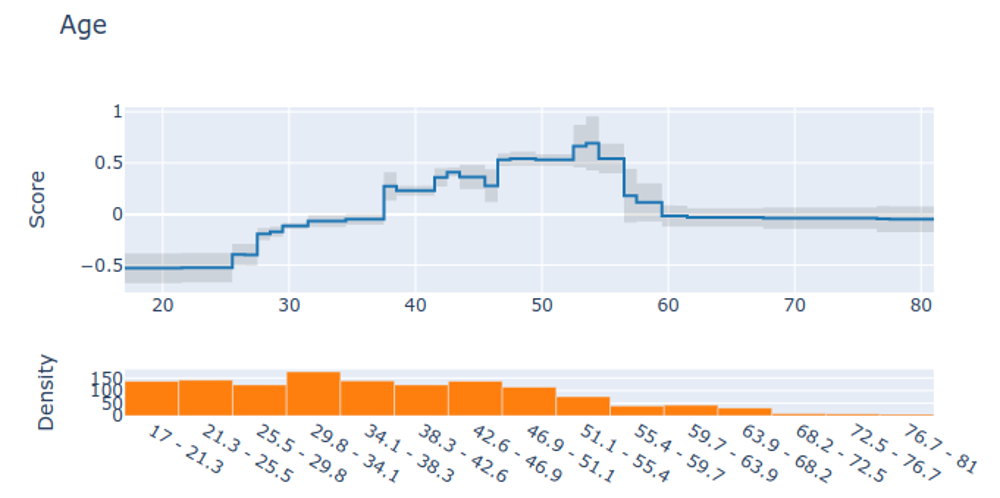

::: {.notes}
The first of four views of the same EBM, trained on census income data. This one is a continuous feature, Age. The step function on top is the learned shape function: the x axis is age, the y axis is the contribution to the score, and because this is a classifier with a logit link, the units are log odds, not probability. Centered at zero, so positive means this age pushes the prediction above the base rate.

Read the shape with them: flat and negative through the early twenties, rising steeply from about 25 to 50, a plateau with a bump around the early fifties, then a decline and a long flat tail past 60. That is a substantive claim about the world, and it is the kind of claim a single coefficient cannot make.

Three details on this figure that generalize to every shape function they will draw. The grey band is uncertainty, from bagging inside the EBM; where it widens, the model is guessing. The steps are steps, not a smooth curve, because the model is built from shallow trees, so the function is piecewise constant, and the step boundaries are the thresholds the trees chose. And the orange histogram underneath is the data density: the flat tail past 70 rests on very few people. Curve and density are read together, always.
:::

## Visualizing EBMs (or GAMs)
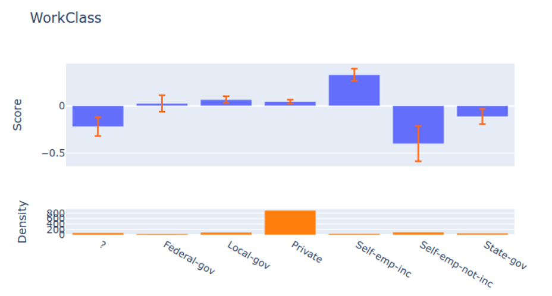

::: {.notes}
The same model, now a categorical feature: WorkClass. The visual language changes to a bar per category, each with an error bar, and the y axis is still a contribution to the log odds.

The point of showing this next to the age curve is that additive models handle both kinds of feature in the same framework, and the plot just adapts. There is no ordering along the x axis here, so nothing should be read into the left-to-right sequence.

Read the pattern: Self-emp-inc sits clearly above zero, Private sits slightly below, and the categories with wide error bars are the ones with almost no data, which the density panel underneath confirms. That is the categorical version of the caveat from the previous slide: a tall bar over an empty histogram is a number the model made up from a handful of rows.

Ask the room what they would do about a category with five observations and an enormous error bar. Merging it into an "other" bucket before training is usually right, and it is exactly the kind of edit the GAM Changer slide later makes possible after training.
:::


## Visualizing EBMs (or GAMs)
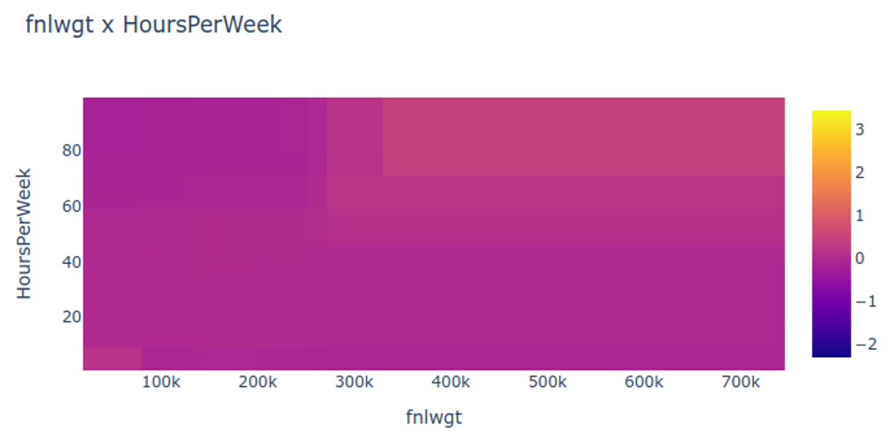

::: {.notes}
Now a pairwise interaction term, the part a pure GAM cannot express: fnlwgt against HoursPerWeek. The encoding is a heatmap, so the x and y axes are the two features and colour is the joint contribution to the score.

Say what this term means inside the model. The prediction is still a sum; this surface is simply one more addend, on top of the individual shape functions for both features. So an EBM is not a black box that happens to plot nicely, it is main effects plus a short, named list of pair terms, and you are looking at one of them.

Read it honestly: most of this surface is flat, one broad band differs, and the effect is modest compared with the age curve two slides ago. That is a useful thing for students to see, because papers tend to show the one interaction that mattered. Being able to see that a term contributes almost nothing is a result.

One visualization point, since this is that kind of course: the colour map here is a continuous sequential-to-diverging ramp over a quantity that has a meaningful zero, the point where the interaction adds nothing. A diverging map centred at zero would make the sign of the contribution readable at a glance, which this one only partly does.
:::

## Visualizing EBMs (or GAMs)
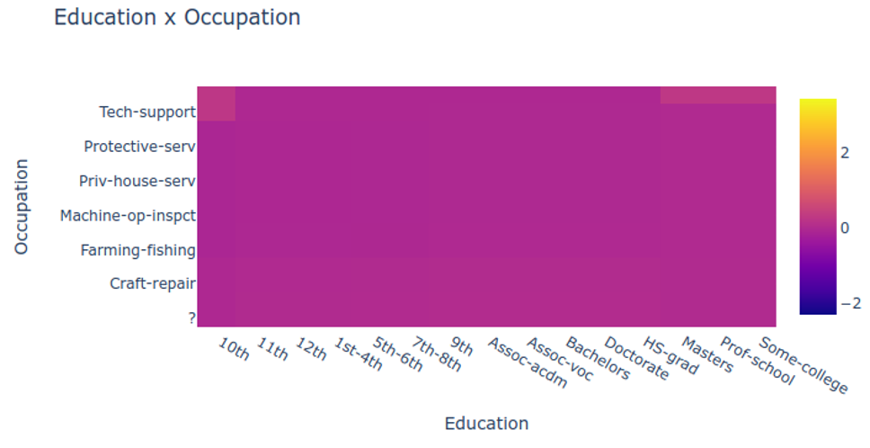

::: {.notes}
A second pairwise interaction, Education against Occupation, and this one is categorical on both axes, so the heatmap becomes a grid of cells rather than a continuous surface.

This is the figure to use for the scalability question. Sixteen education levels by fourteen occupations is 224 cells, and each cell is estimated from the rows that have that exact combination, which for rare pairs is very few. Ask the room what happens when you go from two categorical features to three: the grid becomes a cube, you cannot draw it, and the counts per cell collapse. That is the real ceiling on interaction terms, and it is a data problem as much as a display problem.

It is also worth noticing how much of this plot is a single flat colour. The interaction is concentrated in a few combinations. A sorted or clustered layout, ordering rows and columns so that similar effects sit together, would reveal that structure far better than the alphabetical ordering shown here, and that is a direct application of the matrix reordering ideas from the InfoVis literature.

Taken together, these four slides are the whole EBM: a curve per continuous feature, bars per categorical feature, and a small number of pair surfaces. Nothing else is happening inside the model, which is the claim that makes this family worth the lecture.
:::

## Visual Analytics (VA) Systems Using GAMs
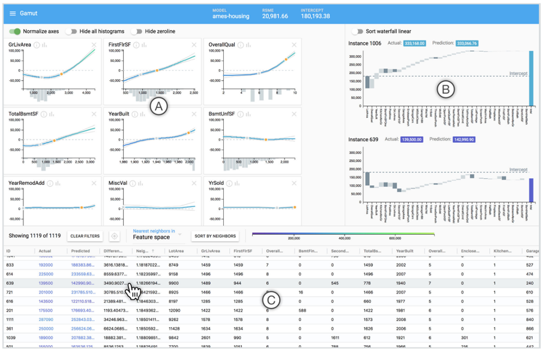

::: footer
Hohman, F., Head, A., Caruana, R., DeLine, R., & Drucker, S. M. (2019). [Gamut: A Design Probe to Understand How Data Scientists Understand Machine Learning Models](https://doi.org/10.1145/3290605.3300809). *CHI 2019*.
:::

::: {.notes}
Gamut, from Microsoft Research, CHI 2019, and it is worth being precise about what kind of paper it is: the system is a *design probe*. They built it in order to study how data scientists actually interpret models, so the contribution is as much the findings about people as the tool.

The interface, from the screenshot. Left, the shape curve view: one line chart per feature, contribution on the y axis in dollars, with a histogram of data density under each axis, which is the same discipline we just applied to the EBM plots. Select a house and it appears as a point on every curve. Drag it and you have a counterfactual: what would this prediction be if the house were 300 square feet bigger. Right, the instance explanation is a waterfall chart, one bar per feature contribution plus the intercept, sorted by magnitude, and a second waterfall can be locked to the first's ordering so two houses can be compared row by row.

The study: twelve professional data scientists, an hour and a half each, on a housing model. Three findings worth repeating.

First, expertise changed what people used. The ML novices went to the local, single-prediction explanations; the most expert participants moved fluidly between global shape functions and local explanations. So "explain the model" is not one need, it is several, and the audience determines which.

Second, interactivity stopped being optional. The authors note that participants could not conceive of answering their own questions without it, even though the standard practice for GAMs at the time was flipping through static printouts of the shape functions.

Third, and this is the one to leave them with, a warning: participants were eager to rationalize the explanations without first asking whether the explanation was correct. A plausible-looking curve gets believed. That is the risk that runs through the whole second half of this course.
:::

## Visual Analytics (VA) Systems Using GAMs


::: footer
Drucker, S. (2020). [Data Visualization: Bridging the Gap Between Users and Information](https://www.microsoft.com/en-us/research/video/data-visualization-bridging-the-gap-between-users-and-information/). Microsoft Research Webinar.
:::

::: {.notes}
A pointer slide rather than a system: this is the title card of Steven Drucker's Microsoft Research webinar, "Data Visualization: Bridging the Gap Between Users and Information", which is available on demand and is a good survey talk to send students to. Drucker is a co-author on the Gamut paper we just looked at and leads visualization work at MSR.

Use this as the moment to step back from the tools and name the pattern they share. Gamut, GAM Changer, and the tree and rule systems coming up are all built on the same three-part recipe: show the model globally, let the user select a case or a region, and show the local consequence in a linked view. Once you see the recipe, the individual systems become variations, and you can design the next one.

If time is short this is the first slide to skip, since the substance is on the slides either side of it.
:::

## GAM Changer: Injecting Domain Knowledge via Interactive Editing

::: {.columns}
::: {.column width="65%"}
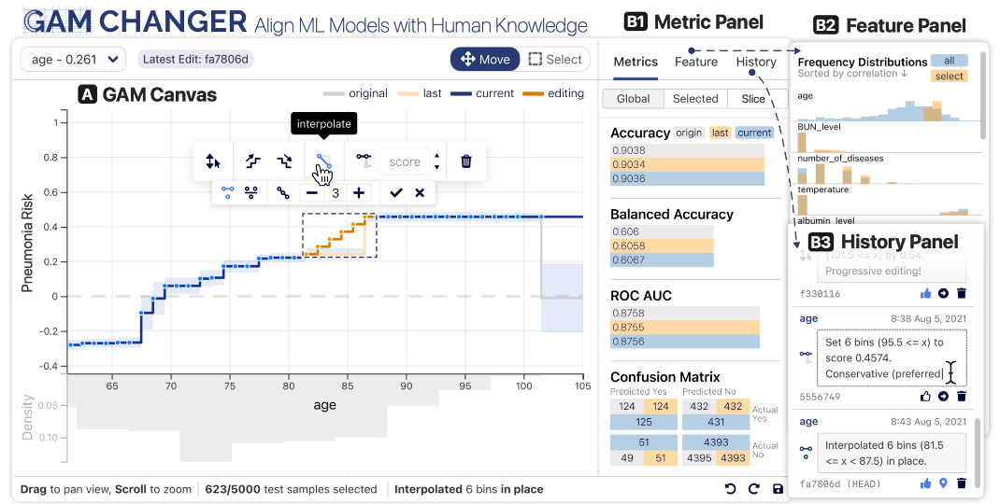{width="100%" fig-align="center"}
:::

::: {.column width="35%"}
**Human-in-the-Loop Features:**

- **Edit shape functions** to encode domain knowledge
- **Enforce monotonicity** where business logic requires
- **Smooth noisy patterns** to improve generalization
- **Real-time feedback** on model performance

**Key Innovation:** Bridges data-driven learning with expert knowledge through interactive visualization
:::
:::

::: footer
Wang, Z. J., Kale, A., Nori, H., Stella, P., Nunnally, M., Chau, D. H., ... & Caruana, R. (2021). [GAM Changer: Editing Generalized Additive Models with Interactive Visualization](https://arxiv.org/abs/2112.03245). arXiv:2112.03245. [Demo](https://interpret.ml/gam-changer/) | [Code](https://github.com/interpretml/gam-changer)
:::

::: {.notes}
GAM Changer, from the same Microsoft Research group with Carnegie Mellon, and it answers the question the Gamut study raised: interpretability, then what? Once a domain expert looks at a shape function and says "that part is wrong", what can they actually do about it? Here they edit the model directly.

The interface, left to right on the screenshot. The GAM Canvas shows one shape function as a set of editable bins; you can select a region and drag it, interpolate across it, delete a segment, or apply monotonicity, which fits an isotonic regression weighted by the bin counts. The metric panel updates in real time, on the global data, on the selected samples, and on a chosen slice, so you see immediately what an edit costs in accuracy. The feature panel shows which other features the affected samples differ on, which is how you catch an edit that silently targets a subgroup. And the history panel treats edits like commits, with timestamps and messages, so the model's edit history is auditable. It runs locally in the browser via WebAssembly and ships inside InterpretML.

The motivating example is medical and it is very clear: in a pneumonia risk model, the learned curve showed elevated risk at a body temperature of 96 degrees Fahrenheit relative to 95. A physician said there is no physiological reason for that, it is an artifact of who got treated, and edited it out.

The part I would spend a minute on is the disagreement in their user study of seven data scientists. Shown an odd trend where low debt-to-income looked risky, some said it made sense and left it, one edited it away on the grounds that a model should not punish people with no debt, and another refused to touch it. Same chart, same tool, different ethical calls. And the authors are candid that real-time feedback and undo do not prevent someone from injecting bias, or from overfitting the validation set by editing against it. Editing a model is a governance question wearing a visualization interface, which is a good note to carry into the fairness week.
:::

## Decision Trees: How They Work

::: {.columns}
::: {.column width="50%"}
Decision trees recursively split data based on feature thresholds:

::: {.incremental}
- **Internal nodes**: Tests on features
- **Branches**: Test outcomes (Yes/No)
- **Leaf nodes**: Final predictions
- **Algorithm**: CART
:::

**Prediction**: Follow path from root to leaf
:::

::: {.column width="50%"}
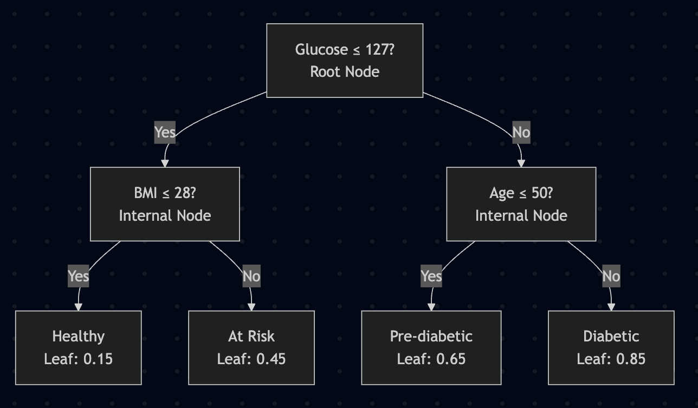{width="100%"}

<!-- MERMAID CODE: decision-tree-diabetes.mmd
```{mermaid}
graph TD
    A[Glucose ≤ 127?<br/>Root Node]
    A -->|Yes| B[BMI ≤ 28?<br/>Internal Node]
    A -->|No| C[Age ≤ 50?<br/>Internal Node]
    B -->|Yes| D[Healthy<br/>Leaf: 0.15]
    B -->|No| E[At Risk<br/>Leaf: 0.45]
    C -->|Yes| F[Pre-diabetic<br/>Leaf: 0.65]
    C -->|No| G[Diabetic<br/>Leaf: 0.85]

    style A fill:#e8f4f8,stroke:#2980b9,stroke-width:3px
    style B fill:#f0f8ff,stroke:#3498db,stroke-width:2px
    style C fill:#f0f8ff,stroke:#3498db,stroke-width:2px
    style D fill:#d5f4e6,stroke:#27ae60,stroke-width:2px
    style E fill:#fff3cd,stroke:#f39c12,stroke-width:2px
    style F fill:#ffd6cc,stroke:#e67e22,stroke-width:2px
    style G fill:#f8d7da,stroke:#e74c3c,stroke-width:2px
```
-->

**Example:** 3 splits, 4 leaves, depth 2
:::
:::

::: footer
Molnar, C. (2022). [*Interpretable Machine Learning*](https://christophm.github.io/interpretable-ml-book/tree.html). Chapter 4.4.
:::

::: {.notes}
Decision trees work by recursively partitioning the feature space. At each internal node, the algorithm chooses a feature and threshold that best splits the data (measured by Gini impurity for classification or variance reduction for regression). This creates a hierarchical structure where each path represents a decision rule. To make a prediction, follow the decision path from root to leaf based on the instance's feature values.

Say what "best" means, because it is one greedy line: try every feature and every threshold, score each candidate split by how much purer the two children are than the parent, take the winner, then recurse. Gini impurity for a node is one minus the sum of squared class proportions, so it is zero when a node is all one class and 0.5 for a balanced binary node. Nothing looks ahead: a split that is mediocre now but would enable a perfect split later is never chosen. That greed is why trees are fast and why they are unstable.

Then the geometry, which is the part students miss. Because every test is on a single feature, every boundary is perpendicular to an axis, so the model carves the space into boxes. A diagonal boundary has to be approximated by a staircase, which is why a two-feature problem with a diagonal separation can need a deep tree, and why trees dislike rotated data while neural networks do not care.

And say where the interpretability actually comes from. Not from the algorithm, from the drawing: the path from root to leaf is a sentence in plain language, and you can follow one case through it in front of a non-expert. That property survives to about depth four or five and then quietly dies, which is the subject of the next slide.
:::

## Decision Trees: Interpretation

**Reading a tree**: "If feature $x_j$ is [smaller/larger] than threshold $c$ AND ... then predict $\hat{y}$"

::: {.columns}
::: {.column width="50%"}
### ✅ Strengths:
- **Natural interactions**: Captures feature interactions automatically
- **Visual logic**: Clear decision rules
- **No preprocessing**: Works with raw features
- **Human-friendly**: Mimics human reasoning
:::

::: {.column width="50%"}
### ⚠️ Limitations:
- **Linear relationships**: Poor at modeling smooth trends
- **High variance/instability**: Small data changes → different tree
- **Depth problem**: Deep trees become uninterpretable
- **Step functions**: Predictions jump at thresholds

**→ This instability motivates ensemble methods** (Random Forests, Gradient Boosting) which average many trees
:::
:::

**Trade-off:** Ensembles gain accuracy but **lose white-box interpretability** → Need for global surrogates (discussed later)

::: footer
Molnar, C. (2022). [*Interpretable Machine Learning*](https://christophm.github.io/interpretable-ml-book/tree.html). Chapter 4.4.
:::

::: {.notes}
The key limitation of decision trees is their instability (high variance) - small changes in training data can produce completely different tree structures. This motivated ensemble methods like Random Forests and Gradient Boosting, which average predictions from hundreds of trees. However, this comes at a major cost: we lose the white-box interpretability of individual trees. You can't meaningfully inspect 500 trees.

Explain why the instability happens, since it follows from the greedy split. If two candidate splits at the root score almost the same, a handful of resampled rows can flip which one wins, and because everything below is conditioned on that choice, the entire subtree changes. The predictions may barely move while the explanation changes completely. That is a specific and uncomfortable failure: the model is stable and its interpretation is not. Ask them what it means to show a stakeholder a tree that would look different on next month's data.

Put a number on the depth problem too. A balanced tree of depth 10 has up to 1,024 leaves, so "just read the tree" is not available, and the rules at the bottom each cover a handful of cases.

Then the trade-off at the bottom of the slide, which is the hinge of the whole lecture. Ensembles fix the variance by averaging, and averaging destroys the single readable structure. The rest of today is two answers to that. The surrogate route, coming up shortly, fits one interpretable model to imitate the ensemble. The Rudin route, at the end, says that for high-stakes decisions you should not have built the ensemble in the first place.
:::

## Tree-based Models: Example
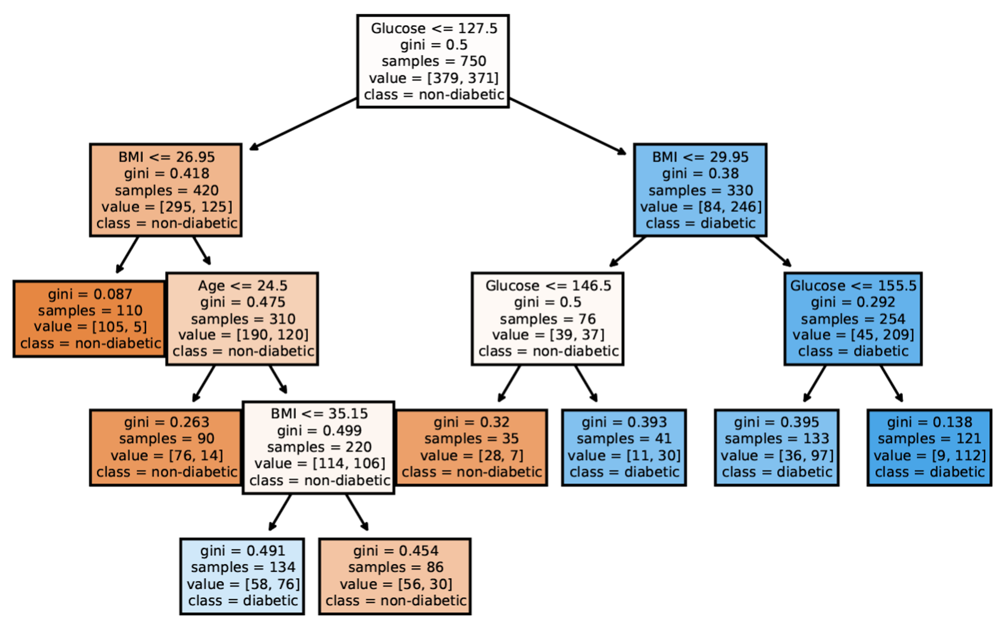

::: {.notes}
A real tree, from scikit-learn on a diabetes dataset, and it is worth reading a couple of nodes out loud because the box contents are the anatomy of the model.

Start at the root: the test is glucose at or below 127.5, there are 750 samples, gini is 0.5, and the class distribution is 379 against 371, which is a balanced problem. Follow the left branch, lower glucose, and the next test is BMI at 26.95 with 420 samples now leaning non-diabetic, 295 to 125. So the tree has found the two features a clinician would name first, and it found them in that order because glucose split the data best.

Three things to point out. The thresholds are oddly precise, 127.5 and 26.95, because they are midpoints between adjacent observed values, not clinical cutoffs; do not over-read them. The colour encodes majority class with saturation for purity, so pale boxes are nodes the model is unsure about. And the sample counts shrink fast: several leaves here hold 35 to 121 cases, which is a reminder that the rules at the bottom of a tree are estimated from very little data.

Then the interaction point on the slide. The tree tests BMI on both sides of the root, at 26.95 on one side and 29.95 on the other. That is an interaction discovered automatically: the BMI that matters depends on the glucose level. A GAM cannot express that without an explicit pair term, and a linear model cannot express it at all. Trees get interactions for free and pay for it in additivity and stability.
:::


<!-- ## Visualization of Trees

https://treevis.net/ provides a gallery of tree visualization. These trees are used to visualize hierarchical structures, but not just tree-based machine learning models.


::: {.notes}
The TreeVis gallery showcases diverse tree visualization techniques from decades of HCI and InfoVis research. While many are designed for file systems, organizational charts, or taxonomies, the layout algorithms (node-link diagrams, treemaps, sunburst charts, icicle plots) all apply to ML decision trees. Choice of layout depends on what you want to emphasize - structure vs space utilization.
::: -->


## VA Systems Using Tree-based Models
::: {.columns}
::: {.column width="65%"}
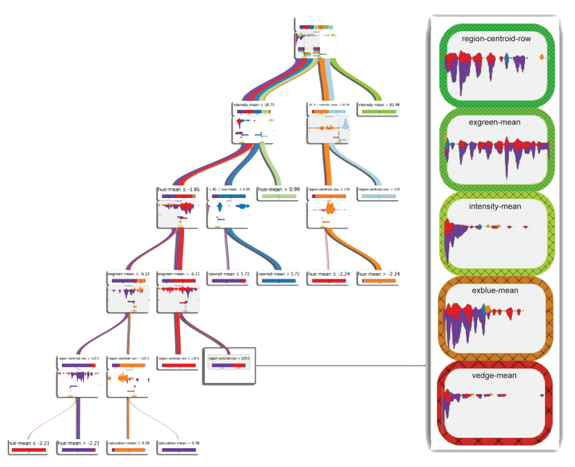{height="760" fig-align="center"}


:::

::: {.column width="35%"}
It shows the flow of different class, and the class distribution along the feature values.
:::
:::

::: footer
van den Elzen, S., & van Wijk, J. J. (2011). [BaobabView: Interactive Construction and Analysis of Decision Trees](https://doi.org/10.1109/VAST.2011.6102453). *IEEE VAST 2011*.
:::

::: {.notes}
BaobabView, van den Elzen and van Wijk, VAST 2011. Flag up front that this is the same system we return to in detail in four slides, where the title says "Interactive Construction"; the name and the paper are the same.

The encoding, which is the part to have them read off the figure. The tree is a node-link diagram drawn top down, and the width of every link is proportional to the number of instances flowing from parent to child, so the diagram is also a flow map: thick means most of the data went this way. Each link is split into coloured bands by class, so you see not just how much data flows but what it is made of, and purity becomes visible as a band collapsing to one colour. Inside each node there is a class distribution bar and a small distribution plot for the candidate split attribute, with the split point drawn as a line you can drag.

That dragging is the point of the paper. This is not a tree viewer, it is a tree *editor*: the expert grows, prunes and adjusts splits by hand, with the confusion matrix updating alongside.

The result worth quoting, from their image-segmentation case. Their hand-built tree reached 93.2 percent accuracy with 29 nodes using 6 of the 19 attributes. The automatic J48 tree scored 94.5 percent with 75 nodes and 12 attributes. So they traded about one point of accuracy for a model two and a half times smaller, and they published that as a success. Ask the room whether that is a good trade, and for which use.

One caveat for honesty: there is no user study here. The authors showed it to three decision tree experts, report that they were positive, and explicitly say a formal evaluation is future work, noting that a controlled experiment is hard when the goal is insight rather than accuracy.
:::

## VA Systems Using Tree-based Models
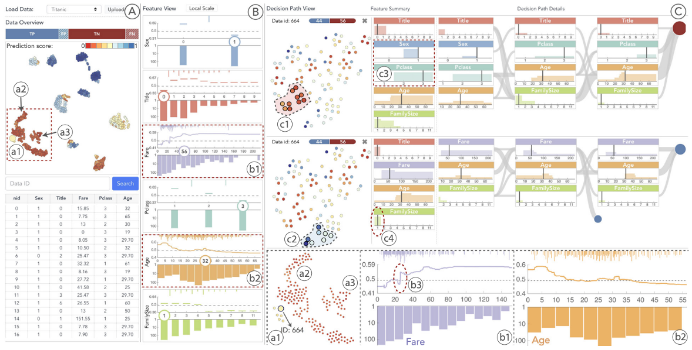

::: footer
Zhao, X., Wu, Y., Lee, D. L., & Cui, W. (2019). [iForest: Interpreting Random Forests via Visual Analytics](https://doi.org/10.1109/TVCG.2018.2864475). *IEEE TVCG*, 25(1), 407-416.
:::

::: {.notes}
iForest, Zhao and colleagues, TVCG 2019. The problem it takes on is the one from the decision-tree slide: a random forest is hundreds of trees, and you cannot read them.

Their move is to shift the unit of analysis from the tree to the *decision path*. Every instance traverses every tree, producing hundreds of paths; iForest summarizes those paths rather than the trees. The system gives access to all the tree information and then summarizes the decision paths across the forest, so a user can ask what route the ensemble typically takes for a given kind of case.

The design detail most worth pointing at, and I would mark it as how the system is described in the follow-on literature rather than something I verified in the paper, which is paywalled: the projection view embeds decision *paths*, not data points. Two dots close together mean the forest reasoned about those two cases similarly, not that the cases have similar feature values. That is an unusual and clever thing to project, and it is easy to misread as an ordinary t-SNE of the data. If you show this figure in a project, label the projection carefully.

The evaluation is two usage scenarios and a qualitative user study.

One limitation to note, raised by the ExMatrix authors on the next-but-one slide: iForest focuses on binary classification, and it does not give an overall picture of the voting committee, which is exactly the gap ExMatrix sets out to fill. Useful to point out that the field advances by one system naming another's blind spot.
:::

## Interactive Construction and Analysis of Decision Trees

::: {.columns}
::: {.column width="50%"}
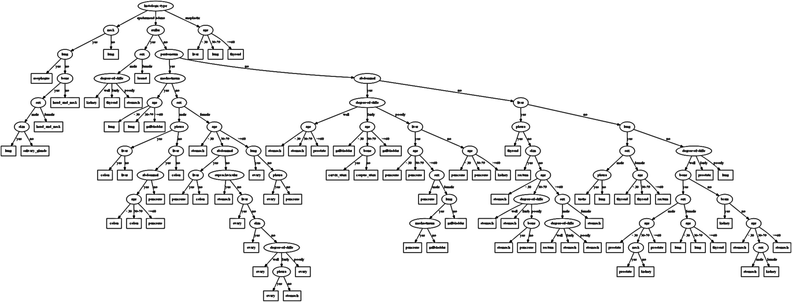{width="100%" fig-align="center"}
:::

::: {.column width="50%"}
- Novel node-link visualization for very large decision trees
- Interactive construction: users can split nodes, prune branches
- Multiple views: overview, detail, rules
:::
:::

::: {.notes}
Now the same BaobabView system in detail. Say that explicitly, because the slide title changes and students will otherwise think this is a second tool.

The overview figure shows the scalability claim: a tree far too large to read node by node, laid out so that the shape is still informative. At this zoom the widths and colours still carry the story, where the mass of the data goes and where classes separate, even though the labels are gone. That is a deliberate design position: an overview does not have to be legible in detail to be useful, it has to preserve the structure you navigate by.

The three bullets are the interaction loop. Construction: the analyst chooses splits rather than accepting the greedy choice, which is how domain knowledge gets in. Pruning: cut a subtree that is fitting noise and watch the confusion matrix. And multiple linked views, overview, detail, and rules, which is the same three-part recipe as Gamut.

The argument for putting a human in this loop is worth stating, because it is not obvious. A greedy learner optimizes purity at each node; it has no idea that one of your features is expensive to measure, or unavailable at prediction time, or ethically off-limits. A human can decline a split for reasons that are nowhere in the data. That is the same motivation as GAM Changer earlier: the model gets edited to respect knowledge the training set does not contain.
:::

## Interactive Construction: Video Demonstration

::: {style="text-align: center;"}

:::

::: {.notes}
The video demonstration of BaobabView. Three things to watch for, and it is worth naming them before pressing play so the room knows where to look.

First, the immediacy of the feedback loop: a split is chosen and the tree, the flows and the confusion matrix all update at once. The analyst is not running experiments, they are steering.

Second, the split point interaction, where dragging the threshold along the attribute's distribution shows how the instances redistribute. Interesting detail from the paper: as the split point is dragged, the totals on the two sides are kept consistent, so the display stays readable while the boundary moves.

Third, pruning: watch what happens to accuracy when a large, apparently important subtree is cut. Often very little, which is the visual version of the overfitting lesson.

This is a local file rather than a YouTube embed, so it plays without the network. If you are short on time this is skippable, since the two figures after it cover the same ground statically.
:::

## Interactive Construction: Colored Flow Visualization

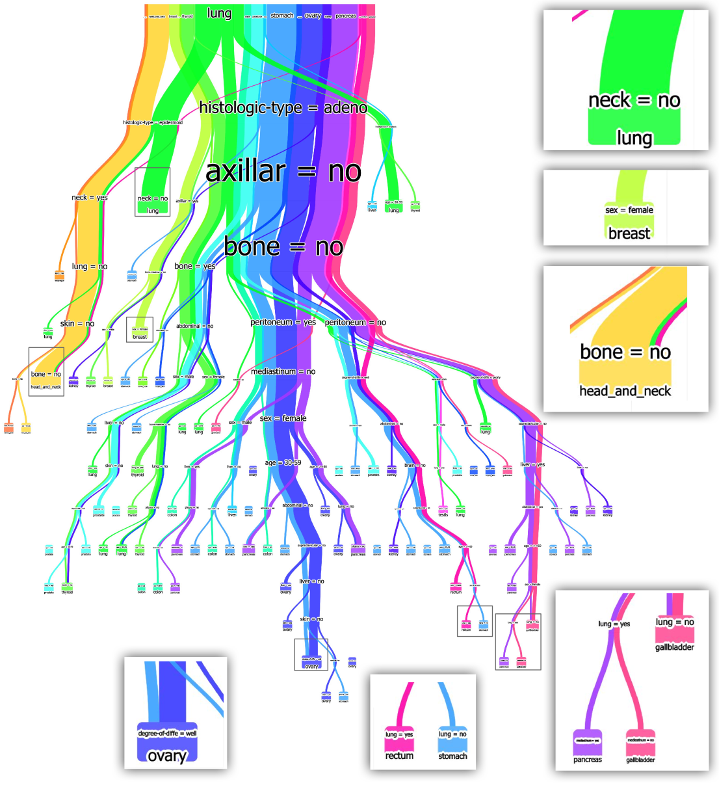

::: {.notes}
The coloured flow view, and this is BaobabView's signature image. Every link is a bundle of instances, its width is the count, and it is divided into bands by class.

Read it as a flow rather than as a tree. The trunk at the top is the whole dataset, all classes mixed, so the bundle is striped with every colour. As you move down, each split peels off colour: a good split produces two children whose bands are more single-coloured than the parent. Purity, which is an abstract number in the Gini formula, is directly visible as stripes turning into solid colour.

The callouts on the right are leaves, labelled with the conditions that reach them, lung, breast, head and neck. Point out that some ribbons stay thick and mixed a long way down: those are the regions the model never manages to separate, and they are where you would look first for a new feature.

Two design observations for a visualization course. This is a Sankey-like encoding, so it inherits the strength of that family, that quantity is preserved along the flow and you can follow a subpopulation. And the colour here encodes the true class rather than the prediction, which is what lets you see error as colour surviving where it should not. Always check which of the two a figure is showing you, because the same picture means different things.
:::

## Interactive Construction: Rule Visualization

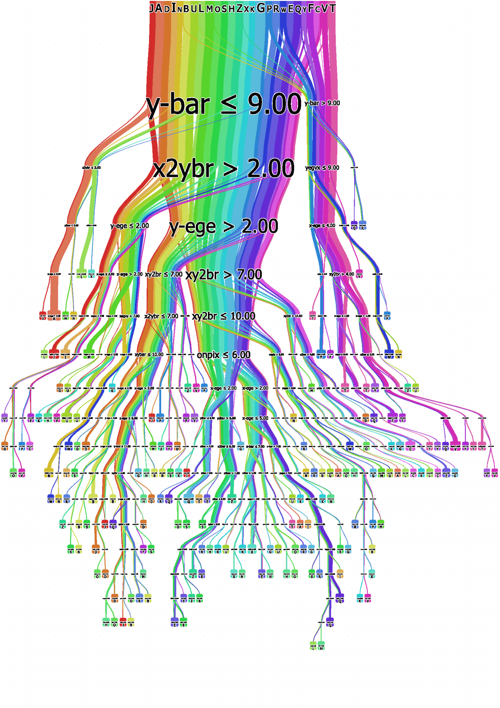

::: {.notes}
The rule view of the same tree. The structure is unchanged; what has been added is the predicate at each split, so the picture can be read as text: y-bar at most 9.00, then x2ybr above 2.00, and so on down to a leaf.

This is the moment the tree becomes the rule list of the next section, so make the link explicit. Every root-to-leaf path is a conjunction of conditions with a class at the end, which is exactly the form of a decision rule. A tree with 40 leaves is a rule set with 40 mutually exclusive rules. The difference is only that the tree draws the shared prefixes once, while a rule list repeats them.

That has a consequence worth stating: trees are compact when rules share conditions and wasteful when they do not, because a condition relevant to two distant branches has to be tested twice. Rule learners can express that in one rule. This is the replicated subtree problem, and it is the standard argument for learning rules directly rather than reading them off a tree.

On the visual design, the honest note: the rainbow colouring here distinguishes paths, and that is close to the limit of what colour can do, since neighbouring hues in a rainbow ramp are not perceptually uniform and the number of paths exceeds the number of distinguishable hues. Sorting or bundling would carry more information than hue at this scale.
:::

# Decision Rules

## Decision Rules: What Are They?

**Definition:** A decision rule is a simple IF-THEN statement consisting of a condition (antecedent) and a prediction (consequent).

::: {.incremental}
- **Structure**: IF (condition) THEN (prediction)
- **Example**: IF glucose > 120 AND age > 50 THEN diabetes_risk = high
- **Natural language**: Rules mirror human decision-making processes
- **Sparse representation**: Only relevant features appear in conditions
- **Fast prediction**: Simple logical evaluation
- **Transparent**: Each rule's logic is fully exposed
- **Compliance-ready**: Rules can be directly translated into legal/regulatory documentation
:::

::: {.notes}
Decision rules represent one of the most interpretable forms of machine learning models. They directly mirror human decision-making processes by explicitly stating conditions and outcomes. This makes them particularly valuable in domains where transparency and explainability are crucial, such as healthcare, finance, and legal applications.

Make the case concretely: a rule is the only model class whose output can be pasted into a policy document without translation. "IF glucose > 120 AND age > 50 THEN high risk" is simultaneously the model, the explanation, and something a regulator can audit. Clinical scoring systems and lending criteria have looked like this for decades, which means rules are the format the domain already speaks.

Two properties on the slide worth drawing out. Sparse representation: only the features that appear in a fired rule matter for that decision, so a fifty-feature dataset can produce a three-condition explanation. And fast prediction: evaluation is a few comparisons, which matters when the model runs on a device or inside a database.

The honest counterweight, so they do not leave thinking rules are free interpretability. Every continuous feature has to be cut into intervals, and those cut points are decisions made by the algorithm, not by medicine. A rule that says "age > 50" implies that 50 and 51 differ and that 51 and 80 do not, which is false as biology and convenient as arithmetic. We will come back to this in the pros and cons.
:::

## Key Difference: Trees vs. Rule Systems

::: {.columns}
::: {.column width="50%"}
**Decision Trees:**

- **Mutually Exclusive**: Each instance follows exactly one path
- **No conflicts**: Instance reaches exactly one leaf
- **Hierarchical**: Rules are ordered by tree structure
- **Example**: A patient is either "high risk" OR "low risk", never both
:::

::: {.column width="50%"}
**Rule Systems:**

- **Not Mutually Exclusive**: Instance can match multiple rules
- **Conflict resolution needed**: Voting, priority, or confidence-based
- **Flat structure**: Rules can be evaluated in any order
- **Example**: A loan can trigger both "high income" AND "high debt" rules
:::
:::

**Implication:** Rule systems need strategies to handle overlapping rules (majority vote, highest confidence, first match)

::: {.notes}
This is a fundamental distinction often overlooked. In decision trees, the hierarchical structure guarantees mutual exclusivity - you can't be in two leaves simultaneously. Rule systems allow multiple rules to fire for the same instance, which requires conflict resolution: majority voting, weighted average, or priority ordering where the first matching rule wins.

Work an example so the abstraction lands. A loan application with high income and high debt. In a tree, the case follows one path and lands in exactly one leaf; whichever of income or debt was tested first has already decided the frame. In a rule set, both "high income implies approve" and "high debt implies deny" can fire, and the system needs a policy for what happens then.

Now the trade-off, which is the interesting part. Mutual exclusivity is what makes a tree easy to reason about globally, and it is also what forces every case through one ordering of questions. Rules give up the guarantee and buy the ability to state several independent reasons for the same decision, which is closer to how people justify things.

The conflict resolution strategy is itself a modelling choice with consequences for interpretability. First-match ordering gives you a rule list, which is cheap to explain, and quietly makes rule 1 more important than rule 40 regardless of evidence. Voting treats rules symmetrically and makes the explanation for a single case a tally rather than a sentence. Ask the room which they would rather defend in a meeting, and there is no clean answer, which is the point.
:::

## Decision Rules: Key Characteristics

**Evaluation Metrics:**

::: {.incremental}
- **Support**: Percentage of instances matching rule conditions
- **Confidence/Accuracy**: Percentage of correct predictions when rule fires
- **Coverage**: How much of the dataset is explained by the rule set
:::

**Learning Approaches:**

::: {.incremental}
- **OneR**: Selects single best feature, discretizes it, creates one rule per value
- **Sequential Covering**: Learns rules greedily - finds best rule, removes covered instances, repeats
- **Bayesian Rule Lists**: Pre-mines frequent patterns, uses Bayesian model selection for optimal ordering
- **RIPPER**: Fast rule learner with pruning to prevent overfitting
:::

::: {.notes}
Support measures breadth - does the rule apply to many instances? Confidence measures precision - when the rule fires, is it usually correct? Good rules balance both metrics. Very specific rules (low support) may overfit, while very general rules (high support, low confidence) may be too simplistic. Sequential covering is the classic approach: learn one rule, remove the data it covers, repeat until all data is covered.

The two metrics are precision and coverage under different names, which is worth saying explicitly so the week 3 vocabulary transfers. Confidence is precision restricted to the cases the rule fires on; support is what fraction of the data that is. A rule with confidence 1.0 and support 0.3 percent is a memorized special case.

On the learning approaches listed on the slide, one sentence each so the names are not empty. OneR builds the best possible single-feature rule set and is worth running as a baseline, because it is often embarrassingly competitive and it tells you how much your complicated model is actually buying. Sequential covering, the RIPPER family, is greedy in the same way as tree induction: take the best rule, delete the rows it covers, repeat, and prune afterwards. Because each rule is learned on what is left over, the later rules are conditioned on the earlier ones, and that is exactly why the ordering carries meaning.

Bayesian Rule Lists are the interesting contrast: rather than greedily growing rules, they pre-mine frequent patterns and then search over orderings of them with a prior that prefers short lists and short conditions. The output is a short, readable list with an uncertainty statement attached, and this line of work is Rudin's, which connects directly to the paper at the end of the lecture.
:::

## Decision Rules: Pros and Cons

::: {.columns}
::: {.column width="50%"}
### ✅ Strengths:

- **Easy to interpret**: Natural language reasoning
- **Fast prediction**: Simple logical checks
- **Robust**: Invariant to feature transformations
- **Feature selection**: Automatically identifies relevant features
- **Human-aligned**: Matches how experts explain decisions

:::

::: {.column width="50%"}
### ⚠️ Limitations:

- **Regression challenges**: Works best for classification
- **Feature discretization**: Continuous features need binning
- **Linear relationships**: Hard to capture smooth trends
- **Overfitting risk**: Complex rules may not generalize
- **Rule conflicts**: Overlapping rules need resolution

:::
:::

::: footer
Molnar, C. (2022). [*Interpretable Machine Learning*](https://christophm.github.io/interpretable-ml-book/rules.html). Chapter 4.7.
:::

::: {.notes}
Decision rules excel when you need transparent, auditable models. They're particularly valuable in regulated industries where you must explain each decision. However, they struggle with continuous relationships - you can't easily express "price increases smoothly with size" as rules. The discretization required for continuous features can lose information and create artificial boundaries.

Push on the discretization cost, because it is the mirror image of the GAM section. A GAM's entire selling point was that it could express a smooth curve for the effect of age. A rule system has to replace that curve with a staircase, and every step boundary is a cliff: two applicants a day apart in age get different decisions. That is an artifact of the representation, and in a lending or medical context it is the kind of artifact that ends up in a complaint.

The overfitting point on the slide deserves a concrete version too. A rule with three conditions carves a small box out of the feature space, and with enough features you can always find a box containing mostly positives by chance. That is why rule learners prune aggressively and why support is reported alongside confidence.

And the conflict problem is not a footnote. Once two rules can fire, the model's behaviour depends on the resolution policy, which is usually buried in the implementation rather than shown to the reader. A rule set is only as interpretable as its tie-breaking.
:::

## Decision Rules: Different Structures

::: {.columns}
::: {.column width="50%"}
{width="100%"}
Clearly see how the decision is made and which rule is more important.

:::

::: {.column width="50%"}
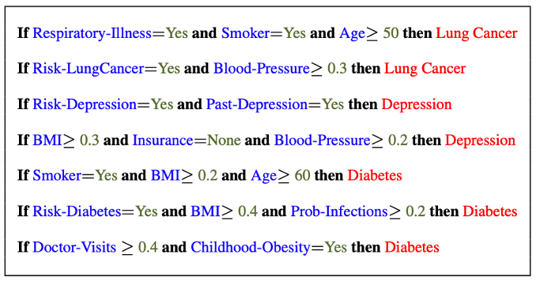{width="100%"}

The final decision is made based on a voting mechanism.

A recent user study shows that "if-then structure without any connecting else statements enables users to easily reason about the decision boundaries of classes."


:::
:::

::: {.notes}
Rule lists have a clear priority ordering with if-then-else chains - rules are tried sequentially until one fires. Rule sets allow multiple rules to fire simultaneously and vote on the final decision. Each rule stands independently.

Have them read the two panels side by side, because the difference is visible in the text. On the left, the indentation cascades: each "else if" is only reachable if everything above it failed, so by the time you reach the fifth line you are carrying four negated conditions in your head. On the right, every line starts at the same margin and can be read on its own.

Then the cost of that readability. In the list, the position of a rule is information: the first rule is the one the model reaches for first, so the structure tells you what dominates. In the set, no rule is privileged, and the price is the voting mechanism, which has to break ties and is rarely shown.

The claim on the right panel of the slide, that a user study found people reason more easily about if-then structures without the connecting else statements, is the empirical version of this argument, and it is a good example of something a visualization course can contribute: the model class is fixed, and the presentation of the same logic changes how well people use it. That is precisely the question on the next-but-one slide.
:::

## Decision Rules: Different Structures
Disjunctive normal form (DNF, OR-of-ANDs)
Conjunctive normal form (CNF, AND-of-ORs)

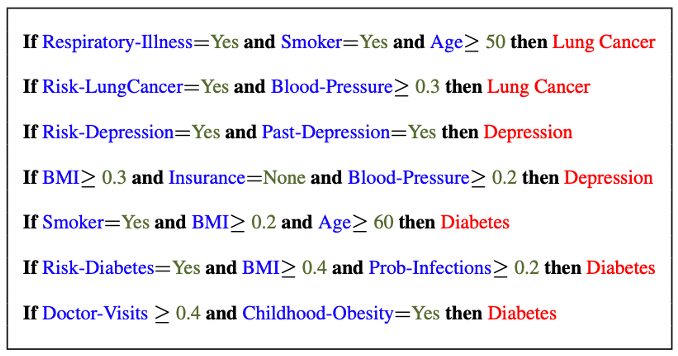

::: {.notes}
This example shows DNF (Disjunctive Normal Form) rules: each rule is a conjunction (AND) of conditions, and we predict positive if ANY rule fires (OR). DNF is more common in ML because it naturally represents disjoint decision regions in feature space.

Answer the question on the slide by reading the form off the figure: each line is a set of conditions joined by "and", and the lines are alternatives, so the whole thing is an OR of ANDs. That is disjunctive normal form, and the geometric reading is that each rule is an axis-aligned box and the model is the union of those boxes. A tree produces the same kind of object with the extra constraint that the boxes cannot overlap.

The reason DNF dominates is that positives are usually clustered in a few pockets of the space, and a union of boxes is exactly the right shape for that. Conjunctive normal form, an AND of ORs, describes the same logic space, but the natural reading becomes "every one of these requirements must be satisfied in at least one way", which is how you would write a checklist rather than a diagnosis.

Useful thing to leave them with: any Boolean function can be written in either form, but the two forms are not equally short. A concept that needs three rules in DNF can need many more clauses in CNF, and since the number of terms is the thing a human has to read, the choice of normal form is an interpretability decision, not just a notational one.
:::

## Decision Rules: Visual Factors Influence Rule Understanding

::: {.columns}
::: {.column width="65%"}
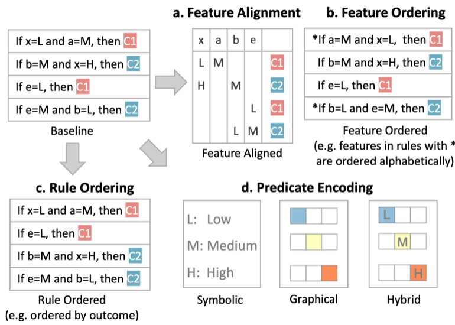{width="100%" fig-align="center"}

:::

::: {.column width="35%"}

**Research Questions:**

Can different visualizations of rules lead to different levels of understanding?

What visual factors influence understanding and how do they affect rule comprehension?

**Key findings:** Visual encoding choices significantly impact interpretability

:::
:::

::: footer
Yuan, J., Nov, O., & Bertini, E. (2021). [*An Exploration and Validation of Visual Factors in Understanding Classification Rule Sets*](https://arxiv.org/abs/2109.09160). arXiv:2109.09160.
:::

::: {.notes}
Yuan, Nov and Bertini, and this one is from our own community, NYU, so it is worth using as a model for what a course project can look like.

The setup: hold the model completely fixed, a rule set of 18 rules over 8 features from a diabetes dataset, and vary only how it is drawn. They identify four visual factors and test two of them. Alignment: are the same features in the same column across rules, or does each rule run as a line of text? And predicate encoding: symbolic text, a graphical mark, or a hybrid.

338 participants from a crowdsourcing platform, between subjects, two task types, predicting what the rule set outputs and characterizing what it does overall.

The headline is a gift for a visualization lecture. Alignment alone cut response time from over 40 seconds to under 30, an improvement of roughly 20 seconds, with accuracy essentially unchanged and close to ceiling in every condition. Putting the same feature in the same column, which is a typographic decision costing nothing, was the entire effect.

Two negative results, which are the more instructive part. The hybrid encoding, which they expected to combine the strengths of text and graphics, was slightly *worse* than graphical alone: the authors suggest the symbols simply take longer to read. And contrary to their expectation, the familiar unaligned text did not make people more confident.

A methods detail worth pointing at: they renamed the features to Magnesium and Calcium, because in piloting, participants used their own intuitions about age and BMI to answer without reading the visualization at all. If you run a study in this course, you will hit that problem.

They also deliberately report effect sizes with bootstrap intervals and no p-values, to avoid dichotomous thinking. Good practice to notice.

The lesson for today: the model class was fixed and interpretability still varied a lot. Interpretability is a property of the artifact a person reads, not only of the model.
:::


## Evaluation of Rules
Given a rule below:

If $X$, then class $Y$.

Support / Coverage of a rule:

\begin{equation}
\text{Support} = \frac{\text{number of instances that match the conditions in } X}{\text{total number of instances}}
\end{equation}

Confidence / Accuracy of a rule:


\begin{equation}
\text{Confidence} = \frac{\text{number of instances that match conditions in } X \text{ and belong to class } Y}{\text{number of instances that match conditions in } X}
\end{equation}

::: {.notes}
Support measures how frequently the rule applies (what fraction of data it covers). Confidence measures how accurate the rule is when it fires (what fraction of covered instances are correctly classified). Good rules balance both - high confidence but very low support means the rule is too specific. High support but low confidence means it's too general and inaccurate.

Put the two definitions on the board next to their week 3 names, because they are the same quantities. Support is coverage: the denominator is the whole dataset. Confidence is precision: the denominator is the set of cases the rule fires on.

Work the pathological cases, they make the metrics stick. A rule that fires on one training case it happens to get right has confidence 1.0, and it is noise. A rule that fires on everything and predicts the majority class has support 1.0 and confidence equal to the base rate, and it has learned nothing, which is exactly the base-rate predictor argument from the calibration lecture in a different costume.

Then the part the slide does not say. These numbers are computed on the training data, where the rule was chosen because it looked good, so both are optimistic; quote them on held-out data. And for a rule *set* rather than a single rule, the individually reported numbers do not compose: two rules with confidence 0.9 each can disagree on the cases where they overlap, and the set's accuracy depends on the conflict resolution policy, not on the individual numbers. Evaluate the system, not the parts.
:::

## Global Surrogate
Imagine that we have a black-box model (too complex to understand the internal structure), can we use white-box models to help us understand the model behavior of the black-box model?

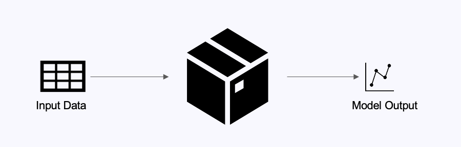{.nostretch width="90%" fig-align="center"}

::: {.notes}
Global surrogate models approximate a complex black-box model with an interpretable white-box model. Train a decision tree or rule set to mimic the black-box's predictions. This trades some accuracy for interpretability - you're explaining the black-box's behavior, not the underlying true relationship.

This slide is the pivot of the lecture, so state the situation plainly: somebody has already trained the accurate opaque model, it is in production, and you are not being allowed to replace it. What can you do?

The surrogate idea in one line: treat the black box as an oracle, ask it lots of questions, and fit something readable to its answers.

The critical distinction, and it is the one students get wrong in projects: the surrogate is trained on the black box's *predictions*, not on the true labels. So it is a model of the model. If the black box is confidently wrong in some region, a faithful surrogate reproduces that wrongness, and it should. Fidelity to the model and accuracy on the world are different targets, and only one of them is what an explanation is for.

Flag where this is going: it sounds like a clean solution and we will spend the next three slides on why it is not, ending with a paper arguing you should not be in this position at all.
:::


## Global Surrogate
Open the black box by understanding a "surrogate model" that approximate the behavior of the original black-box model.

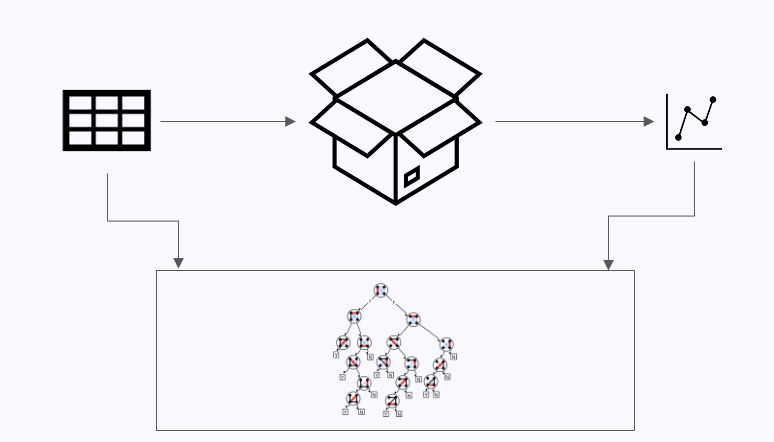{.nostretch width="70%" fig-align="center"}

::: {.notes}
The surrogate training process: feed data through the black-box to get predictions, then train an interpretable model (decision tree, linear model, rules) to predict what the black-box would predict. The surrogate's feature importances and structure reveal what the black-box learned. Check surrogate fidelity - how well does it match the black-box predictions?

Give them the recipe as four steps they could implement today: take your dataset, or generate points across the input space; run the black box on it to get predicted labels; throw away the true labels; fit a shallow tree or a rule list to those predicted labels. What comes out is the explanation.

Then insist on the measurement, because it is the part that gets skipped. Fidelity is the agreement between surrogate and black box, measured as R squared for regression or accuracy for classification, on held-out data. Report it every time you show a surrogate, the way you would report accuracy for a classifier. A tree that agrees with the black box 62 percent of the time is not an explanation of anything, and it will look exactly as convincing as one that agrees 97 percent.

Two subtleties worth 30 seconds. Where you sample matters: fidelity measured on the training distribution says nothing about behaviour off it, and the interesting failures are usually off it. And the surrogate is not unique: refit it on a different sample, or with a different depth, and you may get a structurally different tree with similar fidelity, in which case "what the black box learned" has several incompatible answers. That is the instability property from the tree slide, now attached to your explanation rather than to your model.
:::

## The Fidelity-Interpretability Trade-off

**The Fidelity-Interpretability Trade-off:** A fundamental challenge in XAI where increasing model interpretability often decreases fidelity to the original model's behavior

**What you want:**

{.nostretch width="520px" fig-align="center"}

Simple, interpretable surrogate with high fidelity to the black-box model

**What you get:**

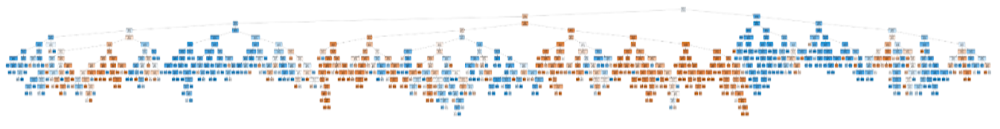{.nostretch width="760px" fig-align="center"}

Either low fidelity (simple but inaccurate) or low interpretability (accurate but complex)

::: {.notes}
This is the Fidelity-Interpretability Trade-off, a foundational problem in Explainable AI (XAI). You want a simple, interpretable surrogate that's also highly faithful to the black-box model's decisions. But there's an inherent tension: simple surrogates miss important patterns (low fidelity), while high-fidelity surrogates become too complex to interpret.

The two pictures make the argument. Above: the tree you want, small enough to read. Below: the thing you actually get once you demand high agreement with a deep ensemble, thousands of tiny leaves, technically a decision tree and in no sense an explanation.

The reason is structural, not a matter of effort. The black box is expressing a function that needed a large hypothesis class; if a depth-3 tree could reproduce it, you did not need the black box in the first place. So there is a dial, and every position on it is unsatisfying: turn it towards simplicity and the explanation is unfaithful, turn it towards fidelity and the explanation is unreadable.

Say the sharpest version of the danger out loud. The failure is silent. A simple surrogate always looks like a good explanation, because simplicity is exactly what we are checking for when we eyeball it. Nothing in the picture tells you it only agrees with the model two-thirds of the time. That is why the previous slide insisted on reporting fidelity.

This same trade-off reappears next week for local explanations: LIME fits a simple model in a neighbourhood, which is the same bargain made smaller, and the neighbourhood is the new hyperparameter. And it is precisely the situation Rudin's paper, four slides on, says we should refuse to enter.
:::


## VA System for Rule List
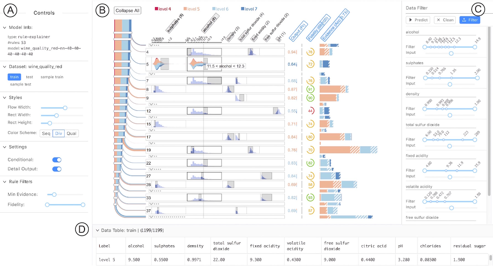

::: footer
Ming, Y., Qu, H., & Bertini, E. (2019). [RuleMatrix: Visualizing and Understanding Classifiers with Rules](https://doi.org/10.1109/TVCG.2018.2864812). *IEEE TVCG*, 25(1), 342-352.
:::

::: {.notes}
RuleMatrix, Ming, Qu and Bertini, TVCG 2019, from NYU, and this is the rule-list counterpart to everything we did with trees.

Start with what it takes as input, because it is a surprise: the model is a black box. They extract a rule list from its input-output behaviour, then visualize the rules. So this is a global surrogate, exactly the construction we defined a few slides ago, with the visualization built for the surrogate rather than for a natively interpretable model.

The layout, read off the figure. Rows are rules, columns are features, so the column position of a condition is fixed across all rules. That is the entire design insight: in a textual rule list, the same feature appears at a different horizontal position in every line, so comparing rules means reading each one. Align the features into columns and comparison becomes a visual scan. Inside a cell, the grey box spans the interval the clause allows, drawn on top of the feature's distribution, so you see both the condition and how much data it covers. Each row ends with the predicted class and its probability, and the bar under a feature name shows how often that feature is used.

To the left, a Sankey-style flow shows how the data cascades through the list, since a rule list is evaluated in order and each rule only sees what previous rules did not catch. On the right, a fidelity glyph, which is the number we insisted on reporting for any surrogate.

Their evaluation is two use cases plus a study with nine participants, mostly graduate students, on a diabetes model, finishing twelve tasks in about fifteen minutes on average.

The limitation they state is the one to remember, and it is refreshingly precise: the implementation can display rule lists with over 100 rules and 30 features, but readability has only been validated below roughly 60 rules and 20 features. That is an interpretability ceiling stated as a number, which is rarer than it should be.
:::

## VA Systems for Rules in Random Forest
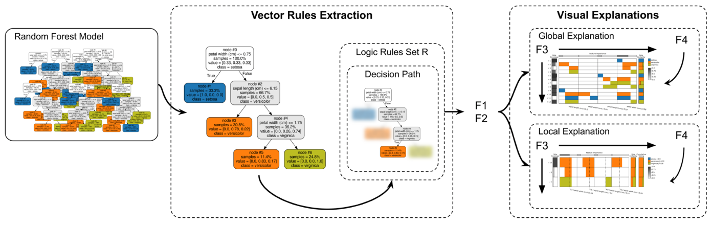

::: footer
Popolin Neto, M., & Paulovich, F. V. (2021). [Explainable Matrix -- Visualization for Global and Local Interpretability of Random Forest Classification Ensembles](https://doi.org/10.1109/TVCG.2020.3030354). *IEEE TVCG*, 27(2), 1427-1437.
:::

::: {.notes}
ExMatrix, Popolin Neto and Paulovich, presented at VAST 2020 and published in TVCG in 2021. It takes the matrix idea from the previous slide and points it at a whole random forest.

The scale problem first, with their own number: a forest of 128 trees on the Wisconsin breast cancer data produced 3,278 rules, about 25 rules per tree, at 99 percent accuracy. Any approach that asks a person to read the rules has already lost. So their design question is not how to display a rule, it is how to display several thousand of them.

The answer is a matrix again, rows as rules and columns as features, but now every cell is a tiny glyph: a rectangle whose horizontal extent within the cell encodes the interval the predicate allows, positioned against that feature's full range. So a cell shows at a glance whether a rule is asking for a low, middle or high value, and an empty cell means the feature is not used. Add a column for how much data each rule covers, a column for its certainty, and a row at the top for feature importance, and you can sort by any of them.

The local views are the more interesting half. Given one instance, show only the rules that actually voted on it, with a cumulative voting column and a marker for the point where the decision stops changing, so you can see the moment the committee made up its mind. There is also a counterfactual view: the smallest feature changes that would flip the vote.

Their own honest limits are useful to read out. The global view is bounded by pixels, one rule per line at best, and they say it can be cluttered and tricky to explore. And in their study with thirteen users, the two global and local-voting tasks were answered correctly by about 77 percent, while the counterfactual view dropped to 62 and 46 percent, which they attribute to it suiting experts. A view can be principled and still be hard to use, and reporting that is a service.
:::

## Other white-box models?
- Naive Bayes
- K-nearest neighbors
- etc.

::: {.notes}
Beyond the models we've covered, other naturally interpretable models include: Naive Bayes (shows probability contributions from each feature via Bayes rule), K-Nearest Neighbors (predictions explained by showing similar training examples), and Logistic Regression (similar to linear regression but for classification).

Use this slide to make the taxonomy point rather than to list models, because each of these is interpretable in a *different way*, and the differences are the interesting part.

Naive Bayes is additive in log space: take logs and the prediction is a sum of per-feature evidence, so it explains like a linear model. Remind them of two weeks ago: it is also famously miscalibrated, because the independence assumption counts correlated evidence repeatedly. Readable and confidently wrong at the same time, which is a useful pairing to have met twice.

K-nearest neighbours is a different species entirely. There are no parameters to read; the explanation is "here are the five most similar cases and what happened to them". That is example-based interpretability, and for clinicians and lawyers it is often the most persuasive kind, because it matches precedent-based reasoning. The catch is that it lives or dies on the distance metric, and in high dimensions distances concentrate, so "similar" quietly stops meaning similar.

Logistic regression is the workhorse and it deserves its own warning: coefficients are in log odds, so people routinely misreport them. An odds ratio is not a probability ratio, and a coefficient of 0.7 does not mean 70 percent more likely.

If someone asks what is missing: sparse linear models with integer weights, the scoring-sheet form used in medicine, which is the family Rudin argues for at the end.
:::

## Outline
- <span style="color: grey;">Model Interpretation and Explanation</span>
- <span style="color: grey;">White-box Approaches and Visualizations</span>
- Related Research in VIS & AI

## Manipulating and Measuring Model Interpretability

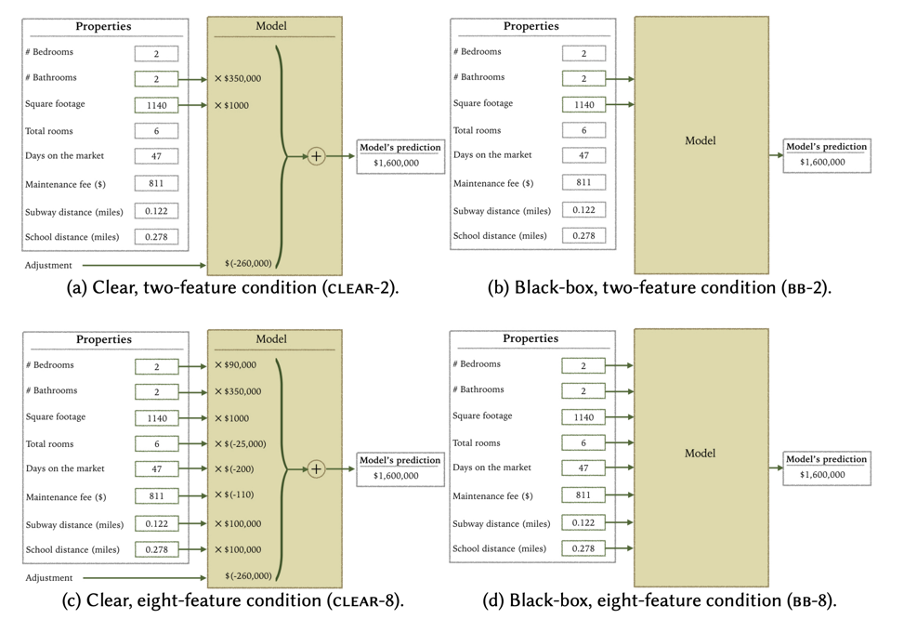

::: footer
Poursabzi-Sangdeh, F., Goldstein, D. G., Hofman, J. M., Vaughan, J. W., & Wallach, H. (2021). [Manipulating and Measuring Model Interpretability](https://arxiv.org/abs/1802.07810). *CHI 2021*.
:::

::: {.notes}
Poursabzi-Sangdeh and colleagues, CHI 2021, and this is the most important empirical result in today's lecture, so give it time.

They did what almost nobody does: a large controlled experiment on whether transparency actually helps people. Two manipulations, crossed. Number of features the model displays, two or eight. And clear versus black-box: whether participants could see the model's internals at all. The crucial design decision is that the models were constrained to make identical predictions, and every participant saw all eight feature values for each apartment. So the only thing that varied was the presentation of the model. Nearly 3,800 participants across four pre-registered experiments, predicting New York apartment prices from real listings.

Three findings, in order.

First, transparency works for the thing it obviously should. People shown the clear two-feature model were much better at simulating it, at predicting what the model would say. Large effect, highly significant.

Second, it did not make them follow the model more when following it would have helped.

Third, and this is the one to slow down for: people shown the clear model were *worse* at catching the model's mistakes. The experiment included apartments with unusual configurations where the model was badly wrong, and participants with the transparent model deviated less from those wrong predictions than participants shown a black box. The authors' own phrasing is "contrary to our intuition", and they attribute it to information overload. In a follow-up, a message telling participants to watch for outliers made the effect disappear.

So transparency bought simulatability and, in this setting, cost scrutiny. Their closing line is the lesson for this course: these counterintuitive findings emphasize the importance of testing over intuition when developing interpretable models. Everything else in today's lecture is an intuition that has mostly not been tested this carefully.
:::

## Stop explaining black box machine learning models for high stakes decisions
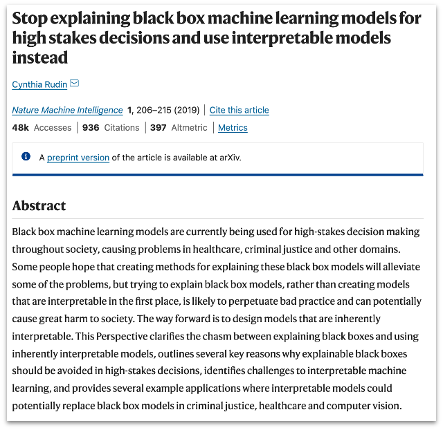

::: footer
Rudin, C. (2019). [Stop explaining black box machine learning models for high stakes decisions and use interpretable models instead](https://doi.org/10.1038/s42256-019-0048-x). *Nature Machine Intelligence*, 1(5), 206-215.
:::

::: {.notes}
Cynthia Rudin's 2019 paper in Nature Machine Intelligence, and it is the argument the whole lecture has been building towards. It is a position paper, it is combative, and it is worth reading in full.

Her central claim, in her words: trying to explain black box models, rather than creating models that are interpretable in the first place, is likely to perpetuate bad practice and can cause catastrophic harm.

Three arguments to walk through.

One: the accuracy-interpretability trade-off is, in her words, a myth. Not always false, but assumed rather than demonstrated. Her evidence includes the 2018 FICO challenge, where entrants were told to build a black box and explain it afterwards, and there turned out to be no performance difference between interpretable and explainable models on that data; a globally interpretable model won the recognition prize. Connect this back to EBMs half an hour ago.

Two, and this is the sharpest: explanations of black boxes must be wrong. If an explanation had perfect fidelity it would *be* the model, and you would not need the original. So every post-hoc explanation is an approximation, and an explanation that is right 90 percent of the time is wrong 10 percent of the time, which means you cannot trust it, which means you cannot trust the model it is vouching for. She suggests we should call these things summaries or trends rather than explanations.

Three, COMPAS. The recidivism instrument requires more than 130 factors, and a three-rule model using only age and prior offences matches its accuracy. She also turns the ProPublica analysis around: ProPublica built a linear approximation of COMPAS that used race, then accused COMPAS of using race. If explanations can be unfaithful, they can be unfaithful in the direction of your hypothesis too. And a detail that lands with any audience: typographical errors in entering those 130-plus factors sometimes determine bail outcomes, and at a 1 percent per-field error rate, more than half of surveys contain at least one.

Leave them with her constructive position, since the title sounds purely negative: build models constrained in form, sparse, monotone where the domain demands it, so they are useful to someone or obey known structure. That is the research programme behind rule lists and EBMs.
:::


## Slice Finder: Automated Data Slicing for Model Validation

::: footer
Chung, Y., Kraska, T., Polyzotis, N., Tae, K. H., & Whang, S. E. (2019). [Slice Finder: Automated Data Slicing for Model Validation](https://doi.org/10.1109/ICDE.2019.00139). *IEEE ICDE 2019*, 1550-1553. Extended version: [arXiv:1807.06068](https://arxiv.org/abs/1807.06068).
:::

::: {.columns}

::: {.column width="50%"}

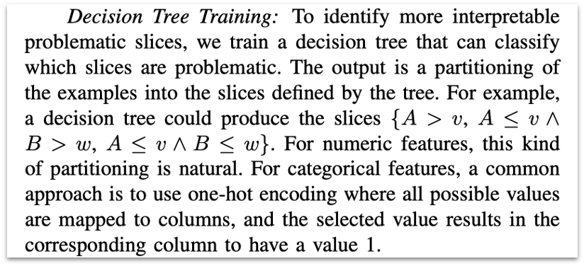{width="100%" fig-align="center"}
:::

:::{.column width="50%"}
How about we use whether the model prediction is wrong or not to train a "surrogate tree"?
:::
:::


::: {.notes}
Slice Finder, from a Google and KAIST group, and it is the operational answer to "the model is 92 percent accurate, so what is wrong with it?".

The problem: aggregate metrics average over everyone, so a model can look fine and fail systematically on a subgroup. Finding those subgroups by hand means guessing which slice to look at, and there are exponentially many.

Their definition of a slice is the thing that makes this a white-box lecture topic: a conjunction of feature-value pairs, and fewer pairs counts as more interpretable. Country equals Germany is a better slice than country equals Germany and age 20 to 40 and postcode 12345, even if the second has worse loss, because a person can act on the first.

Two search strategies: train a decision tree on where the model errs, and read the slices off the paths, or do a lattice search over feature-value combinations. The tree is the version to remember here, because it is the surrogate idea again, pointed at the errors instead of the predictions.

The part I would emphasize is the statistical discipline. A slice must pass two tests, not one: the loss difference must be statistically significant, and the effect size must be large. And because you are testing thousands of candidate slices, they control the false discovery rate explicitly. Without that, hunting for bad subgroups guarantees you find some.

Their census example makes the point in one line: the slice for one occupation had average loss on par with the worst slice, but a much smaller effect size, so it was not actually evidence of a problem. High loss alone is not a finding.

One caveat to state, since we have been holding other papers to it: there is no user study here. The interpretability claim is by construction, few literals per slice, not measured on people, and the authors list a user study as future work.
:::


## Toolkits
InterpretML: https://github.com/interpretml/interpret

::: {.notes}
InterpretML is Microsoft's open-source library for interpretable machine learning. It implements GAMs, Explainable Boosting Machines (EBMs), and various explanation techniques. The library includes both glass-box models (inherently interpretable) and black-box explanation methods (LIME, SHAP). It provides unified APIs and visualization tools.

Practical framing for the projects, since this is the slide they will screenshot. An EBM is a scikit-learn style estimator: fit, predict, and then show the global explanation, which gives you the per-feature curves in a browser, or the local explanation for a single row. The point of the unified API is that you can put a glass-box model and a post-hoc explainer side by side on the same data and compare what they tell you, which is a good project structure in itself.

Two other things worth naming for their toolbox, since the slide lists only one. The pyGAM and mgcv packages are the statistical lineage of GAMs, in Python and R respectively, and mgcv is what a statistician will expect you to have used. And dtreeviz produces far better decision tree drawings than scikit-learn's default, with the class distributions shown at each node, which matters if a tree is going into a report.

The recommendation to give them: for tabular data, fit an EBM early, not as a fallback. If it matches your boosted-trees baseline, you have an accurate model whose explanation is exact, and the rest of the project gets easier.
:::

## Practice 1
Notebook:
https://colab.research.google.com/drive/1nKE6WIApebHi67yfhH6k5mZN86evLZOM?usp=sharing

Some other libraries for PDP visualization:
https://scikit-learn.org/stable/modules/partial_dependence.html
https://interpret.ml/docs/pdp.html

::: {.notes}
This hands-on exercise walks through training GAMs with Python's interpret library and creating partial dependence visualizations. You'll explore how to identify non-linear patterns, detect feature interactions, and interpret model behavior through visualizations.

Tell them what to actually look for, otherwise this becomes a run-all-cells exercise. Three things.

Fit a linear model and a GAM on the same data and compare them on two axes: held-out error, and what each says about one specific feature. The interesting outcome is a feature where the coefficient says "no effect" because the curve rises and then falls, and the average of that is nothing.

Second, check the data density under every curve you are about to believe, and find one region where the shape function is confidently shaped over almost no data. Every dataset has one.

Third, turn the smoothing up and down and see which features change shape. The ones whose story survives are the ones to put in the report.

The notebook link is on the slide, and the scikit-learn partial dependence docs are the reference for the plotting API.
:::

## Practice 2
Notebook:
https://colab.research.google.com/drive/12LV2Z_1BbP3efACYp2QxzsPaOrIn8a8l?usp=sharing

::: {.notes}
This hands-on exercise covers decision tree training, visualization, and rule extraction with sklearn. You'll experiment with tree depth, pruning strategies, and extracting interpretable rules from trained trees.

The exercise worth doing here is the instability demonstration from earlier in the lecture, because it takes five lines and it is convincing. Fit a tree, print it. Resample 90 percent of the rows, fit again, print again. Compare the root split. On most real datasets the structure moves while the accuracy barely does, and having seen that once, they will never again present a single tree as "what the data says" without a caveat.

Two more things to try. Sweep max_depth and plot test accuracy against the number of leaves, so they can see where extra depth stops buying accuracy and starts buying only complexity; that curve is the fidelity-interpretability trade-off in miniature. And use export_text or export_graphviz to pull the rules out as text, which is how a tree turns into the rule list from the last section.

If anyone finishes early: fit a random forest, then fit a depth-3 tree to the forest's predictions and measure the fidelity. That is a global surrogate, built by hand, in about ten lines.
::: 
