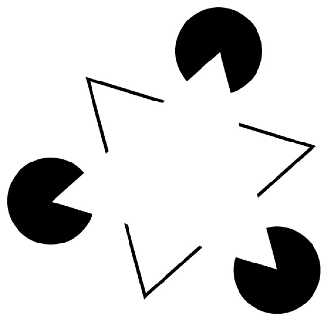
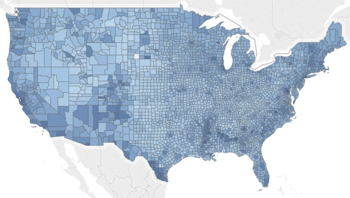
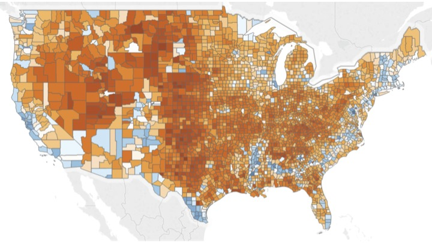

## L1 · Full-bleed figure — wide figures (AR ≥ 1.8), no body text

{fig-align="center"}

::: footer
L1 · one image, nothing else; Quarto auto-stretches it to the remaining height
:::

## L2 · Statement + figure — wide/landscape figure, ONE line of text

**Visual thinking is a series of acts of attention, eye movements, and pattern finding.**

{fig-align="center"}

::: footer
L2 · exactly one bold line above; everything else goes to speaker notes
:::

## L3 · Text beside figure — square/tall figure with bullets (40 / 60)

:::: {.columns}
::: {.column width="40%"}
* We complete incomplete shapes
* Implication: a visualization can mislead by accident
* Conversely: a sparse set of marks is enough to carry a trend
:::
::: {.column width="60%"}
{height="760" fig-align="center"}
:::
::::

::: footer
L3 · height="760" caps the figure whatever its shape; columns disable auto-stretch
:::

## L4 · Centred figure — square figure, no text worth a column

{.nostretch width="50%" fig-align="center"}

::: footer
L4 · .nostretch is required, otherwise width= is overridden at runtime
:::

## L5 · Comparison — two figures, one caption

:::: {.columns}
::: {.column width="50%"}
{width="100%"}
:::
::: {.column width="50%"}
{width="100%"}
:::
::::

**Same counties, same data — sequential hides the threshold, diverging shows it.**

::: footer
L5 · 50/50; stacked variant: two .nostretch images at width 100% then ~62%, centred
:::

## L6 · Text only — up to six bullets, or two columns of ≤ 4 in .smaller

:::: {.columns .smaller}
::: {.column width="50%"}
* Null values
* Empty strings
* Placeholder values (999, −1)
* Incomplete records
:::
::: {.column width="50%"}
* Different formats
* Duplicate records
* Conflicting values
* Unit mismatches
:::
::::

::: footer
L6 · one column for ≤ 6 bullets; split at 7+ so nothing shrinks below .smaller
:::
